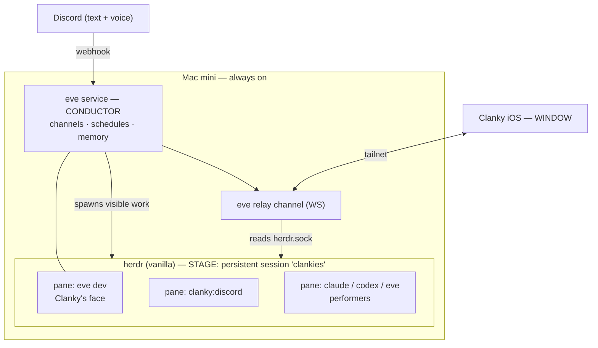

# Clanky

Clanky is an always-on personal agent that lives inside a persistent
[herdr](https://herdr.dev) session and is reachable from anywhere through a
native iOS app.

He is built on three off-the-shelf systems plus a thin layer of glue:

- **herdr** is the *stage* — a vanilla terminal-agent multiplexer. Every agent
  is a visible pane, and herdr supplies the swarm coordination CLI.
- **[eve](https://eve.dev)** is the *conductor* — Clanky's durable backend brain
  and his visible face. eve owns inbound channels (Discord, voice), cron
  schedules, durable sessions, and memory. Its interactive TUI runs in a herdr
  pane and *is* what you see as Clanky.
- The **iOS app** is the *window* — it reaches the stage over the tailnet
  through an eve relay channel.

When Clanky needs more than himself, he spawns **performers** — `eve`, `claude`,
or `codex` agents — as visible herdr panes, and orchestrates them through the
herdr swarm CLI. (The prior Pi runtime is fully removed; see SPEC.md.)

> **Architecture:** see [SPEC.md](SPEC.md) for the complete, authoritative
> design. This README is a short orientation; the spec is the source of truth.

## What Clanky does

- runs always-on (a Mac mini) as a member of a persistent herdr session
- shows up in the Clanky iOS app the moment he is on, with every pane visible
- handles inbound Discord text and voice — surfacing the work **as visible
  panes**, not hidden background processes
- spawns other agents (`claude`, `codex`, more `eve` agents, or subagents of
  himself), all visible as TUIs in herdr
- coordinates a swarm through the vanilla herdr CLI, and orchestrates harvestable
  fan-out runs through the `clanky-herdr-operator` skill
- remembers durable preferences, project facts, and recurring context
- runs scheduled jobs on a cron cadence

## Mental model

Stage, conductor, performers, window.

- **eve owns inbound and durability; herdr owns visibility.** Anything worth
  watching becomes a pane.
- **herdr stays vanilla** — no fork. Remote access is the eve relay channel.
- **The swarm is decoupled from Clanky.** A herdr session is a swarm-ready
  environment on its own; agents coordinate with or without Clanky, and any one
  of them can take the orchestrator role.

## Skills

- `herdr` (vanilla, every agent): flat full-picture coordination — discover,
  read, message, wait, and report presence across panes.
- `clanky-herdr-operator` (coordinator only): the harvestable fan-out protocol —
  spawn workers into a tagged run, monitor, unblock, harvest, clean up.

## Status

This is the rebuild on the eve + herdr architecture. It replaces the previous
Pi-runtime build. See [SPEC.md](SPEC.md) §10 for build phases and §9 for the
migration map from the old model.
