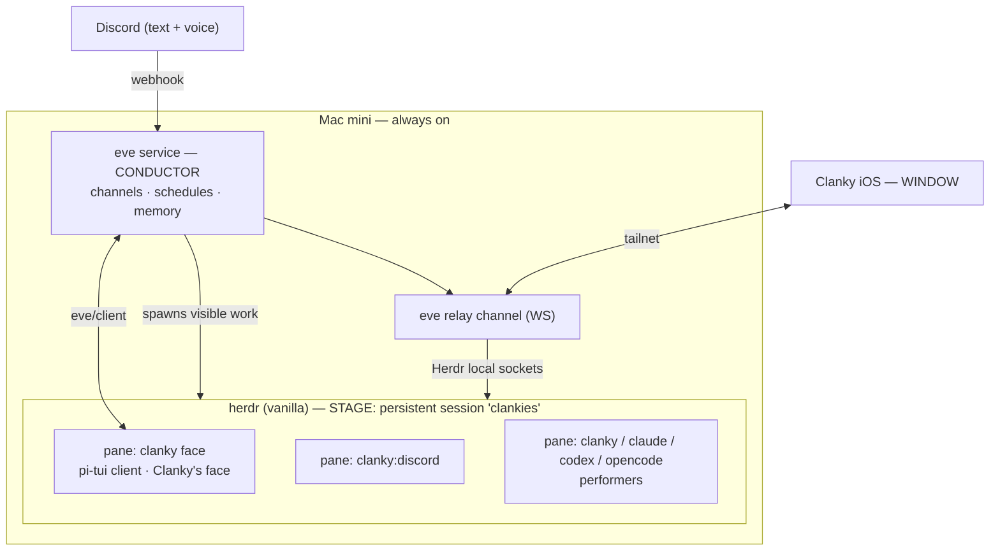

# Clanky


Clanky is an always-on personal agent that lives inside a persistent
[herdr](https://herdr.dev) session and is reachable from anywhere through a
native iOS app.

He is built on three off-the-shelf systems plus a thin layer of glue:

- **herdr** is the *stage* — a vanilla terminal-agent multiplexer. Every agent
  is a visible pane, and herdr supplies the swarm coordination CLI.
- **[eve](https://eve.dev)** is the *conductor* — Clanky's durable backend brain.
  eve owns inbound channels (Discord, voice), cron schedules, durable sessions,
  and memory. It runs headless (`eve dev --no-ui`); what you see as Clanky is his
  own **face** — a pi-tui client (`scripts/clanky.ts`) that renders eve's event
  stream in a herdr pane.
- The **iOS app** is the *window* — it reaches the stage over the tailnet
  through an eve relay channel.

When Clanky needs more than himself, he spawns **performers** — `clanky`,
`claude`, `codex`, or `opencode` agents — as visible herdr panes, and
orchestrates them through the herdr swarm CLI.

> **Architecture:** see [SPEC.md](SPEC.md) for the complete, authoritative
> design. This README is a short orientation; the spec is the source of truth.

## What Clanky does

- runs always-on (a Mac mini) as a member of a persistent herdr session
- shows up in the Clanky iOS app the moment he is on, with every pane visible
- handles inbound Discord text and voice — surfacing the work **as visible
  panes**, not hidden background processes
- spawns other agents (`clanky`, `claude`, `codex`, `opencode`, or custom
  commands), all visible as TUIs in herdr
- coordinates a swarm through the vanilla herdr CLI, and orchestrates harvestable
  fan-out runs through the `clanky-herdr-operator` skill
- remembers durable preferences, project facts, and recurring context
- runs scheduled jobs on a cron cadence

## Mental model

Stage, conductor, performers, window.



- **eve owns inbound and durability; herdr owns visibility.** Anything worth
  watching becomes a pane.
- **herdr stays vanilla** — no fork. Remote access is the eve relay channel.
- **The swarm is decoupled from Clanky.** A herdr session is a swarm-ready
  environment on its own; agents coordinate with or without Clanky, and any one
  of them can take the orchestrator role.

## Skills

- `herdr` (vanilla, every agent): flat full-picture coordination — discover,
  read, message, wait, and report presence across panes.
- `clanky-herdr-operator` (coordinator only): the harvestable fan-out protocol —
  spawn workers into a tagged run, monitor, unblock, harvest, clean up.

## Free-will Discord presence

Clanky is *present* in Discord, not just callable. A Gateway connection
(`agent/channels/discord-gateway.ts`) lets him read whole channels and decide
for himself when to speak — addressed by name ("hey clanky", "yo clank"),
@mentioned, replied to, or following up in an active exchange — and stay quiet
otherwise (`[SKIP]`). "Hop in vc" makes him join voice. Each conversation runs as
a **presence session**: a separate eve session of the same agent, so it shares
his memory, persona, and tools without clogging the main face-pane thread, and
it is mirrored into a watchable herdr pane. With a user/self token
(`CLANKY_DISCORD_CREDENTIAL_KIND=user-token`) he can also watch others' Go Live
screen shares and publish his own (`discord_golive`). Configure the token and
model from the custom face's `/token` and `/model` slash commands (see below)
instead of hand-editing `.env.local`. See [SPEC.md](SPEC.md) §5.2–§5.6.

## Running Clanky

Clanky's brain is the eve server; his face is a client of it. Install the local
CLI once:

```bash
pnpm clanky:install
```

Then use `clanky` from anywhere:

- **`clanky` / `clanky dev`** — default development loop. It starts or attaches
  the headless Eve brain, runs the custom face under Node watch mode, and
  supervises owned Eve processes. If Eve is reachable but stuck unhealthy
  during editing, Clanky waits through the short hot-reload window, then
  restarts the recorded `.eve/dev-server.json` process instead of leaving the
  face on `eve unavailable 503`.
- **`clanky face`** — Clanky's custom face (`scripts/clanky.ts`): a pi-tui client
  that renders eve's `eve/client` event stream, owns/attaches the headless brain
  once without watch mode,
  and adds the slash commands eve can't — `/token <token> [--user-token] [--voice]`,
  `/model <codex|claude> [id]`, `/harness allow ...`,
  `/harness <clanky|claude|codex|opencode|custom> [default|ollama] [model]`,
  `/agent-md on|off|status`, `/skills`,
  `/n`, `/new`, `/status`, `/help`, `/exit`. Config commands rewrite `.env.local`
  and restart the brain. Default port 2000
  (`CLANKY_EVE_PORT`).
- **`clanky up` / `clanky status` / `clanky down`** — manage the persistent
  Herdr session and headless Eve brain.
- **`clanky worker <prompt>`** — send one task to the running Clanky Eve brain
  and stream text output.
- **`clanky update`** — fast-forward this checkout, install dependencies, and
  refresh the `~/.local/bin/clanky` symlink. Use `clanky update --check` to run
  `pnpm check` after updating.

Repo-local alternatives:

- **`pnpm dev`** — eve's stock dev TUI (fixed slash-command set).
- **`pnpm face`** — repo-local equivalent of `clanky face`; for code-editing
  sessions, prefer `clanky dev` so the face and owned brain are both supervised.

## Status

Clanky runs on the eve + herdr architecture described in [SPEC.md](SPEC.md).
The free-will presence is wired and verified offline (`pnpm check`,
`pnpm smoke:discord`); the live voice loop is gated on the bot token +
ClankVox + Realtime credentials.
