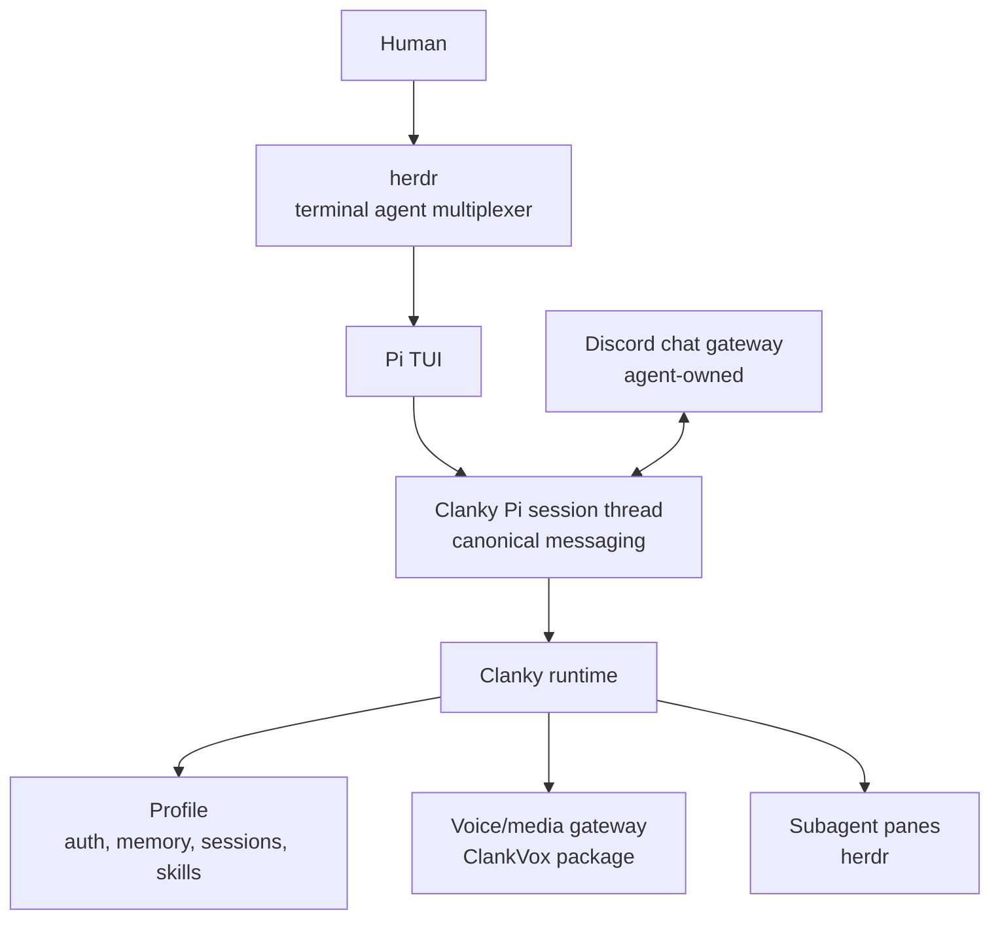

# Clanky


Clanky is a personal Pi agent with profile state, memory, a canonical Pi
session thread, communication gateway adapters, subagents, media tools,
work-tracker refs, and bundled skills.

It is not a separate daemon or scheduler. Pi supplies the terminal agent
runtime. Clanky adds the personal layer. When work needs more than one agent,
Clanky orchestrates subagents as [herdr](https://herdr.dev) panes — visible,
inspectable terminal sessions in the same multiplexer you already run him in.

## 1. What You Can Do

Use Clanky as the agent that is always yours:

- work in a repo through the Pi TUI with Clanky's persona, skills, memory, and
  profile-local credentials
- keep separate profiles for personal work, reviewers, voice tests, or
  temporary experiments
- store and inspect source-grounded memories with explicit privacy controls
- connect external communication gateways, with Discord as the built-in
  agent-owned text adapter for DMs, mentions, replies, and channel bindings
- let gateway side requests route to subagents while the main TUI session keeps
  working
- fan out multi-agent work into herdr panes and watch every subagent run
- join live voice through the Discord/ClankVox media adapter,
  transcribe speakers, speak through Realtime or ElevenLabs, and delegate
  durable work back to Pi
- generate or inspect web/media artifacts through the bundled operator skills

<!-- Capture backlog:
- docs/assets/gifs/clanky-tui-discord.gif: local TUI work continuing while a Discord mention routes through a subagent.
- docs/assets/gifs/clankvox-voice-live.gif: Discord voice live run with speaker transcript, spoken response, ask_pi delegation, and screen-watch or media counters.
-->

## 2. What To Let Clanky Handle

Clanky is strongest when the work needs personal context plus tools:

- orienting in a local repository
- remembering durable preferences, project facts, and recurring context
- deciding whether an external gateway message needs a response or should be skipped
- splitting gateway side work into subagents so the foreground session stays
  useful
- fanning out parallel work into herdr panes and synthesizing the results
- using browser, web search, media, Linear, Discord, or MCP skills when the task
  calls for them
- answering live voice questions quickly and handing longer work to Pi

## 3. Mental Model



Read it as:

- Pi owns the TUI, sessions, model runtime, slash commands, and local repo tools.
- Clanky configures Pi with persona, profile state, memory, skills, connectors,
  and voice/media capabilities.
- Clanky's built-in messaging is the Pi session thread. Discord is a gateway
  into and out of that thread.
- ClankVox is Clanky's voice/media transport package. It handles Discord voice
  and Go Live.
- herdr is the multiplexer around everything: Clanky runs in a pane, and his
  multi-agent work runs as sibling panes he spawns and watches.

## First Path

Run the fresh-user flow first so you can test onboarding without touching your
real profile:

```bash
cd /path/to/clanky-pi
corepack enable
corepack prepare pnpm@11.4.0 --activate
pnpm install
export PATH="$PWD/node_modules/.bin:$PATH" # source checkout only
pnpm dev:setup:fresh
```

Inside the TUI:

```text
/setup
/setup status
/openai-login
```

Then ask:

```text
Summarize this repository and tell me how to run the non-live checks.
```

For a persistent profile:

```bash
clanky --home ~/.clanky --profile personal --cwd .
```

The released CLI is intended to be used directly as `clanky`. The `PATH` line
is only for a source checkout before the CLI is installed globally.

## Communication Gateways And Voice

Agent-owned communication gateways are configured from inside the TUI. Discord
is the built-in chat adapter:

```text
/discord-login
/discord-whoami
/discord-status
```

Voice/media gateways are separate from Clanky's native Pi thread. The Discord
voice adapter uses the same profile credential, Clanky's TypeScript
control plane, OpenAI/xAI Realtime, optional ElevenLabs speech, Pi delegation
through `ask_pi`, and the bundled ClankVox Rust media process:

```text
/discord-voice
/discord-voice setup
/discord-voice join <guild-id> <voice-channel-id>
/voice-logs
```

For the full voice map, use
[Discord Voice Architecture](docs/discord-voice-architecture.md). For the native
media subprocess, jump to [ClankVox Docs](docs://clankvox-docs/overview).

## Orchestration

Clanky's multi-agent path is herdr. When Clanky runs inside herdr
(`HERDR_ENV=1`), he can split panes, spawn sibling agents, wait on their
status, and harvest results — all visible in the same terminal. Gateway
subagents handle Discord side requests without interrupting the foreground
session; anything bigger fans out to panes.

Remote access to Clanky and his subagents (herdr daemon bridge plus the Clanky
iOS app) is in progress — see the [Roadmap](docs/ROADMAP.md).

## Docs Map

- [Getting Started](docs/getting-started.md): install, setup, and daily use.
- [Pi Foundation](docs/pi-foundation.md): what Pi owns and what Clanky adds.
- [Configuration Model](docs/configuration.md): profiles, durable stores, env
  overrides, and gateway ownership.
- [Command Reference](docs/command-reference.md): CLI and slash commands.
- [Memory And Privacy](docs/memory-and-privacy.md): profile-local state and
  privacy controls.
- [Discord Voice Architecture](docs/discord-voice-architecture.md): control
  plane, Realtime, Pi delegation, and the ClankVox media plane.
- [Troubleshooting](docs/troubleshooting.md): common setup failures.
- [Roadmap](docs/ROADMAP.md): the AgentRoom retirement and herdr/iOS plan.

## Local Development

```bash
pnpm check
pnpm smoke
clanky --help
```

Focused non-live checks:

```bash
pnpm smoke:clanky
pnpm smoke:voice
pnpm smoke:agent-tools
pnpm voice:native:test
```
