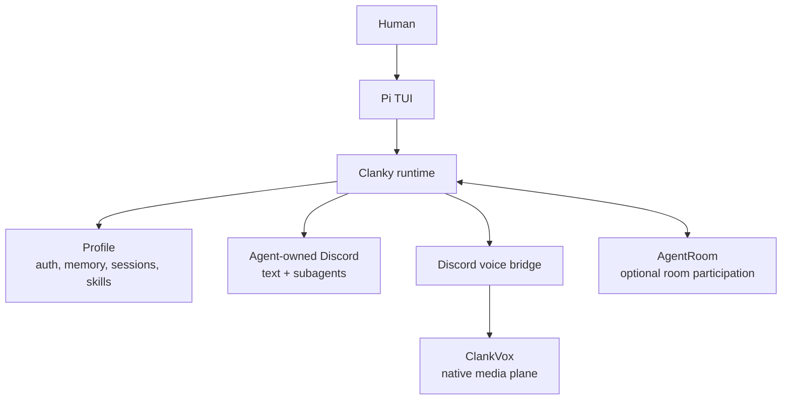

# Clanky


Clanky is a personal Pi agent with profile state, memory, Discord text,
Discord voice, subagents, media tools, work-tracker refs, bundled skills, and
AgentRoom participation.

It is not a separate daemon or scheduler. Pi supplies the terminal agent
runtime. Clanky adds the personal layer. AgentRoom supplies the multi-agent room
when Clanky needs to coordinate with other agents.

## 1. What You Can Do

Use Clanky as the agent that is always yours:

- work in a repo through the Pi TUI with Clanky's persona, skills, memory, and
  profile-local credentials
- keep separate profiles for personal work, room leads, reviewers, voice tests,
  or temporary experiments
- store and inspect source-grounded memories with explicit privacy controls
- connect Clanky's own Discord identity for DMs, mentions, replies, and channel
  bindings
- let Discord side requests route to subagents while the main TUI session keeps
  working
- join Discord voice, transcribe speakers, speak through Realtime or ElevenLabs,
  and delegate durable work back to Pi
- generate or inspect web/media artifacts through the bundled operator skills
- participate in AgentRoom as a lead, worker, reviewer, or standalone personal
  agent

> GIF slot: `docs/assets/gifs/clanky-tui-discord.gif`  
> Capture: local TUI work continuing while a Discord mention routes through a
> subagent, then delegates a durable task back to the main Clanky session.

> GIF slot: `docs/assets/gifs/clankvox-voice-live.gif`  
> Capture: Discord voice live run with speaker transcript, spoken response,
> `ask_pi` delegation, and screen-watch or media counters.

## 2. What To Let Clanky Handle

Clanky is strongest when the work needs personal context plus tools:

- orienting in a local repository
- remembering durable preferences, project facts, and recurring context
- deciding whether a Discord message needs a response or should be skipped
- splitting Discord side work into subagents so the foreground session stays
  useful
- using browser, web search, media, Linear, Discord, or MCP skills when the task
  calls for them
- answering live voice questions quickly and handing longer work to Pi
- joining an AgentRoom room and coordinating through room messages, tasks, and
  audited runtime flow

Let AgentRoom handle multi-agent room topology, runtime launch, audited
send/read, task shadows, room-owned chat connectors, and mobile control. Let
Clanky handle the personal profile, memory, Discord identity, voice settings,
skills, and foreground Pi work.

## 3. Mental Model



Read it as:

- Pi owns the TUI, sessions, model runtime, slash commands, and local repo tools.
- Clanky configures Pi with persona, profile state, memory, skills, connectors,
  and voice/media capabilities.
- ClankVox is a subprocess below Clanky for Discord media transport.
- AgentRoom is optional room infrastructure around Clanky; it does not own
  Clanky's profile.

## First Path

Run the fresh-user flow first so you can test onboarding without touching your
real profile:

```bash
cd /Users/jamesvolpe/dev/agents/clanky-pi
pnpm install
pnpm dev:setup:fresh
```

Inside the TUI:

```text
/setup
/setup status
/openai-login
```

Then ask:

```text
Summarize this repository and tell me how to run the non-live checks.
```

For a persistent profile:

```bash
pnpm clanky --home ~/.clanky --profile personal --cwd .
```

## Discord And Voice

Agent-owned Discord is configured from inside the TUI:

```text
/discord-login
/discord-whoami
/discord-status
```

Discord voice uses the same profile credential, Clanky's TypeScript control
plane, OpenAI/xAI Realtime, optional ElevenLabs speech, Pi delegation through
`ask_pi`, and the bundled ClankVox Rust media process:

```text
/discord-voice
/discord-voice setup
/discord-voice join <guild-id> <voice-channel-id>
/voice-logs
```

For the full voice map, use
[Discord Voice Architecture](docs/discord-voice-architecture.md). For the native
media subprocess, jump to [ClankVox Docs](docs://clankvox-docs/overview).

## AgentRoom

Clanky can run inside AgentRoom as a normal Pi harness:

```bash
agent-room launch clanky --harness pi --command clanky --cwd .
agent-room send clanky "hello"
agent-room read clanky --lines 40
```

Room participation and Discord ownership are separate:

- agent-owned Discord: Clanky uses its own profile credential and owns the
  conversation
- room-owned Discord: AgentRoom owns the connector bot and routes the
  conversation through the room

One Discord conversation should have one owner. Use
`CLANKY_CHAT_GATEWAY_OWNER=room` when an AgentRoom connector owns that chat.

For the room side, jump to [AgentRoom Ecosystem Tour](docs://agent-room-docs/ecosystem).

## Docs Map

- [Start Here](docs/start-here.md): new-user product path.
- [Pi Foundation](docs/pi-foundation.md): what Pi owns and what Clanky adds.
- [First-Time Setup](docs/first-time-setup.md): install, auth, connectors.
- [Using Clanky](docs/using-clanky.md): daily TUI, memory, Discord, voice,
  media, AgentRoom, skills, and MCP workflows.
- [Command Reference](docs/command-reference.md): CLI and slash commands.
- [Memory And Privacy](docs/memory-and-privacy.md): profile-local state and
  privacy controls.
- [AgentRoom Integration](docs/AGENTROOM.md): launch, gateway ownership, and
  room/profile boundaries.

## Local Development

```bash
pnpm check
pnpm smoke
pnpm clanky --help
pnpm docs:dev
```

Focused non-live checks:

```bash
pnpm smoke:clanky
pnpm smoke:voice
pnpm smoke:agent-tools
pnpm voice:native:test
```
