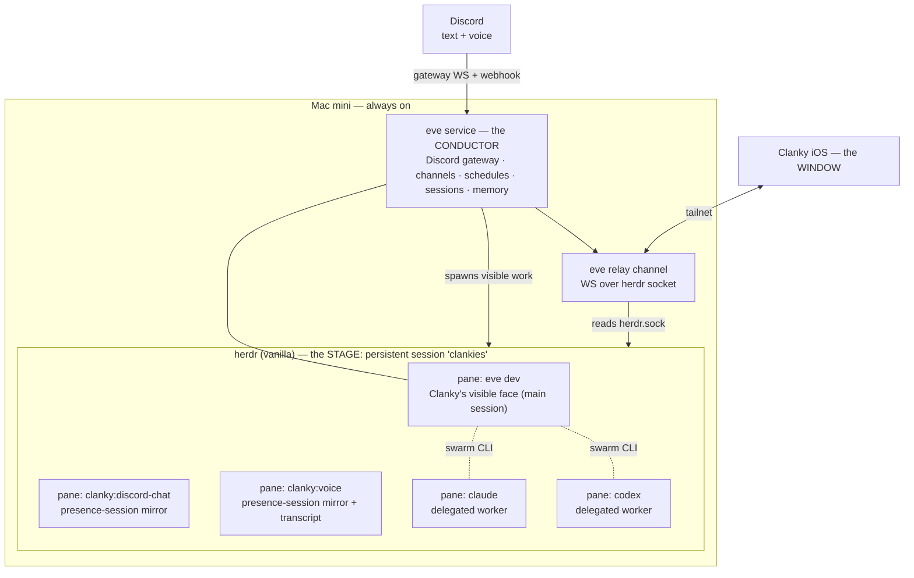
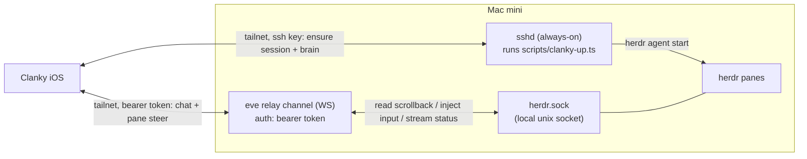
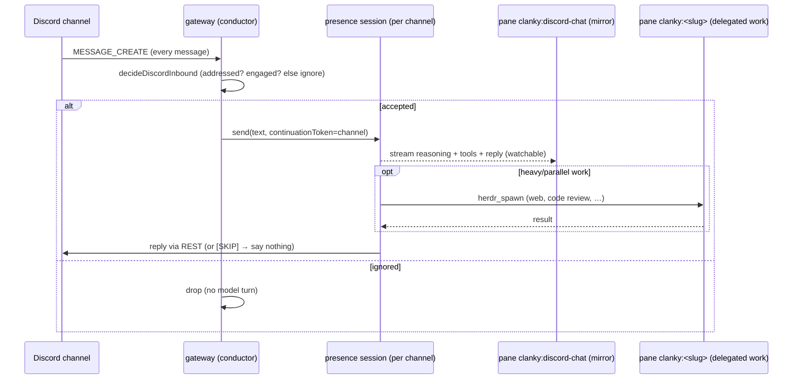

# Clanky Architecture Spec

Status: target architecture. This document is the source of truth for the
rebuilt Clanky. It supersedes the previous "Pi is the foundation, Clanky is not
a daemon" model and every doc written against it.

## 1. Summary

Clanky is an always-on personal agent that lives inside a persistent
[herdr](https://herdr.dev) session and is reachable from anywhere through a
native iOS app. He is built on three off-the-shelf systems and a thin layer of
glue:

- **herdr** is the *stage* — a vanilla, persistent terminal-agent multiplexer.
  Every agent is a visible pane. herdr also provides the swarm coordination CLI.
- **[eve](https://eve.dev)** is the *conductor* — Clanky's durable backend brain
  *and* his visible face. eve owns inbound channels (Discord, voice), cron
  schedules, durable sessions, and memory. Its interactive TUI runs in a herdr
  pane and *is* what you see as "Clanky."
- **Performers** are panes — `eve`, `claude`, or `codex` agents that Clanky
  spawns into herdr for parallel or specialized work, all visible.
- The **window** is the Clanky iOS app, which reaches the stage over the tailnet
  through an eve relay channel.

The previous build was a Pi runtime with personal resources injected and the
gateways, turn queue, and subagent coordination hand-rolled in-process. The
rebuild keeps nothing load-bearing from that model: eve provides the durable
backend primitives Clanky used to hand-roll, herdr provides visibility and swarm
coordination, and **Pi is removed entirely** — it is not a dependency, not a
runtime, and not a performer. The only remaining use of the local Pi checkout
(`~/dev/pi`) is a **one-time code donation**: the OpenAI Codex OAuth flow is
ported out of it into `agent/lib` (§4.6). After that port, deleting `~/dev/pi`
changes nothing about how Clanky runs.

## 2. Goals and non-goals

### Goals

- Clanky is **always on** (a Mac mini) and part of a persistent herdr session by
  default.
- Turning Clanky on shows him in the iOS app; everything he does is a **visible
  TUI pane** in herdr.
- Inbound Discord and voice work surfaces **as panes**, not as hidden in-process
  subagents.
- Clanky can spawn other agents — `claude`, `codex`, more `eve` agents, or
  subagents of himself — all visible.
- **herdr stays vanilla.** No maintained fork. Remote access is solved without
  patching herdr.
- The swarm is **decoupled from Clanky**: a herdr session is a swarm-ready
  environment on its own. Agents coordinate with or without Clanky present, and
  any agent can take the orchestrator role on demand.

### Non-goals

- No custom multiplexer, scheduler, or chat server. herdr and eve own those.
- No hidden background agents. If it runs, it is a pane.
- No backwards-compatibility shims for the old Pi-runtime model. Old surfaces
  are removed, not migrated behind flags.
- Cloud (Mac-off) availability is out of scope for v1. The Mac mini is the host.

## 3. Mental model

Stage, conductor, performers, window.



Read it as:

- **herdr is the stage.** A vanilla, persistent named session (`clankies`) on
  the Mac mini. It provides panes, the swarm coordination CLI
  (`herdr agent list/read/send/wait`, `herdr pane report-agent`), and session
  durability. No fork.
- **eve is the conductor — Clanky's brain and face.** A long-lived local service
  that owns Discord/voice channels, cron schedules, durable session state, and
  memory. Its `eve dev` interactive TUI runs in a pane and is what you see and
  talk to as "Clanky." When eve has inbound or background work, it does not
  answer headlessly — it spawns or routes to a herdr pane so the work is
  visible.
- **Performers are panes.** `eve`, `claude`, or `codex` agents started with
  `herdr agent start`. (herdr can start any binary in a pane, but Pi is not a
  Clanky-blessed performer — see §4.3.)
- **The window is the iOS app.** It reaches the stage through an eve relay
  channel over the tailnet. One front door (eve) serves both chat with Clanky and
  visibility into every pane.

## 4. Roles in detail

### 4.1 herdr — the stage (vanilla)

herdr is used unmodified. It provides:

- **Panes** — every agent is a real terminal, visible and attributable.
- **A persistent named session** (`herdr --session clankies`) that survives
  across restarts and disconnects, so "always on" is herdr's job, not a daemon
  Clanky writes.
- **The swarm coordination CLI**, all over the local unix socket:
  - discovery: `herdr agent list`, `herdr agent get <name>`
  - observation: `herdr agent read <name>` / `herdr pane read`
  - messaging: `herdr agent send <name> <text>` / `herdr pane send-text`
  - synchronization: `herdr agent wait <name> --status idle|working|blocked`
  - presence: `herdr pane report-agent --state … --message …`
  - spawning: `herdr agent start <name> -- <argv…>`

Constraint: **no fork.** herdr's native API is a local unix socket; remote
access is provided by eve (4.4), not by patching herdr. If a herdr-side feature
is genuinely needed (e.g. the old bridge subcommand), it is **upstreamed** to
`ogulcancelik/herdr`, never carried as a private fork.

### 4.2 eve — the conductor (Clanky's brain and face)

Clanky *is* an eve agent: a directory of files (`agent/instructions.md`,
`agent/tools/`, `agent/channels/`, `agent/schedules/`, `agent/skills/`,
`agent/lib/`) that eve compiles and runs as a durable local service.

eve provides, off the shelf, everything Clanky used to hand-roll on Pi:

| Clanky need | eve primitive | Replaces (old in-process code) |
| --- | --- | --- |
| Discord text in/out | `agent/channels/discord.ts` | `agentDiscordGateway`, `discordGatewayController` |
| Voice in/out | `agent/channels/voice.ts` + ClankVox media | `agentVoiceGateway`, voice supervisor wiring |
| Durable session state | eve sessions + `continuationToken` | `runtimeTurnQueue`, `mainSessionContext`, `stores` |
| Scheduled/autonomous runs | `agent/schedules/*.ts` (cron) | (none existed) |
| Visible face | custom face on `eve/client` (`pnpm face`); `eve dev` for debugging | the Pi `InteractiveMode` TUI |
| Memory | eve session context + Clanky memory lib | `@clanky/core` memory (ported) |

**Clanky's face is a custom client on `eve/client`.** `eve dev`'s slash-command
set is fixed and non-extensible, so Clanky's visible face (`scripts/clanky.ts`,
`pnpm face`) is our own terminal UI built on the public `eve/client`. It owns a
headless `eve dev --no-ui` brain (same sessions, memory, tools), starts a
session over the default eve HTTP channel (`POST /eve/v1/session`,
`POST /eve/v1/session/:id`, `GET /eve/v1/session/:id/stream`), and renders the
streamed events (`message.appended`, `reasoning.completed`, `actions.requested`,
`action.result`, `turn.failed`, …) closely mirroring `eve dev`'s look — gutter
glyphs, a yellow phase-aware working spinner, and a persistent bottom status
line (model · effort · tokens · endpoint). On top it adds the config slash
commands `eve dev` can't: `/discord-token`, `/model`, `/effort` (they rewrite
`.env.local` and restart the brain). The stock `eve dev` TUI stays available as
a local dev/debug interface against the same runtime.

Known gap: the face does not yet surface `input.requested` (tool-approval /
human-input prompts) or `session.waiting`; only the streaming render path above
is wired.

The same HTTP routes back the iOS chat surface. For any non-local client, eve's
default dev auth is not sufficient — public surfaces need their own route auth
(see eve's `docs/guides/auth-and-route-protection.md`); `eve/client` supports
bearer/basic auth and custom headers for that.

### 4.3 Performers — panes

When Clanky needs parallel or specialized work, he spawns it as a pane via
`herdr agent start`, never as an eve in-process subagent (which would render
only inside eve's own transcript). Performer types:

- `eve` — another eve agent (e.g. a subagent of Clanky with a narrower brief).
- `claude` — a Claude Code worker for coding tasks.
- `codex` — a Codex worker (and the way to use the OpenAI subscription for
  delegated coding, distinct from Clanky's own model in §4.6).

Pi is **not** a performer. herdr can technically start any binary in a pane, so
nothing stops a one-off `pi` pane, but Pi is not part of Clanky, not installed,
and not maintained as a performer. The `pi-tui-coder` skill is removed.

All performers coordinate through the vanilla `herdr` skill (4.5). Whoever is
orchestrating loads `clanky-herdr-operator` for the harvestable fan-out
protocol.

### 4.4 The window — iOS app, SSH lifecycle + eve relay channel

Remote access must not require a herdr fork. Interaction goes through a **custom
eve channel** (`defineChannel`, raw `WS` route) that relays herdr's local unix
socket to the network. But the relay lives *inside* the eve brain, so it cannot
be what *starts* the brain — that bootstrap rides the one channel that is always
present on the Mac: **SSH**.



- **Lifecycle (SSH).** The app runs `scripts/clanky-up.ts` over SSH to ensure the
  `clankies` session exists and Clanky's brain (`eve dev --no-ui`) runs as a
  pane. Auth: an ed25519 key the app generates and holds in the iOS Keychain.
  Modes: `up` / `status` / `down`, each emitting JSON the app parses.
- **Interaction (relay).** The relay is a raw WS route, so it bypasses eve's
  session framing and carries terminal scrollback, status, and input injection
  faithfully. It adds explicit `start`/`close` ops alongside `read`/`send`/
  `run`/`keys`/`subscribe` and a raw `api` passthrough. Chat-with-Clanky uses
  eve's session routes (`/eve/v1/session`).
- The brain is just another herdr pane — the lead pane — which is why lifecycle
  (SSH) sits below it and interaction (relay) sits inside it.
- herdr stays vanilla; the glue is TypeScript inside the Clanky eve app.
- The iOS app's `Services/` layer targets this relay + SSH contract (replacing
  the earlier herdr-bridge contract, which is gone from the herdr CLI).

### 4.5 Skills model

Two skills, split on capability vs protocol — see also
`skills/clanky-herdr-operator` and the vanilla `herdr` skill.

| Skill | Audience | Purpose |
| --- | --- | --- |
| `herdr` (vanilla, vendor) | **every** agent in a pane | flat full-picture literacy: discover/read/message/wait/`report-agent` |
| `clanky-herdr-operator` | **coordinator only** | opinionated harvestable fan-out: run dirs, manifest, sentinel files, spawn/harvest/cleanup |

- The `herdr` skill is the non-rigid "every agent sees everyone" layer. It is
  already shipped with herdr; the only addition is a short **presence
  self-report** section (`herdr pane report-agent`) so agents publish status for
  peers. That addition is vanilla and upstreamable.
- Do **not** push `clanky-herdr-operator` onto workers; it is the hub-role
  protocol. Workers carry only `herdr`.
- Decision rule: new skill only when trigger *and* audience differ; otherwise
  extend the existing skill.

### 4.6 Model and provider auth — Clanky runs on the OpenAI (Codex) subscription

**Requirement (hard):** Clanky's conductor model is backed by the user's
ChatGPT/Codex **subscription via OpenAI OAuth**, not a per-token OpenAI API key.
The old build got this from Pi's `/login` (Pi owned the OAuth flow and the
subscription-backed model). Dropping Pi drops that, so eve must provide it.

**How eve allows it.** eve's `model:` accepts either a Vercel AI Gateway id
string (key-billed) **or a provider-authored AI SDK `LanguageModel` passed in
code**. Clanky uses the second form: a custom `LanguageModel` that authenticates
with the Codex subscription.

**Port shape (versions resolved):** eve is on the Vercel AI SDK
(`ai@7.0.0-beta.178`, `@ai-sdk/openai@4.0.0-beta.74`,
`@ai-sdk/provider@4.0.0-beta.19` — modern `LanguageModelV2`-era spec). Pi does
**not** use the Vercel AI SDK; its `packages/ai` is a bespoke LLM library on the
official `openai@6.26.0` SDK, and its Codex provider is Pi's own
`StreamFunction`, **not** an AI SDK `LanguageModel`. So the port splits in two —
the OAuth half lifts, the provider half is rebuilt against eve's AI SDK:

- **OAuth flow — lift ~verbatim** (plain HTTP + PKCE + token mint/**refresh**,
  SDK-independent): `~/dev/pi/packages/ai/src/utils/oauth/openai-codex.ts`,
  `utils/oauth/pkce.ts`, `utils/oauth/device-code.ts`.
- **Subscription provider — reference only, rebuild** (it is Pi's
  `StreamFunction` on the `openai` SDK, not portable as code):
  `~/dev/pi/packages/ai/src/providers/openai-codex-responses.ts`. Reuse it as the
  spec for endpoint/headers/request shape — base URL
  `https://chatgpt.com/backend-api`, path `/codex/responses`, headers
  `chatgpt-account-id` and `OpenAI-Beta: responses=experimental`, OpenAI
  **Responses API** shape (note Pi also carries ~1400 lines of WebSocket
  transport and header handling for backend quirks).

**Implementation in eve (`agent/lib/`) — route (a), spike-verified:**

A live spike against the Codex backend with the existing subscription token
confirmed **route (a) works** — the stock `@ai-sdk/openai` Responses model talks
to the Codex backend; no custom `LanguageModelV2` (route b) is needed. The
working recipe:

1. Port the OAuth util to mint and refresh the Codex token (lift from
   `~/dev/pi/.../utils/oauth/openai-codex.ts`). Refresh runs inside the always-on
   eve service; credentials live in the eve secret store / env, never in version
   control. Token shape is `{ access, refresh, expires, accountId }`.
2. Build the model on eve's `@ai-sdk/openai@4.0.0-beta.74`:
   ```ts
   const provider = createOpenAI({
     baseURL: "https://chatgpt.com/backend-api/codex", // .responses() appends /responses
     apiKey: oauth.access,
     fetch: injectHeaders, // sets: chatgpt-account-id, OpenAI-Beta: responses=experimental, originator
   });
   const model = provider.responses("gpt-5.4"); // or gpt-5.3-codex-spark, etc.
   ```
3. Pass `model` as `model:` in `agent.ts`. **Every call must** run streamed and
   carry the Codex-required provider options — verified mandatory:
   - `providerOptions.openai.instructions` — non-empty (Clanky's instructions;
     the `system` message does **not** populate this field — proven in the spike)
   - `providerOptions.openai.store = false`
   - streaming (`stream: true`) — non-streamed calls are rejected
   Wire these as model defaults (a thin wrapper / middleware that always injects
   `instructions` + `store:false`), so callers can't omit them.

Route (b) (hand-write a `LanguageModelV2` from Pi's `openai-codex-responses.ts`)
stays documented as the **fallback only** if the backend later breaks route (a).

**Caveats / to verify:**

- **Route (a) confirmed; the watch item is drift, not feasibility.** The required
  param set (`instructions`, `store:false`, `stream:true`) was reverse-engineered
  from the backend's 400s and may change.
- The Codex Responses surface is **experimental and evolving**
  (`responses=experimental`); it is the same path the official Codex CLI uses
  with your own subscription, not a scrape, but expect drift.
- Token **refresh lifecycle** must be owned by the daemon, not a TUI session.
- Keep the existing **API-key** path (ported from `openAiAuth.ts`) as a fallback
  provider, and the AI Gateway / Anthropic options available for performers.

**Optional second provider — Claude Pro/Max subscription.** `agent/lib/claude-*`
ports Pi's Anthropic OAuth the same way: `claude-auth.ts` (browser login via
`pnpm claude:login`, refresh, store under `anthropic-oauth`) and `claude-model.ts`
(`createClaudeModel` on `@ai-sdk/anthropic`). Select it with
`CLANKY_MODEL_PROVIDER=claude`. Unlike Codex, Anthropic has **no sanctioned
third-party subscription path**: the OAuth model authenticates by presenting
**Claude Code's identity** — `Authorization: Bearer` + `anthropic-beta:
claude-code-…,oauth-…` + `user-agent: claude-cli/…` + `x-app: cli`, and a
middleware that prepends the required first system block *"You are Claude Code,
Anthropic's official CLI for Claude."* This impersonates Anthropic's official
client and is a **ToS-gray path**; use for a personal account, opt-in only. For
Claude *performers* (a `claude` herdr pane) this is unnecessary — Claude Code in
the pane already uses the subscription natively.

## 5. Key flows

### 5.1 Always-on boot (Mac mini)

1. herdr server runs with a persistent session: `herdr --session clankies`.
2. The eve Clanky service starts (channels listening, schedules armed).
3. A pane in `clankies` runs `eve dev` (or `eve dev --url <local>`) as Clanky's
   face.
4. The eve relay channel listens on the tailnet for the iOS app.

"Turning Clanky on" means the eve service and his face pane are up. The iOS app
then shows him.

### 5.2 Discord presence — text (free-will chat)

Clanky is *present* in Discord, not merely callable. He listens to whole
channels, decides for himself when a message is for him, replies in natural
conversation, and can jump in or stay quiet. This is the eve+herdr port of the
Pi-era `agentDiscordGateway` + `discordSubagentCoordinator`.

**The gateway (the always-on ear).** eve's stock `discord.ts` is HTTP
Interactions only — slash commands, request/response. Presence needs to read
*every* message, so the conductor owns a persistent **Discord Gateway**
WebSocket (`agent/lib/discord/gateway.ts`) with the `GUILDS`, `GUILD_MESSAGES`,
`MESSAGE_CONTENT`, and `GUILD_VOICE_STATES` intents. The gateway is a single
connection per bot token (a singleton), so the conductor owns it. Outbound
replies use the stateless Discord **REST** API (`agent/lib/discord/rest.ts`),
which any holder of the bot token can call — so a presence session can post its
own replies without routing audio/text back through the gateway owner. The
HTTP-interactions `discord.ts` stays for slash commands; the gateway is the
free-will surface.

**Addressing + free will.** Every inbound message runs the pure
`decideDiscordInbound` (`agent/lib/discord/acceptance.ts`, ported from
`evaluateDiscordMessageAcceptance`). It *accepts* — i.e. spends a model turn —
on any of: a DM, a platform `@mention`, a reply to one of Clanky's own messages,
a **wake-name address** ("hey clanky", "yo clank", "clanker, …" — matched by
`agent/lib/discord/wake-names.ts`), a bare wake-name **mention**, or a message
inside the **engagement window** (recent active exchange with the same user, so
follow-ups land without re-tagging). Everything else is ignored cheaply, before
any model cost. Acceptance only decides *whether to think*; the model still has
the last word: an accepted turn may answer, or output exactly `[SKIP]` to stay
silent. That two-stage gate (cheap heuristic, then model judgment) is the "free
will" to continue, ignore irrelevant chatter, or jump in. The engagement window
only re-extends when Clanky actually replies, so a `[SKIP]` does not keep him
latched onto a conversation that moved on.

**The presence session (the "Discord subagent").** Accepted chat does **not**
run on Clanky's main face-pane thread — that would clog the window you talk to
and watch. It runs in a dedicated **presence session**: a separate eve session,
keyed per Discord channel, of the *same* root agent. Because it is the same
agent, it shares Clanky's durable **memory store**, persona (`instructions.md`),
and full tool surface automatically (eve shares the memory store across
sessions; only per-session conversation history is separate). So the Discord
Clanky is the same Clanky — same character, same memory, same abilities — on a
thread of his own. Bridge commands escape the subagent and address the main
thread directly: `/clanky <msg>` / `/clanky direct <msg>` → main session,
`/clanky new` → fresh main session, `/clanky compact` → compact main context.



**Watchable in herdr.** Each presence session is mirrored into a herdr pane
(`clanky:discord-chat`) by a viewer that tails the session NDJSON stream
(`GET /eve/v1/session/:id/stream`) and renders reasoning, tool calls, and
messages. You watch the Discord subagent think and act on the stage, exactly
like any performer (§5.6).

**Awareness + delegation.** The presence session has the same `herdr_*` tools as
the conductor, so it has *total awareness of what main Clanky is doing*: it reads
the live stage (`herdr_status`, `herdr_read` on the face pane and other panes)
and shares Clanky's memory. To keep the conversation responsive it **delegates**
heavy work (web browsing, code review, long builds) to `clanky:<slug>` performer
panes via `herdr_spawn` rather than blocking the chat turn, and it can hand a
matter to main Clanky directly (`herdr_send` to the face pane, or a `/clanky
direct` style escalation) when the human is really asking the foreground agent.

The rule still holds: **eve owns inbound + durability; herdr owns visibility.**
The presence session is the durability; its mirror pane and any delegated
performers are the visibility.

### 5.3 Discord presence — voice

Voice is the same presence model with a live media plane. The conductor's
gateway already holds `GUILD_VOICE_STATES`, so "hop in vc" (a wake-addressed
chat message, a voice op, or the existing `discord_voice_join` intent) makes
Clanky join the caller's voice channel. The media path is the ported control
plane in `agent/lib/voice/*` (ClankVox Rust transport for Discord RTP/Opus,
per-speaker OpenAI Realtime transcription, Realtime or ElevenLabs TTS), attached
to the gateway's Discord client via `attachVoiceRuntime()` on
`agent/channels/voice.ts`.

- **Inbound:** ClankVox emits per-speaker PCM; per-speaker STT produces labeled
  transcripts; those become text turns in a dedicated **voice presence session**
  (separate thread, same shared memory + persona, like §5.2).
- **Reasoning + free will:** the realtime agent keeps a small, latency-friendly
  control surface and **delegates** real work — it routes substantive requests
  to the voice presence session / `herdr_spawn` performers rather than mirroring
  Clanky's whole tool set into the low-latency loop. Wake-name barge-in
  interrupts playback; floor control suppresses transcripts while Clanky speaks.
- **Outbound:** the agent's reply is rendered to PCM (internal Realtime audio or
  ElevenLabs) and sent back through ClankVox to Discord.
- **Watchable in herdr:** the `clanky:voice` pane mirrors the live **transcript**
  (who said what) plus the agent's reasoning, tool calls, and spoken replies, so
  a voice room is as inspectable on the stage as a text channel.

Because the voice presence is the same agent on its own session, a thing said in
VC and a thing said in chat reach the same memory and character — and neither
clogs the main face-pane thread.

**Credential kind (bot vs user/self token).** `CLANKY_DISCORD_CREDENTIAL_KIND`
selects `bot-token` (default) or `user-token`. Bot tokens cover text presence and
normal voice audio. **Go Live publish/watch is only exposed to user-token
behavior**, so screen share requires a self token — set it (via the custom
face's `/discord-token … --user-token` slash command), and the gateway applies the discord.js
user-token patches (`agent/lib/discord/user-token-patches.ts`: strip the `Bot `
REST prefix, identify as a desktop client, use `/gateway`, synthesize the READY
`application`). Automating a user account is against Discord's ToS; it is opt-in,
for a personal account, and off by default.

**Go Live.** With a user token, the gateway exposes a raw opcode seam
(`rawGatewayClient()`) that drives Discord's screen-share opcodes through the
already-ported `discordStreamDiscovery` (watch op 20, publish op 18, stop 19,
pause 22). `agent/lib/discord/golive.ts` wraps this as a `GoLiveController`
(list / watch / go-live / stop / pause), registered active when Clanky is in a
vc, and surfaced to him as the `discord_golive` tool. Discovered stream
credentials (`endpoint`/`token`/`rtc_server_id`) are forwarded into ClankVox via
`streamWatchConnect` / `streamPublishConnect` to decode others' streams or
publish his own. **Live-gated:** the actual decode/publish needs a user token + a
running ClankVox + a real call, so the forwarding sink is wired but unexercised
offline; the opcode/discovery/tool layer is verified by `pnpm smoke:discord`.

### 5.4 Continuity across surfaces

Text chat, voice, and the herdr face-pane TUI are three windows onto **one**
Clanky: the same root agent, the same durable memory store, the same tool
surface. They differ only in *which session thread* a turn lands on:

| Surface | Session | Clogs main thread? | Watchable as |
| --- | --- | --- | --- |
| herdr TUI (`eve dev`) | main | — (it *is* the main thread) | the face pane |
| Discord text | per-channel presence | no | `clanky:discord-chat` mirror |
| Discord voice | voice presence | no | `clanky:voice` mirror |
| iOS app | main (via relay) | — | the face pane |

This is what lets you talk to Clanky in the TUI and have him doing parallel work
while, independently, Discord text and voice presences carry on their own
conversations with full awareness of that work.

### 5.5 Fan-out / swarm orchestration

Clanky (or any agent) acting as orchestrator loads `clanky-herdr-operator`,
spawns one pane per task (`clanky:<slug>`), monitors via sentinel files +
`herdr agent read`, unblocks by injecting into panes, and harvests results.
Unchanged from today's operator skill, now driven by an eve conductor instead of
a Pi runtime.

### 5.6 Self-subagents and pane mirrors

There are two distinct things called "subagents" here; keep them apart:

- **Performer panes** — another `eve`, `claude`, or `codex` process started with
  `herdr agent start` (via `herdr_spawn`). Its own process, its own pane, fully
  interactive and watchable, coordinating through the `herdr` skill. This is how
  Clanky (or a presence session) does parallel/specialized work.
- **eve child sessions** — eve's native `agent` tool / declared subagents spin up
  a *child session* in the same service. They share the memory store but render
  only inside eve's own transcript, with no pane. Clanky's **presence sessions**
  (§5.2/§5.3) are this kind: separate session threads of the root agent, made
  watchable not by being a process but by a **pane mirror** that tails the
  session's NDJSON stream into `clanky:discord-chat` / `clanky:voice`.

The mirror is the bridge between the two: it gives a session-only "subagent" the
on-stage visibility that the project's "everything worth watching is a pane" rule
requires, without spawning a redundant process.

## 6. Decoupled swarm sessions (Clanky optional)

Because all coordination is vanilla herdr (the `herdr` skill), the swarm does
not depend on Clanky.

- **`clankies` session** = stage + conductor present → full personal agent.
- **A bare swarm session** = stage only. Agents self-coordinate with
  `herdr agent list/read/send/wait`; any one of them loads
  `clanky-herdr-operator` to become the orchestrator on demand.

The session is the primitive. Clanky is one optional conductor process you
attach to whichever session you point him at. You may run multiple sessions.

## 7. Always-on / deployment

- Host: Mac mini, always on.
- Durability: herdr persistent session (panes survive) + the eve service
  (durable sessions, memory). Both restart with the machine.
- Reachability: tailnet only; the eve relay binds to a private address with a
  bearer token. No public exposure.
- Cloud / Mac-off availability is explicitly deferred. If pursued later, a
  separate deployed eve could cover headless chat only — pane access always
  requires the local herdr.

## 8. Vanilla vs. build

**Off the shelf (no custom maintenance):**

- herdr — stage, persistent session, swarm CLI.
- eve — brain, `eve dev` TUI, channels, schedules, durable sessions.
- `claude` / `codex` — performer agents (Pi is not used).
- the vanilla `herdr` skill.

**We build (all TypeScript, no fork):**

1. The **Clanky eve agent** — instructions, persona, tools, memory lib, Discord
   and voice channels, schedules.
2. The **eve → herdr-pane spawn seam** — the conductor surfaces inbound and
   background work as `herdr agent start` panes (5.2). This is the core
   integration.
3. The **eve relay channel** — raw WS route bridging the iOS app to `herdr.sock`
   (4.4).
4. iOS `Services/` repointed at the relay contract.
5. The **presence self-report** addition to the `herdr` skill (vanilla,
   upstreamable).

## 9. Repository and package layout

### 9.1 Target layout

```
clanky/
  agent/                     # the eve Clanky agent (NEW — the conductor)
    instructions.md
    agent.ts
    channels/
      discord.ts             # Discord HTTP Interactions (slash commands)
      discord-gateway.ts     # free-will presence boot seam (Gateway WS owner)
      voice.ts               # voice channel (ClankVox-backed) + join/leave seam
      relay.ts               # raw WS relay to herdr.sock (the iOS window)
    tools/                   # typed tools (herdr spawn seam, media, web, etc.)
    schedules/               # cron jobs
    skills/                  # agent-local skills (or symlinked)
    lib/
      discord/               # gateway, acceptance/free-will, wake-names, host
      voice/                 # ported Realtime/ClankVox control plane
      ...                    # ported memory, persona, herdr seam helpers
  scripts/
    clanky.ts                # custom face on eve/client (pnpm face)
    discord-pane-mirror.ts   # tails a presence session into a herdr pane
  skills/
    clanky-herdr-operator/   # coordinator fan-out protocol (kept)
    clanky-*-operator/       # web/media/figma/work-tracker/etc. (kept, audited)
  branding/
  SPEC.md                    # this document
  README.md
```

ClankVox stays a sibling Rust repo (`../clankvox`) feeding the voice channel.

### 9.2 Migration map (old Pi runtime → new eve agent)

| Old (current) | Disposition |
| --- | --- |
| `agents/clanky/` (Pi runtime, 38 `pi-coding-agent` imports) | **Removed.** Replaced by `agent/` (eve). |
| `agentDiscordGateway`, `agentChatGateway`, `discordGatewayController`, `discordSubagentCoordinator`, `discordWakeNames` | **Ported** to `agent/lib/discord/*` (gateway, acceptance/free-will, wake-names, host) + `agent/channels/discord-gateway.ts`; the "Discord subagent" is a per-channel eve presence session mirrored to a pane. |
| `agentVoiceGateway`, `agentDiscordVoice`, `voiceSupervisorExtension`, voice coordinators | **Ported.** Control plane → `agent/lib/voice/*`; join/leave + runtime attach → `agent/channels/voice.ts`; "hop in vc" intent + runtime build → `agent/lib/discord/`. |
| `agents/clanky/src/voice/*` (Realtime, transcription, ClankVox IPC) | **Ported** into the voice channel + `agent/lib`. |
| `runtimeTurnQueue`, `mainSessionContext`, `mainWorkerDelegation`, `stores` | **Removed.** Replaced by eve durable sessions + `continuationToken` + the spawn seam. |
| `@clanky/core` (memory, agent tools, subagent store) | **Ported** to `agent/lib` + eve tools; drop the Pi-specific subagent store. |
| `@clanky/chat-discord` | **Folded** into `agent/channels/discord.ts`. |
| `@clanky/browser-bridge`, `discord-mcp` | **Removed** in teardown (recoverable on `master`); re-integrate as eve tools/connections when their capabilities are wired back in. |
| `persona/`, profile/auth commands (`*Auth.ts`, `setupWizard`, `secretPrompt`) | **Re-expressed** as eve instructions + connections/env; drop Pi slash-command wiring. |
| OpenAI **OAuth** model (was Pi's `/login`) | **Ported** into `agent/lib` as a custom AI SDK `LanguageModel` (§4.6); source: `~/dev/pi/packages/ai` oauth util + codex-responses provider. |
| `openAiAuth.ts` (OpenAI **API-key** flow) | **Ported** as the fallback provider; the OAuth subscription path is primary. |
| `skills/pi-tui-coder` | **Removed.** Pi is not a performer. |
| All `docs/*` written against the Pi-foundation model | **Removed** (this spec replaces them). |

### 9.3 Removed docs

The following are deleted as part of this rebuild; their accurate content is
absorbed here:

- `docs/pi-foundation.md` — Pi is no longer the foundation.
- `docs/discord-voice-architecture.md` — voice is an eve channel now.
- `docs/configuration.md`, `docs/getting-started.md`,
  `docs/command-reference.md`, `docs/memory-and-privacy.md`,
  `docs/troubleshooting.md` — written against Pi profiles/TUI flows.
- `docs/ROADMAP.md` — the AgentRoom retirement plan is complete/superseded.
- `docs/qa/*` — Pi-runtime live runbooks.

## 10. Build phases

1. **Skeleton + model auth** — scaffold the eve Clanky agent (`npx eve init`),
   port persona + instructions, and wire the **OpenAI Codex-subscription OAuth
   model** (§4.6) so the conductor runs on the subscription from day one. Get
   `eve dev` running in a herdr pane as the face.
2. **Spawn seam** — implement the eve tool that does `herdr agent start` and
   tracks the pane; prove "background work becomes a visible pane." Add the
   presence self-report to the `herdr` skill.
3. **Discord channel** — stock `agent/channels/discord.ts` (HTTP Interactions /
   slash commands) for request/response use.
4. **Relay channel** — raw WS relay to `herdr.sock`; repoint the iOS app; verify
   pane visibility/steering from the phone.
5. **Voice channel** — port the voice control plane + ClankVox into
   `agent/channels/voice.ts`.
6. **Schedules + cleanup** — add cron jobs; delete the old `agents/clanky` Pi
   runtime, dead packages, and superseded docs.
7. **Free-will Discord presence** (§5.2/§5.3) — the Gateway-owned text + voice
   presence. **Done (verified offline):** wake-name + acceptance/free-will gate
   (`agent/lib/discord/acceptance.ts`, `wake-names.ts`) with a pure smoke
   (`pnpm smoke:discord`); the Gateway WS client (`gateway.ts`, discord.js);
   the host/router to per-channel presence sessions with `[SKIP]`, engagement
   window, and bridge commands (`host.ts`); the pane mirror
   (`scripts/discord-pane-mirror.ts`) + boot seam (`discord-gateway.ts`);
   awareness/delegation via the shared tool surface + instructions; and the
   "hop in vc" intent + voice join seam (`voice-intent.ts`, `voice-runtime.ts`).
   **Also done (verified offline):** user/self-token login for selfbot use
   (`user-token-patches.ts`, `CLANKY_DISCORD_CREDENTIAL_KIND`); the Go Live
   control layer (`golive.ts` + `discord_golive` tool) over the raw-gateway
   opcode seam + `discordStreamDiscovery`; and the **custom face**
   (`scripts/clanky.ts`, `pnpm face`) on eve/client that mirrors eve's TUI and
   adds the slash commands eve can't — `/discord-token`, `/model` (rewrite `.env.local`
   via the pure `env-file.ts` merge + restart the brain), `/new`, `/status`.
   **Live-gated remainder** (needs the token, ClankVox, and OpenAI
   Realtime creds, so not verifiable offline): the realtime voice loop routing
   substantive turns into a shared voice **eve session** (for unified memory)
   rather than only the realtime brain; the `clanky:voice` transcript pane; and
   the ClankVox Go Live decode/publish forwarding (the sink is wired, the media
   path is unexercised offline).

Each phase keeps the system runnable; the old Pi runtime is removed only in
phase 6, once the eve agent covers its surface.

## 11. Open decisions

- **Relay transport fit** — confirm a raw eve WS channel carries live terminal
  scrollback cleanly (spike before phase 4). Fallback: upstream the herdr bridge
  subcommand and let eve be a client of it.
- **Face surface — RESOLVED: custom face.** eve's stock TUI has a fixed,
  non-extensible slash-command set, so the face is `scripts/clanky.ts` (`pnpm
  face`) on the public eve/client: it mirrors eve dev's look and adds the slash
  commands eve can't (`/discord-token`, `/model`, …). It attaches to a running eve
  server or spawns/owns a headless one (eve allows one dev server per agent).
- **Memory store** — reuse `@clanky/core` memory verbatim in `agent/lib` vs.
  adopt eve session context as the primary store.
- **Performer default** — which agent type is the default subagent (`eve` vs
  `claude`) for Clanky's generic fan-out.
- **Codex provider route (§4.6) — RESOLVED: route (a).** A live spike confirmed
  the stock `@ai-sdk/openai` `.responses()` model works against the Codex backend
  with the subscription OAuth token, given `instructions` + `store:false` +
  streaming. No custom `LanguageModelV2` needed; route (b) is fallback-only.
  Remaining risk is backend drift, not feasibility.
