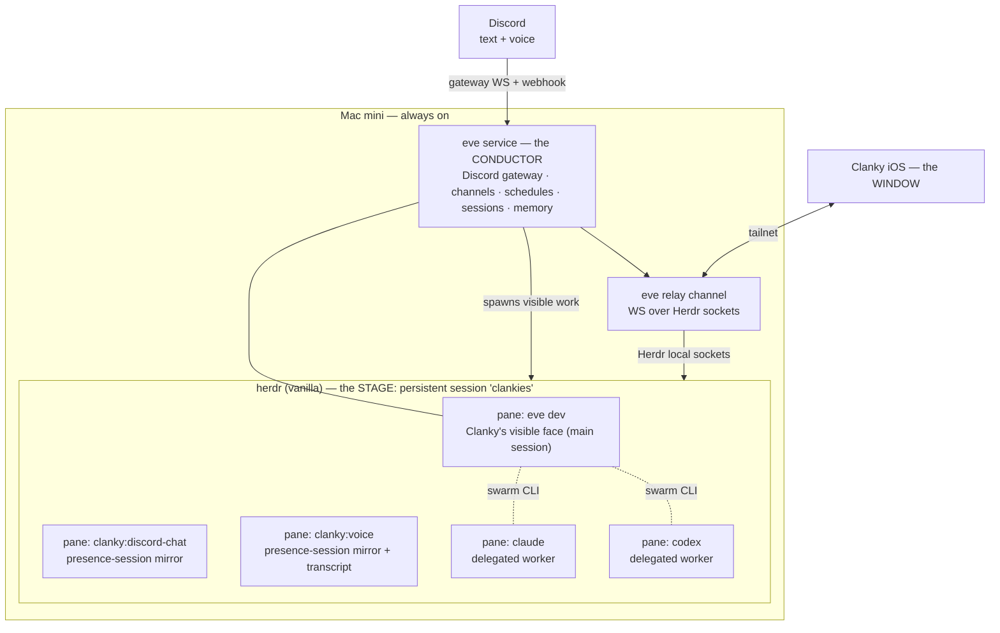
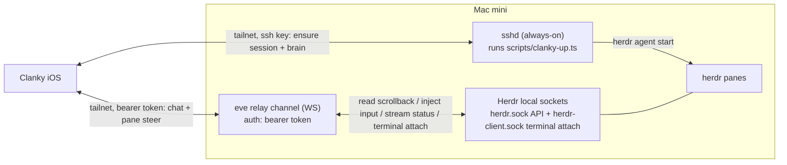
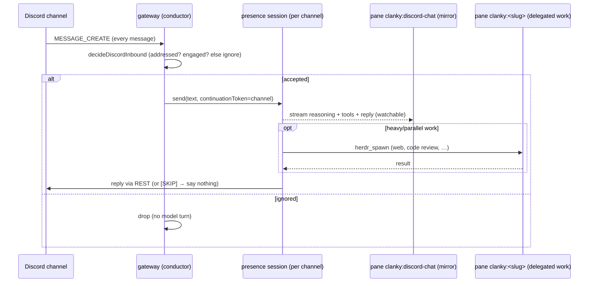

# Clanky Architecture Spec

Status: target architecture. This document is the source of truth for Clanky.

## 1. Summary

Clanky is an always-on personal agent that lives inside a persistent
[herdr](https://herdr.dev) session and is reachable from anywhere through a
native iOS app. He is built on three off-the-shelf systems and a thin layer of
glue:

- **herdr** is the *stage* — a vanilla, persistent terminal-agent multiplexer.
  Every agent is a visible pane. herdr also provides the swarm coordination CLI.
- **[eve](https://eve.dev)** is the *conductor* — Clanky's durable backend brain
  *and* his visible face. eve owns inbound channels (Discord, voice), cron
  schedules, durable sessions, and memory. Its interactive TUI runs in a herdr
  pane and *is* what you see as "Clanky."
- **Performers** are panes — `clanky`, `claude`, `codex`, or `opencode` agents
  that Clanky spawns into herdr for parallel or specialized work, all visible.
- The **window** is the Clanky iOS app, which reaches the stage over the tailnet
  through an eve relay channel.

Pi's `@earendil-works/pi-tui` is the face's presentation layer — the UI toolkit
the face renders the `eve/client` event stream through. eve remains the brain;
pi is the face renderer only, never the brain, the runtime conductor, or a
performer. A local `~/dev/pi` checkout also remains a source reference for the
Codex OAuth implementation in `agent/lib` (§4.6).

## 2. Goals and non-goals

### Goals

- Clanky is **always on** (a Mac mini) and part of a persistent herdr session by
  default.
- Turning Clanky on shows him in the iOS app; everything he does is a **visible
  TUI pane** in herdr.
- Inbound Discord and voice work surfaces **as panes**, not as hidden in-process
  subagents.
- Clanky can spawn other agents — `clanky`, `claude`, `codex`, `opencode`, or
  custom commands — all visible.
- **herdr stays vanilla.** No maintained fork. Remote access is solved without
  patching herdr.
- The swarm is **decoupled from Clanky**: a herdr session is a swarm-ready
  environment on its own. Agents coordinate with or without Clanky present, and
  any agent can take the orchestrator role on demand.

### Non-goals

- No custom multiplexer, scheduler, or chat server. herdr and eve own those.
- No hidden background agents. If it runs, it is a pane.
- No legacy compatibility shims or alternate runtime surfaces.
- Cloud (Mac-off) availability is out of scope for v1. The Mac mini is the host.

## 3. Mental model

Stage, conductor, performers, window.



Read it as:

- **herdr is the stage.** A vanilla, persistent named session (`clankies`) on
  the Mac mini. It provides panes, the swarm coordination CLI
  (`herdr agent list/read/send/wait`, `herdr pane report-agent`), and session
  durability. No fork.
- **eve is the conductor — Clanky's brain and face.** A long-lived local service
  that owns Discord/voice channels, cron schedules, durable session state, and
  memory. Its `eve dev` interactive TUI runs in a pane and is what you see and
  talk to as "Clanky." When eve has inbound or background work, it does not
  answer headlessly — it spawns or routes to a herdr pane so the work is
  visible.
- **Performers are panes.** `clanky`, `claude`, `codex`, or `opencode` agents
  started with `herdr agent start`. (herdr can start any binary in a pane, but
  the supported performer set is defined in §4.3.)
- **The window is the iOS app.** It reaches the stage through an eve relay
  channel over the tailnet. One front door (eve) serves both chat with Clanky and
  visibility into every pane.

## 4. Roles in detail

### 4.1 herdr — the stage (vanilla)

herdr is used unmodified. It provides:

- **Panes** — every agent is a real terminal, visible and attributable.
- **A persistent named session** (`herdr --session clankies`) that survives
  across restarts and disconnects, so "always on" is herdr's job, not a daemon
  Clanky writes.
- **The swarm coordination CLI**, all over the local unix socket:
  - discovery: `herdr agent list`, `herdr agent get <name>`
  - live observation: `herdr agent read <name>` / `herdr pane read`
  - messaging: `herdr agent send <name> <text>` / `herdr pane send-text`
  - synchronization: `herdr agent wait <name> --status idle|working|blocked`
  - presence: `herdr pane report-agent --state … --message …`
  - spawning: `herdr agent start <name> -- <argv…>`

Constraint: **no fork.** herdr's native API is a local unix socket; remote
access is provided by eve (4.4), not by patching herdr. If a herdr-side feature
is genuinely needed (e.g. the old bridge subcommand), it is **upstreamed** to
`ogulcancelik/herdr`, never carried as a private fork.

Herdr is not Clanky's durable historical transcript store. Visible and recent
pane reads are live-stage inspection. Historical output for workers Clanky
spawns is captured by Clanky's transcript layer (§4.3).

### 4.2 eve — the conductor (Clanky's brain and face)

Clanky *is* an eve agent: a directory of files (`agent/instructions.md`,
`agent/tools/`, `agent/channels/`, `agent/schedules/`, `agent/skills/`,
`agent/lib/`) that eve compiles and runs as a durable local service.

eve provides Clanky's durable runtime primitives:

| Clanky need | eve primitive |
| --- | --- |
| Discord text in/out | `agent/channels/discord.ts` |
| Voice in/out | `agent/channels/voice.ts` + ClankVox media |
| Durable session state | eve sessions + `continuationToken` |
| Scheduled/autonomous runs | `agent/schedules/*.ts` (cron) |
| Visible face | custom face on `eve/client` (`clanky dev` while editing, `pnpm face` direct); `eve dev` for debugging |
| Memory | eve session context + Clanky memory lib |

**Clanky's face is a custom client on `eve/client`.** `eve dev`'s slash-command
set is fixed and non-extensible, so Clanky's visible face (`scripts/clanky.ts`,
run through `clanky dev` while editing or `pnpm face` directly) is our own
terminal UI built on the public `eve/client`. It owns a headless
`eve dev --no-ui` brain (same sessions, memory, tools), starts a session over
the default eve HTTP channel (`POST /eve/v1/session`,
`POST /eve/v1/session/:id`, `GET /eve/v1/session/:id/stream`), and renders the
streamed events (`message.appended`, `reasoning.completed`, `actions.requested`,
`action.result`, `turn.failed`, …) closely mirroring `eve dev`'s look — gutter
glyphs, a yellow phase-aware working spinner, and a persistent bottom status
line (model · effort · tokens · endpoint). On top it adds the config slash
commands `eve dev` can't: `/discord-token`, `/model`, `/harness`, `/effort`,
`/approvals`, `/push` (they rewrite `.env.local` and restart the brain). The stock
`eve dev` TUI stays available as a local dev/debug interface against the same
runtime.

The face surfaces `input.requested` (tool-approval / human-input prompts) and
`session.waiting`, then resumes the turn with explicit responses. `/approvals
auto` (env `CLANKY_AUTO_APPROVE=1`, read by `agent/lib/approvals.ts`) remains
available for uninterrupted tool execution; `/approvals prompt` restores
per-tool gating. This only affects approval gates, not the model's own
`ask_question` clarifications.

The same HTTP routes back the iOS chat surface. For any non-local client, eve's
default dev auth is not sufficient — public surfaces need their own route auth
(see eve's `docs/guides/auth-and-route-protection.md`); `eve/client` supports
bearer/basic auth and custom headers for that.

### 4.3 Performers — panes

When Clanky needs parallel or specialized work, he spawns it as a pane via
`herdr agent start`, never as an eve in-process subagent (which would render
only inside eve's own transcript). Performer types:

- `clanky` — Clanky's own CLI runtime (`clanky worker <prompt>`), backed by the
  running Eve brain and Clanky's configured skills.
- `claude` — a Claude Code worker for coding tasks.
- `codex` — a Codex worker (and the way to use the OpenAI subscription for
  delegated coding, distinct from Clanky's own model in §4.6).
- `opencode` — an OpenCode worker that uses OpenCode's native internals.

Allowed coding performers are selected through **coding harness profiles**, not
by importing another agent's internals. `/harness allow` writes
`CLANKY_CODING_HARNESSES` (`clanky`, `claude`, `codex`, `opencode`, `custom`, or
`all`) as the policy allowlist. When a worker is spawned without an explicit
harness, Clanky picks automatically from the allowed set, preferring `clanky`
when it is allowed. Direct `/harness <id>` commands can still write
`CLANKY_CODING_HARNESS` as an optional preferred fallback plus per-harness
launcher/model env for `claude`, `codex`, and `opencode`, or
`CLANKY_CODING_HARNESS_COMMAND` for custom harnesses.
The launcher is either the native CLI default model or an Ollama CLI integration
with a local model; Codex Ollama mode uses `ollama launch codex`, not
`codex-app`. `herdr_spawn` rejects disallowed harnesses, resolves the selected
profile, and starts the command as a visible herdr pane. Clanky then supervises
by reading and steering the pane with `herdr_read` / `herdr_send`. Richer
adapters can be added later, but the base protocol is always a visible pane.

Clanky-spawned performers are wrapped with `clanky transcript-run` by default:
Herdr still starts and owns the pane, while the runner passes terminal output
through unchanged and appends a local transcript under
`~/.clanky/herdr-transcripts/<herdr-session>/<agent>/<run-id>/`:

```
manifest.json
stream.ansi
stream.txt
events.jsonl
```

`stream.ansi` is the lossless terminal stream, `stream.txt` is the normalized
readable history, and `events.jsonl` records timestamped output chunks. Any
agent in the same Herdr session can read it with `clanky transcript read
clanky:<slug> --lines N`. `herdr_read` defaults to `source: "auto"`, which
prefers this transcript when available and falls back to Herdr recent-unwrapped
output. Explicit Herdr sources (`visible`, `recent`, `recent_unwrapped`) still
read Herdr for current screen/debugging state. `source: "full"` is an optional
Herdr capability; with vanilla Herdr builds that do not expose it, Clanky falls
back to capped `recent_unwrapped` output instead of depending on a private fork.

A worker has a transcript **iff** it was launched under `clanky transcript-run`;
sharing Clanky's `HERDR_SESSION` only grants read access to transcripts that
already exist. Capture must sit in the pipe because Herdr exposes bounded
retained scrollback snapshots and attach-time live byte streams, not a
retroactive lossless transcript — so there is no way to transcribe a pane after
the fact. Every spawn entry point therefore funnels through one wrapping seam
(`wrapTranscriptArgv` in `agent/tools/herdr_spawn.ts`):
the eve `herdr_spawn` tool, the `clanky-herdr-operator` `spawn.sh`, and the relay
`start` op all launch performers under `clanky transcript-run` with a pinned
`HERDR_SESSION`/`CLANKY_HOME`. New spawn surfaces (a TUI `/spawn` slash command,
an iOS app button) call this seam, never raw `herdr agent start`. The relay's raw
`api`/`agent.start` passthrough stays the explicit, opt-in escape hatch that
starts an unwrapped pane with no transcript.

| Need | Source |
| --- | --- |
| Running, idle, blocked, done | Herdr |
| Send text or keys | Herdr |
| Current TUI screen | Herdr `visible` |
| Recent terminal screen buffer | Herdr `recent` / `recent_unwrapped` |
| Full retained terminal scrollback | Herdr `full` when supported; otherwise transcript capture for Clanky-spawned panes |
| Historical worker output | Clanky transcript |
| Cross-agent audit trail | Clanky transcript |

Pi is **not** a performer. herdr can technically start any binary in a pane, so
nothing stops a one-off `pi` pane, but Pi is not maintained as a performer —
Clanky's only use of Pi is `@earendil-works/pi-tui` as the face UI toolkit (§1).

All performers coordinate through the vanilla `herdr` skill (4.5). Whoever is
orchestrating loads `clanky-herdr-operator` for the harvestable fan-out
protocol.

### 4.4 The window — iOS app, SSH lifecycle + eve relay channel

Remote access must not require a herdr fork. Interaction goes through a **custom
eve channel** (`defineChannel`, raw `WS` route) that relays Herdr's local unix
sockets to the network: the API socket for normal pane/workspace ops, and the
client terminal socket for durable Native terminal attach. But the relay lives
*inside* the eve brain, so it cannot be what *starts* the brain — that bootstrap
rides the one channel that is always present on the Mac: **SSH**.



- **Pairing (QR).** The primary connect path: `clanky pair` prints a
  `clanky://connect?relayUrl=…&token=…&mode=tailnet` deep link as a terminal QR
  (resolving the tailnet host via `tailscale ip -4`). The app scans it once,
  stores the relay URL + token in Keychain, and auto-reconnects over Tailscale on
  every launch (`restoreConnection`). `clanky pair --link` prints just the link
  for AirDrop. The token stays the credential; Tailscale is the transport.
- **Lifecycle (SSH, Advanced).** Still available under the app's Advanced
  disclosure for remote cold-start: the app runs `scripts/clanky-up.ts` over SSH
  to ensure the `clankies` session exists and Clanky's brain (`eve dev --no-ui`)
  runs as a pane. Auth: an ed25519 key the app generates and holds in the iOS
  Keychain. Modes: `up` / `status` / `down`, each emitting JSON the app parses.
- **Push (relay `register-push` + APNs).** After pairing, the phone registers its
  APNs device token (`register-push {token, events?, platform}`), persisted in
  `~/.config/clanky/push-tokens.json`; the relay returns `{ok, registered,
  apnsConfigured}` so clients can distinguish token registration from send-ready
  APNs configuration. A poll-and-diff watcher (`pane.list` every 5s) pushes an
  alert when an agent transitions to blocked/done/error, carrying the
  pane/workspace ids so a tap deep-links into that pane's live terminal. APNs uses
  token-based auth (ES256 JWT over a .p8 key, `node:crypto` + `http2`), gated on
  `CLANKY_APNS_KEY_PATH` / `CLANKY_APNS_KEY_ID` / `CLANKY_APNS_TEAM_ID` (+
  `CLANKY_APNS_BUNDLE_ID`, `CLANKY_APNS_ENV`); a no-op when unset. The face's
  `/push` command is the local APNs setup surface: it stores only the `.p8` path,
  shows masked registered device tokens, and can send a test notification.
- **Interaction (relay).** The relay is a raw WS route, so it bypasses eve's
  session framing and carries terminal scrollback, status, and input injection
  faithfully. It adds explicit `start`/`close` ops alongside transcript-aware
  `read`/`send`/`run`/`keys`/`subscribe` and a raw `api` passthrough.
  Chat-with-Clanky uses eve's session routes (`/eve/v1/session`).
- **Live terminal (relay `attach`/`write`).** For a true interactive terminal —
  the phone typing straight into a pane and seeing it live — the relay adds a
  held-open `attach` stream and a raw `write` op:
  - `attach {pane, terminal_id?, cols?, rows?, cell_width_px?, cell_height_px?, takeover?=true, source?="visible", format?="ansi", strip_ansi?=false, lines?, interval_ms?=180}`
    opens a per-pane stream. When `terminal_id` is present, the relay connects
    to Herdr's client socket (`herdr-client.sock`), requests `TerminalAnsi`,
    sends `AttachTerminal`, and forwards Herdr-rendered terminal frames as
    base64 ANSI bytes:
    `{id, ok:true, stream:true, body:{type:"pane.output", pane_id, terminal_id, source:"terminal_attach", format:"ansi", full, encoding:"base64", data, seq, width, height}}`.
    The client resets its local terminal for full byte redraws and applies
    incremental frames directly. `cols`/`rows` and cell pixel sizes are the
    viewing client's native terminal grid; reconnecting with a new grid resizes
    the server-owned terminal while the pane process stays durable.
    The iOS app exposes this as Terminal mode **Native**.
  - Without `terminal_id`, or if the direct attach path is unavailable, the relay
    uses the compatibility path: it first sends a **full** ANSI-preserving
    snapshot of the requested source —
    `{id, ok:true, stream:true, body:{type:"pane.output", pane_id, source, format, full:true, text}}`
    — then uses native `pane.attach` byte chunks when available, otherwise
    snapshot polling. `source:"full"` requests all retained Herdr scrollback when
    that Herdr build supports it; vanilla builds without `full` fall back to
    capped `recent_unwrapped` output, while `recent` remains bounded by `lines`.
    The iOS app exposes this as Terminal mode **Mirror**.
    `detach {pane?}` ends one stream (or all). A peer may hold one `events`
    subscription plus one `attach:<pane>` stream per open pane concurrently.
  - `write {pane, text}` → herdr `pane.send_text`, writing verbatim bytes to the
    PTY master with **no** trailing Enter (unlike `run`/`send`). Typed text,
    control sequences (Ctrl-C as `\x03`), and arrow-key escapes (`\x1b[A`) all pass
    through, so the client owns keystroke encoding and newlines.
- The brain is just another herdr pane — the lead pane — which is why lifecycle
  (SSH) sits below it and interaction (relay) sits inside it.
- herdr stays vanilla; the glue is TypeScript inside the Clanky eve app.
- The iOS app's `Services/` layer targets this relay + SSH contract.

### 4.5 Skills model

Two skills, split on capability vs protocol — see also
`skills/clanky-herdr-operator` and the vanilla `herdr` skill.

| Skill | Audience | Purpose |
| --- | --- | --- |
| `herdr` (vanilla, vendor) | **every** agent in a pane | flat full-picture literacy: discover/read/message/wait/`report-agent` |
| `clanky-herdr-operator` | **coordinator only** | opinionated harvestable fan-out: run dirs, manifest, sentinel files, spawn/harvest/cleanup |

- The `herdr` skill is the non-rigid "every agent sees everyone" layer. It is
  already shipped with herdr; the only addition is a short **presence
  self-report** section (`herdr pane report-agent`) so agents publish status for
  peers. That addition is vanilla and upstreamable.
- Do **not** push `clanky-herdr-operator` onto workers; it is the hub-role
  protocol. Workers carry only `herdr`.
- Decision rule: new skill only when trigger *and* audience differ; otherwise
  extend the existing skill.

### 4.6 Model and provider auth — Clanky runs on the OpenAI (Codex) subscription

**Requirement (hard):** Clanky's conductor model is backed by the user's
ChatGPT/Codex **subscription via OpenAI OAuth**, not a per-token OpenAI API key.
Eve owns the OAuth-backed provider used by the conductor.

**How eve allows it.** eve's `model:` accepts either a Vercel AI Gateway id
string (key-billed) **or a provider-authored AI SDK `LanguageModel` passed in
code**. Clanky uses the second form: a custom `LanguageModel` that authenticates
with the Codex subscription.

**Implementation shape (versions resolved):** eve is on the Vercel AI SDK
(`ai@7.0.0-beta.178`, `@ai-sdk/openai@4.0.0-beta.74`,
`@ai-sdk/provider@4.0.0-beta.19` — modern `LanguageModelV2`-era spec). The
`~/dev/pi/packages/ai` implementation is a source reference only: its OAuth
utility is plain HTTP + PKCE, while its Codex provider is a bespoke
`StreamFunction` on the official `openai@6.26.0` SDK rather than an AI SDK
`LanguageModel`.

- **OAuth flow source** (plain HTTP + PKCE + token mint/**refresh**,
  SDK-independent): `~/dev/pi/packages/ai/src/utils/oauth/openai-codex.ts`,
  `utils/oauth/pkce.ts`, `utils/oauth/device-code.ts`.
- **Subscription provider source**:
  `~/dev/pi/packages/ai/src/providers/openai-codex-responses.ts`. Reuse it as the
  spec for endpoint/headers/request shape — base URL
  `https://chatgpt.com/backend-api`, path `/codex/responses`, headers
  `chatgpt-account-id` and `OpenAI-Beta: responses=experimental`, OpenAI
  **Responses API** shape. The reference also carries ~1400 lines of WebSocket
  transport and header handling for backend quirks).

**Implementation in eve (`agent/lib/`) — route (a), spike-verified:**

A live spike against the Codex backend with the existing subscription token
confirmed **route (a) works** — the stock `@ai-sdk/openai` Responses model talks
to the Codex backend; no custom `LanguageModelV2` (route b) is needed. The
working recipe:

1. Implement the OAuth util to mint and refresh the Codex token using
   `~/dev/pi/.../utils/oauth/openai-codex.ts` as the source reference. Refresh
   runs inside the always-on eve service; credentials live in the eve secret
   store / env, never in version control. Token shape is
   `{ access, refresh, expires, accountId }`.
2. Build the model on eve's `@ai-sdk/openai@4.0.0-beta.74`:
   ```ts
   const provider = createOpenAI({
     baseURL: "https://chatgpt.com/backend-api/codex", // .responses() appends /responses
     apiKey: oauth.access,
     fetch: injectHeaders, // sets: chatgpt-account-id, OpenAI-Beta: responses=experimental, originator
   });
   const model = provider.responses("gpt-5.4"); // or gpt-5.3-codex-spark, etc.
   ```
3. Pass `model` as `model:` in `agent.ts`. **Every call must** run streamed and
   carry the Codex-required provider options — verified mandatory:
   - `providerOptions.openai.instructions` — non-empty (Clanky's instructions;
     the `system` message does **not** populate this field — proven in the spike)
   - `providerOptions.openai.store = false`
   - streaming (`stream: true`) — non-streamed calls are rejected
   Wire these as model defaults (a thin wrapper / middleware that always injects
   `instructions` + `store:false`), so callers can't omit them.

Route (b) (hand-write a `LanguageModelV2` from the
`openai-codex-responses.ts` reference) stays documented as the **fallback only**
if the backend later breaks route (a).

**Caveats / to verify:**

- **Route (a) confirmed; the watch item is drift, not feasibility.** The required
  param set (`instructions`, `store:false`, `stream:true`) was reverse-engineered
  from the backend's 400s and may change.
- The Codex Responses surface is **experimental and evolving**
  (`responses=experimental`); it is the same path the official Codex CLI uses
  with your own subscription, not a scrape, but expect drift.
- Token **refresh lifecycle** must be owned by the daemon, not a TUI session.
- Keep the **API-key** path as a fallback provider, and the AI Gateway /
  Anthropic options available for performers.

**Optional second provider — Claude Pro/Max subscription.** `agent/lib/claude-*`
uses Anthropic OAuth the same way: `claude-auth.ts` (browser login via
`pnpm claude:login`, refresh, store under `anthropic-oauth`) and `claude-model.ts`
(`createClaudeModel` on `@ai-sdk/anthropic`). Select it with
`CLANKY_MODEL_PROVIDER=claude`. Unlike Codex, Anthropic has **no sanctioned
third-party subscription path**: the OAuth model authenticates by presenting
**Claude Code's identity** — `Authorization: Bearer` + `anthropic-beta:
claude-code-…,oauth-…` + `user-agent: claude-cli/…` + `x-app: cli`, and a
middleware that prepends the required first system block *"You are Claude Code,
Anthropic's official CLI for Claude."* This impersonates Anthropic's official
client and is a **ToS-gray path**; use for a personal account, opt-in only. For
Claude *performers* (a `claude` herdr pane) this is unnecessary — Claude Code in
the pane already uses the subscription natively.

## 5. Key flows

### 5.1 Always-on boot (Mac mini)

1. herdr server runs with a persistent session: `herdr --session clankies`.
2. The eve Clanky service starts (channels listening, schedules armed).
3. A pane in `clankies` runs `eve dev` (or `eve dev --url <local>`) as Clanky's
   face.
4. The eve relay channel listens on the tailnet for the iOS app.

"Turning Clanky on" means the eve service and his face pane are up. The iOS app
then shows him.

### 5.2 Discord presence — text (free-will chat)

Clanky is *present* in Discord, not merely callable. He listens to whole
channels, decides for himself when a message is for him, replies in natural
conversation, and can jump in or stay quiet. This is the eve+herdr Discord
presence model.

**The gateway (the always-on ear).** eve's stock `discord.ts` is HTTP
Interactions only — slash commands, request/response. Presence needs to read
*every* message, so the conductor owns a persistent **Discord Gateway**
WebSocket (`agent/lib/discord/gateway.ts`) with the `GUILDS`, `GUILD_MESSAGES`,
`MESSAGE_CONTENT`, and `GUILD_VOICE_STATES` intents. The gateway is a single
connection per bot token (a singleton), so the conductor owns it. Outbound
replies use the stateless Discord **REST** API (`agent/lib/discord/rest.ts`),
which any holder of the bot token can call — so a presence session can post its
own replies without routing audio/text back through the gateway owner. The
HTTP-interactions `discord.ts` stays for slash commands; the gateway is the
free-will surface.

**Addressing + free will.** Every inbound message runs the pure
`decideDiscordInbound` (`agent/lib/discord/acceptance.ts`). It *accepts* — i.e.
spends a model turn —
on any of: a DM, a platform `@mention`, a reply to one of Clanky's own messages,
a **wake-name address** ("hey clanky", "yo clank", "clanker, …" — matched by
`agent/lib/discord/wake-names.ts`), a bare wake-name **mention**, or a message
inside the **engagement window** (recent active exchange with the same user, so
follow-ups land without re-tagging). Everything else is ignored cheaply, before
any model cost. Acceptance only decides *whether to think*; the model still has
the last word: an accepted turn may answer, or output exactly `[SKIP]` to stay
silent. That two-stage gate (cheap heuristic, then model judgment) is the "free
will" to continue, ignore irrelevant chatter, or jump in. The engagement window
only re-extends when Clanky actually replies, so a `[SKIP]` does not keep him
latched onto a conversation that moved on.

**The presence session (the "Discord subagent").** Accepted chat does **not**
run on Clanky's main face-pane thread — that would clog the window you talk to
and watch. It runs in a dedicated **presence session**: a separate eve session,
keyed per Discord channel, of the *same* root agent. Because it is the same
agent, it shares Clanky's durable **memory store**, persona (`instructions.md`),
and full tool surface automatically (eve shares the memory store across
sessions; only per-session conversation history is separate). So the Discord
Clanky is the same Clanky — same character, same memory, same abilities — on a
thread of his own. Bridge commands escape the subagent and address the main
thread directly: `/clanky <msg>` / `/clanky direct <msg>` → main session,
`/clanky new` → fresh main session, `/clanky compact` → compact main context.



**Watchable in herdr.** Each presence session is mirrored into a herdr pane
(`clanky:discord-chat`) by a viewer that tails the session NDJSON stream
(`GET /eve/v1/session/:id/stream`) and renders reasoning, tool calls, and
messages. You watch the Discord subagent think and act on the stage, exactly
like any performer (§5.6).

**Awareness + delegation.** The presence session has the same `herdr_*` tools as
the conductor, so it has *total awareness of what main Clanky is doing*: it reads
the live stage (`herdr_status`, `herdr_read` on the face pane and other panes)
and shares Clanky's memory. To keep the conversation responsive it **delegates**
heavy work (web browsing, code review, long builds) to `clanky:<slug>` performer
panes via `herdr_spawn` rather than blocking the chat turn, and it can hand a
matter to main Clanky directly (`herdr_send` to the face pane, or a `/clanky
direct` style escalation) when the human is really asking the foreground agent.

The rule still holds: **eve owns inbound + durability; herdr owns visibility.**
The presence session is the durability; its mirror pane and any delegated
performers are the visibility.

### 5.3 Discord presence — voice

Voice is the same presence model with a live media plane. The conductor's
gateway already holds `GUILD_VOICE_STATES`, so "hop in vc" (a wake-addressed
chat message, a voice op, or the existing `discord_voice_join` intent) makes
Clanky join the caller's voice channel. The media path is the control plane in
`agent/lib/voice/*` (ClankVox Rust transport for Discord RTP/Opus,
per-speaker OpenAI Realtime transcription, Realtime or ElevenLabs TTS), attached
to the gateway's Discord client via `attachVoiceRuntime()` on
`agent/channels/voice.ts`.

- **Inbound:** ClankVox emits per-speaker PCM; per-speaker STT produces labeled
  transcripts; those become text turns in a dedicated **voice presence session**
  (separate thread, same shared memory + persona, like §5.2).
- **Reasoning + free will:** the realtime agent keeps a small, latency-friendly
  control surface and **delegates** real work — it routes substantive requests
  to the voice presence session / `herdr_spawn` performers rather than mirroring
  Clanky's whole tool set into the low-latency loop. Wake-name barge-in
  interrupts playback; floor control suppresses transcripts while Clanky speaks.
- **Outbound:** the agent's reply is rendered to PCM (internal Realtime audio or
  ElevenLabs) and sent back through ClankVox to Discord.
- **Watchable in herdr:** the `clanky:voice` pane mirrors the live **transcript**
  (who said what) plus the agent's reasoning, tool calls, and spoken replies, so
  a voice room is as inspectable on the stage as a text channel.

Because the voice presence is the same agent on its own session, a thing said in
VC and a thing said in chat reach the same memory and character — and neither
clogs the main face-pane thread.

**Credential kind (bot vs user/self token).** `CLANKY_DISCORD_CREDENTIAL_KIND`
selects `bot-token` (default) or `user-token`. Bot tokens cover text presence and
normal voice audio. **Go Live publish/watch is only exposed to user-token
behavior**, so screen share requires a self token — set it (via the custom
face's `/discord-token … --user-token` slash command), and the gateway applies the discord.js
user-token patches (`agent/lib/discord/user-token-patches.ts`: strip the `Bot `
REST prefix, identify as a desktop client, use `/gateway`, synthesize the READY
`application`). Automating a user account is against Discord's ToS; it is opt-in,
for a personal account, and off by default.

**Go Live.** With a user token, the gateway exposes a raw opcode seam
(`rawGatewayClient()`) that drives Discord's screen-share opcodes through the
`discordStreamDiscovery` control layer (watch op 20, publish op 18, stop 19,
pause 22). `agent/lib/discord/golive.ts` wraps this as a `GoLiveController`
(list / watch / go-live / stop / pause), registered active when Clanky is in a
vc, and surfaced to him as the `discord_golive` tool. Discovered stream
credentials (`endpoint`/`token`/`rtc_server_id`) are forwarded into ClankVox via
`streamWatchConnect` / `streamPublishConnect` to decode others' streams or
publish his own. **Live-gated:** the actual decode/publish needs a user token + a
running ClankVox + a real call, so the forwarding sink is wired but unexercised
offline; the opcode/discovery/tool layer is verified by `pnpm smoke:discord`.

### 5.4 Continuity across surfaces

Text chat, voice, and the herdr face-pane TUI are three windows onto **one**
Clanky: the same root agent, the same durable memory store, the same tool
surface. They differ only in *which session thread* a turn lands on:

| Surface | Session | Clogs main thread? | Watchable as |
| --- | --- | --- | --- |
| herdr TUI (`eve dev`) | main | — (it *is* the main thread) | the face pane |
| Discord text | per-channel presence | no | `clanky:discord-chat` mirror |
| Discord voice | voice presence | no | `clanky:voice` mirror |
| iOS app | main (via relay) | — | the face pane |

This is what lets you talk to Clanky in the TUI and have him doing parallel work
while, independently, Discord text and voice presences carry on their own
conversations with full awareness of that work.

### 5.5 Fan-out / swarm orchestration

Clanky (or any agent) acting as orchestrator loads `clanky-herdr-operator`,
spawns one pane per task (`clanky:<slug>`), monitors via sentinel files +
`herdr_read` (`auto` for history, `visible` for current screen), unblocks by
injecting into panes, and harvests results.
The operator skill owns run directories, manifest files, sentinels, and cleanup;
eve decides when to invoke it.

### 5.6 Self-subagents and pane mirrors

There are two distinct things called "subagents" here; keep them apart:

- **Performer panes** — another `clanky`, `claude`, `codex`, or `opencode`
  process started with `herdr agent start` (via `herdr_spawn`). Its own process,
  its own pane, fully interactive and watchable, coordinating through the
  `herdr` skill. This is how Clanky (or a presence session) does
  parallel/specialized work.
- **eve child sessions** — eve's native `agent` tool / declared subagents spin up
  a *child session* in the same service. They share the memory store but render
  only inside eve's own transcript, with no pane. Clanky's **presence sessions**
  (§5.2/§5.3) are this kind: separate session threads of the root agent, made
  watchable not by being a process but by a **pane mirror** that tails the
  session's NDJSON stream into `clanky:discord-chat` / `clanky:voice`.

The mirror is the bridge between the two: it gives a session-only "subagent" the
on-stage visibility that the project's "everything worth watching is a pane" rule
requires, without spawning a redundant process.

## 6. Decoupled swarm sessions (Clanky optional)

Because all coordination is vanilla herdr (the `herdr` skill), the swarm does
not depend on Clanky.

- **`clankies` session** = stage + conductor present → full personal agent.
- **A bare swarm session** = stage only. Agents self-coordinate with
  `herdr agent list/read/send/wait`; any one of them loads
  `clanky-herdr-operator` to become the orchestrator on demand.

The session is the primitive. Clanky is one optional conductor process you
attach to whichever session you point him at. You may run multiple sessions.

## 7. Always-on / deployment

- Host: Mac mini, always on.
- Durability: herdr persistent session (panes survive) + the eve service
  (durable sessions, memory). Both restart with the machine.
- Reachability: tailnet only; the eve relay binds to a private address with a
  bearer token. No public exposure.
- Cloud / Mac-off availability is explicitly deferred. If pursued later, a
  separate deployed eve could cover headless chat only — pane access always
  requires the local herdr.

## 8. Vanilla vs. build

**Off the shelf (no custom maintenance):**

- herdr — stage, persistent session, swarm CLI.
- eve — brain, channels, schedules, durable sessions (headless `eve dev --no-ui` + `eve/client`).
- `@earendil-works/pi-tui` — the face's terminal UI toolkit (rendering primitives).
- `clanky` / `claude` / `codex` / `opencode` — performer agents (pi is not a performer).
- the vanilla `herdr` skill.

**We build (all TypeScript, no fork):**

1. The **Clanky eve agent** — instructions, persona, tools, memory lib, Discord
   and voice channels, schedules.
2. The **eve → herdr-pane spawn seam** — the conductor surfaces inbound and
   background work as `herdr agent start` panes (5.2). This is the core
   integration.
3. The **Clanky transcript layer** — local append-only transcripts for
   Clanky-spawned workers, exposed through `clanky transcript` and transcript
   aware `herdr_read`.
4. The **eve relay channel** — raw WS route bridging the iOS app to Herdr's local
   API and terminal attach sockets (4.4).
5. iOS `Services/` repointed at the relay contract.
6. The **presence self-report** addition to the `herdr` skill (vanilla,
   upstreamable).

## 9. Repository and package layout

### 9.1 Target layout

```
clanky/
  agent/                     # the eve Clanky agent (the conductor)
    instructions.md
    agent.ts
    channels/
      discord.ts             # Discord HTTP Interactions (slash commands)
      discord-gateway.ts     # free-will presence boot seam (Gateway WS owner)
      voice.ts               # voice channel (ClankVox-backed) + join/leave seam
      relay.ts               # raw WS relay to Herdr sockets (the iOS window)
    connections/             # curated third-party servers (Linear, Figma): MCP/OpenAPI + brokered auth
    tools/                   # typed first-party tools (spawn seam, browser-bridge, web, discord, media, dynamic-MCP bridge)
    schedules/               # cron jobs
    skills/                  # agent-local skills (or symlinked)
    lib/
      discord/               # gateway, acceptance/free-will, wake-names, host
      voice/                 # Realtime/ClankVox control plane
      ...                    # memory, persona, herdr seam helpers
  scripts/
    clanky.ts                # custom face on eve/client (pnpm face)
    discord-pane-mirror.ts   # tails a presence session into a herdr pane
  bin/
    clanky.ts                # installed as ~/.local/bin/clanky
  skills/
    clanky-herdr-operator/   # coordinator fan-out protocol
    clanky-*-operator/       # web/media/figma/work-tracker/etc.
  branding/
  SPEC.md                    # this document
  README.md
```

ClankVox stays a sibling Rust repo (`../clankvox`) feeding the voice channel.

### 9.2 Integration model: connections vs. tools vs. dynamic MCP

Three tiers, separated by trust and auth shape. Pick by the rule below; do not
blur them.

1. **Connections (`agent/connections/<name>.ts`)** — the canonical path for
   curated third-party SaaS Clanky depends on: **Linear and Figma first**, then
   any other credentialed service (work trackers, design, finance). One file per
   server via `defineMcpClientConnection` (or `defineOpenAPIConnection`). eve
   brokers auth, keeps the URL and credentials out of the model's reach, exposes
   each remote tool as a typed tool through `connection_search`, and supports
   per-connection approval and tool allow/block. OAuth servers (Linear's hosted
   MCP, etc.) use `auth: defineInteractiveAuthorization` — self-hosted, not the
   Vercel `connect()` helper, since Clanky does not adopt Vercel surfaces. Adding
   one is a small committed code change plus a dev-server reload; the model cannot
   add a connection at runtime, which is the point for credentialed services.

2. **First-party tools (`agent/tools/`)** — capabilities we author and own: the
   herdr spawn seam, `browser_control` (the custom browser-extension bridge),
   `web_*`, `discord_*`, `memory_*`, media. Not third-party servers, just our
   code.

3. **Dynamic MCP bridge (`mcp_list_tools` / `mcp_call` / `mcp_configure`,
   `agent/lib/mcp.ts`)** — runtime-added, no-auth or static-token MCP servers
   only: local tools, automations, a Minecraft MCP. Clanky or the user can add
   one on the fly via `mcp_configure` with no code change. Do **not** route OAuth
   or credentialed SaaS (Linear, Figma, finance) through this layer: its
   transports carry no OAuth provider, and storing long-lived tokens here is
   weaker than a connection's brokered auth. The spawned child-process env must be
   allowlisted, never the full `process.env`.

Decision rule: **OAuth or a shared first-party credential → a connection. No-auth
/ runtime-throwaway / local → the dynamic MCP bridge. Something we wrote ourselves
→ a first-party tool.**

**Role bindings.** Clanky's behavioral routing names logical roles, not vendors.
Roles (work tracker, design tool, and future ones like finance) map to concrete
connections through a runtime binding — `~/.clanky/integration-roles.json` with
env overrides (`CLANKY_WORK_TRACKER`, `CLANKY_DESIGN_TOOL`) — surfaced to the model
by a dynamic instruction (`agent/instructions/integrations.ts`, resolved on
`turn.started`, read/written via `agent/lib/integration-roles.ts`). The custom face
sets bindings with `/integrations` (lists roles, current bindings, and available
connections); the agent picks up the change on the next turn. `instructions.md`
describes roles, so swapping Linear for another tracker, or Figma for another design
tool, is a binding change, not an edit to the persona.

**Filesystem agent files.** Clanky can optionally include host filesystem
instruction files in the same always-on instruction surface. When
`CLANKY_AGENT_MD=1`, `agent/instructions/agent-md.ts` walks upward from
`CLANKY_AGENT_MD_ROOT` (or the brain working directory when unset), reads
`AGENTS.md` / `agent.md` variants in parent-to-leaf order, and appends them as a
dynamic instruction on each turn. This is opt-in because those files are trusted
prompt material; the custom face exposes it through `/agent-md` and restarts the
owned brain after setting changes.

## 10. Implementation status

- **Core runtime:** eve agent, custom face, model selection, harness profiles,
  herdr spawn seam, transcript layer, relay channel, schedules, and dynamic MCP
  bridge are active surfaces.
- **Discord presence:** Gateway-owned text presence, wake-name/free-will gate,
  per-channel presence sessions, pane mirror, bridge commands, voice join intent,
  user-token mode, and Go Live control layer are wired and verified offline.
- **Live-gated voice:** the realtime voice loop, `clanky:voice` transcript pane,
  and ClankVox Go Live media forwarding require a Discord token, ClankVox, and
  OpenAI Realtime credentials for full live verification.

## 11. Open decisions

- **Relay transport fit — RESOLVED (Phase 2): Herdr terminal attach with
  snapshot fallback.** A raw eve WS channel carries live terminal screens via
  the `attach` op (§4.4). When the pane record includes `terminal_id`, the relay
  speaks Herdr's client-socket protocol directly, requests `TerminalAnsi`, and
  forwards rendered terminal frames to iOS. With older Herdr builds or panes
  that lack a terminal id, the relay falls back to the snapshot/native
  `pane.attach` compatibility path over supported read sources. This keeps Herdr
  vanilla at runtime; upstream Herdr can add richer sources without forcing a
  Clanky-specific fork.
- **Face surface — RESOLVED: custom face.** eve's stock TUI has a fixed,
  non-extensible slash-command set, so the face is `scripts/clanky.ts` (`pnpm
  face`) on the public eve/client: it renders eve's event stream through pi-tui
  (`@earendil-works/pi-tui`), matching eve's look only where useful, and adds the
  slash commands eve can't (`/discord-token`, `/model`, `/harness`, …). It attaches to
  a running eve server or spawns/owns a headless one (eve allows one dev server
  per agent).
- **Memory store** — reuse `@clanky/core` memory verbatim in `agent/lib` vs.
  adopt eve session context as the primary store.
- **Performer default — RESOLVED: coding harness profiles.** `/harness allow`
  selects the allowed coding pane profiles; `/harness` selects the default
  fallback and each launchable profile's native-vs-Ollama model preference
  without importing those runtimes as core dependencies.
- **Codex provider route (§4.6) — RESOLVED: route (a).** A live spike confirmed
  the stock `@ai-sdk/openai` `.responses()` model works against the Codex backend
  with the subscription OAuth token, given `instructions` + `store:false` +
  streaming. No custom `LanguageModelV2` needed; route (b) is fallback-only.
  Remaining risk is backend drift, not feasibility.
