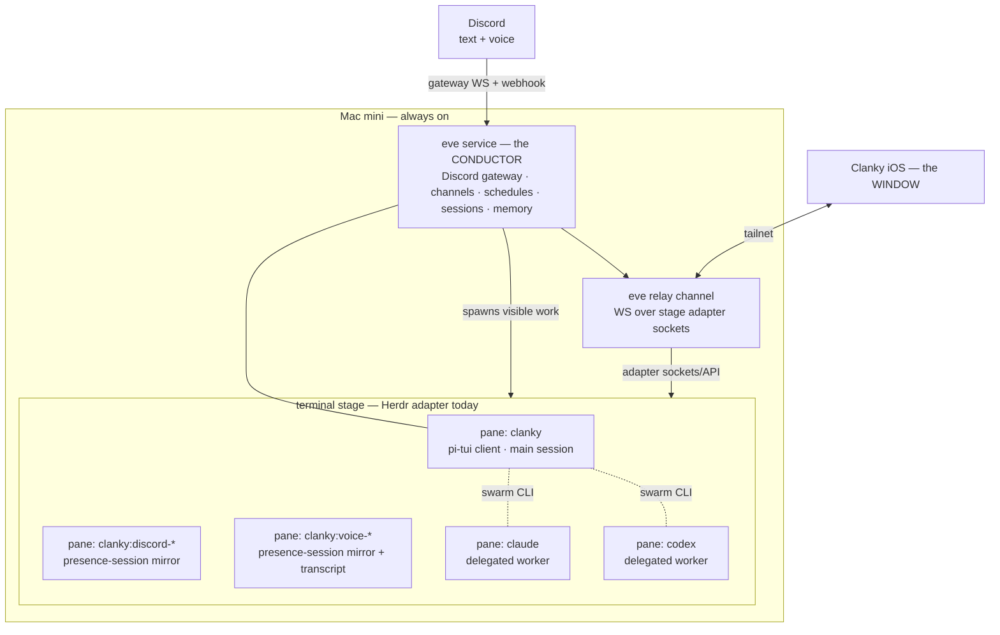
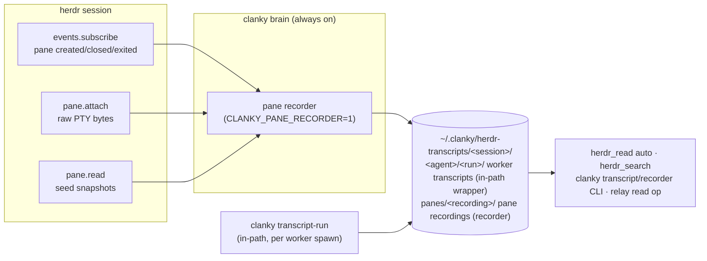
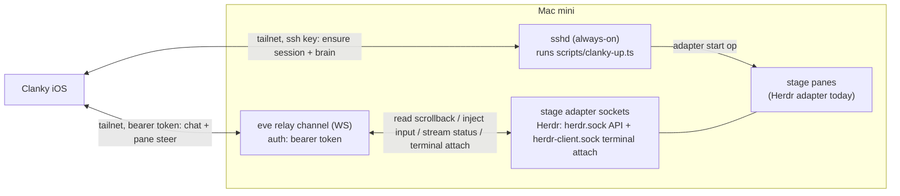
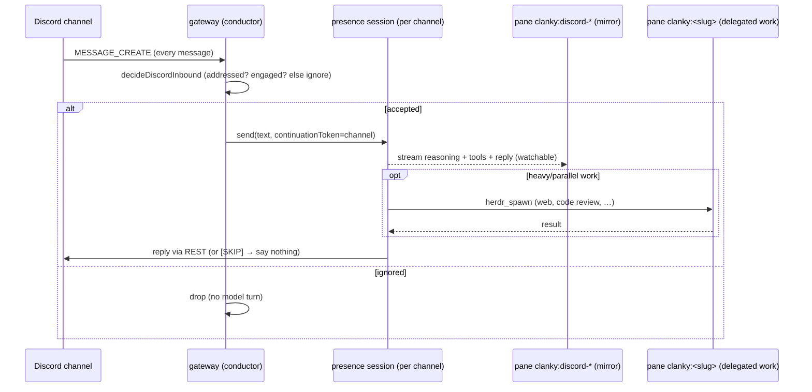

# Clanky Architecture Spec

Status: target architecture. This document is the source of truth for Clanky.

## 1. Summary

Clanky is an always-on personal agent that lives inside a persistent terminal
stage and is reachable from anywhere through a native iOS app. Herdr is the
current/default stage adapter; the architecture is mux-agnostic by design so
tmux, Zellij, and other adapters can expose the same visible-pane model. He is
built on three off-the-shelf systems and a thin layer of glue:

- **The terminal stage** is the visible mux layer. Herdr is the current/default
  adapter and provides the swarm coordination CLI today. Every agent is a visible
  pane.
- **[eve](https://eve.dev)** is the *conductor* — Clanky's durable backend brain.
  eve owns inbound channels (Discord, voice), cron schedules, durable sessions,
  and memory. It runs headless (`eve dev --no-ui`); what you see as Clanky is his
  own **face** — a pi-tui client (`scripts/clanky.ts`) that renders eve's event
  stream in a stage pane.
- **Performers** are panes — `clanky`, `claude`, `codex`, or `opencode` agents
  that Clanky spawns into the stage for parallel or specialized work, all
  visible.
- The **window** is the Clanky iOS app, which reaches the stage over the tailnet
  through an eve relay channel.

Pi's `@earendil-works/pi-tui` is the face's presentation layer — the UI toolkit
the face renders the `eve/client` event stream through. eve remains the brain;
pi is the face renderer only, never the brain, the runtime conductor, or a
performer. A local `~/dev/pi` checkout also remains a source reference for the
Codex OAuth implementation in `agent/lib` (§4.6).

## 2. Goals and non-goals

### Goals

- Clanky is **always on** (a Mac mini) and part of a persistent terminal-stage
  session by default.
- Turning Clanky on shows him in the iOS app; everything he does is a **visible
  TUI pane** in the active stage.
- Inbound Discord and voice work surfaces **as panes**, not as hidden in-process
  subagents.
- Clanky can spawn other agents — `clanky`, `claude`, `codex`, `opencode`, or
  custom commands — all visible.
- **Mux adapters stay vanilla.** No maintained forks. Remote access is solved
  above the mux layer, not by patching Herdr/tmux/Zellij.
- The swarm is **decoupled from Clanky**: a stage session is a swarm-ready
  environment on its own. Agents coordinate with or without Clanky present, and
  any agent can take the orchestrator role on demand.

### Non-goals

- No custom multiplexer, scheduler, or chat server. The active mux adapter and
  eve own those layers.
- No hidden background agents. If it runs, it is a pane.
- No legacy compatibility shims or alternate runtime surfaces.
- Cloud (Mac-off) availability is out of scope for v1. The Mac mini is the host.

## 3. Mental model

Stage, conductor, performers, window.



Read it as:

- **The terminal stage is the mux boundary.** Herdr is the current/default
  adapter: a vanilla, persistent named session (`clankies`) on the Mac mini. It
  provides panes, the swarm coordination CLI (`herdr agent list/read/send/wait`,
  `herdr pane report-agent`), and session durability. tmux, Zellij, and future
  adapters should expose equivalent status/read/send/spawn/presence semantics
  without changing Clanky's conductor model.
- **eve is the conductor — Clanky's brain.** A long-lived local service that owns
  Discord/voice channels, cron schedules, durable session state, and memory. The
  visible Clanky face is a custom `eve/client` pi-tui, not eve's stock TUI. When
  eve has inbound or background work, it does not answer invisibly — it spawns or
  routes to a stage pane so the work is visible.
- **Performers are panes.** `clanky`, `claude`, `codex`, or `opencode` agents
  started through the active stage adapter. (Herdr starts them with
  `herdr agent start`; the supported performer set is defined in §4.3.)
- **The window is the iOS app.** It reaches the stage through an eve relay
  channel over the tailnet. One front door (eve) serves both chat with Clanky and
  visibility into every pane.

## 4. Roles in detail

### 4.1 Terminal stage — mux adapter boundary

The stage is a mux adapter boundary, not a Herdr product requirement. Herdr is
the current/default adapter and is used unmodified. It provides:

- **Panes** — every agent is a real terminal, visible and attributable.
- **A persistent named session** (`herdr --session clankies`) that survives
  across restarts and disconnects, so "always on" is herdr's job, not a daemon
  Clanky writes.
- **The swarm coordination CLI**, all over the local unix socket:
  - discovery: `herdr agent list`, `herdr agent get <name>`
  - live observation: `herdr agent read <name>` / `herdr pane read`
  - messaging: `herdr agent send <name> <text>` / `herdr pane send-text`
  - synchronization: `herdr agent wait <name> --status idle|working|blocked`
  - presence: `herdr pane report-agent --state … --message …`
  - spawning: `herdr agent start <name> -- <argv…>`

Constraint: **no mux forks.** Herdr's native API is a local unix socket; remote
access is provided by eve (4.4), not by patching the mux. If a Herdr-side feature
is genuinely needed (e.g. the old bridge subcommand), it is **upstreamed** to
`ogulcancelik/herdr`, never carried as a private fork. tmux/Zellij adapters
should follow the same rule: adapt at Clanky's boundary or upstream generally
useful mux features.

The mux adapter is not Clanky's durable historical transcript store. Visible and
recent pane reads are live-stage inspection. Historical output for workers Clanky
spawns is captured by Clanky's transcript layer (§4.3).

### 4.2 eve — the conductor (Clanky's brain)

Clanky *is* an eve agent: a directory of files (`agent/instructions.md`,
`agent/tools/`, `agent/channels/`, `agent/schedules/`, `agent/skills/`,
`agent/lib/`) that eve compiles and runs as a durable local service.

eve provides Clanky's durable runtime primitives:

| Clanky need | eve primitive |
| --- | --- |
| Discord text in/out | `agent/channels/discord-gateway.ts` + `agent/channels/discord.ts` |
| Voice in/out | `agent/channels/voice.ts` + ClankVox media |
| Durable session state | eve sessions + `continuationToken` |
| Scheduled/autonomous runs | `agent/schedules/*.md` (cron frontmatter) |
| Slash-command execution | headless command host (`scripts/clanky.ts --command-host`) registered with the relay |
| Visible face | custom face on `eve/client` (`clanky dev` while editing, `pnpm dev` direct) |
| Memory | eve session context + Clanky memory lib |

**Clanky's face is a custom client on `eve/client`.** `eve dev`'s slash-command
set is fixed and non-extensible, so Clanky's visible face (`scripts/clanky.ts`,
run through `clanky dev` while editing or `pnpm dev` directly) is our own
terminal UI built on the public `eve/client`. It attaches to the same headless
`eve dev --no-ui` brain (same sessions, memory, tools), starts a session over
the default eve HTTP channel (`POST /eve/v1/session`,
`POST /eve/v1/session/:id`, `GET /eve/v1/session/:id/stream`), and renders the
streamed events (`message.appended`, `reasoning.completed`, `actions.requested`,
`action.result`, `turn.failed`, …) closely mirroring `eve dev`'s look — gutter
glyphs, an `expo-agent-spinners`-backed phase-aware working spinner with width
presets, curated same-width cycles, exact spinner picks, custom cycles, and a
configurable cycle rate, and a
persistent bottom status line (model · effort · tokens · endpoint). On top it adds Clanky-specific slash
commands `eve dev` can't. The deterministic command executor is the command
host registered with the relay; a visible face may also register as a command
host, but iOS and other remote clients depend on command-host presence rather
than a visible TUI. The live command list is `/help` and the shared `COMMANDS`
registry in `scripts/clanky.ts`; this spec does not duplicate that list. Beyond
slash commands, the face has an inline shell escape (mirroring codex/opencode):
pressing `!` on an empty input enters bash mode (accent border, suppressed
typeahead), where a submitted line runs as a host shell command in the repo via
the user's `$SHELL` and its output renders inline as a transcript block. Esc or
backspace-on-empty exits; Ctrl-C kills a running command; a `!`-prefixed line
runs the same path without entering the mode. The runner and renderer live in
`agent/lib/clanky-face-bash.ts`, and each run is summarized into the TUI ledger
so the brain stays aware. Config
commands rewrite `.env.local` and restart the brain through the host below Eve.

The face surfaces `input.requested` (tool-approval / human-input prompts) and
`session.waiting`, then resumes the turn with explicit responses. `/approvals
auto` (env `CLANKY_AUTO_APPROVE=1`, read by `agent/lib/approvals.ts`) remains
available for uninterrupted tool execution; `/approvals prompt` restores
per-tool gating. This only affects approval gates, not the model's own
`ask_question` clarifications.

The same HTTP routes back the iOS chat surface. For any non-local client, eve's
default dev auth is not sufficient — public surfaces need their own route auth
(see eve's `docs/guides/auth-and-route-protection.md`); `eve/client` supports
bearer/basic auth and custom headers for that.

### 4.3 Performers — panes

When Clanky needs parallel or specialized work, he spawns it as a pane via
`herdr agent start`, never as an eve in-process subagent (which would render
only inside eve's own transcript). Performer types:

- `clanky` — Clanky's own CLI runtime (`clanky worker <prompt>`), backed by the
  running Eve brain and Clanky's configured skills.
- `claude` — a Claude Code worker for coding tasks.
- `codex` — a Codex worker (and the way to use the OpenAI subscription for
  delegated coding, distinct from Clanky's own model in §4.6).
- `opencode` — an OpenCode worker that uses OpenCode's native internals.

Allowed coding performers are selected through **coding harness profiles**, not
by importing another agent's internals. `/harness allow` writes
`CLANKY_CODING_HARNESSES` (`clanky`, `claude`, `codex`, `opencode`, `custom`, or
`all`) as the policy allowlist. Every worker spawn must choose a harness
explicitly (`clanky`, `claude`, `codex`, `opencode`, or `custom`); there is no
automatic or fallback harness selection. Direct `/harness <id>` commands
configure per-harness launcher/model env for `claude`, `codex`, and `opencode`,
or `CLANKY_CODING_HARNESS_COMMAND` for custom harnesses.
The launcher is either the native CLI default model or an Ollama CLI integration
with a local model; Codex Ollama mode uses `ollama launch codex`, not
`codex-app`. `herdr_spawn` rejects disallowed harnesses, resolves the selected
profile, and starts the command as a visible stage pane through the current Herdr
adapter. Clanky then supervises by reading and steering the pane with
`herdr_read` / `herdr_send`. Richer mux adapters can be added later, but the base
protocol is always a visible pane.

Clanky-spawned performers are wrapped with `clanky transcript-run` by default
when worker transcript capture is enabled (`CLANKY_WORKER_TRANSCRIPTS`, default
on; `/harness transcripts on|off` writes it). Herdr still starts and owns the
pane, while the runner passes terminal output through unchanged and appends a
local transcript under
`~/.clanky/herdr-transcripts/<herdr-session>/<agent>/<run-id>/`:

```
manifest.json
stream.ansi
stream.txt
```

`stream.ansi` is the lossless terminal stream and `stream.txt` is the
normalized readable history. Stored transcripts are retention-swept
opportunistically at run creation (30 days / 500 runs / 2 GiB across sessions,
never touching runs active within 6 hours). Any
agent in the same Herdr session can read it with `clanky transcript read
clanky:<slug> --lines N`. `herdr_read` defaults to `source: "auto"`, which
prefers durable history (the worker transcript for agents, the pane recording
in §4.3.1 for panes) and falls back to Herdr recent-unwrapped output. Explicit
Herdr sources (`visible`, `recent`, `recent_unwrapped`) still read Herdr for
current screen/debugging state. Herdr intentionally has no full-history read:
retained scrollback is a bounded in-memory buffer, reads are capped server-side
(1000 lines, no pagination), and nothing survives pane close — durable history
is Clanky's, captured at the byte stream (ADR-0007).

A worker has a transcript **iff** it was launched under `clanky transcript-run`;
sharing Clanky's `HERDR_SESSION` only grants read access to transcripts that
already exist. Capture must sit in the pipe because Herdr exposes bounded
retained scrollback snapshots and attach-time live byte streams, not a
retroactive lossless transcript — so there is no way to transcribe a pane after
the fact. Every spawn entry point therefore funnels through one wrapping seam
(`wrapTranscriptArgv` in `agent/tools/herdr_spawn.ts`):
the eve `herdr_spawn` tool, the `clanky-herdr-operator` `spawn.sh`, the TUI
`/spawn` command, and the relay `start` op all resolve the transcript default
from `CLANKY_WORKER_TRANSCRIPTS` with pinned `HERDR_SESSION`/`CLANKY_HOME` when
wrapping is enabled. Per-spawn overrides remain explicit: `herdr_spawn`
`transcript: true|false`, relay `start` `transcript: true|false`, and operator
`spawn.sh --transcript|--no-transcript`. New spawn surfaces call this seam, never
raw `herdr agent start`. The relay's raw `api`/`agent.start` passthrough stays
the explicit escape hatch that starts an unwrapped pane with no transcript.

Spawns are also **wake-armed** by default: the spawn funnel
(`spawnClankyWorker`) and the operator `spawn.sh` each arm a detached one-shot
completion watcher (`clanky watch`; classification logic in
`agent/lib/worker-watch.ts`) per worker. The watcher blocks on the mux's
agent-status events for that pane, classifies the outcome against the run's
`DONE`/`BLOCKED` sentinels — sentinels are completion truth, `agent_status` is
a heuristic confirmed by a quiet-screen window plus a slow recheck under the
event stream — and delivers exactly one provenance-stamped
`[from watch:<slug>] [worker done|blocked|idle|dead]` wake into the spawning
lead's pane through the `clanky msg` machinery, then exits. The notify target
is resolved to a durable name at spawn time (never a stored pane id, which
compacts). Opt out per spawn with `herdr_spawn` `watch: false` or `spawn.sh
--no-watch`; `spawn.sh` records the armed watcher in `manifest.json` and logs
it to `workers/<slug>/watch.log`. This wake bridge is the supervisor's wake
substrate in the pool orchestration operating model
(`docs/adr/0002-pool-orchestration-operating-model.md`). The relay `start` op
does not arm a watcher yet.

| Need | Source |
| --- | --- |
| Running, idle, blocked, done | Herdr |
| Completion wake ("ping me when done") | `clanky watch`, armed per spawn at the seam |
| Send text or keys | Herdr |
| Current TUI screen | Herdr `visible` |
| Recent terminal screen buffer | Herdr `recent` / `recent_unwrapped` |
| Full history of a wrapped worker | Clanky worker transcript |
| Full history of any other pane (iOS-created, manual, mirrors) | Clanky pane recording (§4.3.1) |
| Historical worker output | Clanky transcript when capture is enabled |
| Cross-agent audit trail | Clanky transcript + pane recordings |
| Full-text search across all of the above | `herdr_search` / `clanky transcript search` |

#### 4.3.1 Session-wide pane recorder

The worker transcript covers only panes spawned through the wrapping seam. The
**pane recorder** (ADR-0007) is the second, observational capture plane: a
service inside the always-on brain that subscribes to Herdr pane lifecycle
events, attaches to every pane in the connected session via the Herdr 0.7.1+
`pane.attach` byte stream, and persists per-pane recordings beside the worker
transcripts under the reserved `panes/` name:

```
~/.clanky/herdr-transcripts/<herdr-session>/panes/<recording-id>/
  manifest.json        kind: pane-recording (paneId, terminalId, agent, label)
  events.jsonl         attach / seed / stream-gap / rotate / prune / finalized
  seed-NNNNNN.txt      pane.read snapshot at each attach epoch (≤1000 lines)
  stream.ansi          lossless raw bytes since attach (active segment)
  stream.txt           normalized readable history (active segment)
  archive-NNNNNN.*.gz  rotated segments (gzip, ~10x for terminal output)
```

The two planes carry different guarantees and both stay: the wrapper is
**in-path** (lossless from birth, survives brain downtime, has exit codes); the
recorder is **observational** (best-effort from first attach, gaps seeded from
`pane.read` and marked in events.jsonl, pauses with the brain). Panes whose
foreground process is a `transcript-run` wrapper are detected via
`pane.process_info` and recorded lifecycle-only (`coveredBy`), so bytes are
stored once; `CLANKY_PANE_RECORDER_RECORD_ALL=1` overrides. Recordings ride the
same retention sweep as worker runs, plus a per-recording cap (256 MiB)
enforced by pruning oldest archives at rotation so an immortal pane cannot eat
the shared budget. A brain restart resumes the open recording for a live pane
by terminal id; against a pre-`pane.attach` Herdr the recorder degrades to
seed-only capture (`clanky recorder seed` runs one such pass manually, e.g.
right before a Herdr live-handoff upgrade truncates replay to 8 KB/pane).



Readers page beyond Herdr's 1000-line cap with `herdr_read`
`source: recording` (`anchor: head|tail`, `skip`), and `herdr_search` /
`clanky transcript search` run full-text search across both planes including
gzipped archives (ripgrep when installed, bounded node scan otherwise). The
relay `read` op mirrors the same recording-first `auto` behavior, so the iOS
window gets durable pane history — including panes it created — for free.

Pi is **not** a performer. herdr can technically start any binary in a pane, so
nothing stops a one-off `pi` pane, but Pi is not maintained as a performer —
Clanky's only use of Pi is `@earendil-works/pi-tui` as the face UI toolkit (§1).

All performers coordinate through the vanilla `herdr` skill (4.5). Whoever is
orchestrating loads `clanky-herdr-operator` for the harvestable fan-out
protocol.

### 4.4 The window — iOS app, SSH lifecycle + eve relay channel

Remote access must not require a mux fork. Interaction goes through a **custom
eve channel** (`defineChannel`, raw `WS` route) that relays the active stage
adapter to the network. With the current Herdr adapter, that means Herdr's local
unix API socket for normal pane/workspace ops and the client terminal socket for
durable Native terminal attach. But the relay lives
*inside* the eve brain, so it cannot be what *starts* the brain — that bootstrap
rides the one channel that is always present on the Mac: **SSH**.

> **Proposed (ADR-0001, pending sign-off) — remote lifecycle direction.** The
> React Native migration has no mature cross-platform SSH stack, so cold-start
> moves off SSH to an always-on **supervisor** below the brain that exposes its
> own tailnet `lifecycle` op (`up`/`status`/`down`). The supervisor is
> `scripts/clanky-up.ts` promoted to a launchd daemon; it holds its **own**
> lifecycle token minted at install (not the brain-minted relay token — the
> relay cannot boot the brain that mints it), and it formalizes the §7 always-on
> boot. Phasing: the RN app first ships against an **already-running relay** (QR
> pairing + Tailscale, no on-device cold-start), then gains supervisor cold-start
> at M6 ([VUH-294](https://linear.app/vuhlp/issue/VUH-294)), at which point SSH
> lifecycle retires. The SSH description below is the **current, ratified** path
> until sign-off flips ADR-0001 to Accepted. See `docs/adr/0001-remote-lifecycle-cold-start.md`.



- **Pairing (QR).** The primary connect path: `clanky pair` prints a
  `clanky://connect?relayUrl=…&token=…&mode=tailnet` deep link as a terminal QR
  (resolving the tailnet host via `tailscale ip -4`). The app scans it once,
  stores the relay URL + token in Keychain, and auto-reconnects over Tailscale on
  every launch (`restoreConnection`). `clanky pair --link` prints just the link
  for AirDrop. The token stays the credential; Tailscale is the transport.
- **Lifecycle (SSH, Advanced).** Still available under the app's Advanced
  disclosure for remote cold-start: the app runs `scripts/clanky-up.ts` over SSH
  to ensure the `clankies` session exists and Clanky's brain (`eve dev --no-ui`)
  runs as a pane. Auth: an ed25519 key the app generates and holds in the iOS
  Keychain. Modes: `up` / `status` / `down`, each emitting JSON the app parses.
  (Proposed to be superseded by the supervisor `lifecycle` op — ADR-0001.)
- **Push (relay `register-push` + APNs/FCM).** After pairing, mobile clients
  register their push token (`register-push {token, platform, events?}` where
  `platform` is `ios` or `android`; omitted platform defaults to `ios` for the
  existing iOS client), persisted as `push-tokens.json` under the Clanky data
  root (`CLANKY_HOME`, default `~/.clanky`; a legacy `~/.config/clanky` registry
  is copied forward on first use); the
  relay returns `{ok, registered, platform, apnsConfigured, fcmConfigured}` so
  clients can distinguish token registration from send-ready sender
  configuration. A poll-and-diff watcher (`pane.list` every 5s) pushes an alert
  when an agent transitions to blocked/done/error, carrying the pane/workspace
  ids so a tap deep-links into that pane's live terminal; the watcher also
  starts at brain boot when the registry is non-empty, not only on the first
  register-push. iOS devices use APNs
  token-based auth (ES256 JWT over a .p8 key, `node:crypto` + `http2`), gated on
  `CLANKY_APNS_KEY_PATH` / `CLANKY_APNS_KEY_ID` / `CLANKY_APNS_TEAM_ID` (+
  `CLANKY_APNS_BUNDLE_ID`, `CLANKY_APNS_ENV`); Android devices use FCM HTTP v1
  with service-account OAuth, gated on `CLANKY_FCM_SERVICE_ACCOUNT_PATH` (or
  `GOOGLE_APPLICATION_CREDENTIALS`) plus optional `CLANKY_FCM_PROJECT_ID`, or the
  env-only `CLANKY_FCM_PROJECT_ID` / `CLANKY_FCM_CLIENT_EMAIL` /
  `CLANKY_FCM_PRIVATE_KEY` trio. Both senders no-op when unset. The face's
  `/push` command is the local APNs setup surface and push status/test surface:
  it stores only the `.p8` path, shows masked registered device tokens by
  platform, and can send test notifications through configured senders.
- **Interaction (relay).** The relay is a raw WS route, so it bypasses eve's
  session framing and carries terminal scrollback, status, and input injection
  faithfully. It adds explicit `start`/`create-tab`/`close` ops alongside
  transcript-aware `read`/`send`/`run`/`keys`/`subscribe` and a raw `api`
  passthrough. `create-tab {workspace_id?, argv, cwd?, label?, focus?}` applies
  a one-pane Herdr layout so the new tab's root pane runs the requested command;
  clients must not simulate new tabs by starting a pane with only
  `workspace_id`, because Herdr will place that pane in the workspace's current
  tab.
  Chat-with-Clanky uses eve's session routes (`/eve/v1/session`). Each native
  chat also binds to a Herdr mirror: after creating an eve session the app calls
  `chat.mirror {session_id, slug, title?, tab_id?, pane_id?}`, which places (or,
  by handle, reuses) a one-pane mirror tab in a dedicated **"Clanky" workspace**
  — one tab per chat, materialized via `layout.apply` so the mirror is the tab
  root with no orphan shell — and returns `{workspace_id, tab_id, pane_id}`;
  `chat.close {tab_id?, pane_id?, close_tab?}` tears it down. The mirror pane runs
  the shared session viewer (`scripts/discord-pane-mirror.ts`), so an iOS chat is
  watchable on the desktop stage like the Discord/voice presences (§5.6). The
  chat list is **device-persisted** (`{slug, sessionId, continuationToken, title,
  tabId, paneId}`); per-chat status is reconciled against the workspace tree the
  app already streams, so there is no server-side chat registry.
- **Shared wire schemas.** `packages/clanky-contract` is the zod/TypeScript
  schema package for the relay and Eve session wire shapes. It lives in this
  agent repo because the agent owns the API; the relay
  (`agent/channels/relay.ts`, implementation in `agent/lib/relay/*`) imports
  it to validate inbound relay requests, and `../clanky-ios` consumes the same
  package from the sibling checkout through its pnpm workspace. Inbound relay
  frames are additionally capped at `MAX_RELAY_INBOUND_MESSAGE_BYTES` (~36 MB,
  sized above the 25 MiB upload limit after base64 expansion); an oversized
  frame is rejected with an error reply before it is ever parsed.
- **Live terminal (relay `attach`/`write`/`resize`).** For a true interactive
  terminal — the phone typing straight into a pane and seeing it live — the
  relay adds a held-open `attach` stream plus raw `write` and `resize` ops:
  - `attach {pane, terminal_id?, cols?, rows?, cell_width_px?, cell_height_px?, takeover?=true, source?="visible", format?="ansi", strip_ansi?=false, lines?, interval_ms?=180}`
    opens a per-pane stream. When `terminal_id` is present, the relay connects
    to Herdr's client socket (`herdr-client.sock`), requests `TerminalAnsi`, and
    also sends a full ANSI-preserving `pane.read` snapshot of `source` first so
    remote clients can seed local scrollback:
    `{id, ok:true, stream:true, body:{type:"pane.output", pane_id, source, format, full:true, text}}`.
    Live chunks that arrive before that snapshot are buffered and replayed after
    it. The relay then sends `AttachTerminal` output as Herdr-rendered base64
    ANSI bytes:
    `{id, ok:true, stream:true, body:{type:"pane.output", pane_id, terminal_id, source:"terminal_attach", format:"ansi", full, encoding:"base64", data, seq, width, height}}`.
    The client treats text snapshots as history replacement, while full byte
    redraws replace only the active screen and must preserve the seeded
    scrollback. `cols`/`rows` and cell pixel sizes are the viewing client's
    native terminal grid; reconnecting with a new grid resizes the server-owned
    terminal while the pane process stays durable.
    The iOS app exposes this as Terminal mode **Native**.
    Every outgoing `pane.output` body also carries `t_frame` (server
    `Date.now()` at send) as an additive latency-instrumentation field;
    strict clients strip it.
    A slow or backgrounded client is guarded by server-side backpressure:
    when the peer's WS socket buffers past 4 MiB, live output frames for that
    attach stream are dropped instead of accumulating in the relay process,
    and once the socket drains below 512 KiB the stream resyncs itself with a
    fresh full snapshot (the same buffered-replay seam used at attach time).
    Initial snapshots and their replays are exempt; polling-mode full-text
    frames are simply skipped while backpressured and resent on the next
    healthy tick. (Relay WS sockets run with `TCP_NODELAY`: eve's Node WS
    stack — crossws over the vendored `ws` — calls `socket.setNoDelay()` on
    every accepted connection.)
  - Without `terminal_id`, or if the direct attach path is unavailable, the relay
    uses the compatibility path: it first sends a **full** ANSI-preserving
    snapshot of the requested source —
    `{id, ok:true, stream:true, body:{type:"pane.output", pane_id, source, format, full:true, text}}`
    — then uses native `pane.attach` byte chunks when available, otherwise
    snapshot polling. `source:"full"` requests all retained Herdr scrollback when
    that Herdr build supports it; vanilla builds without `full` fall back to
    capped `recent_unwrapped` output, while `recent` remains bounded by `lines`.
    The iOS app exposes this as Terminal mode **Mirror**.
    `detach {pane?}` ends one stream (or all). A peer may hold one `events`
    subscription plus one `attach:<pane>` stream per open pane concurrently.
  - `write {pane, text, t0?}` writes verbatim bytes to the PTY master with
    **no** trailing Enter (unlike `run`/`send`). Typed text, control sequences
    (Ctrl-C as `\x03`), and arrow-key escapes (`\x1b[A`) all pass through, so
    the client owns keystroke encoding and newlines. When the requesting peer
    holds a live Native attach stream for the pane, the write is injected as
    `ClientMessage::Input` on that persistent Herdr client socket — the
    low-latency keystroke path, no per-op API connection — and the reply
    carries `result:{type:"ok", via:"stream"}`; otherwise it falls back to
    Herdr's `pane.send_text` API. `keys` always stays on the API socket
    because `pane.send_keys` is terminal-mode-aware. The relay serializes
    `write`, `keys`, `run`, and pane-targeted `send` by target pane before
    forwarding to Herdr, so clients may pipeline live terminal input over a
    held-open WebSocket without racing characters or Enter ahead of prior
    text; an API-path input op that follows a stream write within a short
    ordering-barrier window is briefly delayed so the two Herdr injection
    channels cannot reorder input (design note in
    `agent/lib/relay/ordered-input.ts`). `write` and `keys` accept an optional numeric
    `t0` (client-clock ms) that the relay echoes into its
    `CLANKY_RELAY_TRACE=1` latency trace log.
  - `resize {pane, cols, rows}` → `{id, ok:true}` resizes the server-owned
    terminal of the peer's live Native attach stream in place (Herdr
    `ClientMessage::Resize`; attach-time cell pixel sizes are preserved), so a
    client geometry change does not tear down and reattach the stream. When
    the peer holds no live attach stream for the pane the op fails with the
    standard `{id, ok:false, error}` shape and the client falls back to
    reattaching.
  - `ping {}` → `{id, ok:true, result:{t}}` (server `Date.now()`), an
    app-level keepalive/RTT probe answered by the relay itself with no herdr
    round trip.
  - The relay also heartbeats every peer server-side: a ws protocol ping every
    30s (auto-answered by any RFC 6455 client; where the runtime exposes no
    ws-level ping the relay sends an app-level `{type:"ping", t}` frame
    instead, and any client traffic — e.g. the `ping` op — counts as
    liveness). A peer silent for 90s is terminated and fully cleaned up
    (attach streams, poll loops, pending commands), so a phone dropping off
    the tailnet cannot leave the relay pumping frames into a dead socket.
    Failed `peer.send`s and WS `error` hooks are logged and feed the same
    cleanup path.
  - Native slash commands brokered to the command host (`command`/
    `face-command`) carry a 60s **inactivity** deadline: every forwarded host
    event or client menu message re-arms it; on expiry the client gets the
    standard `{id, ok:false, error}` reply and the host receives `menu.cancel`
    so no orphaned menu session lingers.
  - `upload {kind:"image", filename?, media_type?, data}` saves a base64 image
    from a remote client into Clanky's private data dir on the host and returns
    `{path, filename, media_type, bytes, directive}`. `directive` is an `@image
    <path>` line for the Clanky TUI attachment parser. iOS inserts it through
    bracketed paste so the path lands in the terminal editor without submitting
    the prompt prematurely.
- The brain is just another stage pane — the lead pane — which is why lifecycle
  (SSH) sits below it and interaction (relay) sits inside it.
- The active mux stays vanilla; the glue is TypeScript inside the Clanky eve app.
- The iOS app targets this relay + SSH contract.

### 4.5 Skills model

Two skills, split on capability vs protocol — see also
`skills/clanky-herdr-operator` and the vanilla `herdr` skill.

| Skill | Audience | Purpose |
| --- | --- | --- |
| `herdr` (vanilla, vendor) | **every** agent in a pane | flat full-picture literacy: discover/read/message/wait/`report-agent` |
| `clanky-herdr-operator` | **coordinator only** | opinionated harvestable fan-out: run dirs, manifest, sentinel files, spawn/harvest/cleanup |

- The `herdr` skill is the non-rigid "every agent sees everyone" layer. It is
  already shipped with herdr; the only addition is a short **presence
  self-report** section (`herdr pane report-agent`) so agents publish status for
  peers. That addition is vanilla and upstreamable.
- Do **not** push `clanky-herdr-operator` onto workers; it is the hub-role
  protocol. Workers carry only `herdr`.
- Decision rule: new skill only when trigger *and* audience differ; otherwise
  extend the existing skill.

### 4.6 Model and provider auth — Clanky runs on the OpenAI (Codex) subscription

**Requirement (hard):** Clanky's conductor model is backed by the user's
ChatGPT/Codex **subscription via OpenAI OAuth**, not a per-token OpenAI API key.
Eve owns the OAuth-backed provider used by the conductor.

**How eve allows it.** eve's `model:` accepts either a Vercel AI Gateway id
string (key-billed) **or a provider-authored AI SDK `LanguageModel` passed in
code**. Clanky uses the second form: a custom `LanguageModel` that authenticates
with the Codex subscription.

**Implementation shape (versions resolved):** eve is on the Vercel AI SDK
(`ai@7.0.0-beta.178`, `@ai-sdk/openai@4.0.0-beta.74`,
`@ai-sdk/provider@4.0.0-beta.19` — modern `LanguageModelV2`-era spec). The
`~/dev/pi/packages/ai` implementation is a source reference only: its OAuth
utility is plain HTTP + PKCE, while its Codex provider is a bespoke
`StreamFunction` on the official `openai@6.26.0` SDK rather than an AI SDK
`LanguageModel`.

- **OAuth flow source** (plain HTTP + PKCE + token mint/**refresh**,
  SDK-independent): `~/dev/pi/packages/ai/src/utils/oauth/openai-codex.ts`,
  `utils/oauth/pkce.ts`, `utils/oauth/device-code.ts`.
- **Subscription provider source**:
  `~/dev/pi/packages/ai/src/providers/openai-codex-responses.ts`. Reuse it as the
  spec for endpoint/headers/request shape — base URL
  `https://chatgpt.com/backend-api`, path `/codex/responses`, headers
  `chatgpt-account-id` and `OpenAI-Beta: responses=experimental`, OpenAI
  **Responses API** shape. The reference also carries ~1400 lines of WebSocket
  transport and header handling for backend quirks).

**Implementation in eve (`agent/lib/`) — route (a), spike-verified:**

A live spike against the Codex backend with the existing subscription token
confirmed **route (a) works** — the stock `@ai-sdk/openai` Responses model talks
to the Codex backend; no custom `LanguageModelV2` (route b) is needed. The
working recipe:

1. Implement the OAuth util to mint and refresh the Codex token using
   `~/dev/pi/.../utils/oauth/openai-codex.ts` as the source reference. Refresh
   runs inside the always-on eve service; credentials live in the eve secret
   store / env, never in version control. Token shape is
   `{ access, refresh, expires, accountId }`.
2. Build the model on eve's `@ai-sdk/openai@4.0.0-beta.74`:
   ```ts
   const provider = createOpenAI({
     baseURL: "https://chatgpt.com/backend-api/codex", // .responses() appends /responses
     apiKey: oauth.access,
     fetch: injectHeaders, // sets: chatgpt-account-id, OpenAI-Beta: responses=experimental, originator
   });
    const model = provider.responses("gpt-5.5"); // or another current Codex subscription model
   ```
3. Pass `model` as `model:` in `agent.ts`. **Every call must** run streamed and
   carry the Codex-required provider options — verified mandatory:
   - `providerOptions.openai.instructions` — non-empty (Clanky's instructions;
     the `system` message does **not** populate this field — proven in the spike)
   - `providerOptions.openai.store = false`
   - streaming (`stream: true`) — non-streamed calls are rejected
   Wire these as model defaults (a thin wrapper / middleware that always injects
   `instructions` + `store:false`), so callers can't omit them.

Route (b) (hand-write a `LanguageModelV2` from the
`openai-codex-responses.ts` reference) stays documented as the **fallback only**
if the backend later breaks route (a).

**Caveats / to verify:**

- **Route (a) confirmed; the watch item is drift, not feasibility.** The required
  param set (`instructions`, `store:false`, `stream:true`) was reverse-engineered
  from the backend's 400s and may change.
- The Codex Responses surface is **experimental and evolving**
  (`responses=experimental`); it is the same path the official Codex CLI uses
  with your own subscription, not a scrape, but expect drift.
- Token **refresh lifecycle** must be owned by the daemon, not a TUI session.
- Keep the **API-key** path as a fallback provider, and the AI Gateway /
  Anthropic options available for performers.

**Optional second provider — Claude Pro/Max subscription.** `agent/lib/claude-*`
uses Anthropic OAuth the same way: `claude-auth.ts` (browser login via
`pnpm claude:login`, refresh, store under `anthropic-oauth`) and `claude-model.ts`
(`createClaudeModel` on `@ai-sdk/anthropic`). Select it with
`CLANKY_MODEL_PROVIDER=claude`. Unlike Codex, Anthropic has **no sanctioned
third-party subscription path**: the OAuth model authenticates by presenting
**Claude Code's identity** — `Authorization: Bearer` + `anthropic-beta:
claude-code-…,oauth-…` + `user-agent: claude-cli/…` + `x-app: cli`, and a
middleware that prepends the required first system block *"You are Claude Code,
Anthropic's official CLI for Claude."* This impersonates Anthropic's official
client and is a **ToS-gray path**; use for a personal account, opt-in only. For
Claude *performers* (a `claude` herdr pane) this is unnecessary — Claude Code in
the pane already uses the subscription natively.

## 5. Key flows

### 5.1 Always-on boot (Mac mini)

1. herdr server runs with a persistent session: `herdr --session clankies`.
2. A pane in `clankies` runs Clanky's headless command host
   (`scripts/clanky.ts --command-host` via `clanky up`). The host owns or
   attaches the headless eve Clanky brain (`eve dev --no-ui`; channels
   listening, schedules armed).
3. Optional visible faces (`clanky dev` or `pnpm dev`) attach
   to the same brain over `eve/client`.
4. The eve relay channel listens on the tailnet for the iOS app and forwards
   deterministic slash commands to the command host.

"Turning Clanky on" means the command host and eve service are up. The iOS app
can run commands without a visible face.

### 5.2 Discord presence — text (free-will chat)

Clanky is *present* in Discord, not merely callable. He listens to whole
channels, decides for himself when a message is for him, replies in natural
conversation, and can jump in or stay quiet. This is the eve+herdr Discord
presence model.

**The gateway (the always-on ear).** eve's stock `discord.ts` is HTTP
Interactions only — slash commands, request/response. Presence needs to read
*every* message, so the conductor owns a persistent **Discord Gateway**
WebSocket (`agent/lib/discord/gateway.ts`) with the `GUILDS`, `GUILD_MESSAGES`,
`MESSAGE_CONTENT`, and `GUILD_VOICE_STATES` intents. The gateway is a single
connection per bot token (a singleton), so the conductor owns it. Outbound
replies use the stateless Discord **REST** API (`agent/lib/discord/rest.ts`),
which any holder of the bot token can call — so a presence session can post its
own replies without routing audio/text back through the gateway owner. The
HTTP-interactions `discord.ts` stays for slash commands; the gateway is the
free-will surface.

**Addressing + free will.** Every inbound message runs the pure
`decideDiscordInbound` (`agent/lib/discord/acceptance.ts`). It *accepts* — i.e.
spends a model turn —
on any of: a DM, a platform `@mention`, a reply to one of Clanky's own messages,
a **wake-name address** ("hey clanky", "yo clank", "clanker, …" — matched by
`agent/lib/discord/wake-names.ts`), a bare wake-name **mention**, or a message
inside the **engagement window** (recent active exchange with the same user, so
follow-ups land without re-tagging). Everything else is ignored cheaply, before
any model cost. Acceptance only decides *whether to think*; the model still has
the last word: an accepted turn may answer, or output exactly `[SKIP]` to stay
silent. That two-stage gate (cheap heuristic, then model judgment) is the "free
will" to continue, ignore irrelevant chatter, or jump in. The engagement window
only re-extends when Clanky actually replies, so a `[SKIP]` does not keep him
latched onto a conversation that moved on.

**The presence session (the "Discord subagent").** Accepted chat does **not**
run on Clanky's main face-pane thread — that would clog the window you talk to
and watch. It runs in a dedicated **presence session**: a separate eve session,
keyed per Discord channel, of the *same* root agent. Because it is the same
agent, it shares Clanky's durable **memory store**, persona (`instructions.md`),
and full tool surface automatically (eve shares the memory store across
sessions; only per-session conversation history is separate). So the Discord
Clanky is the same Clanky — same character, same memory, same abilities — on a
thread of his own. Bridge commands escape the subagent and address the main
thread directly: `/clanky <msg>` / `/clanky direct <msg>` → main session,
`/clanky new` → fresh main session, `/clanky compact` → compact main context.



**Watchable in herdr.** Each presence session is mirrored into a herdr pane named
`clanky:discord-<channel suffix>` by a viewer that tails the session NDJSON stream
(`GET /eve/v1/session/:id/stream`) and renders reasoning, tool calls, and
messages. You watch the Discord subagent think and act on the stage, exactly
like any performer (§5.6).

**Awareness + delegation.** The presence session has the same `herdr_*` tools as
the conductor, so it has *total awareness of what main Clanky is doing*: it reads
the live stage (`herdr_status`, `herdr_read` on the face pane and other panes)
and shares Clanky's memory. To keep the conversation responsive it **delegates**
heavy work (web browsing, code review, long builds) to `clanky:<slug>` performer
panes via `herdr_spawn` rather than blocking the chat turn, and it can hand a
matter to main Clanky directly (`herdr_send` to the face pane, or a `/clanky
direct` style escalation) when the human is really asking the foreground agent.

The rule still holds: **eve owns inbound + durability; the terminal stage owns visibility.**
The presence session is the durability; its mirror pane and any delegated
performers are the visibility.

**Gateway resilience.** Start failures and session invalidation self-heal: the
gateway retries on a 5s→5m backoff, and each health check re-probes under the
per-lock guard so a wedged start cannot mask recovery. Readiness derives live
from `client.isReady()` rather than a cached flag. Gateway status-file writes
are debounced (~2s) and flushed on exit. Outbound REST goes through
discord.js's rate-limit-aware request manager (429 Retry-After and 5xx retries
honored), and `discord_recent_activity` results include `failedChannels` so a
partial fan-out is visible instead of silently incomplete.

### 5.3 Discord presence — voice

Voice is the same presence model with a live media plane. The conductor's
gateway already holds `GUILD_VOICE_STATES`, so "hop in vc" (a wake-addressed
chat message, a voice op, or the existing `discord_voice_join` intent) makes
Clanky join the caller's server voice channel. In user-token mode, the gateway
also listens to raw private call events and answers scoped DM and group DM calls;
the DM or group DM channel id is used as the private call voice server id and a
`agent/lib/discord/private-call.ts` adapter rewrites ClankVox's guild-shaped OP4
payloads into private-call OP4 payloads (`guild_id: null`). The gateway handles
voice intents before starting the normal text presence turn, so success/failure
is reported directly instead of asking the text model to infer whether a voice
tool exists. On startup, the gateway also fetches recent messages from scoped
channels and replays only recent server voice intents, covering the restart
window without replaying ordinary chat turns. The media path is the control
plane in `agent/lib/voice/*` (ClankVox Rust transport for Discord RTP/Opus,
a realtime voice client — OpenAI/xAI Realtime or the local stack — and
Realtime or ElevenLabs TTS), attached
to the gateway's Discord client via `attachVoiceRuntime()` on
`agent/channels/voice.ts`.

- **Inbound:** ClankVox emits the voice channel's PCM; the realtime voice
  client consumes it, and the conversation lands as text turns in a dedicated
  **voice presence session** (separate thread, same shared memory + persona,
  like §5.2).
- **Reasoning + free will:** the realtime agent keeps a small, latency-friendly
  control surface and **delegates** real work — it routes substantive requests
  to the voice presence session / `herdr_spawn` performers rather than mirroring
  Clanky's whole tool set into the low-latency loop. Wake-name barge-in
  interrupts playback; floor control suppresses transcripts while Clanky speaks.
- **Outbound:** the agent's reply is rendered to PCM (internal Realtime audio or
  ElevenLabs) and sent back through ClankVox to Discord.
- **Watchable in herdr:** a `clanky:voice-<channel>` pane mirrors the durability
  eve session (§5.6) — the live **transcript** (who said what) plus the agent's
  reasoning and expandable tool calls — so a voice room is as inspectable on the
  stage as a text channel. (Distinct from the `clanky:voice-<slug>` performer
  panes the voice `delegate` op spawns for heavy work.)

Because the voice presence is the same agent on its own session, a thing said in
VC and a thing said in chat reach the same memory and character — and neither
clogs the main face-pane thread.

**ClankVox setup.** The Rust transport must be built before the first join:
`pnpm clankvox:setup` is idempotent — it installs the Rust toolchain (unattended
rustup) if missing, builds the release binary, and verifies it. The join path
requires that prebuilt binary (resolved by `resolveClankvoxBinaryLocation`); it
never compiles inline. If it is missing, the voice op faults the session with a
"run `pnpm clankvox:setup`" message rather than crashing the brain. Override the
source dir with `CLANKY_CLANKVOX_DIR` or point at a prebuilt binary with
`CLANKY_CLANKVOX_BIN`.

**Voice runtime resilience.** Joins and leaves are serialized so overlapping
ops cannot interleave transport state. A realtime send on a closed socket is
dropped and faults the session as `socket_closed` instead of throwing into the
audio loop. Brain exit kills the ClankVox child, and a stale-PID reap runs on
rejoin via the `voice/clankvox.pid` file so an orphaned transport never blocks
the next join. IPC frames are capped at 32 MiB; a desync (oversized or
malformed frame) faults the session rather than buffering unbounded. The voice
`status` op redacts the Go Live endpoint/token (exposing only
`hasCredentials`). The voice fault log rotates at 1 MiB. Local-voice per-turn
errors degrade that turn instead of faulting the whole session.

**Credential kind (bot vs user/self token).** `CLANKY_DISCORD_CREDENTIAL_KIND`
selects `bot-token` (default) or `user-token`. Bot tokens cover text presence and
server voice audio. User tokens cover private DM / group DM call answering and Go
Live publish/watch. Set a user token via the custom face's
`/token … --user-token` slash command; the gateway applies the discord.js
user-token patches (`agent/lib/discord/user-token-patches.ts`: strip the `Bot `
REST prefix, identify as a desktop client, use `/gateway`, synthesize the READY
`application`). Automating a user account is against Discord's ToS; it is opt-in,
for a personal account, and off by default.

**Go Live.** With a user token, the gateway exposes a raw opcode seam
(`rawGatewayClient()`) that drives Discord's screen-share opcodes through the
`discordStreamDiscovery` control layer (watch op 20, publish op 18, stop 19,
pause 22). `agent/lib/discord/golive.ts` wraps this as a `GoLiveController`
(list / watch / go-live / stop / pause), registered active when Clanky is in a
server vc or private call, and surfaced to him as the `discord_golive` tool.
Discovered stream credentials (`endpoint`/`token`/`rtc_server_id`) are forwarded
into ClankVox via `streamWatchConnect` / `streamPublishConnect` to decode
others' streams or publish his own. Stream discovery supports both
`guild:<guild>:<channel>:<user>` and `call:<channel>:<user>` keys. **Live-gated:**
the actual decode/publish needs a user token + a running ClankVox + a real call,
so the forwarding sink is wired but unexercised offline; the
opcode/discovery/tool layer is verified by `pnpm smoke:discord`.

### 5.4 Continuity across surfaces

Text chat, voice, and the herdr face-pane TUI are three windows onto **one**
Clanky: the same root agent, the same durable memory store, the same tool
surface. They differ only in *which session thread* a turn lands on:

| Surface | Session | Clogs main thread? | Watchable as |
| --- | --- | --- | --- |
| custom face (`scripts/clanky.ts`) | main | — (it *is* the main thread) | the face pane |
| Discord text | per-channel presence | no | `clanky:discord-*` mirror |
| Discord server voice / private call | voice presence | no | `clanky:voice-*` mirror |
| iOS app | per-chat presence (relay `chat.mirror`) | no | a mirror tab per chat in the "Clanky" workspace |

This is what lets you talk to Clanky in the TUI and have him doing parallel work
while, independently, Discord text and voice presences carry on their own
conversations with full awareness of that work.

### 5.5 Fan-out / swarm orchestration

Clanky (or any agent) acting as orchestrator loads `clanky-herdr-operator`,
spawns one pane per task (`clanky:<slug>`), ends its turn, and acts on the
`[worker <outcome>]` completion wakes the per-spawn watchers deliver (§4.3).
Sentinel files remain completion truth and `harvest.sh --wait` remains the
polling safety net when a wake never arrives. The orchestrator inspects with
`herdr_read` (`auto` for history, `visible` for current screen), unblocks by
injecting into panes, and harvests results.
The operator skill owns run directories, manifest files, sentinels, and cleanup;
eve decides when to invoke it. The wake bridge is the supervisor's wake
substrate in the pool operating model
(`docs/adr/0002-pool-orchestration-operating-model.md`).

### 5.6 Self-subagents and pane mirrors

There are two distinct things called "subagents" here; keep them apart:

- **Performer panes** — another `clanky`, `claude`, `codex`, or `opencode`
  process started with `herdr agent start` (via `herdr_spawn`). Its own process,
  its own pane, fully interactive and watchable, coordinating through the
  `herdr` skill. This is how Clanky (or a presence session) does
  parallel/specialized work.
- **eve child sessions** — eve's native `agent` tool / declared subagents spin up
  a *child session* in the same service. They share the memory store but render
  only inside eve's own transcript, with no pane. Clanky's **presence sessions**
  (§5.2/§5.3) are this kind: separate session threads of the root agent, made
  watchable not by being a process but by a **pane mirror** that tails the
  session's NDJSON stream into `clanky:discord-*` / `clanky:voice-*`.

The mirror is the bridge between the two: it gives a session-only "subagent" the
on-stage visibility that the project's "everything worth watching is a pane" rule
requires, without spawning a redundant process.

`scripts/discord-pane-mirror.ts` is a read-only pi-tui app that reuses the face's
`ClankyFaceRenderer` + `ClankyTranscriptViewport` (the shared seam lives in
`agent/lib/discord/pane-mirror-view.ts`), so the mirror renders the same
collapsible blocks the face does — reasoning, messages, subagents, and **tool
calls expandable to their full args and output**. It is watch-only: arrow keys
select a block, Enter/Space (or Alt+Enter) or a left-click expand/collapse,
PageUp/Down and the mouse wheel scroll; all interaction with the session happens
over Discord.

The mirror **script** (`scripts/discord-pane-mirror.ts`) and its argv builder
(`agent/lib/pane-mirror.ts`) are shared across presence kinds; only placement
differs. Discord and voice spawn through one seam,
`spawnSessionPaneMirror(slug, sessionId)` (`agent/lib/discord/pane-mirror-spawn.ts`),
splitting near the face pane: text channels mirror their presence session as
`clanky:discord-<channel>` from the gateway's `onPresenceSession`; voice mirrors
its **durability eve session** (§5.3 — the silent turn that runs the same brain on
voice activity) as `clanky:voice-<channel>`, bootstrapped from `joinVoice` with a
silent start turn so the voice subagent is visible immediately after joining.
Voice transcript turns surface as `Voice <speaker>: …` inbound lines. iOS native
chats mirror through the relay `chat.mirror` op
(`agent/lib/ios/chat-mirror-spawn.ts`): each chat is the **root pane of its own
tab** (labeled with the chat slug) in a dedicated "Clanky" workspace — one tab per
chat, materialized with `layout.apply` so no orphan shell pane is left — addressed
by its `{workspace_id, tab_id, pane_id}` handles rather than a named agent
(ADR-0004).

## 6. Decoupled swarm sessions (Clanky optional)

Because all coordination is vanilla herdr (the `herdr` skill), the swarm does
not depend on Clanky.

- **`clankies` session** = stage + conductor present → full personal agent.
- **A bare swarm session** = stage only. Agents self-coordinate with
  `herdr agent list/read/send/wait`; any one of them loads
  `clanky-herdr-operator` to become the orchestrator on demand.

The session is the primitive. Clanky is one optional conductor process you
attach to whichever session you point him at. You may run multiple sessions.

## 7. Always-on / deployment

- Host: Mac mini, always on.
- Durability: herdr persistent session (panes survive) + the eve service
  (durable sessions, memory). Both restart with the machine.
- Reachability: tailnet only; the eve relay binds to a private address with a
  bearer token. No public exposure.
- Cloud / Mac-off availability is explicitly deferred. If pursued later, a
  separate deployed eve could cover headless chat only — pane access always
  requires the local herdr.

## 8. Vanilla vs. build

**Off the shelf (no custom maintenance):**

- terminal stage — persistent mux session and swarm CLI; Herdr is the current/default adapter.
- eve — brain, channels, schedules, durable sessions (headless `eve dev --no-ui` + `eve/client`).
- `@earendil-works/pi-tui` — the face's terminal UI toolkit (rendering primitives).
- `clanky` / `claude` / `codex` / `opencode` — performer agents (pi is not a performer).
- the vanilla `herdr` skill.

**We build (all TypeScript, no fork):**

1. The **Clanky eve agent** — instructions, persona, tools, memory lib, Discord
   and voice channels, schedules.
2. The **eve → herdr-pane spawn seam** — the conductor surfaces inbound and
   background work as `herdr agent start` panes (5.2). This is the core
   integration.
3. The **Clanky transcript layer** — local append-only transcripts for
   Clanky-spawned workers, exposed through `clanky transcript` and transcript
   aware `herdr_read`.
4. The **eve relay channel** — raw WS route bridging the iOS app to Herdr's local
   API and terminal attach sockets (4.4).
5. The iOS client surface targets the relay contract.
6. The **presence self-report** addition to the `herdr` skill (vanilla,
   upstreamable).

## 9. Repository and package layout

### 9.1 Target layout

```
clanky/
  agent/                     # the eve Clanky agent (the conductor)
    instructions.md
    agent.ts
    channels/
      discord.ts             # Discord HTTP Interactions (slash commands)
      discord-gateway.ts     # free-will presence boot seam (Gateway WS owner)
      voice.ts               # voice channel (ClankVox-backed) + join/leave seam
      relay.ts               # raw WS relay to Herdr sockets (the iOS window)
    connections/             # curated third-party servers (Linear, Figma): MCP/OpenAPI + brokered auth
    tools/                   # typed first-party tools (spawn seam, browser-bridge, web, discord, media, dynamic-MCP bridge)
    schedules/               # cron jobs
    skills/                  # agent-local skills (or symlinked)
    lib/
      discord/               # gateway, acceptance/free-will, wake-names, host
      voice/                 # Realtime/ClankVox control plane
      ...                    # memory, persona, herdr seam helpers
  scripts/
    clanky.ts                # custom face on eve/client (pnpm dev)
    discord-pane-mirror.ts   # tails a presence session into a herdr pane
  bin/
    clanky.ts                # installed as ~/.local/bin/clanky
  skills/
    clanky-herdr-operator/   # coordinator fan-out protocol
    clanky-*-operator/       # web/media/figma/work-tracker/etc.
  packages/
    clanky-contract/         # zod/TypeScript relay + Eve wire schemas consumed by iOS
    clanky-browser-bridge/   # local browser control bridge
  branding/
  SPEC.md                    # this document
  README.md
```

ClankVox stays a sibling Rust repo (`../clankvox`) feeding the voice channel.

### 9.2 Integration model: connections vs. tools vs. dynamic MCP

Three tiers, separated by trust and auth shape. Pick by the rule below; do not
blur them.

1. **Connections (`agent/connections/<name>.ts`)** — the canonical path for
   curated third-party SaaS Clanky depends on: **Linear and Figma first**, then
   any other credentialed service (work trackers, design, finance). One file per
   server via `defineMcpClientConnection` (or `defineOpenAPIConnection`). eve
   brokers auth, keeps the URL and credentials out of the model's reach, exposes
   each remote tool as a typed tool through `connection_search`, and supports
   per-connection approval and tool allow/block. OAuth servers (Linear's hosted
   MCP, etc.) use `auth: defineInteractiveAuthorization` — self-hosted, not the
   Vercel `connect()` helper, since Clanky does not adopt Vercel surfaces. Adding
   one is a small committed code change plus a dev-server reload; the model cannot
   add a connection at runtime, which is the point for credentialed services.
   **GitHub** is planned as a curated connection alongside Linear and Figma
   (hosted OAuth), bindable to the `work_tracker` and/or `version_control`
   roles — deferred implementation per §11 / ADR-0003 (VUH-358). The
   Seatbelt-sandboxed `host_command` tool's `gh` is the in-checkout local
   reader today.

2. **First-party tools (`agent/tools/`)** — capabilities we author and own: the
   herdr spawn seam, `host_command` (the Seatbelt-sandboxed host context shell,
   ADR-0003), `browser_control` (the custom browser-extension bridge), `web_*`,
   `discord_*`, `memory_*`, media. Not third-party servers, just our code.

3. **Dynamic MCP bridge (`mcp_list_tools` / `mcp_call` / `mcp_configure`,
   `agent/lib/mcp.ts`)** — runtime-added, no-auth or static-token MCP servers
   only: local tools, automations, a Minecraft MCP. Clanky or the user can add
   one on the fly via `mcp_configure` with no code change. Do **not** route OAuth
   or credentialed SaaS (Linear, Figma, finance) through this layer: its
   transports carry no OAuth provider, and storing long-lived tokens here is
   weaker than a connection's brokered auth. The spawned child-process env must be
   allowlisted, never the full `process.env`.

Decision rule: **OAuth or a shared first-party credential → a connection. No-auth
/ runtime-throwaway / local → the dynamic MCP bridge. Something we wrote ourselves
→ a first-party tool.**

**Role bindings.** Clanky's behavioral routing names logical roles, not vendors.
Roles (work tracker, design tool, version control, and future ones like finance) map
to concrete connections through a runtime binding — `~/.clanky/integration-roles.json`
with env overrides (`CLANKY_WORK_TRACKER`, `CLANKY_DESIGN_TOOL`, `CLANKY_VERSION_CONTROL`);
one connection can fill more than one role (GitHub serves `work_tracker` and/or
`version_control`) — surfaced to the model
by a dynamic instruction (`agent/instructions/integrations.ts`, resolved on
`turn.started`, read/written via `agent/lib/integration-roles.ts`). The custom face
sets bindings with `/integrations` (lists roles, current bindings, and available
connections); the agent picks up the change on the next turn. `instructions.md`
describes roles, so swapping Linear for another tracker, or Figma for another design
tool, is a binding change, not an edit to the persona.

**Filesystem agent files.** Clanky can optionally include host filesystem
instruction files in the same always-on instruction surface. When
`CLANKY_AGENT_MD=1`, `agent/instructions/agent-md.ts` walks upward from
`CLANKY_AGENT_MD_ROOT` (or the brain working directory when unset), reads
`AGENTS.md` / `agent.md` variants in parent-to-leaf order, and appends them as a
dynamic instruction on each turn. This is opt-in because those files are trusted
prompt material; the custom face exposes it through `/agent-md` and restarts the
owned brain after setting changes.

When filesystem agent files are enabled, Clanky also inherits the operator's
Codex and Claude skill roots (`~/.codex/skills`, `~/.codex/skills/.system`, and
`~/.claude/skills`) as dynamic Eve skills. The inherited inventory is exposed
through `/skills` and relay `list-skills`; native clients can surface those as
`$skill` invocations. If an inherited skill name collides with a Clanky-authored
skill, the inherited skill is advertised with a non-colliding Eve runtime name
while clients may still show the original `$name`.

## 10. Implementation status

- **Core runtime:** eve agent, custom face, model selection, harness profiles,
  herdr spawn seam, the Seatbelt-sandboxed `host_command` context lane,
  transcript layer, relay channel, schedules, and dynamic MCP bridge are active
  surfaces.
- **Discord presence:** Gateway-owned text presence, wake-name/free-will gate,
  per-channel presence sessions, pane mirror, bridge commands, voice join intent,
  user-token mode, and Go Live control layer are wired and verified offline.
- **Live-gated voice:** the realtime voice loop, `clanky:voice-*` transcript pane,
  and ClankVox Go Live media forwarding require a Discord token, ClankVox, and
  OpenAI Realtime credentials for full live verification.

## 11. Open decisions

- **Host context access / two lanes — ACCEPTED (ADR-0003); host-command lane
  shipped, GitHub connection deferred (VUH-358).** Clanky's own
  `read_file`/`grep`/`bash` stay sandbox-only (`justbash`, `/workspace`); host
  context flows through the **Context lane**'s `host_command` tool
  (`agent/tools/host_command.ts`, `agent/lib/host-command/*`), adopting
  **Codex's approval model** (`~/dev/codex`): a raw command surface plus the
  `host-command` skill (not narrow schemas), full-disk read minus credential
  globs (`.env*`, `~/.ssh`, `~/.aws`) enforced by macOS **Seatbelt**
  (`sandbox-exec`), per-CLI network grants (pipelines of known reads + `gh`
  read subcommands), a classifier that auto-runs reads and gates mutating `gh`
  calls plus input-carried escalation (`escalation{write|network,
  justification}`) through `agent/lib/approvals.ts`. The approval ladder
  (`/approvals`: read-only → auto → yolo) tops out in a transient yolo —
  injected as `CLANKY_YOLO` into the face-owned brain env, never persisted —
  and clamps to owner-driven turns: loopback eve clients self-declare via the
  `x-clanky-surface` header (face = owner; Discord presence/voice = not),
  unmarked surfaces fail closed to non-owner. The **Work lane** stays
  `herdr_spawn`. **GitHub as a curated connection** (bindable `work_tracker` /
  `version_control`) remains the deferred half — VUH-358. Full context in
  `docs/adr/0003-context-access-two-lane.md`.
- **Remote lifecycle / cold-start — PROPOSED (ADR-0001, pending sign-off).** The
  React Native migration has no mature cross-platform SSH stack, so remote
  cold-start moves off SSH to an always-on **supervisor** below the brain with its
  own tailnet `lifecycle` op and its own install-minted credential (resolving the
  bootstrap paradox: the brain-minted relay token cannot boot the brain). Interim:
  the RN app ships against an already-running relay (QR + Tailscale, no on-device
  cold-start); supervisor cold-start lands at M6 (VUH-294) and SSH lifecycle then
  retires. Full context, options (keep-SSH-native-module vs supervisor vs hybrid),
  and the auth / install / Eve-down analysis are in
  `docs/adr/0001-remote-lifecycle-cold-start.md`.
- **Relay transport fit — RESOLVED (Phase 2): Herdr terminal attach with
  snapshot fallback.** A raw eve WS channel carries live terminal screens via
  the `attach` op (§4.4). When the pane record includes `terminal_id`, the relay
  speaks Herdr's client-socket protocol directly, requests `TerminalAnsi`, and
  forwards rendered terminal frames to iOS. With older Herdr builds or panes
  that lack a terminal id, the relay falls back to the snapshot/native
  `pane.attach` compatibility path over supported read sources. This keeps Herdr
  vanilla at runtime; upstream Herdr can add richer sources without forcing a
  Clanky-specific fork.
- **iOS chat ↔ Herdr binding — PROPOSED (ADR-0004; implemented, pending
  sign-off).** Each native iOS chat is a presence session (like Discord/voice),
  mirrored as a one-pane tab in a dedicated "Clanky" workspace via the relay
  `chat.mirror` / `chat.close` ops (§4.4, §5.6). The mirror is the tab root (no
  orphan shell, `layout.apply`), and the chat list is device-persisted with
  per-chat status reconciled from the live workspace tree — no server-side chat
  registry. Backend + iOS have landed (green checks); ratification pending. Full
  context in `docs/adr/0004-ios-native-chat-herdr-binding.md`.
- **Face surface — RESOLVED: custom face.** eve's stock TUI has a fixed,
  non-extensible slash-command set, so the face is `scripts/clanky.ts` (`pnpm
  dev`) on the public eve/client: it renders eve's event stream through pi-tui
  (`@earendil-works/pi-tui`), matching eve's look only where useful, and adds the
  slash commands eve can't (the live list is `/help`). It attaches to a running
  eve server or spawns/owns a headless one (eve allows one dev server per agent).
- **Memory store** — reuse `@clanky/core` memory verbatim in `agent/lib` vs.
  adopt eve session context as the primary store.
- **Performer selection — RESOLVED: explicit coding harness profiles.**
  `/harness allow` selects the allowed coding pane profiles; each spawn chooses a
  harness explicitly. `/harness` configures each launchable profile's
  native-vs-Ollama model preference without importing those runtimes as core
  dependencies.
- **Codex provider route (§4.6) — RESOLVED: route (a).** A live spike confirmed
  the stock `@ai-sdk/openai` `.responses()` model works against the Codex backend
  with the subscription OAuth token, given `instructions` + `store:false` +
  streaming. No custom `LanguageModelV2` needed; route (b) is fallback-only.
  Remaining risk is backend drift, not feasibility.
