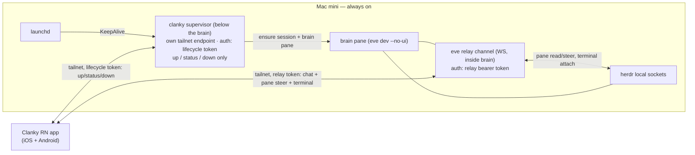

# ADR-0001 — Remote lifecycle / cold-start after the React Native migration

- **Status:** Proposed (pending sign-off)
- **Date:** 2026-06-30
- **Deciders:** James Volpe
- **Issue:** [VUH-279](https://linear.app/vuhlp/issue/VUH-279) — gates [VUH-294](https://linear.app/vuhlp/issue/VUH-294) (M6 cold-start)
- **Affects:** `SPEC.md` §4.4, §7 · `scripts/clanky-up.ts` · the iOS/RN client contract

## Context

Clanky runs headless on an always-on Mac mini. The phone reaches it two ways
(SPEC §4.4):

1. **Live interaction** rides the **eve relay channel** (`agent/channels/relay.ts`)
   — a bearer-token WebSocket that proxies herdr's local sockets over the tailnet.
   The relay is a channel *inside the eve brain*.
2. **Cold-start** rides **SSH**: the app runs `scripts/clanky-up.ts`
   (`up`/`status`/`down`) over SSH with an on-device ed25519 key, ensuring the
   `clankies` herdr session exists and the brain pane is running.

The split exists because of a bootstrap fact: **the relay lives inside the brain,
so it cannot be what starts the brain.** SSH is the one channel that is always
present on the Mac *below* the brain, so it owns the boot. SPEC §4.4 states this
as an invariant: "lifecycle (SSH) sits below it and interaction (relay) sits
inside it."

The current native iOS app can use SSH because Apple platforms have mature SSH
libraries (NMSSH / Citadel). **The React Native migration breaks that
assumption:** there is no mature, cross-platform RN SSH stack. `ssh2` is a Node
library that does not run under Hermes (it needs `net` sockets and Node crypto);
the RN-native options (`react-native-ssh-sftp` and friends) wrap NMSSH on iOS and
JSch/sshj on Android, are thinly maintained, lag the New Architecture, and would
be bespoke native code on **both** platforms — precisely the per-platform burden
the migration exists to eliminate.

So M0 must decide the eventual cross-platform cold-start path before any client
lifecycle code is written. This is a deliberate, hard-to-reverse decision: it
either preserves or rewrites the SPEC §4.4 "SSH below, relay inside" invariant.

### The bootstrap paradox (the load-bearing constraint)

The relay bearer token is **minted by the brain**. Any credential that boots the
brain therefore cannot be the relay token, and any endpoint that boots the brain
cannot be the relay (you cannot call the relay to start the relay). Whatever wins
must present a credential that exists *before and independent of* the brain, on a
process that is up *when the brain is down*. This constraint alone rules out
"just add a `lifecycle` op to the relay."

### What is already true about always-on

SPEC §7 already requires that "herdr persistent session + the eve service …
restart with the machine." That restart mechanism is informal today (the session
is spawned on demand by `clanky-up.ts`). **An always-on boot layer must exist
regardless of this decision** — surviving a Mac reboot with no phone to poke it
requires a launchd-managed start of herdr + brain. That layer is the natural home
for remote cold-start, and its existence is not new surface area we are choosing
to add; it is surface area SPEC §7 already implies.

## Decision drivers

- **Cross-platform, no per-OS native module.** The RN client should reach
  lifecycle with ordinary networking, not a maintained native SSH binding per
  platform.
- **Respect the bootstrap paradox.** The boot credential and boot endpoint must be
  independent of the brain.
- **Preserve the Eve-down guarantee.** Remote boot must work when eve/the relay is
  down — that is the entire job.
- **Least privilege.** The remote-reachable, always-on surface should be able to do
  as little as possible (ideally only `up`/`status`/`down`).
- **herdr stays vanilla; product policy stays in the brain.** The boot layer must
  not grow into a second brain (no conversation, memory, channels, or model
  policy).
- **One artifact, version-locked.** Whatever is always-on should ship from this
  repo and upgrade with the brain, not drift as a separate deployable.

## Options considered

### Option A — Keep SSH, add an RN SSH native module

Preserve §4.4 as written. Port today's flow to RN by writing/adopting a native
SSH TurboModule (NMSSH on iOS, JSch/sshj on Android) and running `clanky-up.ts`
over SSH exactly as the native app does.

- **Auth:** unchanged — an ed25519 key in secure storage (Keychain / Android
  Keystore); the Mac authorizes the app's public key in `authorized_keys`.
- **Install / first-run:** the Mac needs Remote Login (sshd) enabled, and the
  app's generated public key must land in `authorized_keys`. Getting the key there
  is awkward first-run friction (a manual paste or a `clanky pair`-side helper),
  and it must happen per device. No new Mac daemon.
- **Eve-down:** fully handled — SSH is independent of eve, so it boots the brain
  regardless. This is A's real strength.
- **Cost:** a bespoke, thinly-maintained native module on **both** platforms —
  the exact cross-platform fragility the migration removes. It also does **not**
  remove the launchd need (SSH-on-demand does not survive reboot-with-no-phone), so
  A keeps SSH as a *second* below-brain channel *on top of* the launchd layer that
  must exist anyway. Larger standing attack surface than a lifecycle-only endpoint:
  an SSH key is a shell (mitigable with a forced `command=` restriction, but still
  broader than one purpose-built op).

### Option B — Always-on supervisor below the brain + `lifecycle` op

Introduce a small, always-on **supervisor** process (launchd-managed) that lives
in the same "below the brain" layer sshd occupies today. It exposes its **own**
tailnet endpoint — separate from the relay — offering `up`/`status`/`down`. It is
`scripts/clanky-up.ts` promoted from an SSH-invoked script to a launchd daemon
with a thin authenticated network front door. The RN client calls it with ordinary
authenticated HTTP/WS; no SSH, no native module.

- **Auth:** the supervisor holds its **own** long-lived credential (a *lifecycle
  token*), minted at install time by the `clanky` CLI — not by the brain. This is
  what resolves the bootstrap paradox: the boot credential exists before the brain.
  Tailnet-only binding + optional Tailscale peer identity is the outer gate; the
  lifecycle token is the inner gate. The relay token stays brain-minted for live
  traffic. Each credential is verifiable by a process that is up exactly when that
  credential is needed.
- **Install / first-run:** `clanky supervisor install` writes a launchd plist,
  loads it, and mints the lifecycle token; pairing carries the token to the phone
  alongside the relay token. Because the supervisor ships from this repo and reuses
  `clanky-up.ts`, it is version-locked to the brain — upgrade is `git pull` +
  `launchctl kickstart`, no separate deployable. This same daemon formalizes SPEC
  §7 always-on (bring up herdr + brain at login).
- **Eve-down:** the defining property — the supervisor is *not* the relay and *not*
  in the brain, so when eve/the relay is down the phone calls the supervisor, which
  is up (launchd `KeepAlive`), and it starts the brain. No "call the relay to start
  the relay" paradox.
- **Cost:** one new always-on process on the Mac — but it replaces sshd's lifecycle
  role rather than adding to it, and it is the launchd layer §7 needs anyway. It is
  bespoke code on the boot path (a remote-reachable always-on surface), so it must
  be small, least-privilege (only `up`/`status`/`down`), and hardened like the
  relay.

### Option C — Hybrid (keep SSH permanently as a second, dual contract)

Ship B as the default but keep SSH as a permanent, co-maintained Advanced path
(e.g. native-only escape hatch).

- Buys marginal resilience (a second independent boot channel) at the cost of
  **two** maintained lifecycle contracts forever — an RN native SSH module *and* a
  supervisor — contradicting "do not preserve backwards-compatibility layers by
  default" (AGENTS.md) and doubling the boot-path surface to secure. The resilience
  gain is small: launchd `KeepAlive` already covers supervisor crashes, and true
  supervisor-down recovery is local (physical / another machine over SSH), which
  needs no shipped RN SSH module.

A *temporal* hybrid — SSH remains for the existing native build only until the
supervisor lands, then retires — is not option C; it is the phasing of the
recommendation below.

## Decision

**Adopt Option B: an always-on supervisor below the brain exposing a `lifecycle`
op, phased in; retire SSH as the cross-platform cold-start path.** Reject Option A
(fragile dual-platform native module that does not even remove the launchd need)
and Option C (a permanently maintained dual contract).

Phasing:

- **Phase 0 — interim (now, M-early).** The RN app ships against an
  **already-running relay**: QR pairing + Tailscale, **no on-device cold-start**.
  This unblocks app delivery without waiting on lifecycle. The existing native iOS
  build may keep SSH cold-start during this window; it is transitional, not a
  contract the RN app targets.
- **Phase 1 — M6 ([VUH-294](https://linear.app/vuhlp/issue/VUH-294)).** Land the
  launchd supervisor + `lifecycle` op; the RN app gains cold-start over the
  supervisor from the room-actions sheet. SSH lifecycle is removed once the
  supervisor is verified.

### Chosen topology

The shape mirrors today's ("lifecycle below, interaction inside") but swaps SSH
for a purpose-built, least-privilege, cross-platform endpoint.

### The four decision points, resolved

1. **Supervisor boundary.** A small launchd-managed daemon shipped from this repo
   (a `scripts/clanky-supervisor.ts` entrypoint reusing `clanky-up.ts` internals).
   **May:** ensure the `clankies` herdr session server is running; start/stop/
   recycle the brain pane (inheriting `clanky-up.ts`'s wedged-brain recovery);
   report status. **May not:** touch conversation, memory, channels, model policy,
   Discord, or eve sessions — all product/agentic behavior stays in the brain. It
   is boot infrastructure below the brain, not a pane/performer; this is the same
   carve-out from "if it runs, it is a pane" (SPEC §2) that sshd already holds
   today, not a new exception.
2. **Auth model (bootstrap paradox).** The supervisor mints and holds its own
   **lifecycle token** at install time, independent of the brain, so the boot
   credential exists before the brain does. Pairing delivers both tokens to the
   phone (lifecycle + relay), each stored in secure storage. Binding is
   tailnet-only with an optional Tailscale-identity outer gate, matching the
   relay's posture (SPEC §7: tailnet only, no public exposure). The asymmetry is
   deliberate: relay token = brain-minted, gates live traffic (brain must be up to
   verify it); lifecycle token = supervisor-minted, gates boot (brain need not be
   up).
3. **Install / upgrade.** `clanky supervisor install|status|uninstall|rotate-token`
   writes/loads the launchd plist (`~/Library/LaunchAgents/dev.clanky.supervisor.plist`)
   and manages the token. Because the supervisor is the same checkout as the brain,
   it is version-locked: upgrade = pull + `launchctl kickstart`; there is no
   separate deployable to drift. This daemon also becomes the formal home for SPEC
   §7 always-on (herdr + brain at login).
4. **Eve/relay-down failure mode.** Resolved by construction: lifecycle is a
   *different endpoint* on a *different process* with a *different credential* from
   the relay, so "call the relay to start the relay" never arises. launchd
   `KeepAlive` restarts the supervisor if it crashes. The residual single point of
   failure (supervisor itself down) has the same local-recovery fallback as
   "sshd down" today (physical access / SSH from another machine) and needs no
   shipped RN SSH module.

## Consequences

**Positive**

- RN cold-start is ordinary authenticated networking — one client code path, no
  per-platform native SSH module.
- The bootstrap paradox is resolved cleanly with two credentials at two layers,
  each verifiable by a process that is up when it is needed.
- Least privilege: the always-on remote surface can only `up`/`status`/`down`,
  tighter than an SSH shell.
- Formalizes SPEC §7 always-on (launchd boot) as a first-class, version-locked
  artifact instead of an on-demand side effect.

**Negative / risks**

- A new always-on, remote-reachable daemon is bespoke code on the boot path; it
  must stay small and be hardened like the relay (tailnet-only, token, input
  validation).
- One more front door for the client (lifecycle endpoint + relay), a slight step
  back from "one door." Acceptable: it keeps the hard-won relay terminal-attach
  path untouched. Future consolidation (supervisor fronting the relay on one port)
  is possible but out of scope here to avoid destabilizing the media/terminal path.
- Token lifecycle work: minting at install, delivery via pairing, rotation.

**Follow-ups (not this ADR)**

- **M6 / VUH-294:** implement the supervisor + `lifecycle` op and the RN client
  action; promote `clanky-up.ts` to the supervisor entrypoint; remove SSH
  lifecycle. This ADR deliberately writes **no lifecycle code** and leaves
  `scripts/clanky-up.ts` unchanged.
- On sign-off, flip this ADR to **Accepted** and the SPEC §4.4 / §11 blocks from
  *Proposed* to the ratified model.
