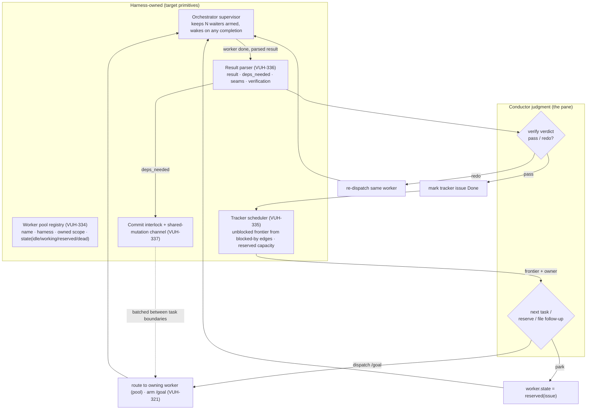

# ADR-0002 — Tracker-driven persistent-pool orchestration

- **Status:** Proposed (pending sign-off)
- **Date:** 2026-06-30
- **Deciders:** James Volpe
- **Issue:** [VUH-333](https://linear.app/vuhlp/issue/VUH-333) — epic; primitives
  [VUH-334](https://linear.app/vuhlp/issue/VUH-334) (pool),
  [VUH-335](https://linear.app/vuhlp/issue/VUH-335) (scheduler),
  [VUH-336](https://linear.app/vuhlp/issue/VUH-336) (result contract),
  [VUH-337](https://linear.app/vuhlp/issue/VUH-337) (commit interlock).
  Mechanisms already filed: [VUH-321](https://linear.app/vuhlp/issue/VUH-321)
  (worker `/goal`), [VUH-332](https://linear.app/vuhlp/issue/VUH-332) (conductor
  drive loop).
- **Affects:** `SPEC.md` §4.3, §5.5 · `skills/clanky-herdr-operator/SKILL.md` ·
  `skills/clanky-herdr-worker/SKILL.md` · `agent/tools/herdr_spawn.ts` ·
  `skills/clanky-herdr-operator/scripts/harvest.sh`

## Context

Clanky is an agent harness built for orchestration: every performer is a visible
stage pane, and any pane can take the conductor role (SPEC §2, §5). The first
real at-scale run of that thesis was live during this decision — a conductor
pane (`clanky:main`-style Claude, labelled `clanky-lead`) drove the React Native
migration (VUH-277…320) with a **persistent pool of four workers** in one shared
worktree, tracked end-to-end in Linear. 16+ issues landed in one session.

The striking fact: the conductor **hand-built a reactive control loop out of raw
primitives** — `herdr wait/read/run` + Linear MCP + prompt conventions — and it
converged on a model the shipped `clanky-herdr-operator` skill does *not*
describe. The skill prescribes ephemeral spawn-per-task workers, a `manifest.json`
+ `DONE`/`BLOCKED` sentinel ledger, and per-worker git worktrees. The live run
kept workers warm, used the tracker as the ledger, and partitioned one shared
worktree by directory. The divergence worked better. This ADR ratifies the
emergent model and names the primitives the harness should own so the conductor
stops re-implementing them by hand every turn.

### The loop the conductor ran by hand

Each cycle, per worker completion:

```
wait agent-status <worker> --status done   (background waiter, re-armed each time)
  -> read the pane; extract result + DEP_NEEDED + self-verification by eye
  -> verify against acceptance criteria (tsc exit 0, BUILD SUCCEEDED, files exist)
  -> mark the tracker issue Done; file follow-up issues as work reveals itself
  -> pick the next DAG-unblocked issue; pre-install its deps centrally
  -> herdr pane run <worker> "/goal You are workerN, next task, VUH-xxx ..."
  -> re-arm the waiter
```

Every arrow above is manual glue. The conductor also tracked, in its head, which
worker owned which domain, who was mid-edit (commit hazard), and which worker was
parked for a blocked capstone.

### What actually worked, and why it diverged from the skill

| Dimension | Shipped operator skill | Live run (what won) |
| --- | --- | --- |
| Worker lifecycle | ephemeral, one `clanky:<slug>` per task, context discarded | **persistent pool** (worker1–4), warm across the whole migration |
| Task routing | new worker per task | **route by domain ownership** ("worker4 is module-owner, keep the terminal track serial on it") |
| Task unit | freeform brief + completion protocol | **`/goal`** — unambiguous terminal state + turn/token cost for free |
| Completion ledger | `manifest.json` + `DONE`/`BLOCKED` files | **the tracker** (Linear): queue, DAG, and durable record in one |
| Work discovery | fixed up-front task list | **file follow-up issues mid-run** (VUH-318 docs, VUH-320 composition) |
| Scheduling | fan-out disjoint tasks | **DAG-aware** — hold a worker `reserved` for a blocked capstone |
| Isolation | per-worker git worktrees | **scope-partitioned shared worktree** + lead-owned commits |
| Shared mutations | (isolated per worktree) | **`DEP_NEEDED` flag-don't-edit** + central batched installs |
| Verification | operator verifies after harvest | same — verify-before-Done, never trust self-report |

The two *mechanism* axes of this model are already tracked: worker `/goal`
completion (VUH-321) and the conductor's own always-on drive loop (VUH-332). This
ADR is the *operating-model* axis — the pool, the tracker-scheduler, the result
contract, and the shared-worktree interlock — filed as VUH-334…337 under VUH-333.

## Decision drivers

- **Warm context beats cold spawn for long, many-issue efforts.** A worker that
  built a module carries the context to extend it; discarding that on every task
  boundary is the operator skill's biggest cost at scale.
- **Do not keep two ledgers.** The tracker is already the durable, user-visible
  record of what is done and what is blocked. A parallel `manifest.json` +
  sentinel ledger is redundant bookkeeping that drifts from the tracker.
- **The conductor should spend tokens on judgment, not glue.** Re-arming waiters,
  parsing prose results, and issuing N MCP calls to transition-and-dispatch are
  mechanical; the harness should own them so the conductor supplies only the
  verify verdict, the next task, and reservation decisions.
- **A shared worktree is cheaper than N worktrees when scopes are disjoint** — but
  only safe with an enforced commit interlock and a central shared-mutation path.
- **Stay provider- and tracker-neutral.** The model must not hardcode Herdr
  (VUH-303 mux-neutral stage) or Linear (`clanky-work-tracker` binding).

## Options considered

### Option A — Keep the ephemeral spawn-per-task operator model

Status quo skill: one worker per task, `manifest.json` + `DONE` sentinels as the
ledger, per-worker worktrees.

- **Pros:** maximal isolation; no pool state to manage; a dead worker loses
  nothing. Correct for a one-shot fan-out of unrelated tasks.
- **Cons:** throws away warm context on every task — the dominant cost across a
  20-issue migration. Two ledgers (manifest + tracker) that drift. Per-worker
  worktrees multiply disk and setup for scopes that never actually collide. The
  live run abandoned all three of these within the first wave.

### Option B — Persistent pool + `/goal` + tracker-as-ledger (the live model)

Model a worker as a durable, named, stateful actor; route tasks by domain
ownership; drive each task under `/goal`; use the tracker as the sole
orchestration ledger; fan into a scope-partitioned shared worktree guarded by a
commit interlock and a central shared-mutation channel.

- **Pros:** warm context and domain locality; one ledger (the tracker) that is
  already user-visible; unambiguous `/goal` completion with free cost accounting;
  DAG scheduling with explicit reserved capacity; lower worktree overhead. This is
  what actually shipped 16 issues in a session.
- **Cons:** pool + ownership + reservation are new harness state to model and keep
  honest. A shared worktree is only safe with the interlock (Option B is unsafe
  without VUH-337). A pooled worker that wedges blocks its whole domain until
  respawned.

### Option C — Hybrid, selected by run shape

Default to B for durable multi-issue efforts; fall back to A (ephemeral workers,
per-worker worktrees) for one-shot fan-outs of write-overlapping or unrelated
tasks.

- **Pros:** keeps A's isolation where it is actually needed (overlapping writers)
  without paying pool overhead for throwaway fan-outs.
- **Cons:** two modes to document and maintain; the conductor must classify the
  run up front.

## Decision

**Adopt Option B as the default operating model, with Option C's fallback for
write-overlapping or one-shot fan-outs.** The persistent pool, tracker-ledger,
and shared-worktree-with-interlock become the described path; per-worker
worktrees remain the documented escape hatch for tasks whose scopes overlap.

`DONE`/`BLOCKED` sentinels are **retained** — they are the machine signal a
`/goal` loop writes at resolution (VUH-321) and what `harvest.sh` polls. What is
demoted is `manifest.json` as the *orchestration ledger*: it stays a spawn record
(names -> argv, for attribution), while the **tracker** becomes the durable record
of task state, dependencies, and completion. The pool registry (VUH-334) holds
live lifecycle state; the tracker holds durable work state.

### Supervisor loop (target)

The harness owns the mechanical loop; the conductor is invoked only at the
diamond decision points.



Under VUH-332, the conductor's own always-on `/goal` loop drives this supervisor:
each wake, it consumes the scheduler frontier and re-dispatches, so the loop runs
unattended between user turns.

### The primitives, resolved

1. **Persistent worker pool + domain-ownership routing (VUH-334).** A durable,
   named, stateful worker actor with an ownership map (worker <-> paths/domain)
   and a route-by-locality dispatch helper. Panes stay warm; `/goal` is re-armed
   per task; respawn only on death.
2. **Tracker-driven scheduler (VUH-335).** The tracker's `blocked-by`/`blocks`
   edges are the scheduler input. "Mark Done + dispatch next unblocked" is one
   action. A `reserved` worker state parks capacity for a named blocked issue.
3. **Machine-parseable worker-result contract (VUH-336).** A result schema
   (`result` / `deps_needed[]` / `seams_exposed[]` / `verification{command,status}`
   / `scope_touched[]`) the worker emits and `harvest.sh`/the supervisor parses —
   auto-routing `deps_needed` and machine-checking the verification claim.
4. **Shared-worktree commit interlock + shared-mutation channel (VUH-337).** The
   commit path refuses while any pool worker is non-`idle` (encoding the `/c`
   wait-for-siblings rule and State Safety's no-`git add -A`); a conductor-owned
   queue applies lockfile/config/manifest edits between task boundaries.

Mechanisms this composes with: worker `/goal` completion (VUH-321) supplies the
unambiguous terminal state and the verification-in-output contract; the conductor
drive loop (VUH-332) supplies the autonomous wake that runs the supervisor.

The supervisor's **wake substrate is shipped** ([VUH-359](https://linear.app/vuhlp/issue/VUH-359)):
every spawn seam (`spawnClankyWorker`, operator `spawn.sh`) arms a detached
one-shot `clanky watch` per worker that classifies completion against the run's
sentinels — sentinel files are truth; `agent_status` is heuristic, confirmed by
a quiet-screen window and a slow recheck, with dropped event subscriptions
re-resolved by durable name and resubscribed — and delivers one
provenance-stamped `[worker done|blocked|idle|dead]` wake to the spawning
lead's pane (SPEC §4.3, §5.5). The target supervisor's "keeps N waiters armed,
wakes on any completion" box builds on this: today re-arming happens
per-spawn; the pool supervisor (VUH-334) owns keeping a warm worker's watcher
armed across `/goal` re-dispatches.

## Consequences

**Positive**

- The conductor stops re-implementing orchestration each turn; it supplies
  judgment, and the harness owns waiting, parsing, transitioning, and dispatch.
- One ledger (the tracker) that is already user-visible and provider-neutral; no
  manifest/tracker drift.
- Warm context and domain locality across long runs; `/goal` gives free per-task
  cost accounting.
- Shared-worktree fan-out becomes safe (interlock) instead of vigilance-dependent.

**Negative / risks**

- New harness state (pool lifecycle, ownership, reservations) to model and keep
  truthful against live pane state; stale ownership mis-routes a task.
- A shared worktree is only as safe as the interlock — VUH-337 is a prerequisite,
  not an optimization. Without it the model regresses to the hand-guarded commit
  hazard the live run navigated by luck and attention.
- A wedged pooled worker blocks its domain until respawned; the pool needs a
  liveness/respawn path (fold into VUH-334).

**Follow-ups (not this ADR)**

- Implement VUH-334…337; land the worker-side result contract in
  `clanky-herdr-worker/SKILL.md` and the operator model in
  `clanky-herdr-operator/SKILL.md` (updated alongside this ADR to describe the
  pool + tracker-ledger path, with per-worker worktrees as the documented
  fallback).
- On sign-off, flip this ADR to **Accepted** and fold the operating model into
  `SPEC.md` §5.5 (spawn/performers) and §4.3 (spawn seam), cross-linking both ways.
- Reconcile with VUH-303: the pool/scheduler primitives must sit above the
  mux-neutral StageProvider, not inside the Herdr adapter.
