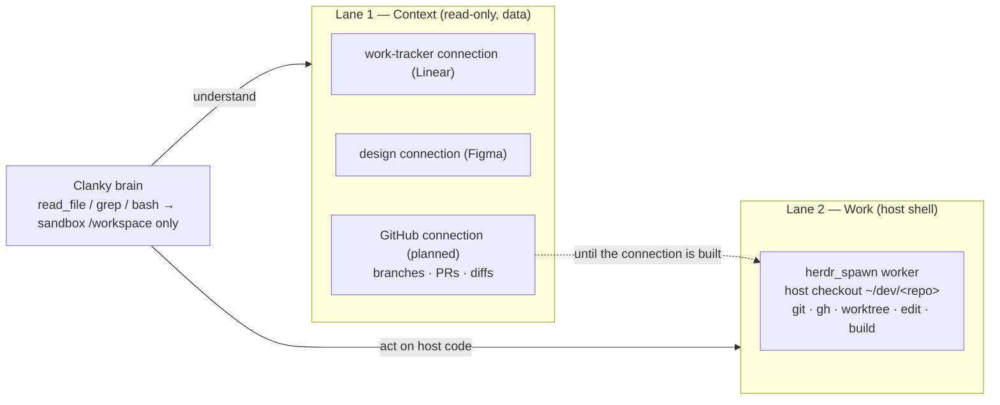

# ADR-0003 — Two-lane context access: sandbox boundary, connections, and the PR/branch work lane

- **Status:** Proposed (pending sign-off)
- **Date:** 2026-07-01
- **Deciders:** James Volpe
- **Issue:** Unfiled — file under the work tracker before ratifying.
- **Affects:** `SPEC.md` §9.2, §11 · `agent/instructions.md` · `agent/skills/coding.md` ·
  `agent/connections/github.ts` (planned) · `agent/tools/herdr_spawn.ts`

## Context

Clanky's brain keeps eve's default harness, so the model has `read_file`, `grep`,
`glob`, and `bash`. But the sandbox backend is `justbash()` rooted at
`/workspace` (`agent/sandbox.ts`), isolated from the Mac's filesystem — those
tools cannot see host repos, checkouts, PRs, or the user's code. The persona
(`agent/instructions.md`) never said so: it mentions the sandbox only obliquely,
in the `herdr_spawn` cwd note ("do not use sandbox paths like `/workspace`").
Result: asked to read a host file or review a PR, Clanky would point `read_file`
at a `/Users/...` path, get an empty/ENOENT sandbox result, and stall.

The ways to reach real context are uneven:

- **Work tracker** (Linear) and **design** (Figma) are curated eve connections
  (`agent/connections/{linear,figma}.ts`) — OAuth, MCP-backed, surfaced via
  `connection_search`. Clanky reads issues and designs as *data*, no shell.
- **Version control** (GitHub) is unwired: no connection, no native tool, no
  seeded MCP. The only path to a branch/PR/diff today is a spawned worker running
  `gh`/`git` in a host checkout.
- **Host code** is reachable only by `herdr_spawn`, which does not clone — its
  `cwd` must be an existing checkout (`resolvePaneCwd` throws otherwise); there is
  no repos-root convention.

Two problems: (1) Clanky is not told his own file tools are blind to the host;
(2) there is no named model for how he gathers context versus how he acts on host
code, and GitHub — a third of the intended GitHub / Linear / Figma triad — has no
home.

## Decision

Adopt an explicit **two-lane context model** and teach it in the persona.

**Lane 1 — Context (read-only, no pane).** Understanding work is a data call
through connections/first-party tools: work-tracker connection for issues, design
connection for designs, version control for branches/PRs/diffs. Default first
move.

**Lane 2 — Work (host shell).** Acting on host code — edit, build, run, review a
diff in-tree, land a branch — is a `herdr_spawn` worker in a host checkout, where
branches and worktrees live.

Concretely:

1. **Persona names the boundary.** `agent/instructions.md` states that
   `read_file`/`grep`/`bash` are sandbox-only and blind to host paths, and states
   the two lanes with a context-first default. Principle lives in the persona;
   mechanics live in the `coding` skill.
2. **GitHub gets both.** A read-only curated **GitHub connection**
   (`agent/connections/github.ts`, mirroring `linear.ts`/`figma.ts`) serves Lane 1
   — reading branches, PRs, diffs, review comments as data. The **Work lane** uses
   `gh`/`git` inside a spawned worker for review and landing. Until the connection
   lands, Lane-1 GitHub reads fall back to a short `gh`-in-worker call.
3. **Branch/worktree recipe.** Reviewing or working a PR spawns a worker into an
   existing host checkout under the repos root (`~/dev/<repo>`), which `git fetch`
   + `git worktree add`s the PR branch when it should be isolated. The conductor
   owns the branch/PR lifecycle (per `clanky-herdr-operator`). `herdr_spawn` never
   clones; the checkout must pre-exist.

## Options considered

**GitHub via `gh`-in-worker only.** Simplest — no new connection. Rejected as the
sole path: every PR glance costs a pane spawn, so there is no cheap read-only
context lane, and it is asymmetric with Linear/Figma.

**GitHub via a read-only connection only.** Cheap Lane-1 reads, symmetric with the
other two legs. Rejected as the sole path: a read connection cannot edit files,
run builds, or land a branch — the Work lane still needs a host shell.

**Both (chosen).** Connection for cheap read-only context; `gh`/`git`-in-worker for
acting. Fullest coverage; the connection is deferred, the docs land now.

**Clone the repo into Clanky's own sandbox instead of a host worker.** Rejected on
two levels. Today it is impossible: the sandbox backend is `justbash()`
(`agent/sandbox.ts`) — a simulated bash over a virtual filesystem with no real
binaries (`git`, `node`, package managers) and no network
(`node_modules/eve/docs/sandbox.mdx`), so there is no `git clone` to run. eve does
offer real backends (`docker()`, `microsandbox()`) that can clone, but the model
stays wrong even with one: a sandbox `/workspace` is isolated and invisible, which
contradicts the "anything worth watching becomes a pane" thesis (SPEC §2, §5);
edits there cannot be committed, pushed, reviewed, or landed to a real branch
without exfiltrating them back to the host; host `git`/`gh` credentials are
deliberately kept out of the sandbox (security model — no `process.env`, no
secrets); and building/testing the real repos needs the host toolchain
(pnpm/cargo/xcodebuild). The sandbox stays lightweight scratch; host code work is a
visible pane on the real checkout — which is the Work lane.

**Where awareness lives — persona vs. skill.** Chosen: the durable principle (two
lanes, sandbox boundary) in `instructions.md`; the current mechanics (which
connection, the `gh`-in-worker fallback, the worktree recipe) in `coding`, so the
present-tense mechanics can change without editing the persona.

## Topology

## Consequences

- The awareness gap closes: Clanky stops aiming `read_file` at host paths.
- Context-first becomes the default; workers are spawned only for host-code work,
  saving panes and latency.
- GitHub is the next curated connection to build — a small committed file plus a
  dev-server reload (SPEC §9.2), read-only scope.
- A repos-root convention (`~/dev/<repo>`) is assumed by the Work lane; if repos
  live elsewhere the recipe passes an explicit `cwd`.
- Scope of this ADR is docs only: `agent/instructions.md`, `agent/skills/coding.md`,
  SPEC §9.2 / §11. The GitHub connection and any repos-root config are follow-up
  implementation.
