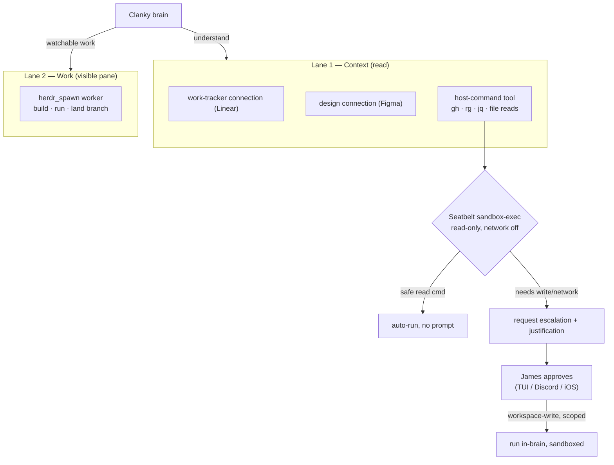

# ADR-0003 — Host context access: two lanes + a Seatbelt-sandboxed host-command tool (Codex approval model)

- **Status:** Proposed (pending sign-off)
- **Date:** 2026-07-01
- **Deciders:** James Volpe
- **Issue:** Unfiled — file under the work tracker before ratifying.
- **Affects:** `SPEC.md` §9.2, §11 · `agent/instructions.md` · `agent/skills/coding.md` ·
  `agent/tools/<host-command tool>` (planned) · `agent/lib/approvals.ts` ·
  `agent/sandbox.ts` · reference: `~/dev/codex` (`codex-rs` sandboxing/seatbelt, Apache-2.0)

## Context

Clanky's brain keeps eve's default harness (`read_file`/`grep`/`bash`), but the
sandbox backend is `justbash()` (`agent/sandbox.ts`) — a simulated bash over a
virtual filesystem with no real binaries and no network
(`node_modules/eve/docs/sandbox.mdx:158`). So his own tools cannot see host
repos, PRs, or code, and the persona never said so: asked to read a host file, he
would point `read_file` at a `/Users/...` path and get nothing. Meanwhile Linear
and Figma are curated eve connections (data, no shell), GitHub is unwired, and
host code is reachable only by `herdr_spawn` into an existing checkout (no clone).

The open question this ADR resolves: **how does Clanky read host code and
version-control state directly — cheaply, without spawning a pane?** Two forces
pull against each other:

- **Creativity.** Narrow typed tools (a `repo_read(path)` / `gh_read(pr)` schema)
  pre-decide the query surface. Reading and exploring code is open-ended —
  `git log --graph --author=…`, `gh pr diff | rg`, `jq` over `gh api`, following
  an import three files deep — and a schema caps it. A raw, composable CLI is the
  right shape.
- **Safety.** Clanky is always-on and constantly ingests untrusted input (Discord
  messages, web pages, and the *contents of repo files he reads*). A raw host
  shell with no floor turns any injected "run X" into host RCE.

Codex (checked out at `~/dev/codex`, Apache-2.0) already reconciles these with a
proven model; we adopt it rather than invent one.

## Decision

**Two lanes, picked by intent.**

- **Lane 1 — Context (read, no pane).** Understand work as data/reads: the
  work-tracker connection (Linear) for issues, the design connection (Figma) for
  designs, and — new — a **direct host-command tool** for host code and
  version-control state (files, `git`, `gh`). Default first move.
- **Lane 2 — Work (visible pane).** Substantial, watchable work — build, run, land
  a branch — is a `herdr_spawn` pane, unchanged.

**The host-command tool adopts Codex's approval model** (`~/dev/codex/codex-rs`):

1. **Raw command surface + a skill, not narrow schemas.** The tool takes an
   arbitrary shell command and returns stdout. A companion skill carries the
   read-only discipline, the repos layout (`~/dev`, the `clanky-agent` vs
   `../clanky` naming gotcha), and good `gh`/`rg`/`jq` incantations.
   Creativity lives in composition; wisdom in the skill.
2. **Default read-only, OS-enforced via macOS Seatbelt.** Commands run under
   `sandbox-exec -p <profile> -- <cmd>` from a `(deny default)` profile — mirroring
   Codex's `seatbelt.rs` and `seatbelt_base_policy.sbpl`. This is a *physical*
   floor, not a verb denylist (which is bypassable). The floor is **per-CLI
   capabilities** on three axes — filesystem-read, filesystem-write, network
   (+ allowed hosts) — not one global read-only: `gh` needs network egress to the
   GitHub API even to read, while pure-filesystem tools (`cat`/`rg`) need none.
   Default: full-disk read, **no filesystem writes**, network only as a CLI's
   profile grants. Default cwd is the repos root (`~/dev`).
3. **Safe-command fast path.** An allowlist of read-only commands
   (`ls/cat/grep/rg/head/tail/wc`, guarded `find`/`sed -n`/`rg`, and `gh` read
   subcommands — `pr view`/`pr diff`, `issue view`, `run view`, `api`) auto-runs
   with zero prompts — modeled on Codex's `is_known_safe_command`. Local `git` is
   intentionally excluded (see Options).
4. **On-request escalation, approve-in-place (chosen posture).** When the model
   needs writes or network, it requests an escalated run (`workspace-write` scoped
   to cwd + `/tmp`, or a named grant) with a `justification`. That surfaces to
   James through Clanky's existing approvals surface (`agent/lib/approvals.ts` —
   `gated()` / `CLANKY_AUTO_APPROVE`, over TUI/Discord/iOS) and, on approval, runs
   **in-brain, sandbox-scoped** — Codex's `AskForApproval::OnRequest` +
   `SandboxPolicy::WorkspaceWrite`. "Always" answers are remembered per
   command+cwd. Escalation does **not** route to a pane; the pane path
   (`herdr_spawn`) stays the independent Lane-2 mechanism for watchable work.

**Generalizes to any CLI — a host-CLI substrate, not a `gh` tool.** The tool is
not GitHub-specific. Each exposed CLI is a **policy-registry entry**: its binary, an
arg/subcommand `allow`/`ask`/`deny` ruleset (OpenCode-style wildcard patterns), and
a **capability profile** (filesystem-read / filesystem-write / network + allowed
hosts) the Seatbelt profile enforces — plus, optionally, a skill snippet of its
incantations. `gh` and the core read utilities (`cat`/`grep`/`rg`/`ls`/`find`/`sed
-n`/`jq`) are the initial entries; adding `fd`, `kubectl`, `aws`, `tailscale`,
`ffmpeg`, etc. later is a registry entry + skill, gated by the same approval model —
**config, not new code**. Per-CLI prerequisites: the binary is installed and authed
on the host, and network egress is scoped to the hosts it legitimately needs (or a
networked CLI becomes an exfiltration path). This is Clanky's own quick, read-first
terminal; sustained, watchable, or mutating work still spawns a pane, which already
has every host CLI.

**Approval modes — a ladder, yolo at the top.** Following Codex's presets, the tool
exposes a single approval-mode setting, not a fixed policy:

- **`read-only`** (default): Seatbelt read-only, on-request escalation (above).
- **`auto`**: Seatbelt `workspace-write` (writes scoped to cwd + `/tmp`, network
  per-CLI), auto-approved — mutation without prompts, still sandboxed.
- **`yolo` / `full-access`**: sandbox off (`DangerFullAccess`) + never ask — Clanky
  can do everything, like Codex `--yolo` / Claude `--dangerously-skip-permissions`.

It is one setting at max, not a separate code path: yolo is `DangerFullAccess` +
`AskForApproval::Never`. Toggled by the owner via a `/yolo` (or `/approvals`) face
command and env (`CLANKY_YOLO` / `CLANKY_APPROVAL_MODE`, extending
`CLANKY_AUTO_APPROVE`); default off, shown in the face header, not persisted across a
brain restart.

**Yolo guardrail — trust of the turn.** Clanky is always-on and ingests untrusted
input (Discord/voice from third parties, web pages, repo contents). Yolo on such a
turn means any third-party message could drive arbitrary host commands, so yolo
applies only to **owner-driven turns** (the authenticated face and relay/iOS);
**autonomous presence turns clamp to the gated policy even when yolo is on**, unless
the owner explicitly opts those in too. Enabling yolo is itself an owner-only
privileged action, never something a Discord/voice turn can set.

**Version control / GitHub — a curated connection.** GitHub is a **main integrated
MCP**, a curated connection alongside Linear and Figma (`agent/connections/github.ts`,
hosted GitHub OAuth MCP, `approval: gated(always())`), surfaced via
`connection_search`. It is the first-class GitHub surface: structured reads (PRs,
diffs, issues, CI, code search) plus **approval-gated collaboration writes** (comment,
open/label issues, request review). GitHub API writes are SaaS writes like Linear's —
brokered and gated by the connection, not host mutations — so they do not use the
Seatbelt/pane path. The connection is bindable to **two roles**, either or both:
`work_tracker` (GitHub Issues/PRs) and a new `version_control` / `code_host` role,
chosen via `/integrations`; Linear stays the default `work_tracker` binding unless
switched. The host-CLI `gh` (above) is now the **optional in-checkout local reader**
for the diff of the repo Clanky is standing in; the connection covers everything
off-host and in the hosted tier. (This **reverses an earlier draft of this ADR** that
dropped the connection in favor of `gh`-only: GitHub is worth first-class
integration, not just a local reader.) Local `git` is still not granted.

## Options considered

**Narrow typed read tools (`repo_read`, `gh_read`).** Rejected: a fixed schema
pre-decides the query surface and caps the model's read creativity; open-ended
exploration wants a raw CLI.

**Raw host shell, read-only by convention only (skill-enforced).** Rejected:
always-on + untrusted input means an injected command has no hard floor —
injection → host RCE.

**Raw shell gated by a verb/binary denylist.** Rejected in favor of OS-level
Seatbelt: denylists are fragile and bypassable (shell tricks, aliases, `env`, path
games); an OS sandbox is a real boundary.

**Escalation posture — approve-in-place (chosen) vs escalate-to-pane vs both.**
Chosen approve-in-place, the pure Codex model: simplest UX, matches what we are
borrowing, and the pane path already exists separately for watchable work.
Escalate-to-pane-only was rejected as too heavy (a one-line fix should not need a
pane); "both" as more UI than needed now.

**Grant local `git` alongside `gh`.** Rejected: `gh` read subcommands (`pr
view`/`pr diff`, `issue view`, `run view`, `api`) cover the GitHub-level context
Clanky needs, while local `git` state operations overlap the worker's territory and
add stateful surface for no real need. Excluded to keep the allowlist minimal; code
*content* is still readable via `cat`/`grep`/`rg`, and local git archaeology, if
ever required, is a worker's job.

**Clone the repo into Clanky's own sandbox.** Rejected on two levels. Today it is
impossible: `justbash()` is a simulated bash with no real binaries (`git`, `node`,
package managers) and no network (`node_modules/eve/docs/sandbox.mdx`), so there is
no `git clone` to run. eve does offer real backends (`docker()`, `microsandbox()`)
that can clone, but the model stays wrong even with one: a sandbox `/workspace` is
isolated and invisible (contradicting the "anything worth watching becomes a pane"
thesis, SPEC §2, §5); edits there cannot be committed, pushed, reviewed, or landed
without exfiltrating them back to the host; host `git`/`gh` credentials are
deliberately kept out of the sandbox (security model — no `process.env`, no
secrets); and building/testing the real repos needs the host toolchain
(pnpm/cargo/xcodebuild). The sandbox stays lightweight scratch.

**OpenCode's model (`~/dev/opencode`).** Its `allow`/`ask`/`deny` per-command
wildcard ruleset is a clean *format* (we may layer it over Seatbelt for the
allow/deny lists), but it has **no OS sandbox** — bash runs with full host
authority — so it is not the enforcement layer.

## Topology

## Consequences

- Clanky reads host code and VC state directly and cheaply — no "spawn a worker
  just to read a diff." When the tool ships, `agent/instructions.md` and
  `agent/skills/coding.md` flip from "you cannot read host files" to "read via the
  host-command tool."
- A real read-only floor for an always-on agent on untrusted input: OS-enforced,
  not convention.
- Escalation reuses the existing approvals infrastructure; no new approval channel.
- The GitHub OAuth connection is dropped from scope as redundant with local `gh`;
  SPEC §9.2 is updated to say so.
- A repos-root convention (`~/dev`) is assumed by the tool's default cwd; other
  checkouts pass an explicit cwd.
- The tool requires macOS (Seatbelt). If Clanky ever runs on Linux, mirror the
  floor with bubblewrap + seccomp (Codex's `linux-sandbox`).
- Scope of this ADR is the decision. Implementation — the tool, the Seatbelt
  profile, the exploration skill, the approvals wiring, and the persona/skill flip
  — is follow-up.
