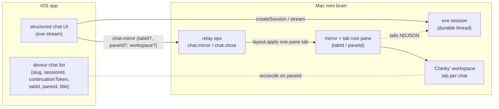

# ADR-0004 — iOS native chat ↔ herdr binding: per-chat presence mirrors in a dedicated workspace

- **Status:** Proposed (backend + iOS implemented 2026-07-01, green checks; SPEC §4.4/§5.4/§5.6/§11 folded; pending James's ratification → Accepted)
- **Ratification note:** The 2026-07-02 workspace-targeting amendment is implemented
  while the ADR remains Proposed pending owner ratification.
- **Date:** 2026-07-01
- **Deciders:** James Volpe
- **Issue:** Unfiled — file under the work tracker before ratifying.
- **Affects:** `SPEC.md` §4.4, §5.4, §5.6, §11 · `agent/channels/relay.ts` ·
  `agent/lib/discord/pane-mirror-spawn.ts` (generalize) · `agent/lib/herdr-placement.ts`
  (new workspace/tab helpers) · `packages/clanky-contract/src/ops.ts` (new relay ops) ·
  `scripts/discord-pane-mirror.ts` (reused as-is) · sibling `clanky-ios`
  `apps/mobile` chat surface (multi-chat store + history drawer)

## Context

The iOS app's "Chat with Clanky" surface and herdr are fully decoupled today:

- A native chat is a **headless eve HTTP session** (`EveClient.createSession` /
  `continueSession` / `streamSession` against `/eve/v1/session*`). It is durable
  server-side (resumable with `{sessionId, continuationToken}`) but has **no
  herdr pane** and **no enumeration** — sessions cannot be listed.
- The **relay** (`agent/channels/relay.ts`) is a raw herdr-pane proxy that
  explicitly does not create eve sessions. It exposes workspace/tab/pane list +
  `create-tab` + `start` (through the transcript seam) + `attach`, but no
  create-workspace op and no link between an eve `sessionId` and a `workspace_id`/
  `pane_id`.
- The only mechanism that makes a session watchable is `spawnSessionPaneMirror`
  (§5.6), wired for Discord and voice presence only. Nothing mirrors an iOS/relay
  session, so SPEC §5.4's claim that iOS lands on "main (via relay) / the face
  pane" does not hold: the RN client mints a fresh session per new chat, and no
  pane is behind it.

Product goal: **each native chat is a real live TUI session in herdr, in a
dedicated workspace with a tab per chat**, with a history switcher and multiple
concurrent chats — while keeping the app's structured chat UI (reducer + block
renderers, input/authorization blocks).

## Decision

Treat each iOS native chat as a **presence session with a pane mirror** — the
same construct Discord and voice already use (§5.6) — placed as a **tab in a
dedicated "Clanky" workspace** (one tab per chat; a chat's own subagents become
panes in that tab). The structured eve stream stays the iOS UI; the mirror gives
the session on-stage visibility — **watch-only** on the terminal stage, exactly
like the Discord/voice mirrors. (Letting herdr input steer the session is a
future question; see Open questions.)

This is deliberately **not** a new performer/worker and needs **no change to the
transcript-run seam**: the durable transcript is the eve session itself, and the
mirror (`scripts/discord-pane-mirror.ts`) tails it read-only. Mirrors are viewers,
not spawns, so they do not funnel through `wrapTranscriptArgv` — exactly as the
Discord/voice mirrors already do not.

Sub-decisions (the three forks resolved with the user):

1. **Binding = structured chat + linked mirror pane** (not "the TUI transcript is
   the chat").
2. **Layout = one dedicated "Clanky" workspace, tab per chat**.
3. **Rollout = this ADR is the contract**; backend + iOS implement after sign-off.

## Contract

### Backend seam

The mirror **script** is shared with Discord/voice; the **spawn mechanics differ**
by placement. Discord/voice keep `spawnSessionPaneMirror` → `agent.start` split
near the face pane. iOS needs one tab per chat whose *single* pane is the mirror,
so it must not reuse the face-split path — and it must respect this invariant:

> **Invariant: exactly one pane per chat — the mirror, at the tab root. No orphan
> shell pane and no leftover default tab.**

This matters because both `workspace.create` and `tab.create` return a **default
shell `root_pane`** (herdr skill: `workspace create` → `{ workspace, tab,
root_pane }`; `tab create` → `{ tab, root_pane }`). Splitting an `agent.start`
into that tab would leave the shell root beside the mirror — a blank pane per
chat. So iOS makes the **mirror occupy the tab root** instead of splitting:

- **Preferred — the mirror *is* the tab root** via the relay's existing one-pane
  tab pattern (`create-tab` → herdr `layout.apply` with a one-pane root running
  `argv`). `resolveIosChatWorkspace()` (via `herdrRequest`, vanilla herdr methods
  — no fork) resolves fresh materialization targets in this order:
  `workspace_id` validates an existing workspace from `workspace.list`;
  `workspace_label` find-or-creates by label; absent explicit target →
  find-or-create by stable default label (`"Clanky"`, override
  `CLANKY_IOS_WORKSPACE_LABEL`; `CLANKY_IOS_WORKSPACE_ID` remains the unscoped
  hard override). Resolved workspaces are memoized by herdr session + target so
  multiple scoped chat groups coexist.
  1. For a new chat, apply a one-pane tab whose root runs the mirror argv
     (`layout.apply { workspace_id, root: one-pane(argv = [node, mirrorScript,
     eveHost, sessionId, slug]), label: title }`) → `{ tab_id, pane_id }`. The
     tab's single pane is the mirror; no shell root is left behind.
  2. **First chat reuses** the workspace's initial tab/`root_pane` (returned by
     `workspace.create`) rather than adding a second tab, so the default tab is
     never orphaned.
- If a named `clanky:ios-<slug>` agent is wanted for parity with Discord/voice,
  the implementer must first verify herdr's `agent.start` can *root* a fresh tab
  as a single named pane (workspace-scoped, no `tab_id`/split). If it instead
  splits into an existing tab, **reuse the auto-created root pane** (run the mirror
  in it via `pane.run`/`pane.send-text`) or **close it** — never leave it blank.

`scripts/discord-pane-mirror.ts` is reused unchanged — a generic eve-session
NDJSON tailer (`argv = [eveHost, sessionId, slug]`). The tab is labeled with the
chat `title` for legibility on the stage.

### New relay ops

Added to the shared op catalog (`packages/clanky-contract/src/ops.ts`:
`RELAY_OP_NAMES`, arg + result schemas) and the `agent/channels/relay.ts`
`dispatch` switch. Typed ops (not raw `api`) so the iOS client stays
schema-checked and the unwrapped `api` passthrough stays reserved as the
no-transcript escape hatch.

- **`chat.mirror`** — materialize (or revalidate) a chat's mirror.
  - args: `{ session_id: string, slug: string, title?: string, tab_id?: string,
    pane_id?: string, workspace_id?: string, workspace_label?: string, session? }`
    — the optional `tab_id`/`pane_id` are the device-remembered handles from a
    prior call (see below). For a fresh mirror, `workspace_id` targets an existing
    workspace and wins over `workspace_label`; `workspace_label` find-or-creates by
    label; absent fields use the default "Clanky" workspace path.
  - result: `{ workspace_id, tab_id, pane_id }`.
  - **Idempotent by handle, not by agent name** (the mirror is a tab-root command
    pane, not a registered agent):
    - if `pane_id` is alive and running this chat's mirror → return it (no-op);
    - else if `tab_id` is alive → re-root the one-pane mirror layout in that tab
      and return it (reuse the tab, no new pane);
    - else → resolve the requested/default workspace and apply a new one-pane
      mirror tab (§ Backend seam), returning fresh handles.
    - a live remembered handle wins over a conflicting workspace target; workspace
      fields apply only when the mirror must materialize fresh.
- **`chat.close`** — tear down a chat's presence.
  - args: `{ tab_id?: string, pane_id?: string, close_tab?: boolean, session? }`
  - closes the mirror pane; closes its tab when `close_tab` is set. Takes the
    device-remembered handles (there is no `clanky:ios-<slug>` agent to resolve).
    When Herdr refuses to close the workspace's final tab, the backend closes the
    owning workspace.

### iOS flow

Create/continue/stream are unchanged; one materialize call is added:

1. `EveClient.createSession(message)` → `{ sessionId, continuationToken }`.
2. relay `chat.mirror { session_id, slug, title, tab_id?, pane_id?, workspace_id?, workspace_label? }` →
   `{ workspaceId, tabId, paneId }`. The device passes back the `tab_id`/`pane_id`
   it stored from a prior call so the op reuses the same tab. Best-effort: on
   failure the chat still works (degrades to "no pane yet"); retry on next send.
3. Persist the returned `{ tabId, paneId }` on the chat record.
4. `streamSession(sessionId, 0)` renders the transcript (as today).

`slug` is a **device-stable short id per chat** (e.g. base32 of a client uuid); the
stored `{ tabId, paneId }` are what pin re-materialization to the same tab.

### History / multi-chat model

The **device is the source of truth** for the chat list; herdr is the
materialized presence.

- iOS persists per-chat `{ slug, sessionId, continuationToken, title, tabId,
  paneId, updatedAt }` (AsyncStorage). This is required regardless —
  `continuationToken` cannot be re-derived, and `tabId`/`paneId` pin the mirror.
- The history drawer lists persisted chats; each row's live status comes from the
  StructuralState the app **already** receives — match the stored `paneId` (else
  `tabId`) against the Clanky workspace (online / idle / needs-attention).
- Resume = `streamSession(sessionId, 0)`; if the mirror pane is gone, `chat.mirror`
  re-materializes it.
- **No new eve session-list endpoint is required.**

## SPEC deltas (land as *Proposed* alongside this ADR)

- **§5.4** iOS row → `per-chat presence (via relay) | no | a mirror tab in the
  "Clanky" workspace` (replacing "main / the face pane").
- **§5.6** extend "Both presence kinds" to three: iOS native chats are mirrored via
  the relay `chat.mirror` op, but — unlike the Discord/voice mirrors that
  `agent.start`-split near the face — the iOS mirror *is* the root pane of its own
  tab in the dedicated "Clanky" workspace (one tab per chat), so no orphan shell
  pane is created.
- **§4.4** document the `chat.mirror` / `chat.close` relay ops and the
  device-persisted chat list.
- **§11** mark the "iOS chat ↔ herdr" open item resolved.

## Alternatives considered

- **B — the TUI transcript *is* the chat** (spawn a `clanky` performer per chat;
  iOS renders its transcript / live terminal). Rejected: discards the structured
  chat UX the RN app already has; a performer per chat is heavier than a session
  thread; steering semantics blur. The mirror model reuses the exact Discord/voice
  precedent.
- **One workspace per chat.** Rejected as the default: a long chat list becomes a
  long workspace list; tabs-in-one-workspace matches the "chats" mental model and
  the app's Workspace→Tab→Pane browser. A chat's subagents still get panes in its
  tab.
- **Backend session registry + eve list endpoint** for history. Deferred:
  device-persisted list + live reconciliation covers history with no server store;
  add server enumeration only when cross-device history is needed.
- **eve session-create hook** that auto-mirrors iOS sessions. Rejected: couples the
  generic eve HTTP route to herdr and needs an iOS marker on the session; the
  explicit `chat.mirror` op keeps the eve route generic and the trigger visible.
- **`chat.create` op that mints the eve session server-side.** Rejected: the relay
  deliberately does not own eve-session lifecycle; client-created session +
  `chat.mirror` preserves that boundary.

## Consequences

- + Reuses the mirror script + the relay's one-pane-tab (`layout.apply`) pattern;
  small, precedented backend surface (two typed ops + workspace find-or-create).
- + Each chat is watchable/inspectable on desktop (watch-only, Discord parity);
  the app gains real multi-chat + history with no server-side session store.
- + No change to the transcript-run worker seam — mirrors are viewers.
- − Two round-trips on new-chat (`createSession` + `chat.mirror`); mitigated by
  making `chat.mirror` best-effort and retryable.
- − Depends on vanilla-herdr `workspace.create` + one-pane `layout.apply`
  (supported today, reached via `herdrRequest` / the existing `create-tab` path).
  Any herdr-side gap is upstreamed, per the no-fork rule.
- − Device is the history source of truth: uninstall loses the list (sessions stay
  resumable only if tokens were synced). Acceptable for v1; server enumeration is
  the future upgrade.
- Risk: the mirror script needs a reachable `CLANKY_EVE_HOST` — the same
  assumption Discord/voice already make, so no new exposure.

## Implementation phases (post-acceptance)

1. **Contract:** add `chat.mirror` / `chat.close` to `@clanky/contract` (both
   repos' copies) + result schema.
2. **Backend:** workspace find-or-create + one-pane mirror-tab helper in
   `herdr-placement.ts` (reusing the `layout.apply` path, honoring the one-pane
   invariant); relay dispatch for the two ops. `pnpm check` + a focused mirror
   smoke against a live pane that asserts the chat tab has exactly one pane.
3. **iOS:** multi-chat store (collection + active id, per-chat
   `useClankyChatSession`), history drawer wired to the branded header's trailing
   slot, `chat.mirror` on chat create, live status from StructuralState. (The
   branded drawer + welcome state + input-clip fix already landed as Phase 1.)
4. **Docs:** fold the SPEC deltas; cross-link ADR ↔ SPEC.

## Open questions

- **Desktop steering:** keep the mirror watch-only (Discord parity) or let herdr
  input reach the session? Default watch-only for v1.
- **Tab lifecycle:** auto-close the tab when a chat is deleted on device
  (`chat.close { close_tab: true }`) vs leave for manual cleanup? Default
  auto-close on delete.
- **Slug scheme:** collision handling if multiple devices share one herdr session —
  prefix the slug with a short device id?
