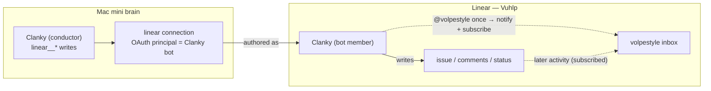

# ADR-0005 — Linear agent-activity notifications: Clanky writes as a distinct bot actor and @mentions the owner

- **Status:** Proposed (pending sign-off)
- **Date:** 2026-07-01
- **Deciders:** James Volpe
- **Issue:** Unfiled — file under the work tracker before ratifying.
- **Affects:** `agent/connections/linear.ts` (actor = OAuth principal) ·
  `agent/lib/mcp-oauth.ts` (per-principal token store holds the bot's token) ·
  `skills/clanky-work-tracker/SKILL.md` + `agent/skills/clanky-work-tracker.md`
  (the @mention-on-open rule) · Linear workspace (a new `Clanky` member — manual,
  admin-only) · `SPEC.md` work-tracker notes

## Context

The owner (`volpestyle`, workspace admin) wants his Linear **inbox to light up for
everything his agents do** — a durable feed of Clanky's autonomous work, not a
tracker he has to poll.

Today it never fires, and no notification-preference change can make it. The
`Vuhlp` workspace has exactly one human actor and no bot/app user. Clanky's Linear
integration (`agent/connections/linear.ts`, the curated eve connection to
`mcp.linear.app/mcp`) authenticates by **interactive OAuth**, and its actor is
"whoever completed `/mcp auth linear`" — i.e. the owner himself. So every issue,
comment, and status transition Clanky makes is attributed to the owner, and Linear
enforces one hard rule:

> **Linear never notifies you about your own activity.**

Writer and reader are the same account, so the whole feed is self-suppressed. Two
further constraints shape the fix:

- The hosted Linear MCP has **no subscriber field and no subscribe tool** —
  `save_issue` exposes `assignee` and `delegate`, nothing to add a watcher. The
  only owner-reachable notification primitive over this surface is the **@mention**
  (`save_issue.description` / `save_comment.body`, "use @displayName"), which both
  notifies *and* subscribes the mentioned user.
- A self-@mention is also suppressed — mentioning yourself notifies nobody. So the
  @mention only works once the writer is **not** the owner.

## Decision

**Clanky writes to Linear as a distinct `Clanky` bot actor, and @mentions the owner
once per issue it opens or first touches.** Scope is **Clanky's autonomous work
only** — the conductor already owns every tracker write (workers never touch
Linear; see `clanky-work-tracker`), so nothing else needs to change.

Two moves, both small:

1. **Distinct actor.** Provision a `Clanky` member in `Vuhlp` (owner-controlled
   alias, e.g. `volpestyle+clanky@gmail.com`) and complete `/mcp auth linear`
   while logged into Linear *as that account*. Clanky's OAuth broker keys tokens
   per principal (`mcp-oauth.ts` `principalStoreKey`), so its Linear connection
   then holds the bot's token and every `linear__*` write attributes to `Clanky`,
   not the owner. No code change to the connection — it is a re-auth under a
   different Linear identity.
2. **Notify by @mention.** When Clanky creates an issue, it includes `@volpestyle`
   in the description; when it first comments on a pre-existing issue it is driving,
   it `@volpestyle`s once. Because `Clanky` ≠ `volpestyle`, that fires an inbox
   notification **and subscribes** the owner — so every later status change and
   comment by Clanky on that issue reaches the inbox automatically. One mention per
   issue is enough; the subscription carries the rest.

This deliberately **rejects the native Linear Agent** (app actor + Agent Sessions):
its model is *delegate work into the agent from Linear*, which inverts Clanky's
control flow — Clanky decides its own work and treats Linear as a **written
ledger** (ADR-0002), not an inbound queue. The Agent-Session construct fights that
grain and does not integrate cleanly into the conductor. The bot actor gives the
notification behavior we want with none of that machinery.

## Contract

**Actor invariant.** Clanky's Linear connection authenticates as the `Clanky`
member, never as the owner. The owner's personal Linear identity does not author
Clanky's tracker writes. If the connection is ever re-authed as the owner, the feed
silently self-suppresses again — this is the failure mode to watch for.

**Notify rule (skill-enforced, in `clanky-work-tracker`).**

- On issue **create**: include `@volpestyle` in the description.
- On the **first** status comment for a pre-existing issue Clanky is driving:
  `@volpestyle` once. Subsequent comments/status changes need no mention — the
  owner is already subscribed.
- Never mention the owner as the *author* identity (that is the actor, set by
  auth); the mention is a body token only.
- The existing `tracker_update_skipped` contract is unchanged: if the connection is
  unavailable, report it — do not fake the mention.

**"Everything" coverage.** Owner-created issues already auto-subscribe him, so
Clanky's activity there notifies him without a mention; the @mention rule covers
the issues he would otherwise not watch (Clanky-created or others'). Net: every
issue Clanky drives ends with the owner subscribed, so the full arc — open →
progress → blocker → done — lands in his inbox.

**Bonus inbound loop (not built here).** Because `Clanky` is now its own actor with
its own inbox, the owner can delegate by assigning an issue to `Clanky` or
`@`-mentioning it; Clanky can read *its* inbox at natural boundaries (the skill's
existing "check inbox, do not busy-poll" guidance) and pick the work up. This
recovers a lightweight delegation UX without native Agent Sessions. Left as a
follow-up.

## Alternatives considered

- **Native Linear Agent (app actor + Agent Sessions).** Rejected. Purpose-built for
  "delegate → watch the session," and the app actor is free (no member seat), but
  it inverts Clanky's control flow and needs an OAuth app + webhook receiver
  (`AgentSessionEvent`) + activity emission — machinery that does not fit the
  conductor-writes-a-ledger model. Cost outweighs benefit for an outbound feed.
- **Tune notification preferences only.** Impossible — self-suppression is
  actor-level, not a preference. No setting exposes "notify me about my own edits."
- **@mention the owner while still the same actor.** No-op — self-mentions don't
  notify. Confirms the distinct actor is load-bearing.
- **Assignee-based subscription** (assign issues to the owner so he auto-subscribes).
  Rejected as the mechanism: assignee should reflect who *does* the work (Clanky),
  not who watches. @mention subscribes without abusing assignment.
- **Static bot API key instead of OAuth-as-bot.** More robust for an unattended
  always-on account (no browser login, no OAuth-refresh drift), but the curated
  connection is OAuth-only against the hosted MCP, and a key path means either a
  connection-code change or a different Linear API surface. Deferred to the
  OAuth-refresh open question; start with OAuth-as-bot (zero code change).
- **A second real bot user vs. the owner's `+clanky` alias.** The alias is a
  distinct Linear account the owner fully controls (Gmail plus-addressing delivers
  to him) — simplest way to own the bot's login/inbox. Still consumes one seat.

## Consequences

- + Owner's inbox reflects Clanky's real activity, with no polling and no new
  server surface — two small moves (re-auth + one skill rule).
- + Clanky gains its own Linear identity/inbox, enabling the inbound delegation loop
  above as a cheap follow-up.
- + Attribution is now truthful: the tracker shows Clanky did the work, the owner
  reviewed.
- − Costs **one Linear seat** for the `Clanky` member.
- − Bot auth is interactive OAuth under the bot login; the bot's token can drift on
  refresh for an unattended account (see open questions).
- − One extra @mention on issues the owner already watches (harmless; the rule
  favors robustness over perfect deduplication).
- Risk: a future re-auth as the owner silently reverts to self-suppression. The
  actor invariant above and a memory note guard against a session "fixing" it back.

## Implementation phases

1. **Provision (manual, owner/admin).** Invite `volpestyle+clanky@gmail.com` to
   `Vuhlp` as member `Clanky`; accept the invite.
2. **Re-auth.** In a browser logged in as `Clanky`, run `/mcp auth linear`; verify
   the connection now authors as `Clanky` (`get_user "me"` over the connection, or
   a probe issue whose author is the bot).
3. **Skill rule.** Land the @mention-on-open rule in both `clanky-work-tracker`
   copies (done alongside this ADR).
4. **Verify end-to-end.** Clanky opens a probe issue with `@volpestyle`; confirm the
   owner's inbox shows the mention + a subscription; Clanky posts a status change;
   confirm that notifies too. Close the probe.
5. **Docs.** Fold the actor invariant into `SPEC.md`'s work-tracker notes;
   cross-link ADR ↔ SPEC.

## Open questions

- **OAuth-refresh durability:** does the bot's OAuth token survive unattended over
  weeks, or does the always-on brain need the static-API-key path for a bot with no
  human to re-consent? Revisit if the connection drops auth.
- **Mention noise:** is one mention per issue the right granularity, or should
  high-traffic issues suppress the owner's own comment-authored notifications via
  his notification preferences? Default: one mention, lean on subscription.
- **Inbound delegation:** build the "assign/mention `Clanky` → Clanky reads its
  inbox and picks it up" loop, or keep the feed outbound-only for now?
