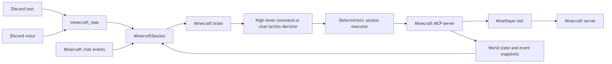

# Minecraft

Canonical capability doc for Clanky's embodied Minecraft runtime.

Minecraft is not a separate persona. It is Clanky operating inside a Minecraft Java world through a Mineflayer-backed MCP runtime.

<!-- source: docs/diagrams/minecraft-brain-flow.mmd -->

## Core Model

- Discord text, Discord voice, and Minecraft chat are all input surfaces into the same Minecraft session.
- The active `MinecraftSession` owns one Minecraft brain.
- The Minecraft brain decides structured in-world actions and updates longer-horizon goal state.
- The runtime executes that decision deterministically through Mineflayer tools.

That split is intentional:

- brain: decides what to do, what the active goal is, and whether another planner checkpoint is needed immediately
- runtime/tools: make the action happen reliably

This keeps Minecraft aligned with `AGENTS.md`: Clanky sees context and decides for himself, instead of acting like a regex command router.

## Current Capability Set

Today the runtime supports these high-level actions:

- connect / disconnect
- status
- follow a player
- guard a player
- go to coordinates
- collect nearby blocks by canonical ID
- attack the nearest hostile mob
- look at a player
- stop current autonomous behavior
- return home
- chat in Minecraft
- eat the highest-value food in inventory
- equip an item (e.g. shield) to the off-hand slot
- craft items using known recipes, optionally with a nearby crafting table
- deposit/withdraw items from allowed chests
- place a single block from inventory
- execute a structured multi-block build plan (with optional sub-planner expansion from a short description)
- long-horizon project loop: start/step/pause/resume/abort with an action budget
- bounded visible-block projection of the scene ahead
- on-demand rendered first-person scene capture for aesthetic/social inspection

The Minecraft brain can choose between those actions, react to in-game chat, and keep using the same active session across Discord text and voice followups.

It also carries lightweight long-horizon state inside the session:

- active goal
- current subgoals
- progress notes/checkpoints
- preferred world/server target for joining
- active project (title, description, checkpoints, action budget, completed checkpoints)
- last action result plus typed failure context for self-correction

It also carries structured perception and event state into the brain:

- recent typed in-world events such as chat, death, player joins/leaves, combat, block-break, and item-pickup
- bounded `visualScene` block/entity projection of what is ahead of the bot
- a one-shot rendered first-person glance when the planner chooses `look`

When an in-world action fails, the session records both the free-form result text and a structured `lastActionFailure` record with a typed reason such as `player_not_visible` or `out_of_range`. For player-targeted failures, it also surfaces a `didYouMeanPlayerName` suggestion when the visible world state strongly suggests the intended player. The planner can immediately consume that state and recover inside the same turn instead of dead-ending on the first failed step.

## World Perception

The Minecraft brain currently sees the world through two complementary perception tiers:

- the normal Mineflayer status snapshot plus bounded `minecraft_visible_blocks` projection: health, food, position, hazards, visible players, inventory, task, recent typed events, non-air blocks ahead, nearby entities in view, sky/enclosure hints, and short notable-feature summaries
- an on-demand `minecraft_look` rendered first-person glance, used when the planner needs to judge what something actually looks like rather than only what structured telemetry says is there

The first tier is the mechanical/survival channel. It is cheap enough to use on normal planning turns and gives the brain structured answers to questions like "is there lava ahead", "am I in a cave", and "what blocks are in front of me" without needing pixels.

The second tier is the social/aesthetic channel. The planner can choose `look`, which captures a rendered first-person image from the current viewpoint and feeds it into the very next planner checkpoint of the same Minecraft brain. This keeps the one-brain architecture intact: Mineflayer still executes deterministically, and Clanky only spends image tokens when the moment actually justifies a visual glance.

## Input Surfaces

### Discord text

- The text/orchestrator brain decides whether to use `minecraft_task`.
- The text system prompt explicitly describes Minecraft as an embodied-self handoff, not a command router.
- Once a Minecraft session exists, the instruction is handed to the Minecraft brain for in-world interpretation.
- When the current channel already has an active Minecraft session, the user prompt includes a one-line session-state hint so the orchestrator can keep continuity without re-querying blindly.

### Discord voice

- The voice runtime decides whether to use `minecraft_task`.
- The voice system prompt uses the same embodied-self framing, and the live voice prompt includes the same active-session hint when a Minecraft session already exists for the current scope.
- Once a Minecraft session exists, the instruction is handed to the same Minecraft brain.

### Minecraft chat

- New in-game chat events are observed from the MCP status/event stream.
- The Minecraft brain decides whether to reply in chat, act in the world, both, or neither.
- In-game chat is queued as a bounded pending backlog during reply cooldowns or while another chat decision is in flight. Those lines still reach the brain as explicit `pendingInGameMessages` context on the next chat/planning decision instead of being silently dropped.

The transport that delivered the instruction does not change who is making the Minecraft decision.

### Cross-surface Discord context

When the Minecraft session is scoped to a guild channel, the brain also sees a labeled window of recent Discord channel messages on every planning turn and every in-game chat reply. In-game chat history and Discord channel history are kept in separate prompt sections so the brain can reason about surface-of-origin — it knows which speaker was in Minecraft versus in Discord and can connect follow-ups across surfaces ("Volpe said 'help Alice' in voice, Alice just typed 'hey clanky help me' in MC chat") without conflating the two streams.

DM/owner-private scopes deliberately receive no Discord context. That filter happens at the plumbing boundary: the `getRecentDiscordContext` callback is simply not wired for DM-scoped sessions, so private conversation cannot leak into Minecraft chat visible to other players.

### Proactive Discord narration

- Significant in-world events can become candidate proactive Discord posts in the text channel that owns the active Minecraft session.
- The narration pipeline receives typed events, not just raw strings, so significance filtering no longer depends on regex-parsing the bot's event log.
- The narration filter is a cost gate, not a relevance gate. It shortlists deaths, server join/leave problems, combat moments, player joins/leaves, and first-time major progression blocks such as diamond ore or obsidian, then the model decides whether the room actually wants to hear about it.
- `[SKIP]` remains first-class. Even when an event is significant enough to reach the model, Clanky can still stay quiet.
- Narration is rate-limited per owning channel through `agentStack.runtimeConfig.minecraft.narration.minSecondsBetweenPosts`, and its selectiveness is tuned with `agentStack.runtimeConfig.minecraft.narration.eagerness`.

## Runtime Shape

The live path is:

1. A Discord text turn, Discord voice turn, or Minecraft chat event reaches the active `MinecraftSession`.
2. The session assembles world state, recent game events, in-game chat history, recent Discord channel context (guild-scoped sessions only), current mode, constraints, preferred server target, and longer-horizon planner state.
3. The Minecraft brain chooses a structured checkpoint action plus any goal/subgoal/progress updates, informed by typed recent events, the current visible-block projection when available, and an attached rendered glance when it previously chose `look`.
4. The session may run a bounded internal planner loop for that turn when the brain marks the step as a setup/checkpoint, such as `connect` before `follow`, or when an action fails and the updated failure state should be reconsidered immediately.
5. The session converts each chosen action into concrete MCP tool calls.
6. The MCP server drives Mineflayer, which performs the actual movement, pathfinding, combat, and block interaction.

The session also runs a deterministic reflex loop for fast infrastructure-grade reactions such as hazard response. Reflexes are not the personality layer; they are the safety/latency layer.

## Settings

The canonical config lives under `agentStack.runtimeConfig.minecraft`:

- `enabled`
- `mcpUrl`
- `knownIdentities`
- `server`
- `narration.eagerness`
- `narration.minSecondsBetweenPosts`
- `execution`

`execution` follows the same model-binding pattern used by other capability-local brains:

- `mode: inherit_orchestrator`
- `mode: dedicated_model`

When `inherit_orchestrator` is selected, Minecraft uses the main text/orchestrator model.

When `dedicated_model` is selected, Minecraft uses its own provider/model binding for both:

- operator-turn interpretation inside the Minecraft session
- Minecraft in-game chat behavior

This is the preferred architecture for an embodied capability: one Minecraft brain, many input surfaces.

## Server Selection And Identity

The canonical product-level join target lives in `agentStack.runtimeConfig.minecraft.server`.

That target is session context, not a second decision-maker. It gives the Minecraft brain and runtime a shared answer to questions like:

- what world/server does `join the server` mean here?
- what world is Clanky expected to rejoin after disconnects or restarts?
- what server label should appear in planner context and status summaries?

`server` currently supports:

- `label`
- `host`
- `port`
- `description`

When configured, the session uses that target for both explicit `connect` actions and automatic reconnect/autoconnect behavior.

If no explicit target is configured yet, the bundled MCP runtime still resolves the server host in this order:

1. explicit `host` argument when the low-level connect tool receives one
2. `server-info.json` from the configured server-info URL
3. `MC_HOST`
4. `127.0.0.1`

The bundled MCP runtime resolves the bot username in this order:

1. explicit `username` argument when the low-level connect tool receives one
2. `MC_USERNAME`
3. `ClankyBuddy`

`knownIdentities` is optional. When empty, Clanky treats every Minecraft player as a peer and forms impressions organically from chat, behavior, and memory.

When populated, it acts like a small Discord to Minecraft address book:

- `mcUsername`
- `discordUsername`
- `label`
- `relationship`
- `notes`

This is context, not a permission list. It helps the brain resolve people across Discord and Minecraft when that is useful, but it does not stop Clanky from interacting with players who are not listed.

## Building And Projects

### Building

The brain can emit a `build` action in two forms:

- **Explicit plan** — a structured list of `{ x, y, z, blockName }` placements the brain has already reasoned about. The session hands it straight to `BuildStructureSkill`.
- **Description** — a short sketch (geometric primitive like `wall 5x3`, `floor 4x4`, `pillar 5`, `box 3x3x3`, `hollow_box 4x4x4`, or freeform like "a small wood shack") that the builder sub-planner expands into a concrete plan. The sub-planner runs a single LLM call (using the Minecraft brain binding) for freeform descriptions; geometric primitives are expanded deterministically with no LLM cost.

Build plans are capped at 256 blocks per skill invocation. The `BuildStructureSkill` navigates closer when a block is out of reach, optionally clears obstructions (`clearFirst`), places each block via `minecraft_place_block`, and reports progress per block so the session can checkpoint. Partial failures surface as a typed `lastActionFailure` so the brain can recover.

### Chest constraints

`constraints.allowedChests` is a list of `{ x, y, z, label? }` coordinates. When set, the session rejects `deposit` or `withdraw` actions targeting any chest not in the list before a single byte touches the MCP runtime. This is an infrastructure safety gate — it prevents griefing or accidental inventory dump into public containers.

### Long-horizon project loop

A project is a self-chosen multi-turn goal the brain pursues across sessions. The brain can:

- `project_start { title, description, checkpoints?, actionBudget? }` — begin a new project. The session refuses if another project is already active.
- `project_step { summary? }` — explicitly log a step while the project is executing. If the summary matches one of the declared checkpoints, that checkpoint is marked complete.
- `project_pause { reason? }` / `project_resume` — pause/resume without discarding state.
- `project_abort { reason? }` — abandon the project.

The session also **auto-deducts** from the project's action budget on every concrete in-world action (not reads, session connect/disconnect plumbing, chat, or `look_at`) while a project is executing. When `actionsUsed` hits the budget, the project auto-pauses and surfaces a `budget_exceeded` failure so the brain can reason about whether to extend, split, or abandon. Once paused, `project_step` is rejected until the brain resumes or aborts the project. Budget-exhausted projects cannot resume past the cap; the brain must start a fresh project instead.

Budget caps are infrastructure cost controls, not creative limits. The brain always chooses whether to start a project at all.

## Settings

- `agentStack.runtimeConfig.minecraft.enabled`
- `agentStack.runtimeConfig.minecraft.mcpUrl`
- `agentStack.runtimeConfig.minecraft.knownIdentities`
- `agentStack.runtimeConfig.minecraft.server` (single preferred target)
- `agentStack.runtimeConfig.minecraft.serverCatalog` (optional list of labeled targets the brain can connect to by name)
- `agentStack.runtimeConfig.minecraft.narration.{eagerness, minSecondsBetweenPosts}`
- `agentStack.runtimeConfig.minecraft.project.defaultActionBudget`
- `agentStack.runtimeConfig.minecraft.execution` (brain model binding)

## Current Limits

Minecraft is currently an embodied teammate runtime. Remaining gaps:

- no first-person vision upgrades beyond the rendered scene glance (no shaders, modded servers, resource packs)
- no deeper reputation model yet beyond chat history, memory, and the optional `knownIdentities` address book
- no automated food-slot pre-equip management (eat reflex picks best food at eat time)

The important boundary is that these are narrow gaps, not architecture limits. The runtime has the right authority boundary: the Minecraft brain owns in-world decisions, the tool/runtime layer owns reliable execution, reflexes own survival safety, and the sub-planner expands shorthand into concrete plans.

## Product Language

Current product language: `embodied Minecraft teammate`

Avoid describing it as only a `command companion` when discussing the architecture. The runtime still has capability gaps, but the authority model is one in-world brain rather than transport-specific command handlers.
