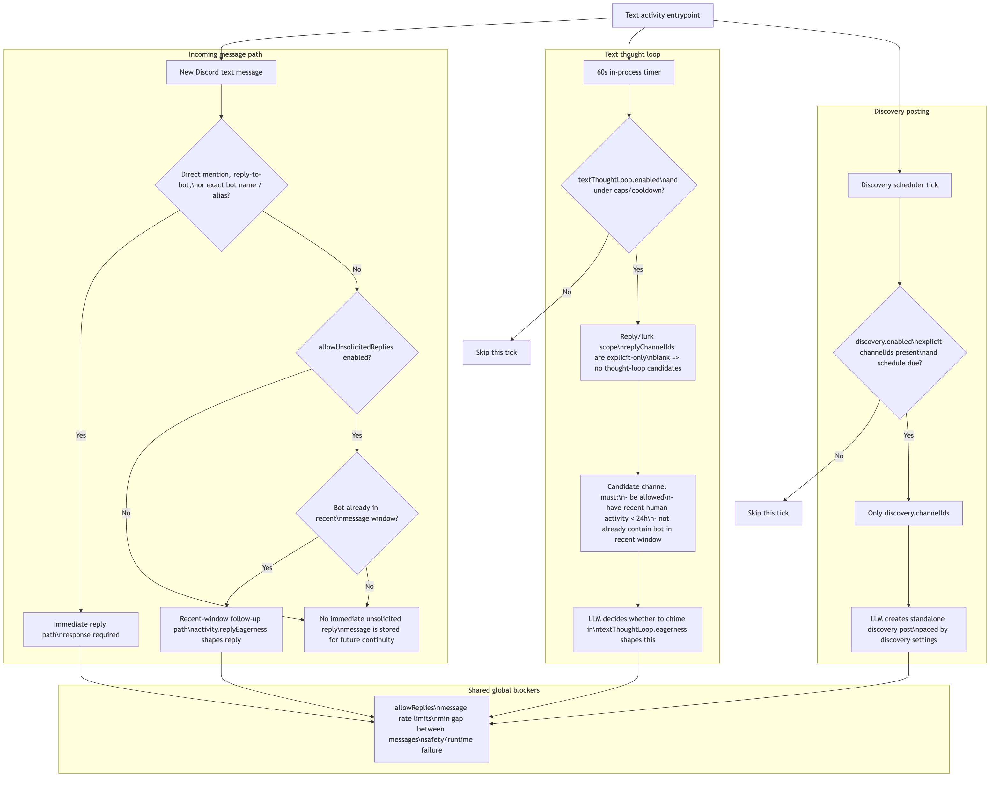
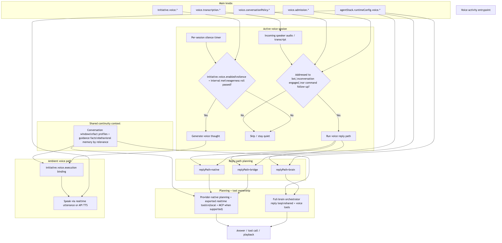

# Clanker Activity Model

> **Scope:** All activity paths (text + voice) — which path fired and which slider controls it.
> Barge-in and noise rejection: [`voice-interruption-policy.md`](voice/voice-interruption-policy.md)
> Voice pipeline stages, providers, and per-stage settings: [`voice-provider-abstraction.md`](voice/voice-provider-abstraction.md)

This document explains how Clanker decides when to speak in text channels and voice sessions, which settings control each path, how tool calling fits into the runtime, and where to look in code and the dashboard when behavior needs to change.

It is the source of truth for the current activity model:

- direct mentions and replies
- recent-window follow-up replies
- cold-channel text thought-loop replies
- discovery / proactive posts
- voice session reply behavior and voice thought engine behavior
- shared text/voice tool calling

<!-- source: docs/diagrams/clanker-activity.mmd -->

<!-- source: docs/diagrams/clanker-voice-and-tools.mmd -->

## Mental Model

There are four distinct text activity paths:

1. `Directly addressed reply`
Clanker is pinged, replied to, or called by exact name / alias. This enters the reply path immediately.

2. `Recent-window follow-up reply`
Clanker already spoke in the recent message window for that channel/thread, so it is allowed to continue participating.

3. `Text thought loop`
Nobody explicitly called Clanker, and Clanker is not already in the current recent window. A timer periodically checks eligible channels and decides whether Clanker wants to chime in.

4. `Discovery post`
A separate proactive posting system that can post standalone discovery/shitpost content in explicit discovery channels.

These are related, but they are not the same system and they are not controlled by the same settings.

The runtime has enough separate paths and sliders that the activity model needs its own dedicated reference.

## Operator Checklist

If you are trying to understand or tune behavior, these are the main questions:

1. Is this text or voice?
2. Is the bot being directly addressed, already in the recent conversational window, or cold-starting into a conversation?
3. Is this a reactive reply path, a scheduled thought-loop path, or a discovery/proactive path?
4. Does the bot need a tool, or should it answer from continuity and current prompt context alone?
5. Which dashboard section owns the relevant knob?

## Activity Paths

### 1. Directly Addressed

This is the highest-priority text path.

Examples:

- user mentions the bot
- user replies directly to a bot message
- user says the bot name or configured alias exactly

Behavior:

- Clanker enters the reply path immediately.
- Reply eagerness is not meant to suppress this.
- The reply can still be blocked by global controls like:
  - `permissions.allowReplies = false`
  - rate limits / cooldowns
  - safety refusal
  - runtime/model failure

Relevant code:

- `src/bot/replyAdmission.ts`
- `src/bot.ts`

## 2. Recent-Window Follow-Up

If Clanker already has a message in the recent channel window, the next non-addressed turns can still enter the reply decision loop.

This is what lets Clanker continue a thread after already joining it.

Behavior:

- admission is allowed because the bot is already in-context
- `permissions.allowUnsolicitedReplies` still has to be on for this path
- once admitted, reply eagerness still matters
- the model can still choose to respond or `[SKIP]`

Relevant code:

- `hasBotMessageInRecentWindow(...)` in `src/bot/replyAdmission.ts`
- `shouldAttemptReplyDecision(...)` in `src/bot/replyAdmission.ts`
- text prompt eagerness wording in `src/prompts/promptText.ts`

## 3. Text Thought Loop

This is the cold-start conversational lurking path.

It exists for cases like:

- two people are talking in `#general`
- nobody addressed Clanker
- Clanker has not posted in the recent window yet
- Clanker may still decide to jump in

The thought loop is:

- timer-driven
- in-process only
- checked every 60 seconds
- scoped to explicit `permissions.replyChannelIds`
- capped by cooldown and daily limits
- limited to channels with recent human activity
- intentionally separate from the normal unsolicited-reply admission flag

Important distinction:

- the loop checks every 60 seconds
- that does **not** mean it posts every 60 seconds
- actual posting is limited by `initiative.text.minMinutesBetweenThoughts` and `initiative.text.maxThoughtsPerDay`

The thought loop runs only while the bot process is online, with no replay catchup.

Setting boundary:

- `initiative.text.enabled` is the switch for this path
- `permissions.allowUnsolicitedReplies` controls reply admission, not the thought loop — lurking/chiming in on a timer is a separate proactive system

Relevant code:

- `maybeRunTextThoughtLoopCycle()` in `src/bot.ts`
- `pickTextThoughtLoopCandidate()` in `src/bot.ts`

## 4. Discovery Posts

Discovery posts are a separate proactive system.

These are not normal conversational chime-ins. They are standalone posts based on discovery scheduling and optional external link/media sourcing.

Behavior:

- only allowed in explicit `discovery.channelIds`
- uses discovery pacing/schedule settings, not thought-loop cadence
- does not require recent human activity in the channel

Relevant code:

- `maybeRunDiscoveryCycle()` in `src/bot.ts`
- `src/bot/discoverySchedule.ts`

## Voice Activity Paths

Voice has a different surface area than text, but the same high-level split still exists:

1. `Explicit voice command / direct address`
2. `Conversation-engaged follow-up reply`
3. `Voice thought engine`
4. `Voice tool use during a reply`

The important difference is that voice behavior runs inside an active voice session and is gated by turn segmentation, silence windows, speaking state, and session-level engagement tracking.

### 5. Directly Addressed In Voice

Examples:

- someone clearly says the bot's name in VC
- someone issues an explicit join/leave/music command aimed at the bot
- the current speaker is clearly continuing a command/reply chain already aimed at the bot

Behavior:

- the voice decision layer is biased toward replying
- the reply-decision LLM and addressing state both matter
- the runtime logs one `voice_turn_addressing` decision record per processed turn

Relevant code:

- `evaluateVoiceReplyDecision(...)` in `src/voice/voiceReplyDecision.ts`
- `buildVoiceConversationContext(...)` in `src/voice/voiceReplyDecision.ts`
- `buildVoiceAddressingState(...)` in `src/voice/voiceAddressing.ts`
- `voice_turn_addressing` action logging in `src/voice/turnProcessor.ts`

### 6. Voice Reply Classifier Gate

A lightweight LLM classifier (haiku, yes/no) gates non-direct-address turns before they reach generation. The classifier sees transcript, speaker, participant list, eagerness, and engagement context, and decides whether the bot should respond.

Mode defaults:

- **Bridge:** classifier always on — it's the only gate before generation.
- **Brain:** classifier off by default (generation LLM decides via `[SKIP]`), toggleable on via dashboard.
- **Native:** not applicable — audio flows directly to the realtime model.

Decision flow:

- Direct address (wake word) → fast-path allow, no classifier needed
- Command followup → fast-path allow
- Eagerness disabled → block
- Addressed-to-other signal → classifier context (strong deny prior, not hard deterministic block)
- Full-brain/file-ASR path → `generation_decides` (the text LLM handles skip via `[SKIP]`)
- Music playing and no wake latch → `music_playing_not_awake`
- `voice.admission.mode=classifier_gate` → classifier YES/NO → `classifier_allow` / `classifier_deny`
- `voice.admission.mode=generation_decides` → `generation_decides`
- Classifier prompt context includes attributed recent history (`speaker: "text"`) up to 6 turns / 900 chars plus current turn fields

The classifier gate uses language understanding to evaluate turns.

Relevant code:

- `evaluateVoiceReplyDecision(...)` in `src/voice/voiceReplyDecision.ts`
- `runVoiceReplyClassifier(...)` in `src/voice/voiceReplyDecision.ts`
- `buildVoiceAddressingState(...)` in `src/voice/voiceAddressing.ts`
- `runRealtimeTurn(...)` and `runFileAsrTurn(...)` in `src/voice/turnProcessor.ts`

### 7. Voice Thought Engine

The voice thought engine is the VC equivalent of a timer-driven conversational chime-in system.

Behavior:

- only runs while an active voice session exists
- scheduled by silence and cooldown, not by a fixed global cron
- uses `initiative.voice.*` settings
- is separate from direct-address handling

Important distinction:

- voice thought timing is per session
- the engine is scheduled with `setTimeout(...)` based on silence and minimum spacing
- it is not replayed after downtime or after the session ends

Relevant code:

- `resolveVoiceThoughtEngineConfig(...)` in `src/voice/thoughtEngine.ts`
- `scheduleVoiceThoughtLoop(...)` in `src/voice/thoughtEngine.ts`
- `maybeRunVoiceThoughtLoop(...)` in `src/voice/thoughtEngine.ts`

### 8. Voice Runtime Modes Matter

There are three voice runtime styles to keep in mind:

- `realtime native`
  - provider-native realtime generation owns more of the turn loop

- `brain / bridge`
  - transcript text is pushed through the shared continuity + tool-calling brain path
  - non-direct-address turns are admitted by `voice.admission.mode`:
    - `classifier_gate`: YES/NO classifier gate
    - `generation_decides`: generation decides reply vs skip

- `brain` with `voice.openaiRealtime.transcriptionMethod="file_wav"` and/or `voice.ttsMode="api"`
  - transcription, text generation, and TTS are separate stages
  - the text LLM decides whether to reply or `[SKIP]` (reason: `generation_decides`)

The user-visible behavior should stay broadly aligned, but the transport is different. The most important operator takeaway is that the continuity model and tool model are intentionally shared, even when the audio pipeline is not.

Relevant code:

- `src/voice/voiceModes.ts`
- `src/voice/voiceSessionHelpers.ts`
- `src/voice/voiceSessionManager.ts`
- `src/bot/voiceReplies.ts`

## Channel Scope Rules

### Reply Channels

`permissions.replyChannelIds` controls where reply/lurk behavior is treated as a reply-channel context.

Current behavior:

- if `replyChannelIds` is non-empty:
  - only those listed channels are reply channels

`non-private` here means:

- guild text channels
- public threads
- not DMs
- not private threads

`allowed` still matters:

- `permissions.allowedChannelIds` can limit the overall text-channel set
- `permissions.blockedChannelIds` always excludes channels

### Discovery Channels

`discovery.channelIds` is explicit-only.

If it is empty:

- discovery posting is disabled everywhere

There is no “all channels by default” fallback for discovery posts.

### Voice Channel Scope

Voice uses a separate permission scope from text:

- `voice.allowedVoiceChannelIds`
- `voice.blockedVoiceChannelIds`
- `voice.blockedVoiceUserIds`

Text reply-channel defaults do not affect voice session eligibility.

## Setting Map

### Immediate Reply Controls

- `permissions.allowReplies`
  - global text reply master switch

- `permissions.allowUnsolicitedReplies`
  - controls whether non-direct, non-forced reply attempts can happen once admitted by the normal unsolicited path
  - scope: unsolicited reply admission only (direct-address replies and the text thought loop are independent systems)

- `activity.replyEagerness`
  - eagerness for admitted unsolicited replies (0–100)
  - primarily affects recent-window follow-up and model skip behavior once the reply loop runs

- `activity.minSecondsBetweenMessages`
  - global text spacing between bot messages

### Reply Eagerness Tiers

The eagerness value (0–100) from `activity.replyEagerness` maps to graduated prompt tiers. The raw number is also exposed to the LLM so it has a continuous sense of the scale.

| Range | Label | Prompt behavior |
|-------|-------|-----------------|
| 0–15 | Lurker | Only speak when clearly talked to or something genuinely important to say |
| 16–35 | Observer | Observe more than talk; chime in when genuinely engaging or clearly addressed |
| 36–55 | Selective | Skip unless genuinely useful, interesting, or funny |
| 56–75 | Engaged | Contribute when it fits the flow, but still pick moments |
| 76–90 | Active | Jump in freely, lighter contributions fine if they fit naturally |
| 91–100 | Very social | Riff freely, casual reactions and banter welcome |

### Directed-At-Someone-Else Detection

When the trigger message is structurally directed at another user, the skip prompt is strengthened. Two signals are detected:

- `mentionsOtherUsers` — the message @mentions one or more users, none of which are the bot
- `repliesToOtherUser` — the message is a Discord reply to another user's message (not the bot's)

How eagerness modulates the skip:

- At eagerness ≤ 75: hard skip instruction — "Output [SKIP] unless the message also clearly invites you to participate"
- At eagerness > 75: soft skip — "Strongly prefer [SKIP] — only jump in if you have something genuinely worth adding to their exchange"

### Conversational Awareness

Even without structural signals (no @mention, no Discord reply), the prompt instructs the LLM to detect when people are talking to each other:

- At eagerness ≤ 60: "If people are talking to each other (using names, replying back and forth, making plans together), output [SKIP]."
- At eagerness > 60: "If people are clearly having a private or directed exchange with each other, prefer [SKIP] unless you can genuinely add to the conversation."

This covers cases like "yo James let's play later" where no platform mention is used but the message is clearly directed at someone else.

Relevant code:

- `mentionsOtherUsers` and `repliesToOtherUser` computed in `src/bot/replyPipeline.ts` (`buildReplyContext`)
- eagerness tiers, directed-at-someone-else, and conversational awareness prompts in `src/prompts/promptText.ts` (`buildReplyPrompt`)

### Thought Loop Controls

- `initiative.text.enabled`
  - enables/disables the cold-channel conversational lurking loop
  - this is separate from `permissions.allowUnsolicitedReplies`

- `initiative.text.eagerness`
  - controls how willing Clanker is to chime in during thought-loop checks

- `initiative.text.minMinutesBetweenThoughts`
  - cooldown between thought-loop posts

- `initiative.text.maxThoughtsPerDay`
  - daily cap for thought-loop posts

- `initiative.text.lookbackMessages`
  - how much recent context the thought loop inspects when evaluating a channel

### Discovery Controls

- `discovery.enabled`
- `discovery.channelIds`
- `discovery.maxPostsPerDay`
- `discovery.minMinutesBetweenPosts`
- `discovery.pacingMode`
- discovery media/link sourcing settings

These affect discovery posts only, not normal conversation replies.

### Voice Controls

- `voice.enabled`
  - master switch for voice features

- `voice.replyEagerness`
  - general voice-reply willingness once a turn is admitted into generation

- `voice.commandOnlyMode`
  - narrows voice behavior toward commands/control instead of open-ended chatting

- `initiative.voice.enabled`
  - master switch for timer/silence-driven unsolicited VC thoughts

- `initiative.voice.eagerness`
  - how willing Clanker is to speak up on its own in an active VC

- `initiative.voice.minSilenceSeconds`
  - required silence before a voice thought can be scheduled

- `initiative.voice.minSecondsBetweenThoughts`
  - minimum spacing between voice thought-engine replies

- `voice.replyPath`
  - `native`, `bridge`, or `brain`
  - changes how replies are transported, not the operator-facing continuity model

- `voice.admission.mode`
  - `classifier_gate` or `generation_decides` for realtime bridge admission

- `voice.admission.musicWakeLatchSeconds`
  - sliding latch window (default 15s) that allows follow-up turns during active music after a wake/direct-address

- `agentStack.overrides.voiceAdmissionClassifier`
  - model used for the realtime admission classifier in `classifier_gate` mode

- classifier context window
  - attributed recent transcript history (`speaker: "text"`) up to 6 turns / 900 chars, plus current turn fields

- `agentStack.runtimeConfig.voice.generation.*`
  - model used for voice-turn generation in non-native generation paths and `generation_decides` admission behavior

- `voice.openaiRealtime.*`, `voice.geminiRealtime.*`, `voice.elevenLabsRealtime.*`, `voice.openaiAudioApi.*`
  - provider- and transport-specific controls

## Tool Calling Model

Tool calling is part of the activity model because it changes what the bot can do during a turn and what users should expect from follow-up behavior.

There are three important rules:

1. Tools are available to the brain, not to the user directly.
2. Text and voice share most of the same core conversational tools.
3. Tool calling is on-demand; it should not happen every turn.

### Shared Core Conversational Tools

Shared text/voice conversational tools include:

- `conversation_search`
- `memory_search`
- `memory_write`
- `adaptive_directive_add`
- `adaptive_directive_remove`
- `web_search`
- `browser_browse`

These are the tools that let Clanker:

- recall earlier text or voice conversations
- remember durable facts
- persist recurring behavior guidance
- look things up on the live web
- use the browser agent when a normal web search is not enough

### Tool-Calling Paths

Text has two tool-calling shapes:

- normal text reply loop
- STT-pipeline voice generation, which reuses the text reply tool set

Realtime voice has its own transport, but the same conceptual tool model:

- tool descriptors are registered with the realtime provider
- function-call events arrive from the provider
- local tools and MCP tools execute in runtime
- results are sent back into the conversation

Important operator expectation:

- the tool surface is mostly shared
- the transport differs between native realtime, bridge, and full-brain/API-override replies
- some tools remain modality-specific when they only make sense in voice

Relevant code:

- `src/tools/replyTools.ts`
- `src/bot/replyPipeline.ts`
- `src/bot/voiceReplies.ts`
- `src/voice/voiceToolCalls.ts`
- `src/voice/voiceSessionManager.ts`

### Tool Availability And Toggles

Tool use is still affected by settings and runtime state:

- memory tools depend on `memory.enabled`
- adaptive directive persistence depends on `adaptiveDirectives.enabled`
- browser browsing depends on browser-agent availability and caller opt-in
- automations intentionally opt out of `browser_browse` right now
- web search depends on `webSearch.enabled` and rate/budget conditions

So "the bot has a tool" and "the tool is available on this exact turn" are not always the same thing.

## Global Guardrails That Still Apply

Even though the activity paths differ, they still share some global runtime blockers:

- `permissions.allowReplies`
  - disables normal text reply generation entirely

- `permissions.maxMessagesPerHour`
  - caps all outgoing text activity

- `activity.minSecondsBetweenMessages`
  - global spacing between bot messages

- voice session state, silence windows, and addressing confidence
- transport-specific availability for native realtime vs bridge/stt paths
- safety / model refusal
- runtime/provider failure

So "direct mention" means "the bot must enter the reply path," not "a visible message is physically guaranteed under every failure mode."

## Which Slider Actually Matters?

### Direct mention / direct reply to bot

Primary driver:

- direct address

Reply eagerness:

- effectively not the deciding factor

### Clanker is already in the recent window

Primary driver:

- recent-window follow-up admission

Reply eagerness:

- yes, this matters

### Two humans are talking and Clanker has not spoken yet

Primary driver:

- text thought loop

Reply eagerness:

- not the main control here

Thought-loop eagerness:

- this is the important one

### Standalone proactive post

Primary driver:

- discovery scheduler

Thought-loop eagerness:

- not relevant

Discovery settings:

- these are the important ones

## Double-Posting Protection

The thought loop intentionally backs off if Clanker already posted in the recent message window.

That separation is important:

- if Clanker is already in the recent window, the normal recent-window reply path handles follow-up participation
- if Clanker is not in the recent window, the thought loop can decide whether to enter

This prevents the thought loop from piling on while Clanker is already active in the conversation.

## Practical Examples

### Example A: user says `clanker what do you think?`

- direct-address path
- enters reply path immediately
- reply eagerness should not suppress it

### Example B: Clanker already posted, then two more users keep talking

- recent-window follow-up path
- admitted because Clanker is already in-context
- reply eagerness can still make Clanker answer or skip

### Example C: two users are chatting in `#general`, Clanker has not spoken yet

- thought loop decides whether to jump in
- `initiative.text.*` is the main control

### Example D: `replyChannelIds` is blank

- no channels are treated as reply channels
- the text thought loop has no eligible channel candidates and will not post
- direct-address replies still work

### Example E: `discovery.channelIds` is blank

- discovery posting is disabled everywhere
- this does not affect direct replies or the text thought loop

### Example F: `allowUnsolicitedReplies` is off, but `initiative.text.enabled` is on

- recent-window follow-up replies will stop
- direct mentions still work
- the scheduled thought loop can still chime into eligible reply channels

### Example G: in VC, someone addresses Clanker once and then asks a short follow-up

- voice conversation continuity can still treat the follow-up as aimed at the bot
- realtime admission mode (`voice.admission.mode`) and session engagement context matter more than text-channel eagerness sliders

### Example H: user asks "what did we say about Nvidia earlier?"

- Clanker should prefer `conversation_search`
- this applies in both text and voice
- durable memory is not the primary source for prior chat recall

### Example I: user asks for a recurring behavior rule

- Clanker should use `adaptive_directive_add` rather than `memory_write`
- the saved directive then affects future text and voice behavior through the shared continuity layer

## Current Defaults Worth Remembering

- thought-loop scheduler check cadence: 60 seconds
- thought-loop active-channel requirement: recent human activity within the last 24 hours
- discovery channel selection: explicit-only
- empty `replyChannelIds`: disables reply-channel classification and thought-loop candidate scanning
- voice thought engine defaults to enabled
- voice thought timing is silence/cooldown driven, not a 60-second global poll

## Dashboard Knob Map

If you are trying to change behavior from the dashboard, the main sections are:

- `Core Behavior`
  - text eagerness sliders
  - thought-loop settings
  - top-level reply/activity pacing

- `Channels & Permissions`
  - allowed/blocked text channels
  - reply/lurk channel IDs
  - blocked users
  - voice allowed/blocked channels and blocked voice users

- `Discovery`
  - discovery posting enablement, pacing, and discovery channel IDs

- `Voice Mode`
  - voice provider/runtime mode
  - reply path
  - transcription model/method
  - voice thought engine settings
  - generation/reply-decision model settings

- `Browser`
  - browser-agent enablement and model/provider settings for `browser_browse`

- `Memory`
  - durable memory visibility
  - adaptive directives and audit history

## Source Files

The main behavior described here is implemented in:

- `src/bot.ts`
- `src/bot/replyAdmission.ts`
- `src/bot/replyPipeline.ts`
- `src/bot/discoverySchedule.ts`
- `src/bot/voiceReplies.ts`
- `src/voice/voiceSessionManager.ts`
- `src/voice/voiceReplyDecision.ts`
- `src/voice/voiceToolCalls.ts`
- `src/tools/replyTools.ts`
- `src/settings/settingsSchema.ts`
- `dashboard/src/components/settingsSections/CoreBehaviorSettingsSection.tsx`
- `dashboard/src/components/settingsSections/ChannelsPermissionsSettingsSection.tsx`
- `dashboard/src/components/settingsSections/DiscoverySettingsSection.tsx`
- `dashboard/src/components/settingsSections/VoiceModeSettingsSection.tsx`
