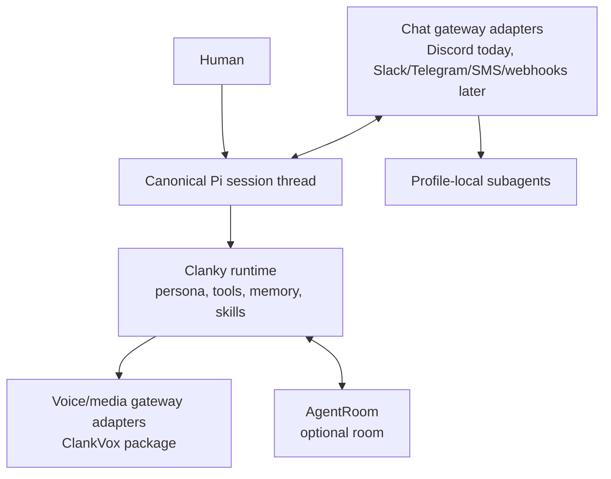

# Communication Gateways

Clanky is not a Discord agent. Clanky is a personal Pi agent with a
communication gateway layer. Discord text and Discord voice are shipped
adapters, but the product model is meant to support other messaging and live
communication surfaces.

## Core Model

The canonical local conversation is still the Pi session thread. External
systems are adapters into or out of that thread, or into profile-local subagents
when side work should not interrupt the foreground session.

## Chat Gateways

A chat gateway can deliver inbound messages, receive replies, and route accepted
side requests to subagents. The built-in chat adapter is agent-owned Discord,
which handles DMs, mentions, replies, optional channel binding, and
model-mediated skip/reply decisions.

Future chat adapters should follow the same shape:

- normalize inbound messages before Clanky sees them
- keep provider credentials in the owning process or profile
- make skip/reply/delegate decisions explicit
- let the main Pi session stay useful while gateway side work runs elsewhere
- avoid making the external platform the source of truth

## Voice And Media Gateways

Voice/media gateways are separate from chat gateways. ClankVox is Clanky's main
voice/media transport package. Discord voice and Go Live run through ClankVox.
They use Clanky's TypeScript control plane, realtime model sessions, speech
output providers, Pi delegation through `ask_pi`, and the native ClankVox media
process.

The same boundary should hold for future Slack huddles, WebRTC calls, or other
live media surfaces: Clanky owns the control plane and profile settings, while a
media adapter owns provider-specific transport.

## Ownership

Gateway ownership is independent from AgentRoom participation:

- **Agent-owned gateway:** Clanky owns the credential and gateway lifecycle for
  its profile. This is the default personal-agent path.
- **Room-owned gateway:** AgentRoom owns the connector and routes the
  conversation into a room channel or lead agent. Clanky can still participate
  in that room as a normal Pi harness.
- **No gateway:** Clanky remains a local Pi agent with memory, skills, and tools.

One external conversation should have exactly one owner. Do not attach the same
conversation to both Clanky and AgentRoom.

## Subagents

Gateway subagents are profile-local Clanky sessions. They are useful for
handling accepted side requests while the foreground TUI keeps working. They are
not AgentRoom workers and they do not create a separate credential boundary.

Use AgentRoom when the work needs a shared room, audited runtime flow, task
shadows, durable handoffs, or multiple independent coding agents.

## Where The Details Live

- [Using Clanky](using-clanky.md): daily chat and voice workflows.
- [AgentRoom Integration](AGENTROOM.md): gateway ownership when Clanky joins a
  room.
- [Memory And Privacy](memory-and-privacy.md): profile-local credential and
  transcript boundaries.
- [Discord Voice Architecture](discord-voice-architecture.md): Discord
  voice/media implementation.
