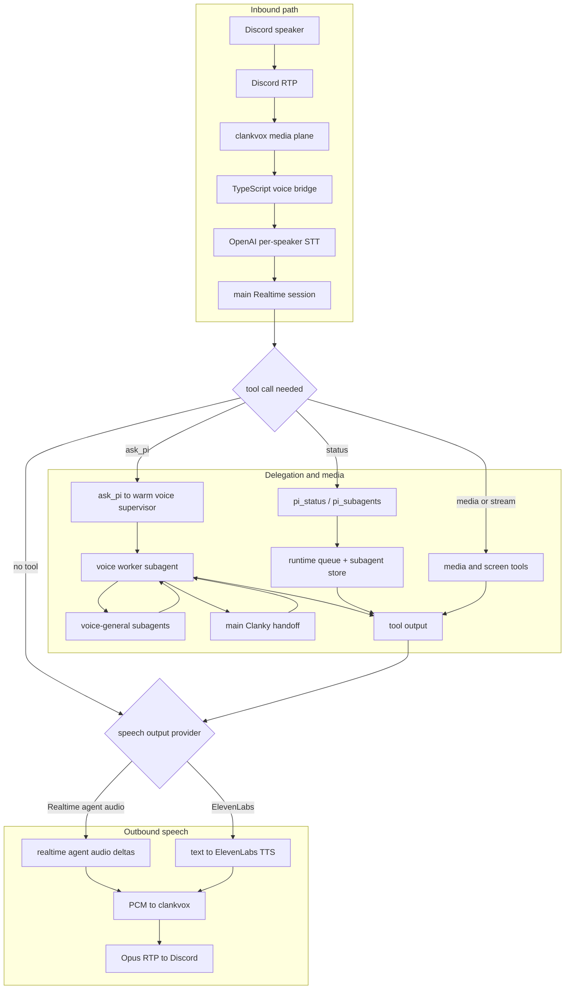

# Discord Voice Architecture

This is the end-to-end map for Clanky's agent-owned Discord voice path. The
important distinction is that Discord voice is not one Pi chat turn. It is a
TypeScript control plane, a Rust Discord media plane, and Pi delegation behind a
live realtime voice agent session. The realtime agent provider can be OpenAI
Realtime or xAI Grok Voice. The speech output provider is only the audio
renderer; it is not the same setting as the realtime reasoning/tool agent.



## Runtime Roles

`agents/clanky/src/discordGatewayController.ts` decides whether Clanky owns the
Discord text client, a voice-only client, or no Discord client. Room-owned
AgentRoom text connectors do not own this voice bridge; voice uses Clanky's
agent-owned Discord credential.

`agents/clanky/src/agentDiscordVoice.ts` is the TypeScript voice orchestrator.
It resolves settings, starts the selected realtime agent client, starts the
OpenAI speaker transcription client, starts `clankvox`, dispatches tools,
handles interruption policy, and records voice subagent context.

`agents/clanky/src/voice/clankvox/` is the Rust media process. It owns Discord
voice transport details: voice gateway connection, RTP/RTCP, DAVE encryption,
Opus encode/decode, screen stream watch/publish, music/video playback, and PCM
IPC to Node.

Pi is downstream of the realtime agent. The voice agent can call `ask_pi`,
which either uses the voice worker subagent coordinator or serializes a prompt
through the main Pi runtime.

xAI Grok Voice supports the live audio/tool agent path but does not currently
receive Discord screen-share image frames in this bridge. OpenAI Realtime
remains the provider for screen-watch snapshot inspection.

## Startup

`createClankyRuntime()` installs the `/discord-voice` slash command and the
model-facing tools `discord_voice_status`, `discord_voice_join`, and
`discord_voice_leave`.

`ClankyDiscordGatewayController.start()` resolves Discord ownership. When text
chat is agent-owned, voice shares that Discord client. When text chat is
suppressed by `CLANKY_CHAT_GATEWAY_OWNER`, voice can still create a voice-only
client with voice-state intents.

`resolveAgentDiscordVoiceConfig()` combines environment variables, stored
profile settings from `discord-voice.json`, stored auth entries, and default
Realtime settings. A fixed guild/channel target starts immediately. A dynamic
configuration starts a handle that can join later through tools or slash
commands.

`AgentDiscordVoiceBridge.start()` connects the pieces: stream discovery,
Realtime response session, `clankvox` IPC, per-speaker transcription manager,
tool handlers, optional ElevenLabs client, and voice worker recording. When a
subagent runtime factory is available, it also prewarms the voice worker so the
first `ask_pi` turn does not pay the worker creation cost.

## Inbound Audio

Discord audio does not go directly into the main Realtime response session.
`clankvox` receives encrypted Discord RTP, decrypts it, decodes Opus, tracks
speakers, and emits per-user PCM frames to Node over IPC.

For each active Discord speaker,
`discordVoiceSpeakerTranscription.ts` opens an individual OpenAI Realtime
transcription session. Final transcripts are labeled with the Discord user and
batched by `CLANKY_DISCORD_VOICE_TRANSCRIPT_RESPONSE_BATCH_DELAY_MS` before
being inserted as text turns into the main Realtime response session.

That design keeps speaker attribution outside the model guesswork and avoids
feeding a mixed room audio stream into the response session.

## Response Audio

The main Realtime session is the live voice brain. It receives labeled text
turns, can call tools, and creates responses.

In the default speech path, Realtime emits PCM audio deltas. TypeScript forwards
those deltas to `clankvox`, which resamples as needed, encodes Opus frames, and
sends Discord voice RTP.

In ElevenLabs mode, Realtime output modality is text. TypeScript accumulates
the response text, streams it through ElevenLabs TTS, and sends the returned
PCM to `clankvox` for the same Discord playback path.

## Tools And Pi Delegation

Realtime tool calls are handled in `agentDiscordVoice.ts`. The dispatcher
normalizes streaming and completed function-call events, dedupes call ids,
executes the local handler, sends the function output back to Realtime, and
then asks Realtime to continue the response.

The core work tool is `ask_pi`. It passes the voice context to Pi for longer
reasoning, repo-aware work, skills, and normal Clanky tool use. If a voice
worker subagent is configured, `ask_pi` goes through the always-warm voice
supervisor in `discordVoiceSubagentCoordinator.ts`; otherwise it uses the main
runtime through a serial queue so voice requests do not race each other.

The voice supervisor is a real Clanky subagent: it uses the same runtime
factory shape as the main agent, with the subagent effort default. Its context
explicitly says that it is below the main foreground Clanky agent, that the
main agent owns the user's primary window, AgentRoom/tmux authority, and final
foreground coordination, and that the realtime voice agent owns live speech and
media.

Only the voice supervisor gets the privileged `voice_delegate_to_subagent`
tool. That tool runs a `voice-general` subagent for bounded helper work. Those
general workers get normal Clanky tools, skills, memory, `main_session_context`,
`subagent_status`, and `delegate_to_main_worker`, but they do not receive the
child-spawn tool. Ordinary Discord text subagents also do not receive it.

The realtime voice agent does not mirror every tool that the main Pi agent can use.
That would duplicate authorization, tool schemas, and runtime policy in the
low-latency Realtime session. Instead, voice has a small control surface:

- `ask_pi` delegates work to the Pi layer.
- `pi_status` reports the main runtime queue, current voice bridge state, and
  a concise subagent summary.
- `pi_subagents` lists tracked subagents and workers, with filters for kind,
  state, stale entries, and result limit.

Those status tools read the same runtime queue and `DiscordSubagentStore` that
the text gateway and subagent coordinator already use. They are meant for
questions like "what is the main agent doing?", "is the voice worker busy?",
or "did a subagent fail?" without creating a new Pi turn just to inspect local
state.

Media tools are intentionally URL-first:

- `play_music_url`
- `play_video_url`
- `start_music_visualizer`
- `media_pause`
- `media_resume`
- `media_stop`
- `media_status`

Search, selection, and higher-level media decisions should happen through
`ask_pi`; the media tools only play resolved URLs.

## Screen Share And Go Live

`discordStreamDiscovery.ts` watches raw Discord gateway stream events and sends
the native stream opcodes needed to watch, stop watching, publish, pause, or
delete streams. TypeScript forwards stream metadata to `clankvox`, which owns
the Discord voice/video media details.

Bot tokens are enough for normal voice audio and music playback. Native screen
watch and Go Live publish depend on Discord user-token behavior and should be
treated as live-gated.

## Floor Control

The bridge tracks when Clanky is speaking through Realtime output duration,
pending playback buffer depth, and active external TTS. While Clanky is
speaking, ordinary speaker transcripts are recorded but not forwarded to the
response session.

Addressed wake-name transcripts interrupt. Saying `Clanky`, `clank`, or a
configured alias stops playback, cancels the active Realtime response, and
forwards the transcript so the model can answer the interruption.

## Operational Checks

Use `docs/discord-voice-live-runbook.md` for live verification. The important
counters prove separate parts of the bridge:

- Discord join and input audio prove the gateway and `clankvox` capture path.
- Realtime session acceptance proves model connectivity and configuration.
- Output audio proves the selected speech output provider and Discord playback path.
- Tool-call and `ask_pi` counters prove Realtime-to-Pi delegation.
- Stream and media counters prove native Go Live or media playback behavior.

Non-live checks are still useful before credentials are involved:

```bash
pnpm check
pnpm smoke:voice
pnpm voice:native:check
pnpm voice:build
```

## Source Map

- TypeScript orchestrator: `agents/clanky/src/agentDiscordVoice.ts`
- Discord ownership: `agents/clanky/src/discordGatewayController.ts`
- Voice settings: `agents/clanky/src/discordVoiceSettings.ts`
- Realtime adapter: `agents/clanky/src/voice/openAiRealtimeClient.ts`
- Per-speaker STT: `agents/clanky/src/voice/discordVoiceSpeakerTranscription.ts`
- Rust IPC client: `agents/clanky/src/voice/clankvoxIpcClient.ts`
- Rust media process: `agents/clanky/src/voice/clankvox/src/main.rs`
- Rust voice/audio pipeline:
  `agents/clanky/src/voice/clankvox/docs/audio-pipeline.md`
- Rust Go Live details: `agents/clanky/src/voice/clankvox/docs/go-live.md`
