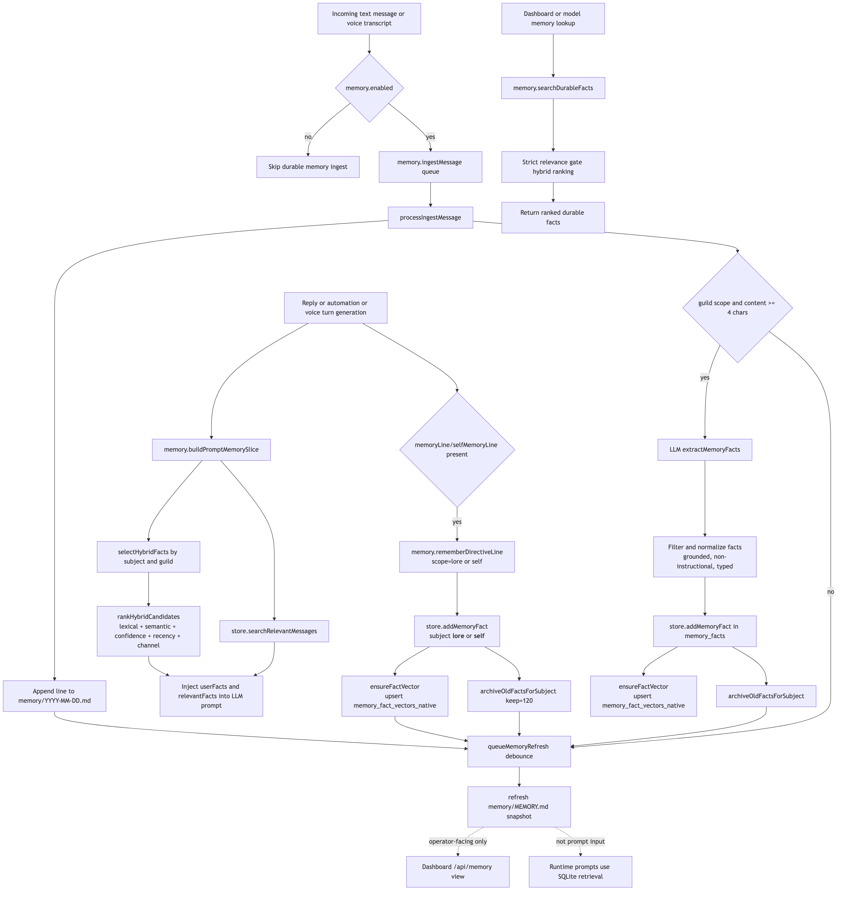

# Memory System (Source of Truth)

This document describes how durable memory works in runtime, based on current code behavior.

## Scope

Durable memory has three layers:

1. **Daily journals** (`memory/YYYY-MM-DD.md`): append-only logs of ingested user text, bot-authored text outputs, and voice transcripts. Raw material.
2. **Daily reflection**: an LLM pass that reviews each day's journal and distills it into durable facts. The bridge between raw logs and long-term memory.
3. **SQLite facts + vectors** (`memory_facts`, `memory_fact_vectors_native`): the durable knowledge base used by runtime retrieval and prompts.

Additionally, `memory/MEMORY.md` is a periodically regenerated snapshot for operator/dashboard inspection — not consumed by the model.

This is only the durable-fact memory system. Two adjacent persistence layers now sit beside it:

1. **Conversation history** (`messages` table): saved text chat, saved voice transcripts, and saved assistant spoken turns. Queried through `conversation_search` for “what did we say earlier?” continuity.
2. **Adaptive directives** (`adaptive_style_notes`, `adaptive_style_note_events`): persistent server-level instructions about how the bot should talk or act in future conversations. Queried separately from durable facts so style/behavior guidance does not pollute `memory_facts`.

## Flow Diagram

<!-- source: docs/diagrams/memory-system-flow.mmd -->

## Key Files

- `src/memory/memoryManager.ts`: ingestion queue, daily journaling, daily reflection job, directive writes (`rememberDirectiveLine`), fact profile loading (`loadUserFactProfile`), on-demand hybrid retrieval/ranking (`searchDurableFacts`), markdown refresh.
- `src/memory/memoryHelpers.ts`: fact normalization, grounding checks, scoring helpers, directive scope config.
- `src/memory/dailyReflection.ts`: end-of-day reflection logic — reads daily journal, runs LLM distillation, writes durable facts.
- `src/store/store.ts`: `memory_facts` and `memory_fact_vectors_native` schema + query/update methods.
- `src/store/storeAdaptiveDirectives.ts`: adaptive directive storage, prompt-time retrieval, and audit-log helpers.
- `src/llm.ts`: embedding API calls, reflection LLM calls.
- `src/tools/replyTools.ts`: `memory_write` and `memory_search` tool definitions + execution handlers (used by text chat brain).
- `src/voice/voiceToolCallMemory.ts`: `memory_search` and `memory_write` voice tool execution handlers.
- `src/voice/voiceToolCallDirectives.ts`: adaptive-directive voice tool execution handlers.
- `src/voice/voiceToolCalls.ts`: re-export facade for the above modules.
- `src/bot.ts`: message ingest trigger, reflection job scheduling.
- `src/bot/voiceReplies.ts` and `src/voice/voiceSessionManager.ts`: voice transcript ingestion + session-level fact profile caching.
- `src/dashboard.ts`: `/api/memory`, `/api/memory/refresh`, `/api/memory/search`.

## Data Model

### `memory_facts` (durable facts)

Created in `Store.init()` (`src/store/store.ts`) with key fields:

- `guild_id` (required): primary scope boundary.
- `channel_id` (optional): retrieval bias, not hard partitioning.
- `subject` (required): user ID for user facts, `__lore__` for lore facts, or `__self__` for durable bot self-memory.
- `fact`, `fact_type`, `evidence_text`, `source_message_id`, `confidence`.
- `is_active`: soft archive flag.
- `UNIQUE(guild_id, subject, fact)`: dedup/upsert key.

### `memory_fact_vectors_native` (semantic vectors)

- Primary key: `(fact_id, model)`.
- Stores `dims` and `embedding_blob` (Float32 blob).
- Queried with sqlite-vec cosine similarity (`1 - vec_distance_cosine(...)`).

## Runtime Lifecycle

### Startup and periodic maintenance

- `src/app.ts` initializes `MemoryManager` and calls `refreshMemoryMarkdown()` once at startup.
- `src/bot.ts` starts a 5-minute timer calling `refreshMemoryMarkdown()`.
- `src/bot.ts` starts the daily reflection scheduler (checks if reflection is due on each tick).
- On shutdown, bot drains pending ingest jobs (`drainIngestQueue`) before exit.

### Message ingest pipeline (text chat)

Text-side journaling now captures both the incoming user side and the bot-authored output side when `settings.memory.enabled` is true:

1. **Incoming user text**: `ClankerBot.handleMessage()` calls `memory.ingestMessage(...)`.
2. **Outgoing bot text**:
   - `src/bot/replyPipeline.ts` journals normal text replies after the send succeeds.
   - `src/bot/automationEngine.ts` journals automation posts after publish.
   - `src/bot/discoveryEngine.ts` journals discovery posts after publish.
3. All of those calls queue a job keyed by `messageId`.
4. Queue behavior:
   - Dedupes concurrent same-message jobs by returning one shared promise.
   - Max queue length is `400`; overflow drops the oldest job and resolves it as `false`.
5. Worker runs `processIngestMessage(...)` sequentially:
   - Cleans content (trim/collapse, max 320 chars; empty/too short dropped).
   - Appends one line to `memory/YYYY-MM-DD.md`.
   - Schedules markdown refresh (`queueMemoryRefresh`, debounced by `pendingWrite` + 1s delay).

Note: `processIngestMessage` does **not** perform automatic fact extraction. Durable facts are only created through explicit `memory_write` tool calls (see below).

### Message ingest pipeline (voice transcripts)

Voice paths also feed durable memory using synthetic message IDs:

- **User speech**: `src/voice/voiceSessionManager.ts` calls `memory.ingestMessage(...)` via `queueVoiceMemoryIngest()` for user transcripts from both realtime bridge and file-ASR turns.
- **Bot replies**: `src/voice/voiceSessionManager.ts` calls `memory.ingestMessage(...)` in `persistAssistantVoiceTimelineTurn()` so bot-spoken replies also appear in the daily journal.

Both sides of voice conversations are now captured in the daily journal, giving daily reflection the full conversation context.

### Daily reflection

The reflection job is the bridge between raw journal logs and durable memory. It runs once per day (configurable) and reviews the day's journal to decide what's worth remembering long-term.

**How it works:**

1. Job triggers at the configured time (default: end of day, or on a configurable interval).
2. Reads the current day's journal file (`memory/YYYY-MM-DD.md`).
3. Sends the full journal to an LLM with a reflection prompt: "Review this day's conversations. Extract durable facts worth remembering — things about people, ongoing projects, important events, preferences, and recurring topics. Ignore throwaway chatter, greetings, and ephemeral requests."
4. LLM returns structured facts with scope (user/lore/self) and subject attribution.
5. Each fact is written through the same `rememberDirectiveLine` path as `memory_write` tool calls — same grounding checks, same dedup, same archiving.
6. Reflected journals are marked as processed. Journal files are retained indefinitely.

**Why reflection exists alongside `memory_write`:**

Two complementary paths to durable memory:

- **`memory_write` (real-time)**: the brain notices something important mid-conversation and stores it immediately. Fast, but depends on the brain's in-the-moment judgment — things slip through, especially in fast-moving voice sessions.
- **Daily reflection (batch)**: reviews the full day with hindsight. Catches patterns, repeated topics, and facts the brain didn't think to store in real time. Sees the forest, not just the trees.

Both paths produce the same kind of durable facts in `memory_facts`. Reflection just has better context for deciding what matters.

**Settings:**

- `memory.enabled` (default `true`): master switch for durable memory journaling and fact retrieval/write behavior.
- `memory.reflection.enabled` (default `true`): master switch.
- `memory.reflection.hour` / `memory.reflection.minute`: daily reflection schedule time.
- `memory.reflection.maxFactsPerReflection`: cap on facts produced per run (default `20`).
- `directives.enabled` (default `true`): independently enables/disables adaptive directive retrieval and conversational directive save/remove behavior.

### Fact creation via `memory_write` tool

Durable facts are created when the brain decides to call the `memory_write` tool during conversation.

**Tool definition** (`src/tools/replyTools.ts` / `src/memory/memoryToolRuntime.ts`): accepts a `namespace` plus an `items` array, where each item has `text` and optional `type`.

- `namespace = "speaker"` / `user:<id>` → stored under that user's Discord ID as `subject`.
- `namespace = "guild"` / `guild:<guildId>` → stored under subject `__lore__`.
- `namespace = "self"` → stored under subject `__self__`.
- `items[].type` can explicitly preserve `preference`, `profile`, `relationship`, `project`, or `other`.
- If `type` is omitted, the write path falls back to the scope default (`preference` for user facts, `lore` for guild lore, `self` for bot self-memory).

All scopes share: `confidence = 0.72`, grounding check against source text, instruction-like text rejection.

**Structured text reply path**: the text reply schema can also save one direct fact without a tool call by filling `memoryLine + memoryScope + memoryFactType` or `selfMemoryLine + selfMemoryFactType`. The reply pipeline routes those through the same durable-write path as `memory_write`.

**Execution path**: tool call or structured reply directive → `executeMemoryWrite()` / reply pipeline → `memory.rememberDirectiveLineDetailed({ line, scope, subjectOverride, factType, ... })` → `store.addMemoryFact(...)` → async embedding → archive old facts → markdown refresh.

When `memory_write` fires during an active voice session, the affected user's cached fact profile is refreshed on the session object so subsequent turns see the new fact without a full reload.

**Scope config** is resolved by `resolveDirectiveScopeConfig()` in `memoryHelpers.ts`.

This path is used in both text chat (via `replyTools.ts`) and voice chat (via `voiceToolCalls.ts`), where equivalent `memory_write` and `memory_search` tools are registered as OpenAI Realtime function tools.

### Tiered fact storage and eviction

Facts are classified into two durability tiers that control eviction behavior when per-subject caps are reached:

**Core facts** — identity-level, rarely change:
- Inferred from `fact_type`: `profile` and `relationship` facts are core.
- Examples: name, birthday, occupation, family relationships, long-term preferences.
- Evicted last. When the core tier itself fills, a consolidation pass merges/compresses related facts rather than dropping them.
- Separate cap (default 20 per user subject).

**Contextual facts** — situational, expected to rotate:
- All other `fact_type` values: `preference`, `project`, `other`, `lore`.
- Examples: current mood, what game they're playing this week, recent opinions.
- Standard FIFO eviction by `updated_at` — oldest contextual facts are archived first.
- Cap: remaining budget after core facts (e.g., 60 contextual if 20 core out of 80 total).

**Eviction order** in `archiveOldFactsForSubject`:
1. Archive contextual facts beyond the contextual cap (oldest first by `updated_at`).
2. Only if contextual facts are within budget AND total exceeds the subject cap, archive core facts (oldest first).
3. Core facts are never archived to make room for contextual facts.

The LLM already distinguishes fact types at write time (both `memory_write` and daily reflection). The tier is derived from the existing `fact_type` field — no new column needed.

## Safety Guards

Facts written through `memory_write` are filtered in `memory.rememberDirectiveLine()` and `memoryHelpers.ts`:

- Input normalization and length bounds (`normalizeMemoryLineInput`).
- Fact type normalization (`preference|profile|relationship|project|other`; `general` collapses to `other`; scope defaults preserve `lore` / `self` for those buckets).
- Instruction/prompt-injection-like text rejection (`isInstructionLikeFactText` — rejects `system`, `developer`, `ignore previous`, secrets, etc.).
- Grounding requirement (`isTextGroundedInSource`):
  - Exact compact-substring pass, or
  - token-overlap threshold (about 45% minimum, with short-line special case).

If embedding fails, errors are logged and the fact is still stored (embedding backfill happens on next retrieval query).

## Embeddings

Embeddings are used for semantic ranking in on-demand `memory_search` tool calls and dashboard search.

- Query embedding: `llm.embedText(...)` when query length >= 3 and OpenAI client exists.
- Fact embedding payload includes `type`, `fact`, and optional `evidence`.
- Model resolution order:
  1. `settings.memory.embeddingModel`
  2. `appConfig.defaultMemoryEmbeddingModel` (`DEFAULT_MEMORY_EMBEDDING_MODEL` env)
  3. fallback `"text-embedding-3-small"`

If vectors are missing for some candidates, retrieval backfills up to 8 missing fact vectors per query.

Fact embeddings are generated at write time for use by `memory_search` queries.

## Retrieval and Ranking

### Fact profile retrieval (`loadUserFactProfile`)

For prompt injection, facts are loaded as **fact profiles** — lightweight SQLite-only queries with no embedding API calls. Profiles are cached at the session level (voice) or loaded per-turn (text chat).

**How it works:**

1. Query `memory_facts` for the user's active facts (`subject = userId, is_active = 1`), ordered by `confidence DESC, updated_at DESC`.
2. Query `memory_facts` for bot self-facts (`subject = "__self__"`) and guild lore (`subject = "__lore__"`), same ordering.
3. Return structured profile with core vs contextual facts separated (see Tiered Fact Storage below).
4. No embedding call, no semantic ranking. Pure SQLite, sub-millisecond.

**Session-level caching (voice):**

- When a user joins the voice channel, their fact profile is loaded and stored on `session.factProfiles[userId]`.
- When a user leaves, their profile is removed from the cache.
- When `memory_write` fires during a session, the affected user's cached profile is refreshed.
- Instruction rebuilds (realtime mode) and turn generation (STT mode) pull from the cached profiles.
- Lore and self-facts are loaded once at session start and refreshed on `memory_write`.

**Per-turn loading (text chat / automation):**

- Text replies and automation runs load fact profiles fresh per-turn via `loadConversationContinuityContext`.
- This is still fast (SQLite-only) so per-turn loading is acceptable outside voice.

**Consumers:**

- Text replies (`src/bot/replyPipeline.ts`)
- Automation runs (`src/bot/automationEngine.ts`)
- Voice turn generation (`src/bot/voiceReplies.ts`)
- Voice realtime instruction context (`src/voice/instructionManager.ts`)

### On-demand search via `memory_search` tool

For targeted, context-aware memory lookup the model calls the `memory_search` tool. This is where semantic ranking (embeddings + cosine similarity) earns its keep — the model writes a purposeful query, not a raw transcript.

- Used by the brain mid-conversation when it needs specific facts ("what do I know about this person's job?")
- Uses `searchDurableFacts` which performs full hybrid ranking with embedding.
- Also powers dashboard search and reply followup memory lookups.

### Search API retrieval (`searchDurableFacts`)

For on-demand model-triggered and dashboard memory lookup:

- Pulls guild-scoped active facts (`getFactsForScope`), with optional `subjectIds` and `factTypes` prefilters when the caller already knows the namespace or desired fact tags.
- Hybrid ranking with strict relevance gate enabled.
- Returns top N (limit clamped to 1..24).

### Hybrid score formula (used by `searchDurableFacts` only)

Per candidate:

- `lexicalScore`: token overlap / substring match on fact + evidence text.
- `semanticScore`: cosine similarity from sqlite-vec.
- `confidenceScore`: stored confidence.
- `recencyScore`: `1 / (1 + ageDays / 45)`.
- `channelScore`:
  - `1` same channel,
  - `0.25` fact has no channel_id,
  - `0` different channel.

Combined score:

- If semantic available:
  - `0.50 * semantic + 0.28 * lexical + 0.10 * confidence + 0.07 * recency + 0.05 * channel`
- If semantic unavailable:
  - `0.75 * lexical + 0.10 * confidence + 0.10 * recency + 0.05 * channel`

Relevance gate:

- With semantic: pass if semantic/lexical minimums are met, or strong combined score with minimum signal.
- Without semantic: requires lexical >= 0.24 or combined >= 0.62.
- Strict mode (`searchDurableFacts`) returns no hits if all candidates fail gate.

## Adaptive Directives vs Durable Memory

Adaptive directives are intentionally not stored in `memory_facts`.

- `memory_facts`: durable facts about users, the bot, or guild lore
- `messages`: prior text/voice conversation history
- `adaptive_style_notes`: persistent instructions about how the bot should talk or act later

Examples:
- Durable memory: `James likes Nvidia.`
- Conversation history: `Two days ago we talked about NVDA being around $181.`
- Adaptive directive: `Use "type shit" occasionally in casual replies.` or `Send a GIF to Tiny Conk whenever they say "what the heli."`

Adaptive directives are split into:
- `guidance`: broad style/tone/persona/operating guidance, which can stay lightly active across turns
- `behavior`: recurring trigger/action behavior, which is retrieved into prompt context only when the current turn appears relevant

That retrieval split is what keeps behavior directives useful without bloating every prompt with every saved action rule.

## Markdown Files in `memory/`

### Daily logs: `memory/YYYY-MM-DD.md`

- Append-only journal lines: timestamp, author, and scoped message text.
- Header is initialized once per day/file.
- Consumed by the daily reflection job to produce durable facts.
- Retained indefinitely (no automatic pruning).

### Snapshot: `memory/MEMORY.md`

Generated by `refreshMemoryMarkdown()` with sections:

- People (durable facts by subject)
- Bot self memory (subject `__self__`)
- Ongoing lore (subject `__lore__`)
- Recent journal highlights
- Source daily logs

Used for dashboard/operator inspection, not direct model context.

## Settings and Controls

From defaults + normalization:

- `memory.enabled` (default `true`)
- `memory.promptSlice.maxRecentMessages` (default `35`, clamped `4..120`)
  Note: this controls short-term chat context windows, not durable fact count.
- `memory.embeddingModel` (default `"text-embedding-3-small"`)
- `memory.reflection.enabled` (default `true`): enable/disable daily reflection.
- `memory.reflection.hour` / `memory.reflection.minute`: daily reflection schedule time.
- `memory.reflection.maxFactsPerReflection` (default `20`): cap on facts per reflection run.
- `directives.enabled` (default `true`): toggle adaptive directive retrieval/write behavior separately from durable memory.
- `memoryLlm` provider/model config controls the model used for reflection and tool-triggered operations.

## APIs and Observability

Dashboard API:

- `GET /api/memory`: returns snapshot markdown content.
- `POST /api/memory/refresh`: regenerates and returns snapshot.
- `GET /api/memory/search?q=...&guildId=...&channelId=...&limit=...`: hybrid durable fact search (uses `searchDurableFacts` with full semantic ranking).
- `GET /api/memory/fact-profile`: structured fact profile for a guild/user.
- `GET /api/memory/facts`: list/filter raw facts.
- `GET /api/memory/subjects`: list subjects with fact counts.
- `GET /api/memory/reflections`: list reflection run history.
- `GET /api/memory/adaptive-directives`: list active adaptive directives for a guild.
- `GET /api/memory/adaptive-directives/audit`: list directive audit events for a guild.

Action log kinds used by memory pipeline:

- `memory_fact`
- `memory_reflection_start`, `memory_reflection_complete`, `memory_reflection_error`
- `memory_embedding_call`, `memory_embedding_error`
- `memory_log_prune`
- plus `bot_error`/`voice_error` entries for pipeline failures.

## Practical Notes

- Durable memory is always guild-scoped. Facts never cross guild boundaries.
- Channel scope is a ranking hint, not a hard filter.
- Archiving is soft (`is_active = 0`), not hard delete.
- Pre-turn prompt injection uses SQLite-only fact profiles (no embedding API calls). Semantic ranking (embeddings + cosine similarity) is reserved for on-demand `memory_search` tool calls.
- Voice sessions cache fact profiles per-user; text chat loads them fresh per-turn (still fast since it's SQLite-only).
- The canonical source for runtime memory behavior is `src/memory/memoryManager.ts` + `src/store/store.ts`; docs should be updated if those files change.
