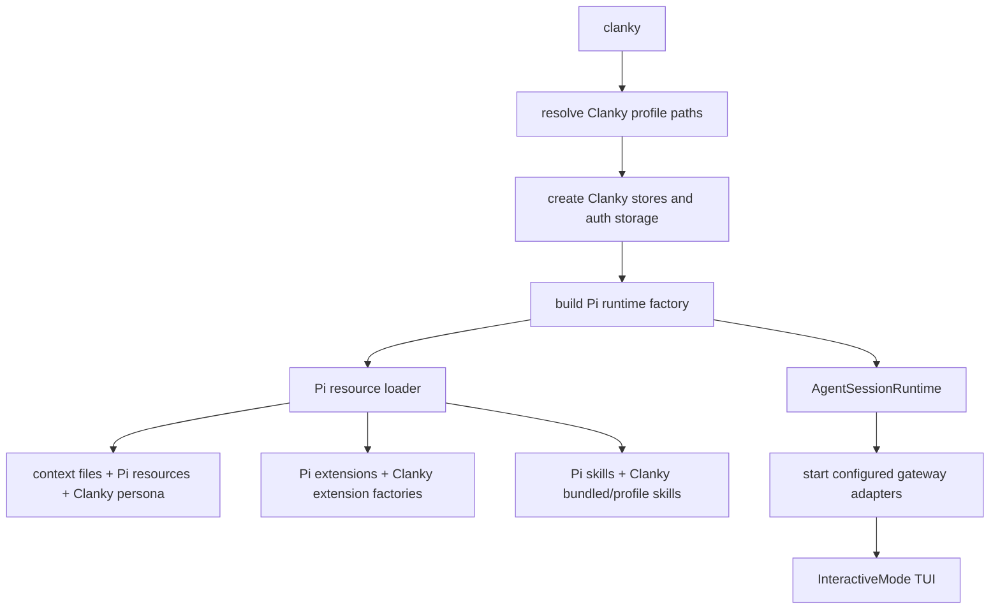

# Pi Foundation

The [Pi](https://pi.dev) foundation is the core concept behind Clanky. Clanky
is not a custom chat server with a Pi-like UI. It is a Pi runtime with
Clanky-specific resources injected into it.

In code, `agents/clanky/src/runClanky.ts` creates a Pi `AgentSessionRuntime`
with `createAgentSessionRuntime()`, then hands that runtime to
`InteractiveMode`. The runtime factory uses Pi's session services, model
registry, settings manager, resource loader, extension system, and tool
definition path.

## What Pi Owns

Pi provides the generic agent harness:

- Interactive TUI through `InteractiveMode`.
- Session lifecycle through `AgentSessionRuntime` and `SessionManager`.
- Built-in coding tools: `read`, `bash`, `edit`, and `write`.
- Optional read-only tools: `grep`, `find`, and `ls`.
- Model registry, settings, provider auth, thinking levels, and model switching.
- Context-file discovery from `AGENTS.md` or `CLAUDE.md`.
- Slash command infrastructure.
- Extension loading and extension APIs.
- Skill discovery and progressive skill loading.
- Session tree navigation, resume, fork, clone, compaction, export, and share.

Clanky users see these systems directly. When you use `/resume`, `/tree`,
`/compact`, `/model`, `/settings`, `/reload`, or `/hotkeys`, you are using Pi
behavior.

For the upstream harness docs, see the [Pi documentation](https://pi.dev/docs/latest),
especially [Using Pi](https://pi.dev/docs/latest/usage) for day-to-day TUI
behavior and [SDK](https://pi.dev/docs/latest/sdk) for the runtime APIs Clanky
embeds.

## What Clanky Adds

Clanky configures Pi for a personal agent:

- Persona markdown from `agents/clanky/persona/SELF.md`.
- Profile paths under `~/.clanky` by default.
- Profile auth storage for OpenAI, gateway, xAI, and ElevenLabs credentials.
- Clanky memory, profile status, skills, work-tracker refs, and subagent stores.
- Bundled Clanky skills plus profile-local Clanky skills.
- Chat gateway ownership, profile-local gateway subagents, and Discord operator
  tools for the Discord adapter.
- Voice/media gateway settings, voice logs, and realtime voice-agent handoff to
  Pi, with Discord voice implemented by the ClankVox adapter.
- OpenAI web search and OpenAI/xAI media generation tools.
- External MCP status/list/call tools.
- Setup, auth, effort, profile, memory, web, media, subagent, Discord, and voice
  slash commands.

The Clanky runtime uses Pi's `systemPromptOverride` to append the Clanky persona.
If an external gateway identity is stored in the active profile, that identity
is appended to the startup prompt as well. It also uses Pi's `skillsOverride` to
merge bundled/profile Clanky skills with Pi-discovered skills.

Clanky's built-in messaging is still Pi's session thread. Discord text,
AgentRoom send/read, and future Slack, Telegram, SMS, webhook, or huddle-style
integrations are gateways into or out of that thread; they do not replace the
native session model.

## Runtime Flow



Every new, resumed, forked, cloned, or imported session goes through the same
runtime factory. That keeps Clanky identity, stores, skills, auth, and extension
wiring consistent across Pi session replacement.

## State Locations

Pi normally stores global agent state under `~/.pi/agent`. Clanky deliberately
uses its own home and profile layout instead:

```text
~/.clanky/
  .profile
  .token
  skills/
  profiles/
    <profile>/
      auth.json
      models.json
      sessions/
      skills/
      memory/
      SELF.md
      work-trackers/
      subagents/
      index.db
      discord-voice.json
      discord-bridge.log
      discord-voice.log
```

Use `--home <dir>` to move the whole Clanky home and `--profile <name>` to pick
the active profile. `CLANKY_HOME` and `CLANKY_PROFILE` provide the same choices
from the environment.

Clanky still loads project context files from the working directory, because
that behavior belongs to Pi. A project `AGENTS.md` or `CLAUDE.md` can therefore
guide Clanky just like it guides Pi.

## Pi Commands That Matter In Clanky

| Command | Why it still matters |
| --- | --- |
| `/login`, `/logout` | Pi provider auth path for subscription/API-key providers. Clanky also has `/openai-login` and `/auth remove <provider>` for profile-local API keys. |
| `/model` | Switch the current model. Clanky defaults to `openai/gpt-5.5`. |
| `/settings` | Change thinking, theme, message delivery, and transport settings. |
| `/resume`, `/new`, `/session` | Manage Pi session files stored in the active Clanky profile. |
| `/tree`, `/fork`, `/clone` | Branch or duplicate the current session using Pi's session tree. |
| `/compact` | Summarize old context when a session gets large. |
| `/reload` | Reload context files, skills, prompts, themes, and extensions. |
| `/hotkeys` | Show keyboard shortcuts for the Pi TUI. |
| `/export`, `/share` | Export or share the active Pi session. |

## Tools Boundary

Pi's built-in tools cover local repo work. Clanky's model-facing tools add
personal-agent capabilities:

- Memory: `memory_remember`, `memory_search`, `memory_forget`.
- Web and media: `web_search`, `web_backend_status`,
  `openai_image_generate`, `xai_image_generate`, `xai_video_generate`,
  `media_backend_status`.
- Discord adapter: guild/channel/message/media/send/reaction tools.
- Voice gateway tools: `discord_voice_status`, `discord_voice_join`,
  `discord_voice_leave` for the Discord voice adapter.
- Coordination: `main_session_context`, `delegate_to_main_worker`,
  `subagent_status`.
- Work trackers and MCP: `work_tracker_link`, `mcp_list_tools`, `mcp_call`.
  Tracker-specific creation, comments, and status updates go through installed
  MCP servers, CLIs, or skills.

The user usually does not call model-facing tools directly. They become
available to the model when Clanky decides they match the request and the
required credentials are configured.
