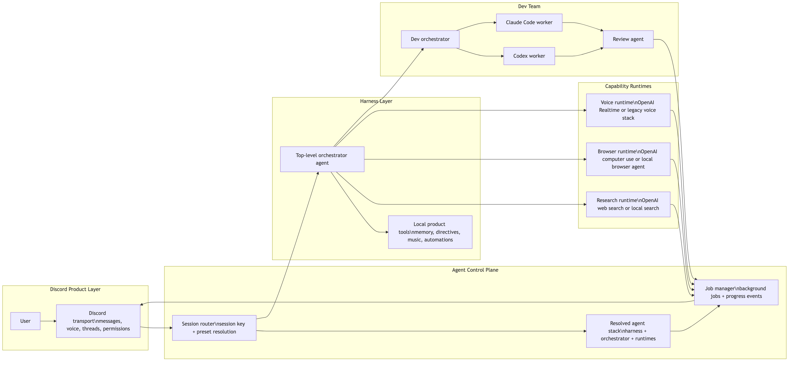

# Preset-Driven Agent Stack Spec

This document specifies a target architecture for shifting Clanker Conk toward a preset-driven agent stack.

The architecture itself is not OpenAI-native. It is modular, capability-routed, and provider-aware.

`openai_native` is one preset inside this architecture. Other presets can resolve different orchestrators, capability runtimes, and worker stacks without changing the product surface.

The core idea is to separate:

- agent harness/orchestration
- model provider
- capability runtimes
- specialist worker runtimes

That separation allows a simple preset such as `openai_native` while still supporting mixed stacks like "Anthropic orchestrator, OpenAI hosted tools, Codex and Claude Code workers."



<!-- source: docs/diagrams/preset-driven-agent-stack.mmd -->

## 1. Goals

- Make OpenAI the easiest and most capable default preset for text, search, browser/computer use, voice, and dev-task orchestration.
- Preserve modularity by abstracting at the runtime and capability layer instead of pretending all providers expose the same native features.
- Keep Discord-specific product logic local: permissions, rate limits, message/session routing, memory, music, automations, dashboard state, and observability.
- Support a real "dev team" architecture where Clanker delegates coding work to Codex and Claude Code workers through an orchestrator.
- Reduce current settings sprawl by replacing low-level provider toggles with opinionated presets plus advanced overrides.
- Avoid legacy compatibility paths after each migration phase stabilizes.

## 2. Non-Goals

- This spec does not replace Discord transport, storage, memory, or music subsystems.
- This spec does not require rewriting low-level Discord voice transport around the OpenAI Agents SDK.
- This spec does not require every provider to support every OpenAI-native feature.
- This spec does not preserve the full current multi-provider matrix indefinitely.

## 3. Problem Statement

Today the runtime already has strong tool and sub-agent concepts, but the primary architecture is still organized around low-level provider abstraction:

- main conversational LLM provider
- follow-up LLM provider
- voice generation provider
- voice reply-decision provider
- transcriber provider
- search provider order
- browser agent provider
- code agent provider

This creates several issues:

- provider choice leaks into too many settings and runtime branches
- native capabilities such as OpenAI `web_search`, computer use, background jobs, and handoffs are harder to adopt cleanly
- tool orchestration and provider routing are entangled
- Discord bot logic remains the de facto control plane instead of a transport into a clearer agent runtime

## 4. Design Principles

### 4.1 Capability-Based Abstraction

Abstractions should sit around capabilities, not vendors.

Good abstraction:

- `researchRuntime`
- `browserRuntime`
- `voiceRuntime`
- `devOrchestratorRuntime`
- `codingWorkerRuntime`

Bad abstraction:

- one giant `provider` field that tries to imply search, browser, coding, and voice behavior

### 4.2 Presets First, Overrides Second

The primary UX should be a preset selector. Advanced users can override individual runtimes later.

### 4.3 OpenAI-Native Is A Preset, Not The Architecture

`openai_native` is not just model selection. It is a named preset that implies use of OpenAI-hosted capabilities where they are meaningfully better:

- Responses or Agents SDK orchestration
- native `web_search`
- computer use for interactive browser/UI work
- Realtime voice
- GPT-5.4 orchestrator behavior for dev work

### 4.4 Specialist Workers Stay Specialized

Codex and Claude Code remain worker runtimes, not default chat-brain providers.

### 4.5 Product Logic Stays Local

Discord context, memory policy, adaptive directives, channel permissions, automations, music state, and logs remain local responsibilities.

## 5. Terminology

### 5.1 Harness

The runner that manages agent state, tool invocation, handoffs, tracing, and background execution.

Examples:

- internal Clanker loop
- OpenAI Agents SDK

### 5.2 Model Provider

The model backend used by the orchestrator or a worker.

Examples:

- OpenAI
- Anthropic
- AI SDK Anthropic adapter
- LiteLLM proxy

### 5.3 Capability Runtime

The implementation behind a capability exposed to the orchestrator.

Examples:

- native OpenAI web search
- local Brave/SerpApi search service
- OpenAI computer use
- local browser agent

### 5.4 Worker Runtime

A specialist runtime that performs delegated work.

Examples:

- Codex
- Claude Code

## 6. Target Presets

### 6.1 `openai_native`

Default OpenAI-first preset.

| Layer | Runtime |
|---|---|
| Harness | OpenAI Agents SDK or Responses-native runtime |
| Orchestrator model | OpenAI GPT-5.4 |
| Research | OpenAI native `web_search` |
| Browser/UI ops | OpenAI computer use |
| Voice | OpenAI Realtime |
| Voice admission | `adaptive` policy with optional classifier gate |
| Dev orchestrator | GPT-5.4 |
| Dev design | Claude Code |
| Dev implementation | Codex |
| Dev review | Claude Code |
| Dev research | inherit orchestrator |

### 6.2 `anthropic_brain_openai_tools`

Anthropic provides the actual orchestrator model, but OpenAI still provides selected hosted capabilities.

| Layer | Runtime |
|---|---|
| Harness | OpenAI Agents SDK or internal runtime |
| Orchestrator model | Anthropic model via AI SDK adapter or LiteLLM |
| Research | Bridged OpenAI web-search sub-agent |
| Browser/UI ops | Bridged OpenAI operator sub-agent |
| Voice | OpenAI Realtime or legacy voice stack |
| Voice admission | `adaptive` or `classifier_gate`, configurable |
| Dev orchestrator | Anthropic or OpenAI, configurable |
| Dev design | Claude Code |
| Dev implementation | Claude Code primary, Codex parallel |
| Dev review | Claude Code |
| Dev research | inherit orchestrator |

Important constraint:

- OpenAI native hosted tools are only directly available when the active orchestrator is an OpenAI model in the OpenAI tool loop.
- When the orchestrator is non-OpenAI, OpenAI-native capabilities must be exposed through local bridge tools that call OpenAI sub-runtimes.

### 6.3 `claude_code_max`

Persistent Claude Code Max session as the primary brain. OpenAI provides voice transport and TTS only. All reasoning, research, and dev work runs through a single long-running Claude Code process powered by a Max subscription.

| Layer | Runtime |
|---|---|
| Harness | Persistent Claude Code session (`claude_code_session`) |
| Text brain | Claude Code session (full tool access) |
| Voice brain | Claude Code session (fast-only tool policy) |
| Voice transport | OpenAI Realtime (audio in/out, ASR, TTS) |
| Voice admission | `adaptive` policy, classifier runs inside Claude Code session |
| Research | Claude Code session (codebase tools, web fetch, shell) |
| Browser/UI ops | Claude Code session or bridged OpenAI computer use |
| Dev orchestrator | Claude Code session |
| Dev design | Claude Code session |
| Dev implementation | Claude Code session or Codex for parallel bulk work |
| Dev review | Claude Code session |
| Dev research | Claude Code session |

Key properties:

- One persistent process per guild or session scope, not spawned per request.
- The session accumulates conversational context over time, similar to an OpenAI Realtime session.
- Tool availability varies by turn type: voice turns use `fast_only` policy (no multi-file reads mid-utterance), text turns use `full` policy.
- The only OpenAI API cost is voice transport (Realtime audio, ASR, TTS). All reasoning is covered by the Max subscription.
- Context window management is required: the session must prune or summarize history as it approaches limits.

Cost model:

- Fixed: Claude Code Max subscription (unlimited usage)
- Variable: OpenAI Realtime audio transport only
- Eliminates per-token API billing for text responses, voice brain, classifier, thought engine, memory extraction, research, and dev tasks

### 6.4 `multi_provider_legacy`

Current architecture preserved during migration.

### 6.5 `custom`

Advanced per-runtime override mode.

## 7. Runtime Stack Model

The runtime must explicitly model four independent choices:

```ts
type AgentHarnessKind = "internal" | "openai_agents" | "claude_code_session";

type ModelProviderKind =
  | "openai"
  | "anthropic"
  | "ai_sdk_anthropic"
  | "litellm"
  | "claude_code_session";

type ResearchRuntimeKind =
  | "openai_native_web_search"
  | "local_external_search";

type BrowserRuntimeKind =
  | "openai_computer_use"
  | "local_browser_agent";

type VoiceRuntimeKind =
  | "openai_realtime"
  | "legacy_voice_stack";

type VoiceAdmissionPolicyMode =
  | "deterministic_only"
  | "classifier_gate"
  | "generation_decides"
  | "adaptive";

type CodingWorkerRuntimeKind =
  | "codex"
  | "claude_code";
```

Top-level resolved stack:

```ts
type AgentSessionToolPolicy = "none" | "fast_only" | "full";

interface AgentSessionPolicy {
  persistent: boolean;
  toolPolicy: {
    voice: AgentSessionToolPolicy;
    text: AgentSessionToolPolicy;
  };
}

interface ResolvedAgentStack {
  preset: "openai_native" | "anthropic_brain_openai_tools" | "claude_code_max" | "multi_provider_legacy" | "custom";
  harness: AgentHarnessKind;
  sessionPolicy?: AgentSessionPolicy;
  orchestrator: {
    provider: ModelProviderKind;
    model: string;
  };
  researchRuntime: ResearchRuntimeKind;
  browserRuntime: BrowserRuntimeKind;
  voiceRuntime: VoiceRuntimeKind;
  voiceAdmissionPolicy: {
    mode: VoiceAdmissionPolicyMode;
    classifierProvider?: ModelProviderKind;
    classifierModel?: string;
    musicWakeLatchSeconds?: number;
  };
  devTeam: {
    orchestrator: {
      provider: ModelProviderKind;
      model: string;
    };
    roles: {
      design: CapabilityExecutionPolicy;
      implementation: CapabilityExecutionPolicy;
      review: CapabilityExecutionPolicy;
      research?: CapabilityExecutionPolicy;
    };
    codingWorkers: CodingWorkerRuntimeKind[];
  };
}
```

## 8. Core Architecture

### 8.1 Transport Layer

Responsibilities:

- receive Discord events
- enforce permissions and rate limits
- normalize message, thread, voice, and screen-share context
- map inbound activity into agent session keys
- deliver streaming updates back to Discord

The Discord transport must stop owning deep provider-specific orchestration logic.

### 8.2 Session Router

The runtime must introduce a proper agent-session control plane similar in spirit to OpenClaw:

- one source of truth for active agent sessions
- stable session keys derived from guild/channel/thread/user-scope
- explicit session metadata for preset, harness, orchestrator model, and active worker jobs

Suggested session key shape:

```text
guild:<guildId>:channel:<channelId>:thread:<threadId|main>:scope:<scopeKey>
```

Suggested persisted session fields:

- `session_key`
- `preset`
- `harness_kind`
- `orchestrator_provider`
- `orchestrator_model`
- `openai_conversation_id` or `previous_response_id`
- `active_voice_session_id`
- `updated_at`

### 8.3 Orchestrator Runtime

The orchestrator is the top-level reasoning agent that receives Discord context and decides whether to:

- answer directly
- search the web
- browse or operate a UI
- recall conversation or memory
- delegate a dev task
- control music or automations

The orchestrator should not directly own filesystem editing responsibilities.

### 8.4 Capability Runtimes

Capabilities exposed to the orchestrator:

- `conversation_search`
- `memory_search`
- `memory_write`
- `adaptive_directive_add`
- `adaptive_directive_remove`
- `research_live`
- `browser_task`
- `delegate_dev_task`
- `voice_session_*`
- `stream_watch_*`
- `screen_share_offer`
- `music_*`
- `automation_*`

Over time, `web_search`, `web_scrape`, `browser_browse`, and `code_task` should be consolidated into a smaller and higher-level capability set.

### 8.5 Core Local Capabilities

Clanker has several important custom features that should not be treated as preset-specific extras.

They are part of the core product layer and should remain available across all presets:

- admission policy
- conversation continuity
- durable memory
- adaptive directives
- initiative and thought behavior
- automations
- music state and control

The architecture should therefore distinguish between:

- core local capabilities that define Clanker behavior
- resolved external runtimes that vary by preset

Examples:

- core local capability
  - memory retrieval and write policy
  - adaptive directive storage and retrieval
  - voice admission logic
  - initiative / thought-engine scheduling
- preset-resolved runtime
  - OpenAI native web search
  - local external search
  - OpenAI computer use
  - local browser agent
  - OpenAI Realtime
  - Codex or Claude Code workers

The practical rule:

- presets choose external orchestrators and hosted capabilities
- Clanker still owns its own conversational operating system

#### 8.5.1 Admission Runtime

Admission logic is product-owned session control.

It should remain local because it depends on:

- Discord channel context
- transcript confidence and silence rejection
- wake modes and wake variants
- follow-up latches
- focused-speaker ownership
- output lock state
- music wake latch state
- command-only policy

This logic may call a classifier model in some modes, but the policy itself belongs to Clanker, not to any provider preset.

#### 8.5.2 Memory Runtime

Memory should be generalized as a local runtime with explicit internal stages:

- `memory.retrieve`
- `memory.write`
- `memory.extract`
- `memory.reflect`

This is a good place to formalize interfaces, because the current system already has clear stages and persistence boundaries.

Important separation:

- conversation history is not durable memory
- durable memory is not adaptive directives
- adaptive directives are not automations

Those concepts should stay distinct even if they are all exposed as tools.

#### 8.5.3 Directive Runtime

Adaptive directives should be treated as a persistent behavior-policy layer.

They are not the same as memory facts:

- memory stores durable facts about users, self, or guild lore
- directives store durable guidance or recurring behavior policy

Recommended local interface:

- `directiveStore.add`
- `directiveStore.remove`
- `directiveStore.retrieveForContext`

The product term "adaptive directives" is still useful and should stay.

#### 8.5.4 Initiative Runtime

The thought engine should be modeled as a local initiative runtime rather than as a provider feature.

Responsibilities:

- decide when unsolicited initiative is allowed
- gather the context slice used for initiative
- generate a candidate thought or chime-in
- apply post-generation gating before delivery

This keeps the behavior product-specific while allowing the underlying model to vary by preset.

#### 8.5.5 Automation Runtime

Automations should remain local and persistent.

They may use the active orchestrator or local tools during execution, but:

- schedule ownership
- run history
- permission checks
- guild/channel routing

should remain Clanker responsibilities.

#### 8.5.6 Generalize Interfaces, Not Product Semantics

These features should be generalized one level up, but not collapsed into an indistinct plugin layer.

Good generalization:

- `MemoryRuntime`
- `DirectiveRuntime`
- `InitiativeRuntime`
- `AdmissionRuntime`
- `AutomationRuntime`

Bad generalization:

- one giant behavior runtime that merges memory, directives, initiative, and automations
- one generic tool abstraction that erases the distinction between facts, behavior policy, and schedules

Target framing:

- Clanker core capabilities
- plus a preset-resolved external agent stack

## 9. Native vs Bridged OpenAI Capabilities

### 9.1 Direct Native Path

Use when:

- harness and active orchestrator path are OpenAI-native
- orchestrator model is OpenAI
- the tool is supported directly by the active model

Examples:

- direct native `web_search`
- direct computer use
- direct background-mode job orchestration

### 9.2 Bridged Hosted-Tool Path

Use when:

- orchestrator model is non-OpenAI
- the product still wants OpenAI-native capabilities

In this mode the main orchestrator sees normal local function tools such as:

- `openai_research_task`
- `openai_browser_task`

Those local tools call a smaller OpenAI sub-runtime and return the result.

This preserves product modularity without pretending Anthropic models can directly invoke OpenAI hosted tools.

### 9.3 Local Capability Path

Use when:

- exact deterministic behavior matters
- cost must stay lower
- auth/session handling is product-specific
- the feature is not available in a hosted runtime

Examples:

- Discord memory and adaptive directives
- music queue control
- deterministic page fetches for known public URLs

## 10. Research Runtime

### 10.1 `openai_native_web_search`

Intended use:

- live facts
- news
- research summaries
- citation-heavy answers

Expected advantages:

- integrated search and reasoning in one loop
- richer source attribution
- less local provider and fetch plumbing

### 10.2 `local_external_search`

Intended use:

- provider-agnostic operation
- deterministic provider order
- lower-level page read control
- fallback when OpenAI-native research is disabled

Migration target:

- `openai_native_web_search` becomes the default in `openai_native`
- `local_external_search` remains available for `custom` and legacy modes

## 11. Browser Runtime

### 11.1 `openai_computer_use`

Intended use:

- JS-heavy sites
- authenticated web apps
- operator validation
- browser-based workflows where visual state matters

### 11.2 `local_browser_agent`

Intended use:

- exact DOM extraction
- deterministic navigation
- lower-cost fallback
- non-OpenAI stacks

Migration target:

- make computer use the preferred high-level browser runtime in `openai_native`
- keep the local browser agent as an advanced override and deterministic fallback

## 12. Dev Team Architecture

### 12.1 Dev Task Lifecycle Roles

Dev tasks follow a phased lifecycle. Each phase is a distinct capability role with its own model binding, resolved by the active preset.

| Role | Responsibility |
|---|---|
| `dev_orchestrator` | Scopes the task, sequences phases, chooses role bindings, creates job record |
| `design` | Architectural reasoning, interface contracts, design decisions, pre-implementation spec |
| `implementation` | Code changes across files, refactors, feature builds, test updates |
| `review` | Post-implementation diff review, correctness checks, risk flagging |
| `research` | Pre-task codebase survey, large-context analysis, log/trace diagnosis |

The role abstraction is stable even when model bindings change. "Design" is always "design" whether it resolves to Claude Code, Codex, Gemini, or a future model.

### 12.2 Expected Flow

For a dev request:

1. top-level orchestrator determines the request is a software task
2. orchestrator calls `delegate_dev_task`
3. `dev_orchestrator` scopes the work, selects role bindings from the active preset, and creates a job record
4. `design` role produces a spec or implementation plan when the task requires architectural reasoning (skip for mechanical tasks)
5. `implementation` role performs code changes
6. `review` role reads the diff, flags issues, verifies invariants
7. Clanker posts status updates and final result back into Discord

The `research` role is optional and dispatched when the orchestrator determines the task requires a codebase survey or large-context analysis before design or implementation.

### 12.3 Role Binding Policy

Role bindings are resolved per-preset using `CapabilityExecutionPolicy`. Each role can inherit the orchestrator model or bind a dedicated worker runtime.

```ts
interface DevTeamPolicy {
  orchestrator: ModelBinding;
  roles: {
    design: CapabilityExecutionPolicy;
    implementation: CapabilityExecutionPolicy;
    review: CapabilityExecutionPolicy;
    research?: CapabilityExecutionPolicy;
  };
  codingWorkers: CodingWorkerRuntimeKind[];
}
```

Default `openai_native` bindings:

| Role | Default binding | Rationale |
|---|---|---|
| `design` | Claude Code | Strong at architectural reasoning, interface contracts, catching subtle invariants |
| `implementation` | Codex | Fast at multi-file refactors, pattern-matching existing codebase conventions |
| `review` | Claude Code | Catches issues the implementation worker may miss, validates design intent |
| `research` | inherit orchestrator | Pre-task survey, codebase exploration, log analysis |

These bindings are preset defaults, not hardcoded. The `custom` preset allows overriding any role binding. As model capabilities evolve, presets update their default bindings without changing the role abstraction.

Selection heuristics for the orchestrator:

- file count > 3 and change is structural/mechanical: Codex implements, Claude reviews
- change requires novel design or touches subtle invariants: Claude implements
- task needs large existing context understood first: research role surveys, then hand off
- always: review role validates before merge

### 12.4 Long-Running Jobs

Dev jobs should be first-class persisted entities.

Suggested tables:

- `agent_jobs`
- `agent_job_events`
- `agent_worker_sessions`

Suggested fields:

- `job_id`
- `guild_id`
- `channel_id`
- `thread_id`
- `session_key`
- `job_kind`
- `status`
- `requested_by_user_id`
- `orchestrator_provider`
- `orchestrator_model`
- `worker_runtime`
- `worker_session_id`
- `summary`
- `started_at`
- `updated_at`
- `completed_at`

### 12.5 Discord UX

Recommended Discord behavior:

- one thread per dev job
- periodic progress updates
- final post includes summary, changed files, test status, and next action

## 13. Voice Runtime

### 13.1 First Principle

Voice is a capability runtime, not a reason to keep the entire bot multi-provider by default.

### 13.2 Voice Admission Policy

Voice admission policy is a first-class part of the runtime stack.

It answers a separate question from speech generation:

- did the bot hear a valid transcript?
- should the bot respond to this turn at all?
- does this channel need a classifier gate before generation?

The classifier step is therefore optional, not mandatory.

Supported modes:

- `deterministic_only`
  - fast gates only
  - good for dedicated bot channels and low-risk voice sessions
- `classifier_gate`
  - deterministic gates first, then a small classifier model decides allow/deny
  - good for crowded channels, command-only modes, and music-active sessions
- `generation_decides`
  - deterministic safety gates first, then the generation model decides whether to reply
  - useful when a separate classifier is not worth the complexity
- `adaptive`
  - runtime policy resolves between `deterministic_only` and `classifier_gate` based on context
  - this is the recommended default for `openai_native`

Recommended `adaptive` behavior:

- use `deterministic_only` in dedicated direct bot voice channels
- use `classifier_gate` in crowded channels
- use `classifier_gate` in command-only or wake-word-style modes
- use `classifier_gate` when music is active and the wake latch matters

### 13.3 `openai_realtime`

This becomes the preferred voice runtime in `openai_native`.

Responsibilities:

- realtime audio in/out
- realtime transcription bridge when configured
- tool calling for voice-safe capabilities
- voice session lifecycle

Recommended `openai_native` path:

- Realtime transcription for per-speaker ASR
- Realtime speech for output and tool-followup turns
- local voice admission policy before generation

This is intentionally an OpenAI-native bridge path, not a requirement to run pure end-to-end native audio in every channel.

### 13.4 `legacy_voice_stack`

Preserves the current provider matrix during migration.

### 13.5 Rollout Guidance

Do not rewrite low-level Discord audio transport first.

Migration order:

- switch text and dev orchestration first
- adopt native research and browser runtimes
- collapse voice runtime choices after the agent core stabilizes

## 14. Harness Options

### 14.1 `internal`

Clanker-owned loop:

- full control
- fewer external dependencies
- useful for legacy and non-OpenAI stacks

### 14.2 `openai_agents`

Preferred in `openai_native`.

Reasons:

- handoffs
- hosted tools
- background execution model
- clearer stateful orchestration primitives

Constraint:

- direct hosted OpenAI tools are tied to OpenAI models in the active loop

### 14.3 `claude_code_session`

Persistent Claude Code process as harness and model provider.

Properties:

- one long-running process per session scope (guild, channel, or voice session)
- the process stays warm between requests, eliminating startup latency
- conversational context accumulates naturally within the session
- tool access is governed by `AgentSessionPolicy.toolPolicy` per turn type
- the underlying model is whatever the Claude Code Max subscription provides (currently Claude Opus/Sonnet)

Voice turn policy:

- `fast_only`: no multi-file reads, no shell commands, no long tool loops
- the session can reference its accumulated context and memory without tool calls
- response tokens stream directly into the TTS pipeline

Text turn policy:

- `full`: codebase search, file reads, shell execution, web fetch, memory operations
- the session can reason through files and produce grounded responses
- no different from a normal Claude Code interaction, just triggered by Discord events

Context window management:

- the session must implement conversation pruning or summarization as context fills
- critical state (memory facts, directive cache, channel roster) should be pinned outside the conversation window
- stale conversation turns should be evicted before tool context

Session lifecycle:

- sessions are started on first interaction or voice join
- sessions are kept alive across multiple interactions within the same scope
- sessions are torn down on inactivity timeout or explicit reset
- session crash recovery should restart the process and restore pinned state

Advantages:

- fixed cost via Max subscription regardless of usage volume
- the same session handles chat, voice brain, research, and dev work
- accumulated context means the bot genuinely "remembers" the conversation without re-fetching

Constraints:

- no direct access to OpenAI hosted tools (web search, computer use) — must bridge
- voice latency depends on tool policy discipline
- context window is finite — long sessions require active management

## 15. Provider Adapters

### 15.1 OpenAI

Direct use for:

- GPT-5.4 orchestration
- native web search
- computer use
- Realtime voice
- Codex-adjacent workflows

### 15.2 Anthropic via AI SDK

Preferred TypeScript-native non-OpenAI adapter path when the product wants Anthropic models without giving up the selected harness.

### 15.3 LiteLLM

Optional gateway path when the product wants:

- one internal provider endpoint
- routing and budgeting at the proxy layer
- easier multi-provider operational control

LiteLLM is not required for this architecture. It is an adapter option, not a core dependency.

## 16. Canonical Settings Model and Dashboard UX

### 16.1 Three Shapes, Not One

The settings UI should not directly edit `ResolvedAgentStack`.

There are three different shapes in this architecture:

- canonical settings
  - the user-edited, dashboard-facing settings object
  - organized around product semantics
- normalized settings
  - defaults applied
  - invalid combinations rejected
  - preset constraints enforced
- resolved agent stack
  - the runtime-only output of preset resolution
  - used to boot the active orchestrator and worker runtimes

Flow:

```ts
CanonicalSettings
  -> normalizeCanonicalSettings()
  -> resolveAgentStack()
  -> ResolvedAgentStack
```

Rule:

- the dashboard edits canonical settings
- runtime startup consumes the resolved stack
- do not make the UI mirror the fully expanded runtime object

### 16.2 Design Rules For The Canonical Settings Object

- top-level sections should represent product capabilities, not vendors
- preset selection should be simple by default
- low-level runtime branches should stay hidden until advanced overrides are enabled
- core local capabilities should remain first-class sections across every preset
- provider and model selection should live either under `agentStack` or under a capability execution policy, not as scattered top-level fields
- runtime-specific knobs should live in isolated `runtimeConfig` buckets, never mixed into product policy sections

### 16.3 Canonical Top-Level Shape

The canonical settings object should look more like this:

```ts
type AgentStackPreset =
  | "openai_native"
  | "anthropic_brain_openai_tools"
  | "claude_code_max"
  | "multi_provider_legacy"
  | "custom";

interface ModelBinding {
  provider: ModelProviderKind;
  model: string;
}

interface CapabilityExecutionPolicy {
  mode: "inherit_orchestrator" | "dedicated_model";
  model?: ModelBinding;
}

interface CanonicalSettings {
  identity: {
    botName: string;
    botNameAliases: string[];
  };

  persona: {
    flavor: string;
    hardLimits: string[];
  };

  prompting: {
    global: {
      capabilityHonestyLine: string;
      impossibleActionLine: string;
      memoryEnabledLine: string;
      memoryDisabledLine: string;
    };
    text: {
      guidance: string[];
    };
    voice: {
      guidance: string[];
      operationalGuidance: string[];
    };
    media: {
      promptCraftGuidance: string;
    };
  };

  permissions: {
    replies: {
      allowReplies: boolean;
      allowUnsolicitedReplies: boolean;
      allowReactions: boolean;
    };
    devTasks: {
      allowedUserIds: string[];
    };
  };

  interaction: {
    activity: {
      replyEagerness: number;
      reactionLevel: number;
      minSecondsBetweenMessages: number;
      replyCoalesceWindowSeconds: number;
      replyCoalesceMaxMessages: number;
    };
    followup: {
      enabled: boolean;
      execution: CapabilityExecutionPolicy;
      toolBudget: {
        maxToolSteps: number;
        maxTotalToolCalls: number;
        maxWebSearchCalls: number;
        maxMemoryLookupCalls: number;
        maxImageLookupCalls: number;
        toolTimeoutMs: number;
      };
    };
    startup: {
      catchupEnabled: boolean;
      catchupLookbackHours: number;
      catchupMaxMessagesPerChannel: number;
      maxCatchupRepliesPerChannel: number;
    };
  };

  agentStack: {
    preset: AgentStackPreset;
    advancedOverridesEnabled: boolean;
    overrides?: {
      harness?: AgentHarnessKind;
      orchestrator?: ModelBinding;
      researchRuntime?: ResearchRuntimeKind;
      browserRuntime?: BrowserRuntimeKind;
      voiceRuntime?: VoiceRuntimeKind;
      devTeam?: {
        orchestrator?: ModelBinding;
        codingWorkers?: CodingWorkerRuntimeKind[];
      };
      voiceAdmissionClassifier?: CapabilityExecutionPolicy;
    };
    runtimeConfig?: {
      research?: {
        openaiNativeWebSearch?: {
          userLocation?: string;
          allowedDomains?: string[];
        };
        localExternalSearch?: {
          providerOrder: string[];
          maxResults: number;
          maxPagesToRead: number;
          maxCharsPerPage: number;
          recencyDaysDefault: number;
          maxConcurrentFetches: number;
        };
      };
      browser?: {
        openaiComputerUse?: {
          model?: string;
        };
        localBrowserAgent?: {
          execution: CapabilityExecutionPolicy;
          maxBrowseCallsPerHour: number;
          maxStepsPerTask: number;
          stepTimeoutMs: number;
          sessionTimeoutMs: number;
        };
      };
      voice?: {
        openaiRealtime?: {
          model: string;
          voice: string;
          transcriptionMethod: string;
          inputTranscriptionModel: string;
          usePerUserAsrBridge: boolean;
        };
        legacyVoiceStack?: {
          selectedProvider: string;
        };
      };
      claudeCodeSession?: {
        sessionScope: "guild" | "channel" | "voice_session";
        inactivityTimeoutMs: number;
        contextPruningStrategy: "summarize" | "evict_oldest" | "sliding_window";
        maxPinnedStateChars: number;
        voiceToolPolicy: AgentSessionToolPolicy;
        textToolPolicy: AgentSessionToolPolicy;
      };
      devTeam?: {
        codex?: {
          maxTurns: number;
          timeoutMs: number;
          maxTasksPerHour: number;
          maxParallelTasks: number;
          defaultCwd?: string;
        };
        claudeCode?: {
          maxTurns: number;
          timeoutMs: number;
          maxTasksPerHour: number;
          maxParallelTasks: number;
          defaultCwd?: string;
        };
      };
    };
  };

  memory: {
    enabled: boolean;
    execution: CapabilityExecutionPolicy;
    extraction: {
      enabled: boolean;
    };
    reflection: {
      enabled: boolean;
      strategy: string;
    };
  };

  directives: {
    enabled: boolean;
  };

  initiative: {
    text: {
      enabled: boolean;
      execution: CapabilityExecutionPolicy;
      eagerness: number;
      minMinutesBetweenThoughts: number;
      maxThoughtsPerDay: number;
      lookbackMessages: number;
    };
    voice: {
      enabled: boolean;
      execution: CapabilityExecutionPolicy;
      eagerness: number;
      minSilenceSeconds: number;
      minSecondsBetweenThoughts: number;
    };
  };

  voice: {
    enabled: boolean;
    transcription: {
      enabled: boolean;
      languageMode: "auto" | "fixed";
      languageHint: string;
    };
    channelPolicy: {
      allowedChannelIds: string[];
      blockedChannelIds: string[];
      blockedUserIds: string[];
    };
    sessionLimits: {
      maxSessionMinutes: number;
      inactivityLeaveSeconds: number;
      maxSessionsPerDay: number;
      maxConcurrentSessions: number;
    };
    conversationPolicy: {
      replyEagerness: number;
      commandOnlyMode: boolean;
      allowNsfwHumor: boolean;
      textOnlyMode: boolean;
      operationalMessages: "all" | "important_only" | "off";
    };
    admission: {
      mode: VoiceAdmissionPolicyMode;
      wakeSignals: Array<
        | "direct_address"
        | "followup_latch"
        | "focused_speaker"
        | "command_only"
        | "music_wake"
      >;
      intentConfidenceThreshold: number;
      musicWakeLatchSeconds: number;
    };
    streamWatch: {
      enabled: boolean;
      minCommentaryIntervalSeconds: number;
      maxFramesPerMinute: number;
      autonomousCommentaryEnabled: boolean;
      brainContextEnabled: boolean;
    };
    soundboard: {
      enabled: boolean;
      allowExternalSounds: boolean;
      preferredSoundIds: string[];
    };
  };

  media: {
    vision: {
      enabled: boolean;
      execution: CapabilityExecutionPolicy;
      maxAutoIncludeImages: number;
      maxCaptionsPerHour: number;
    };
    videoContext: {
      enabled: boolean;
      execution: CapabilityExecutionPolicy;
      maxLookupsPerHour: number;
      maxVideosPerMessage: number;
      maxTranscriptChars: number;
      keyframeIntervalSeconds: number;
      maxKeyframesPerVideo: number;
      allowAsrFallback: boolean;
      maxAsrSeconds: number;
    };
  };

  music: {
    ducking: {
      targetGain: number;
      fadeMs: number;
    };
  };

  automations: {
    enabled: boolean;
  };
}
```

### 16.4 What Belongs Under `agentStack` Versus A Core Capability Section

Use this rule consistently:

- `agentStack`
  - preset choice
  - runtime overrides
  - runtime-specific low-level config
  - specialist worker selection
- core capability sections such as `memory`, `initiative`, `voice`, and `automations`
  - product policy
  - behavioral thresholds
  - pacing and budgets
  - permissions and routing

Example:

- `voice.admission.mode` belongs under `voice` because it is product behavior
- the dedicated classifier model for admission belongs under `agentStack.overrides.voiceAdmissionClassifier` because it is a runtime binding

### 16.5 Prompting In Settings Versus Runtime Prompt Scaffolding

Prompting should remain part of settings.

What should be editable in settings:

- personality and tone guidance
- capability honesty guidance
- impossible-action behavior guidance
- memory disclosure guidance
- text guidance
- voice guidance
- voice operational guidance
- media prompt-craft guidance

What should not be editable in normal settings:

- hidden tool-use contracts
- handoff wiring instructions
- internal output sentinels and protocol scaffolding
- safety-critical runtime invariants
- prompt assembly logic

Recommended rule:

- if a product owner might reasonably tune it as behavior or style, it belongs in `prompting`
- if the runtime depends on it as an implementation contract, keep it outside editable settings

Long-term prompt-contract rule:

- structured reply output should be reserved for reply-shape fields such as text, skip, lightweight annotations, and similar render-time metadata
- side-effectful actions and external capability requests should migrate into first-class tools instead of living in large hidden JSON reply contracts

This keeps prompting flexible without turning the settings UI into an editor for internal orchestration glue.

### 16.6 Dashboard Section Model

The dashboard should be modeled around these sections:

- Identity
- Persona
- Prompting
- Interaction
- Stack Preset
- Memory
- Directives
- Initiative
- Voice
- Media
- Music
- Automations
- Advanced Stack Overrides

Rules for the UI:

- show `Stack Preset` to every user
- hide `Advanced Stack Overrides` until explicitly enabled
- only show runtime config for the currently selected runtime branches
- do not show provider-specific forms in the default preset view
- always keep core local capability sections visible because they exist across all presets
- show a resolved-stack preview so the user can see what a preset currently expands to

### 16.7 Intentionally Removed From The Canonical Shape

The canonical settings object should not preserve these as separate top-level domains:

- `llm.*`
- `replyFollowupLlm.*`
- `memoryLlm.*`
- `webSearch.*`
- `browser.*`
- `codeAgent.*`
- `voice.voiceProvider`
- `voice.brainProvider`
- `voice.transcriberProvider`
- provider-specific voice branches mixed directly into `voice.*`

Those settings still exist conceptually, but they should be relocated into:

- `agentStack`
- per-capability `execution` policies
- capability-local policy sections
- runtime-specific `runtimeConfig` buckets

### 16.8 Migration Of Existing Settings

Current settings should be progressively remapped into the canonical sections above and then deleted once each migration cutover is complete.

Examples:

- `llm.*` -> `agentStack.overrides.orchestrator`
- `replyFollowupLlm.*` -> `interaction.followup.*`
- `prompt.capabilityHonestyLine` -> `prompting.global.capabilityHonestyLine`
- `prompt.impossibleActionLine` -> `prompting.global.impossibleActionLine`
- `prompt.memoryEnabledLine` -> `prompting.global.memoryEnabledLine`
- `prompt.memoryDisabledLine` -> `prompting.global.memoryDisabledLine`
- `prompt.textGuidance` -> `prompting.text.guidance`
- `prompt.voiceGuidance` -> `prompting.voice.guidance`
- `prompt.voiceOperationalGuidance` -> `prompting.voice.operationalGuidance`
- `prompt.mediaPromptCraftGuidance` -> `prompting.media.promptCraftGuidance`
- `memoryLlm.*` -> `memory.execution`
- `webSearch.*` -> `agentStack.runtimeConfig.research.localExternalSearch`
- `browser.*` -> `agentStack.runtimeConfig.browser.localBrowserAgent`
- `codeAgent.*` -> `agentStack.runtimeConfig.devTeam.codex` or `.claudeCode`
- `voice.replyDecisionLlm.provider` -> `agentStack.overrides.voiceAdmissionClassifier.model.provider`
- `voice.replyDecisionLlm.model` -> `agentStack.overrides.voiceAdmissionClassifier.model.model`
- `voice.replyDecisionLlm.realtimeAdmissionMode` -> `voice.admission.mode`
- `voice.replyDecisionLlm.musicWakeLatchSeconds` -> `voice.admission.musicWakeLatchSeconds`
- `voice.thoughtEngine.*` -> `initiative.voice.*`
- `textThoughtLoop.*` -> `initiative.text.*`

## 17. Tool Surface Evolution

### 17.1 Current Tool Surface

Current top-level tool surface includes:

- `web_search`
- `web_scrape`
- `browser_browse`
- `code_task`

### 17.2 Target Tool Surface

Target top-level capability surface:

- `research_live`
- `browser_task`
- `delegate_dev_task`
- `conversation_search`
- `memory_search`
- `memory_write`
- `adaptive_directive_add`
- `adaptive_directive_remove`
- `voice_session_*`
- `stream_watch_*`
- `screen_share_offer`
- `music_*`
- `automation_*`

The target surface is intentionally more semantic and less implementation-specific.

### 17.3 Tool Modeling Rule

Actions with side effects, runtime state changes, or external capability requests should be modeled as first-class tools or capability calls, not as fields embedded inside a structured reply payload.

Examples of what should remain structured output:

- final reply text
- skip / no-send decision
- lightweight delivery annotations such as reaction choice
- optional voice-addressing metadata used for local session policy

Examples of what should become tools:

- voice session join / leave / status actions
- stream-watch start / stop / status actions
- screen-share link offers
- automation create / pause / resume / delete / list actions
- research, browse, memory, and article-open requests

Reason:

- this keeps the prompt smaller
- removes duplicate "set this field to null" protocol glue
- makes the tool surface visible and consistent across runtimes
- allows hosted-tool selection and tool-search features to operate on the real capability set

### 17.4 Migration Away From Structured Action Fields

As the target stack is implemented, the current pattern of encoding actions inside reply JSON should be treated as transitional glue and removed once equivalent tools exist in the active runtime.

Migration examples:

- `voiceIntent.*` -> `voice_session_*`, `stream_watch_*`, and `music_*`
- `automationAction.*` -> `automation_*`
- `screenShareIntent.*` -> `screen_share_offer`
- `webSearchQuery`, `browserBrowseQuery`, `memoryLookupQuery`, `imageLookupQuery`, and `openArticleRef` -> direct tool calls rather than prompt-directed follow-up fields

Important rule:

- do not keep both a real tool and a parallel structured-action field for the same capability longer than necessary

## 18. Persistence and Observability

### 18.1 New Persistence Needs

Add persistent state for:

- agent sessions
- OpenAI conversation ids or previous-response pointers
- background job state
- worker session mappings

### 18.2 Logging

Add action kinds for:

- `agent_session_start`
- `agent_session_update`
- `agent_job_start`
- `agent_job_progress`
- `agent_job_complete`
- `agent_job_error`
- `openai_hosted_tool_call`
- `openai_hosted_tool_error`

### 18.3 Dashboard

The dashboard should gain:

- current preset and resolved runtime stack
- active sessions
- active jobs
- per-job event stream
- worker session roster

## 19. Rollout Plan

### Phase 1

- add `agentStack` config
- add preset resolver
- add text-only `openai_native` runtime behind a setting

### Phase 2

- switch research in the new runtime to OpenAI native web search
- keep local external search only in legacy/custom modes

### Phase 3

- add `delegate_dev_task`
- add `dev_orchestrator`
- add job persistence and Discord-thread progress reporting

### Phase 4

- add OpenAI computer-use runtime
- keep local browser agent as advanced override/fallback

### Phase 5

- adopt `openai_realtime` as preferred voice runtime in the new stack
- remove unused legacy provider branches after cutover

## 20. Open Questions

- Should `openai_native` use the OpenAI Agents SDK directly or a Clanker-owned Responses runtime that mirrors the same model?
- Should bridged hosted-tool sub-agents be visible in the dashboard as independent jobs or hidden as internal steps?
- Should Codex and Claude Code both be available to the dev orchestrator by default, or should one require explicit enablement?
- How much of the current `voice.*` settings surface should survive once presets exist?
- Should session state use stored OpenAI conversation objects or `previous_response_id` chains as the primary state handle?
- For `claude_code_max`: should voice brain calls block on the serialized session queue, or should voice get a dedicated fast-path session separate from text?
- For `claude_code_max`: what is the right session scope — one per guild, one per channel, or one per voice session? Guild scope maximizes context reuse but risks cross-channel bleed.
- For `claude_code_max`: should the persistent session have access to Clanker's own source code, enabling self-modification under operator approval?

## 21. External References

- OpenAI web search: [developers.openai.com/api/docs/guides/tools-web-search](https://developers.openai.com/api/docs/guides/tools-web-search)
- OpenAI computer use: [developers.openai.com/api/docs/guides/tools-computer-use](https://developers.openai.com/api/docs/guides/tools-computer-use)
- OpenAI conversation state: [developers.openai.com/api/docs/guides/conversation-state](https://developers.openai.com/api/docs/guides/conversation-state)
- OpenAI background mode: [developers.openai.com/api/docs/guides/background](https://developers.openai.com/api/docs/guides/background)
- OpenAI Realtime: [developers.openai.com/api/docs/guides/realtime](https://developers.openai.com/api/docs/guides/realtime)
- OpenAI Agents SDK handoffs: [openai.github.io/openai-agents-js/guides/handoffs/](https://openai.github.io/openai-agents-js/guides/handoffs/)
- OpenAI Agents SDK models: [openai.github.io/openai-agents-js/guides/models/](https://openai.github.io/openai-agents-js/guides/models/)
- OpenAI Agents SDK AI SDK integration: [openai.github.io/openai-agents-js/extensions/ai-sdk/](https://openai.github.io/openai-agents-js/extensions/ai-sdk/)
- AI SDK Anthropic provider: [ai-sdk.dev/docs/guides/providers/anthropic](https://ai-sdk.dev/docs/guides/providers/anthropic)
- LiteLLM docs: [docs.litellm.ai](https://docs.litellm.ai/)
