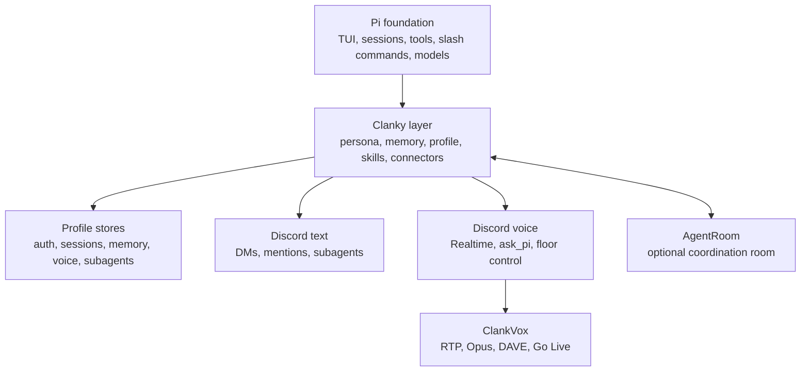

# Start Here


Clanky is a personal agent built on [Pi](https://pi.dev). Learn it through
three questions:

1. What powerful things can I do as a user?
2. What should I let Clanky handle?
3. What mental model explains what is happening?

## 1. What You Can Do

Clanky gives you a local agent that can carry personal context across tools:

- use Pi's terminal TUI for repo work, session history, model switching, and
  slash commands
- keep profile-local auth, memory, sessions, skills, and connector settings
- ask Clanky to remember source-grounded facts, then inspect or forget them
- connect an agent-owned Discord identity for DMs, mentions, replies, and
  optional channel binding
- let Discord requests run through subagents while the foreground session keeps
  working
- join Discord voice, hear speakers, speak back, and delegate durable work to Pi
- use web, browser, media generation, Linear, Discord, and MCP skills when
  configured
- join an AgentRoom room as a normal Pi harness while keeping profile ownership
  explicit

> GIF slot: `docs/assets/gifs/clanky-tui-discord.gif`  
> Capture: foreground Clanky working in the local TUI while Discord routes a
> mention through a subagent and returns a useful handoff.

## 2. What To Let Clanky Handle

Let Clanky handle work that benefits from personal state and live tool access:

- repository orientation and local command/file work
- memory-backed context that should follow your profile
- Discord triage: reply, skip, ask for clarification, or delegate
- voice-room questions that need fast response plus optional Pi follow-up
- media/web/browser tasks where the right skill can pick the right backend
- AgentRoom participation as a lead, worker, or reviewer

Use AgentRoom when the problem becomes a room: multiple agents, runtime launch,
audited terminal IO, task shadows, room-owned connectors, mobile checks, and
handoffs between workers. Jump to
[AgentRoom Ecosystem Tour](docs://agent-room-docs/ecosystem) for that layer.

## 3. Mental Model



Pi is the generic agent harness. Clanky configures that harness with personal
state, memory, connectors, skills, Discord, voice, and media. ClankVox sits
under voice as deterministic transport code. AgentRoom sits around Clanky when
you want multi-agent coordination.

## First Path To Try

Use the fresh-user script first. It creates a temporary Clanky home so you can
test onboarding without touching your real profile.

```bash
cd /Users/jamesvolpe/dev/agents/clanky-pi
pnpm install
pnpm dev:setup:fresh
```

Inside the TUI:

```text
/setup
/setup status
/openai-login
```

Then send a simple prompt:

```text
Summarize this repository and tell me how to run the non-live checks.
```

That proves the Pi TUI, Clanky profile setup, model auth path, context loading,
and basic tool use before you involve Discord or voice.

## Normal Personal Profile

After the fresh run works, start a persistent profile:

```bash
pnpm clanky --home ~/.clanky --profile personal --cwd .
```

Inside Clanky:

```text
/setup
/profile
/openai-whoami
```

Profiles are the boundary for sessions, memory, skills, auth, voice settings,
subagents, and work-tracker state. Running two live Clankies on the same profile
is unsupported.

## Docs Map

- [Pi Foundation](pi-foundation.md): what Clanky inherits from Pi and what
  Clanky adds.
- [First-Time Setup](first-time-setup.md): prerequisites, install, fresh-user
  test, and connector setup.
- [Using Clanky](using-clanky.md): day-to-day workflows once the profile works.
- [Command Reference](command-reference.md): CLI commands, Pi slash commands,
  Clanky slash commands, and model-facing tools.
- [Memory And Privacy](memory-and-privacy.md): profile state, auth storage,
  memory policy, and forget/export commands.
- [AgentRoom Integration](AGENTROOM.md): room participation, gateway ownership,
  and launch contract.
- [Discord Voice Architecture](discord-voice-architecture.md): TypeScript
  control plane, Realtime, Pi delegation, and ClankVox media plane.
- [Troubleshooting](troubleshooting.md): common setup failures and where to look
  first.

For LLM ingestion, the docs site publishes
[`llms.txt`](https://volpestyle.github.io/clanky/llms.txt) and
[`llms-full.txt`](https://volpestyle.github.io/clanky/llms-full.txt).
