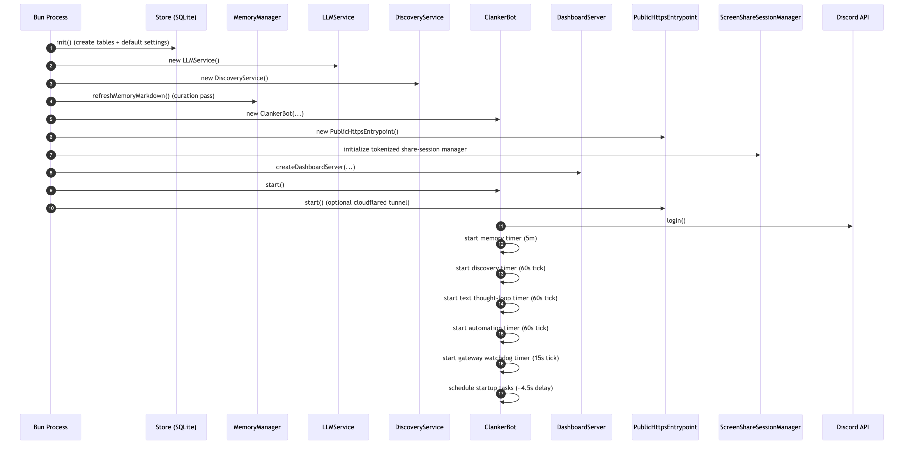
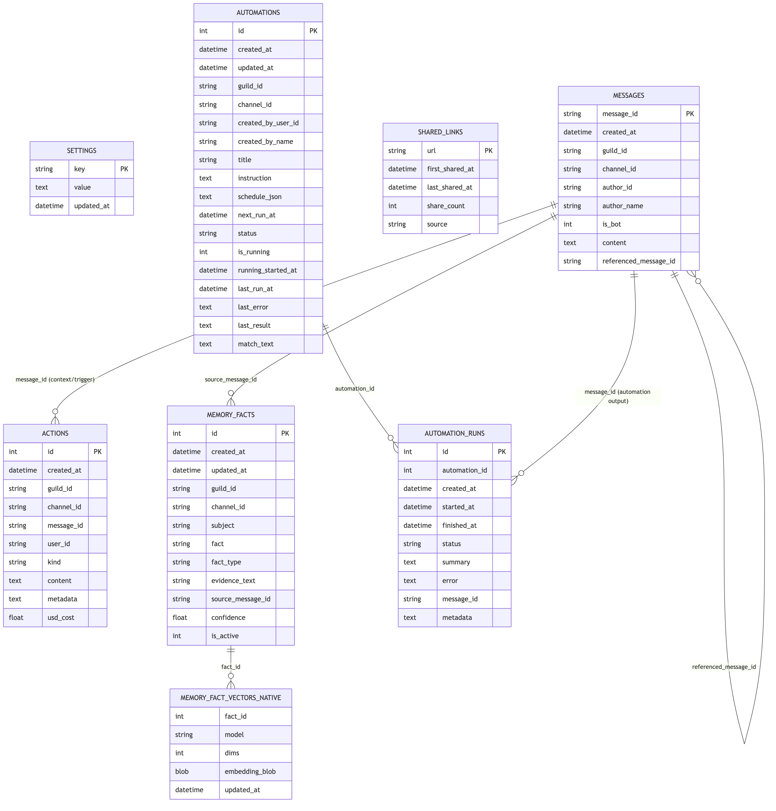
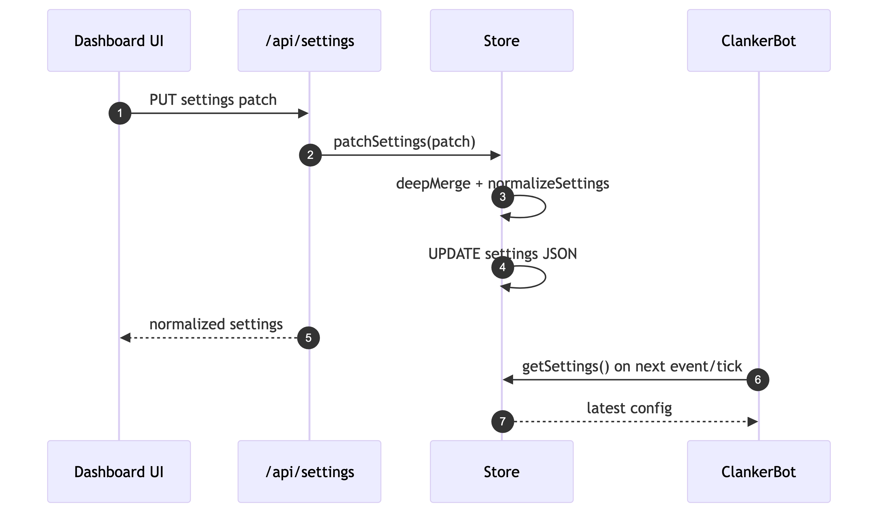
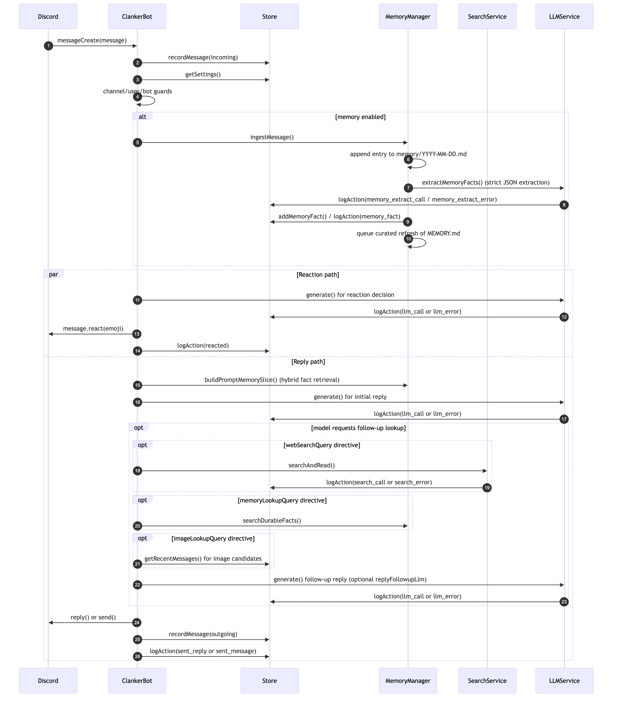
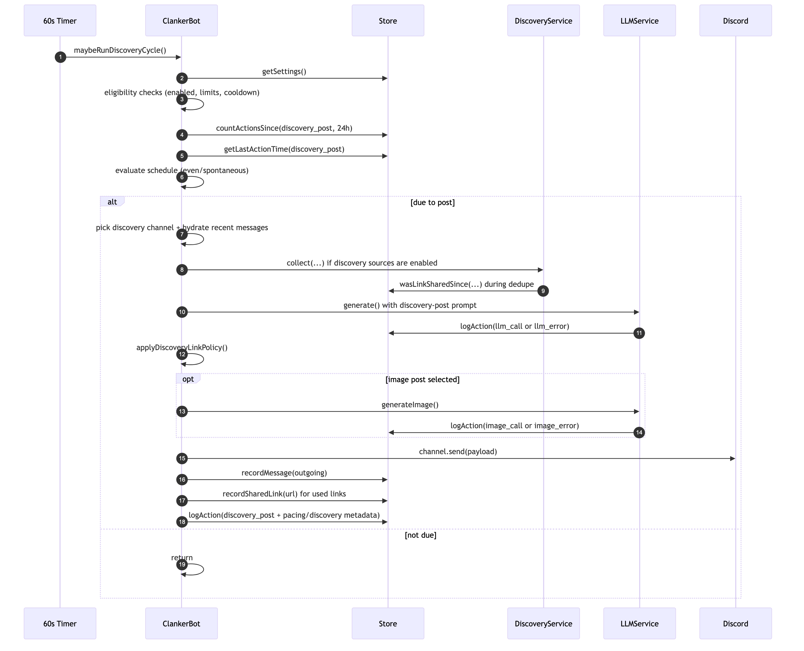

# Clanker Conk Technical Architecture

This document explains how the bot is wired, how data moves through the system, and the key runtime flows.

The preset-driven stack spec now informs the live settings/runtime layer. For the full target architecture, including `openai_native` and hybrid Anthropic/OpenAI stacks, see:
- `docs/preset-driven-agent-stack-spec.md`

## 1. High-Level Components

Code entrypoint:
- `src/app.ts`: bootstraps storage, services, bot, and dashboard server.

Core runtime:
- `src/bot.ts`: Discord event handling and orchestration.
- `src/bot/*`: extracted bot domains (`automationControl`, `discoverySchedule`, `queueGateway`, `replyAdmission`, `replyFollowup`, `startupCatchup`, `voiceReplies`).
- `src/settings/settingsSchema.ts`: canonical persisted settings schema.
- `src/settings/agentStack.ts`: preset resolution + capability/runtime accessors (`research`, `browser`, `voice`, `devTeam`, orchestrator bindings).
- `src/llm.ts`: model provider abstraction (OpenAI, Anthropic, xAI/Grok, or Claude Code), usage + cost logging, embeddings, image/video generation, ASR, and TTS.
- `src/llmClaudeCode.ts`: Claude Code CLI invocation/parsing helpers used by `LLMService`.
- `src/llmCodex.ts`: OpenAI Responses/Codex integration used by the code-agent runtime.
- `docs/claude-code-brain-session-mode.md`: Claude Code persistent-brain behavior and how it differs from stateless API providers.
- `src/memory.ts`: append-only daily journaling + LLM-based fact extraction + hybrid memory retrieval (lexical + vector).
- `src/discovery.ts`: external link discovery for discovery posts.
- `src/store.ts`: SQLite persistence orchestration.
- `src/store/*`: settings normalization and store helper utilities.
- `src/voice/voiceSessionManager.ts`: voice orchestration and session lifecycle.
- `src/voice/voiceJoinFlow.ts`, `src/voice/voiceStreamWatch.ts`, `src/voice/voiceOperationalMessaging.ts`, `src/voice/voiceDecisionRuntime.ts`: extracted voice domains.
- `docs/voice-output-state-machine.md`: canonical assistant reply/output phase model and incident workflow.
- `src/publicHttpsEntrypoint.ts`: optional Cloudflare Quick Tunnel runtime for exposing local dashboard/API over public HTTPS.
- `src/screenShareSessionManager.ts`: tokenized browser screen-share session lifecycle and frame relay into voice stream-watch ingest.

Agents:
- `src/agents/browseAgent.ts`: headless browser agent — LLM + browser tool loop for navigating websites and extracting information.
- `src/agents/codeAgent.ts`: code-agent orchestration (Claude Code + Codex providers), including one-shot tasks and session-backed turns.
- `src/agents/codexAgent.ts`: Codex-backed `SubAgentSession` implementation.
- `src/agents/subAgentSession.ts`: shared session manager + lifecycle for long-running tool sessions (`browser`, `code`).

Tool definitions:
- `src/tools/browserTools.ts`: browser tool schemas + execution wrappers for the browse agent.
- `src/tools/openAiComputerUseRuntime.ts`: OpenAI computer-use sub-runtime that drives the browser manager when the resolved browser runtime is `openai_computer_use`.
- `src/tools/replyTools.ts`: tool schemas available to the text chat brain (`conversation_search`, web search, memory, image lookup, open-article lookup, etc.).
- `src/voice/voiceToolCalls.ts`: voice tool definitions + execution handlers for all tools available in voice sessions, including shared conversation-history recall.

Control plane:
- `src/dashboard.ts`: REST API and static dashboard hosting, including tunnel-host public/private route gating.
- `dashboard/src/*`: React dashboard (polling stats/actions/memory/settings and writing settings back).

Storage:
- `data/clanker.db`: runtime SQLite database.
- `memory/YYYY-MM-DD.md`: append-only daily journal files.
- `memory/MEMORY.md`: operator-facing curated snapshot for dashboard inspection (not directly injected into model prompts).

## 2. Runtime Lifecycle


<!-- source: docs/diagrams/runtime-lifecycle.mmd -->

## 3. Tool Orchestration

The central architectural idea: Clanker owns the product control plane, while the agent stack resolves external runtimes by preset. The orchestrator is still tool-using LLM-driven, but capability routing is now resolved through a canonical stack instead of scattered provider toggles.

```
User (voice or text)
    │
    ▼
Brain (LLM with tool-use)
    ├── conversation_search            →  persisted text + voice conversation recall
    ├── memory_search / memory_write   →  persistent facts + vector recall
    ├── web_search                     →  live web search + page inspection
    ├── browser_browse                 →  headless browser agent (navigate, click, extract)
    ├── code_task                      →  code agent runtime (Claude Code or Codex)
    ├── music_*                        →  queue management + playback control
    ├── image/video/gif generation     →  media creation via model APIs
    └── MCP tools                      →  extensible third-party capabilities
```

Most conversational tools are shared across both voice and text paths. The brain generally sees the same core tool surface regardless of input modality, while the backing runtime is chosen by the resolved stack:
- research capability: `agentStack.runtimeConfig.research`
- browser capability: `agentStack.runtimeConfig.browser`
- voice runtime: `agentStack.runtimeConfig.voice`
- dev-team workers: `agentStack.runtimeConfig.devTeam`

A few tools remain modality-specific when the capability only makes sense in one runtime (for example realtime voice transport controls or voice-only playback controls).

Conversation continuity is split into two retrieval layers:
- `conversation_search`: recall of prior exchanges from persisted message history, across text chat and voice transcripts.
- `memory_search`: durable long-lived facts/preferences/lore extracted from conversation and stored in `memory_facts`.

This keeps default prompts small while still letting the model explicitly look up earlier exchanges when continuity matters.

A third persistence layer now exists for recurring bot behavior:
- `adaptive_directive_add` / `adaptive_directive_remove`: server-level persistent directives that shape how the bot talks and acts across future turns.
- `guidance` directives: broad style/tone/persona/operating guidance.
- `behavior` directives: recurring trigger/action behavior, such as sending a GIF or calling out a specific user when the current turn matches.

Unlike durable memory facts, adaptive directives are injected into prompts directly. Guidance directives can stay broadly active, while behavior directives are retrieved query-by-query so they only enter context when the current turn is relevant.

### How Tools Are Invoked

**Text chat path:** The brain calls `llm.chatWithTools()` with the text reply tool set. The LLM returns `tool_use` blocks, the bot executes them, appends results, and loops until the LLM returns a text-only response. Implemented in `replyTools.ts` (inline tools) and dedicated agents like `browseAgent.ts` (agent loops).

**Voice path:** Tools are registered as OpenAI Realtime function definitions. The Realtime brain emits `response.function_call_arguments.done` events, the bot executes the tool via `voiceToolCalls.ts` handlers, and sends results back with `conversation.item.create`. The brain continues the conversation with the result.

**Agent tools:** Some tools themselves contain an inner agent loop. When the brain calls `browser_browse`, it spawns a `browseAgent` that runs its own multi-step LLM + browser tool cycle. The brain gets back a final result — it doesn't manage the inner loop directly.

`browser_browse` now uses a shared browser-task runtime across text and voice:
- `src/tools/browserTaskRuntime.ts`: channel-scoped task registry, abort classification, and shared `runBrowserBrowseTask(...)` wrapper.
- Text and voice both pass through that runtime, so cancellation semantics, error normalization, and logging stay aligned.
- Automation runs currently opt out of `browser_browse` on purpose, even though they use the same generic reply-tool plumbing.

### Host-Access Tools

`code_task` is now a shipped tool in text and voice tool loops:

- text: `src/tools/replyTools.ts`
- voice: `src/voice/voiceToolCalls.ts`

Execution is routed through `src/agents/codeAgent.ts` and gated by settings:

- `codeAgent.enabled`
- `codeAgent.allowedUserIds` (allowlist)
- `codeAgent.maxTasksPerHour`
- `codeAgent.maxParallelTasks`

### Tool Composition Example

A user says "go check my open GitHub issues":

1. Brain calls `browser_browse` → navigates to the GitHub issues page → extracts the issue list
2. Brain reports the issues back to the user
3. User asks follow-up questions about one of the issues
4. Brain optionally calls `browser_browse` again or combines the result with `memory_search`
5. Brain reports the answer back to the user

No step here is hardcoded. The brain chose which tools to use and in what order based on the conversation.

## 4. Data Model (SQLite)

Main tables created in `src/store.ts`:
- `settings`: single `runtime_settings` JSON blob.
- `messages`: normalized message history across text chat, persisted user voice transcripts, and persisted assistant spoken turns.
- `actions`: event log (replies, reactions, discovery posts, llm/image calls, errors) with `usd_cost`.
- `memory_facts`: LLM-extracted durable facts with type/confidence/evidence.
- `memory_fact_vectors_native`: sqlite-vec-compatible embeddings per fact/model for semantic recall.
- `adaptive_style_notes`: active persistent adaptive directives, including `directive_kind` (`guidance` or `behavior`), audit metadata, and soft-delete fields.
- `adaptive_style_note_events`: append-only audit log of directive adds/edits/reactivations/removals.
- `shared_links`: external links already posted (for dedupe windows).
- `automations`: natural-language schedule definitions and next-run state.
- `automation_runs`: per-run execution history for each automation.

Table relationship diagram (logical relationships):


<!-- source: docs/diagrams/data-model.mmd -->

Note: the implementation uses logical joins and lookups; SQLite foreign-key constraints are not currently declared.

Cost aggregation:
- `llm_call` rows store `usd_cost`.
- `/api/stats` uses `Store.getStats()` to sum total and daily LLM spend.

## 5. Settings Flow

Settings are patched through dashboard API and normalized in `Store.patchSettings()` / `normalizeSettings()`.

Canonical top-level settings groups:
- `identity`
- `persona`
- `prompting`
- `permissions`
- `interaction`
- `agentStack`
- `memory`
- `directives`
- `initiative`
- `voice`
- `media`
- `music`
- `automations`

Preset-driven stack settings:
- `agentStack.preset`: `openai_native`, `anthropic_brain_openai_tools`, `multi_provider_legacy`, or `custom`
- `agentStack.advancedOverridesEnabled`: whether per-runtime overrides are exposed and persisted
- `agentStack.overrides`: orchestrator / worker override bindings
- `agentStack.runtimeConfig`: capability-runtime configuration for research, browser, voice, and dev-team workers

Normalization responsibilities:
- clamping numeric ranges,
- sanitizing list fields,
- defaulting missing keys,
- migrating legacy flat settings into the canonical preset-driven shape,
- ensuring reply-channel, text-thought-loop, and discovery config is always valid.

The bot reads settings at decision time (`store.getSettings()`), so updates apply without restart.


<!-- source: docs/diagrams/settings-flow.mmd -->

## 6. Message Event Flow (Replies + Reactions)

Entrypoint: Discord `messageCreate` handler in `ClankerBot`.


<!-- source: docs/diagrams/message-event-flow.mmd -->

Key guardrails:
- channel allow/block lists.
- blocked users.
- per-hour message and reaction limits.
- minimum seconds between bot messages.
- high-level activity behavior is documented in `docs/clanker-activity.md`.

## 7. Latency-Critical Model Choices

High-impact latency levers:
- `llm.provider` + `llm.model` for primary reply generation.
- `replyFollowupLlm.*` when follow-up lookup/regeneration passes are enabled.
- voice model settings (`voice.replyDecisionLlm.provider/model` for music stop / thought engine, realtime/STT/TTS model fields).

Validation signals:
- `Store.getReplyPerformanceStats()` (`memorySliceMs`, `llm1Ms`, `followupMs`).
- voice `voice_turn_addressing` runtime logs.

## 8. Text Thought Loop + Discovery Post Flow

Text-channel proactivity is now split in two:
- `replyChannelIds` + `textThoughtLoop.*`: periodic conversational lurking.
- `discovery.channelIds` + `discovery.*`: proactive standalone discovery posting with optional external links/media.

Canonical activity rules, sliders, and edge cases are documented in:
- `docs/clanker-activity.md`


<!-- source: docs/diagrams/discovery-post-flow.mmd -->

Scheduling modes:
- `even`: post only when elapsed time exceeds `max(minMinutesBetweenPosts, 24h/maxPostsPerDay)`.
- `spontaneous`: after min gap, uses probabilistic ramps + force-due bound.

## 9. Discovery Subsystem

`DiscoveryService.collect()` builds topic seeds, fetches enabled sources in parallel, filters/ranks candidates, and provides a shortlist to discovery-post prompting.

Canonical discovery behavior, controls, and rollout guidance live in:
- `docs/initiative-discovery-spec.md`.

## 10. Dashboard Read/Write Patterns

Dashboard polling:
- `/api/stats` every 10s
- `/api/actions` every 10s
- `/api/memory` every 30s
- `/api/settings` on load (and manual reload after save)

Dashboard writes:
- `PUT /api/settings`: saves all settings.
- `POST /api/memory/refresh`: forces immediate memory markdown regeneration.

Dashboard read APIs also include:
- `GET /api/automations`: list automations by guild/channel/status/query.
- `GET /api/automations/runs`: list run history for one automation.
- `GET /api/memory/adaptive-directives`: list active adaptive directives for one guild.
- `GET /api/memory/adaptive-directives/audit`: list adaptive directive audit events for one guild.
- `POST /api/memory/simulate-slice`: simulate retrieval slices for memory prompt tuning.

## 11. Action Log Kinds

Common `actions.kind` values in current runtime:
- Messaging/discovery: `sent_reply`, `sent_message`, `reply_skipped`, `discovery_post`, `text_thought_loop_post`, `automation_post`
- Reactions: `reacted`, `voice_soundboard_play`
- LLM + media generation: `llm_call`, `llm_error`, `image_call`, `image_error`, `video_call`, `video_error`, `gif_call`, `gif_error`
- Memory pipeline: `memory_fact`, `memory_extract_call`, `memory_extract_error`, `memory_embedding_call`, `memory_embedding_error`
- Adaptive directives: `adaptive_style_note` (current internal action-log kind for directive lifecycle events)
- Search + video context: `search_call`, `search_error`, `video_context_call`, `video_context_error`
- Agent tools: `browser_browse_call`, `browser_tool_step`
- Code agent: `code_agent_call`, `code_agent_error`
- Voice runtime: `voice_session_start`, `voice_session_end`, `voice_turn_in`, `voice_turn_out`, `voice_runtime`, `voice_intent_detected`, `voice_error`
- Speech services: `asr_call`, `asr_error`, `tts_call`, `tts_error`
- Automation lifecycle: `automation_created`, `automation_updated`, `automation_run`, `automation_error`
- Reflection lifecycle: `memory_reflection_start`, `memory_reflection_complete`, `memory_reflection_error`
- Runtime + generic failures: `bot_runtime`, `bot_error`

These power the activity stream and metrics/cost widgets in the dashboard.

## 12. Failure Behavior

- LLM failures are logged (`llm_error`) and bubble to caller; bot-level wrappers log `bot_error`.
- Reaction failures (permission/emoji issues) are swallowed.
- Image generation failures fall back to text-only discovery posts.
- Discovery fetch failures are captured per source; discovery cycle can still continue with no links.
