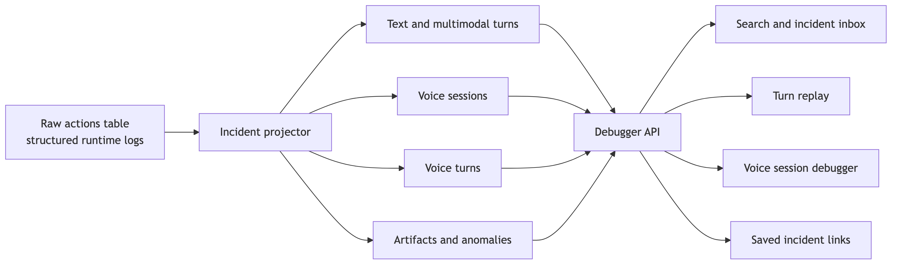

# Runtime Debugger And Incident Replay Design

Status: proposed

References:
- [`docs/operations/logging.md`](../operations/logging.md)
- [`docs/architecture/overview.md`](../architecture/overview.md)
- [`docs/architecture/activity.md`](../architecture/activity.md)
- [`docs/capabilities/memory.md`](../capabilities/memory.md)
- [`docs/voice/voice-provider-abstraction.md`](../voice/voice-provider-abstraction.md)
- [`docs/voice/voice-client-and-reply-orchestration.md`](../voice/voice-client-and-reply-orchestration.md)
- [`docs/voice/voice-capture-and-asr-pipeline.md`](../voice/voice-capture-and-asr-pipeline.md)
- [`docs/voice/voice-output-and-barge-in.md`](../voice/voice-output-and-barge-in.md)

<!-- source: docs/diagrams/runtime-debugger-flow.mmd -->

## Goal

Build a first-class runtime debugger for Clanker that turns raw structured logs
into incident reconstruction, replay, search, and operator-grade debugging for:

- text reply turns
- multimodal turns
- voice sessions and voice turns
- tool loops
- memory side effects
- transport/runtime failures

The product is not "more analytics." The product is a turn and session
debugger that makes causality legible.

## Product Thesis

Grafana/Loki already gives value because it exposes the raw event stream. The
main remaining gap is reconstruction:

- operators can find the right events
- operators still have to manually stitch them into one story

The debugger should remove that stitching work.

Primary job:

- explain what happened
- explain why it happened
- explain what the bot saw
- explain what the runtime did next

Secondary job:

- summarize cost, latency, and trend data

If we have to choose, incident replay matters more than aggregate metrics.

## Why This Is Worth Building

Clanker is not a simple request/response bot. It has:

- coalesced text turns
- direct and ambient reply admission
- prompt bundles and followup tool loops
- multimodal captioning and image lookup
- memory retrieval and reply ingestion
- multiple voice reply paths
- VAD, ASR bridge, admission, output lock, barge-in, and playback telemetry
- music and screen-share overlays

That means failures are usually causal chains, not isolated lines.

The debugger pays for itself if it reduces these categories of debugging from
"open five panels and grep logs" to "open one replay view":

- odd or unsafe text replies
- mysterious skips
- wrong tool choices
- stale or missing memory
- voice sessions that heard something but said nothing
- transport/runtime regressions after provider or prompt changes

## Current State

Existing useful surfaces:

- raw structured action log in `actions`
- Grafana/Loki search over `runtime-actions.ndjson`
- dashboard `ActionStream`
- dashboard `TextTab`
- dashboard `VoiceMonitor`
- persisted voice session history APIs
- live voice runtime snapshot and prompt-state views
- `response_triggers` index for trigger-message linkage

Current pain:

- text and multimodal turns are still event-centric instead of incident-centric
- voice history is session-scoped but not reconstructed into per-turn causality
- tool loops, memory events, and prompt context are visible but fragmented
- cross-surface debugging requires manual correlation by time and ID
- the current dashboard is implicitly single-bot even though the long-term need
  is broader observability across bots

## Scope

This design targets Clanker first, but the contract should be reusable across
all bots that emit the same structured action envelope.

That means the debugger must not assume:

- one bot name
- one guild
- one runtime family
- one provider stack

From the start, every replay/search API should be able to carry bot identity
and deployment identity even if the first shipped UI uses only Clanker.

## Operator Workflows

### 1. "Why did it say that?"

Open the final sent message or reply and see:

- triggering message(s)
- recent coalesced window
- admission/addressing decision
- prompt bundle
- memory and tool context
- model output(s)
- final delivered action

### 2. "Why did it not reply?"

Open the user message and see the precise stop point:

- deterministic admission deny
- classifier/generation `[SKIP]`
- cooldown or reply budget gate
- output lock
- empty ASR
- error or cancellation

### 3. "Why did voice feel broken?"

Open the affected VC session and see:

- session lifecycle
- speaker activity and VAD promotion
- ASR revisions/finals
- addressing/admission decisions
- generation and tool activity
- playback/output lock/barge-in
- recovery or failure

### 4. "What changed after a regression?"

Search incidents by:

- model or provider
- reply path (`bridge`, `brain`, `native`)
- guild/channel/user
- tool usage
- output lock reason
- trace source
- time window

Then compare before/after incident shapes.

## Ideal Information Architecture

### 1. Debugger tab

Add a top-level dashboard tab dedicated to debugging rather than folding all new
surfaces into `ActionStream`, `TextTab`, or `VoiceMonitor`.

Sub-surfaces:

- `Incidents`
- `Replay`
- `Voice`
- `Search`
- `Saved`

### 2. Incident inbox

Default landing view.

Shows recent reconstructed incidents across the selected scope:

- text turn
- multimodal turn
- voice turn
- voice session anomaly
- tool/runtime error

Each row should show:

- bot
- time
- incident type
- guild/channel
- user/speaker
- short summary
- model/provider
- tool badges
- latency
- cost
- anomaly flags

### 3. Replay pane

Single-incident detail view with:

- readable timeline
- raw JSON panel
- linked artifacts
- correlation IDs
- deep link / permalink

### 4. Search

Structured filters plus free-text search over event content and selected
metadata fields.

### 5. Saved views

Operators should be able to save:

- recurring queries
- incident permalinks
- named anomaly views

## Canonical Debugger Data Model

Raw `actions` remains the source of truth.

The debugger adds derived entities on top of it.

### 1. Incident

Top-level reconstructed object.

Fields:

- `incidentId`
- `incidentType`
- `botId`
- `botName`
- `deployment`
- `guildId`
- `channelId`
- `userId`
- `startedAt`
- `endedAt`
- `status`
- `summary`
- `correlationKeys`
- `latency`
- `cost`
- `anomalies`

Incident types:

- `text_turn`
- `multimodal_turn`
- `voice_session`
- `voice_turn`
- `runtime_error`
- `tool_session`

### 2. Event fragment

Normalized projection of one raw action row into the debugger domain.

Fields:

- `actionId`
- `createdAt`
- `kind`
- `phase`
- `lane`
- `shortLabel`
- `raw`

### 3. Artifact

Renderable payload tied to an incident:

- prompt bundle
- transcript
- attachment thumbnail
- image lookup result
- web result set
- tool result payload
- memory facts
- screen-share frame summary

### 4. Anomaly

Derived flag created by projector rules, not only by explicit errors.

Examples:

- `reply_missing_after_direct_address`
- `tool_loop_stalled`
- `empty_asr_after_promotion`
- `output_lock_stale`
- `high_followup_latency`
- `repeated_silence_gate_drop`

## Correlation Model

The debugger should reconstruct incidents from stable keys already present in
logs, plus a few new ones that we should add.

### Existing keys to use immediately

- `message_id`
- `guild_id`
- `channel_id`
- `user_id`
- `metadata.triggerMessageId`
- `metadata.triggerMessageIds`
- `metadata.sessionId`
- `metadata.source`
- `metadata.event`
- `metadata.traceSource`

### New keys to add

These should become part of the common action envelope for Clanker and any
future bots using the same debugger:

- `botId`
- `botName`
- `runtimeInstanceId`
- `deployment`
- `gitSha`
- `environment`
- `incidentId` when a runtime already knows it
- `turnId` for text and voice replay grouping
- `toolCallId` and `toolStep`
- `promptBundleId`
- `artifactRefs`

### Correlation rules

Text and multimodal:

- use `triggerMessageId` as the primary join key
- use `triggerMessageIds` for coalesced context and sibling linkage
- treat sent reply/message, reaction, llm call, tool results, and memory ingest
  as one incident when they share the same trigger set and close timestamps

Voice session:

- use `sessionId` as the primary join key
- group all `voice_*` actions with that session

Voice turn:

- add a canonical `turnId`
- until then, derive provisional turns from a chain of:
  - promotion event
  - transcript events
  - addressing/admission
  - generation/tool/output events

## Ideal Replay UI For Text And Multimodal

The text replay view should feel like a linear story, not a table dump.

Sections:

### 1. Trigger

- final anchor message
- coalesced trigger list
- recent-room context window
- addressing signal

### 2. Inputs

- prompt bundle
- relevant memory slice
- detected attachments
- captioning results
- retrieved web/image/browser context

### 3. Model loop

- first model call
- tool requests in order
- tool results in order
- followup model call(s)
- parse/recovery events if structured output failed

### 4. Delivery

- reaction
- sent message or reply
- standalone vs reply
- mention resolution
- media directives

### 5. Persistence

- memory ingest
- fact writes
- conversation history writes

### 6. Performance

- queue
- memory
- llm
- followup
- typing
- send
- cost

## Ideal Debugger For VC Runtime And Events

This is the most important part of the design. Voice debugging should not stop
at "session history plus a flat event list."

It should reconstruct how the room moved.

### Voice surface split

The voice debugger should have two connected views:

- `Live session debugger`
- `Session replay`

Live helps operators while the room is active.
Replay helps after a bad session or regression.

### Live session debugger

Top summary bar:

- bot
- guild / voice channel
- mode and reply path
- provider/runtime
- session age
- active participants
- current floor owner
- output lock state
- pending response state
- active response state
- pending deferred turns

Pinned health chips:

- transport connected / disconnected
- ASR healthy / degraded
- generation healthy / degraded
- output healthy / degraded
- music active
- screen-share active

### Voice session timeline

Render the session as synchronized lanes instead of one flat feed.

Required lanes:

- `Session`
  - joins, leaves, reconnects, session end
- `Membership`
  - participant joins/leaves
- `Capture/VAD`
  - activity start, provisional capture, promotion, silence gate
- `ASR`
  - speech started/stopped, transcript revisions, finals, empty transcript
- `Admission`
  - addressing, wake latch, command-only, output lock, deny reasons
- `Generation`
  - model calls, prompts, followup loops, cancellations
- `Tools`
  - tool start, tool result, tool failure, ownership path
- `Output`
  - bot audio start/stop, preplay stash, interruption, replay recovery
- `Screen share`
  - frame ingest, commentary request, brain-context refresh
- `Music`
  - playback state, ducking, soundboard overlays

Operators should be able to collapse to only the lanes relevant to the current
incident.

### Voice turn reconstruction

Within a session, the debugger should reconstruct human-readable voice turns.

One voice turn card should include:

- provisional capture and promotion metadata
- utterance IDs / transcript revision chain
- final transcript
- direct address / command follow-up / ambient reasoning
- output lock reason if blocked
- generation prompt snapshot
- tool calls
- generated text
- whether speech was played, cancelled, or replayed
- barge-in or interruption details

### Voice prompt and context surfaces

Ideal operator surfaces:

- current instructions
- classifier prompt snapshot
- generation prompt snapshot
- bridge prompt snapshot
- last generation context
- memory facts used for the session
- stream-watch brain context payload

These already exist in pieces in the live voice snapshot. The debugger should
preserve them and present them in replay alongside the relevant turn.

### Voice anomaly callouts

The voice debugger should surface likely failure causes automatically.

First anomaly set:

- promoted capture with empty ASR
- direct address denied by output lock
- output lock stuck after response done
- repeated silence-gate drops for same speaker/session
- generation succeeded but output never started
- tool call ownership mismatch
- repeated reconnects
- screen-share commentary storms
- music playback masking expected speech

### Voice ideal drilldown

When an operator clicks "why didn’t it answer here?", the UI should answer in
one screen:

1. user speech was promoted at `t0`
2. transcript finalized at `t1`
3. admission denied or allowed at `t2`
4. model/tool loop happened at `t3`
5. output was blocked, cancelled, played, or replayed at `t4`

That should be true for both live sessions and historical sessions.

## Backend Design

### 1. Keep `actions` as the event ledger

Do not replace the raw action log.

The debugger should be a projection layer over:

- `actions`
- `response_triggers`
- `messages`
- memory and voice snapshot helpers where relevant

### 2. Add a projector layer

Introduce a debugger projection module that can:

- reconstruct incidents on read for MVP
- optionally persist derived summaries later for speed

Suggested module split:

- `src/debugger/incidentProjector.ts`
- `src/debugger/textTurnProjector.ts`
- `src/debugger/voiceSessionProjector.ts`
- `src/debugger/voiceTurnProjector.ts`
- `src/debugger/anomalyRules.ts`

### 3. Add derived storage only after MVP proves the shape

MVP can project on read from `actions`.

If query latency or cross-bot scale becomes painful, add derived tables:

- `debug_incidents`
- `debug_incident_events`
- `debug_voice_turns`
- `debug_artifacts`

Those tables should cache projections, not become the source of truth.

### 4. Add debugger APIs

Required APIs:

- `GET /api/debug/incidents`
- `GET /api/debug/incidents/:incidentId`
- `GET /api/debug/text-turns/:triggerMessageId`
- `GET /api/debug/voice-sessions/:sessionId`
- `GET /api/debug/voice-sessions/:sessionId/turns`
- `GET /api/debug/search`
- `GET /api/debug/saved-views`
- `POST /api/debug/saved-views`

Search filters:

- bot
- guild
- channel
- user
- incident type
- kind
- model
- provider
- reply path
- tool name
- anomaly
- output lock reason
- trace source
- time range

### 5. Indexing and query performance

The current action store indexes are enough for raw feeds but not ideal for a
rich debugger.

Expected additions:

- `idx_actions_guild_time`
- `idx_actions_channel_time`
- `idx_actions_message_id`
- `idx_actions_user_time`
- `idx_response_triggers_created_at`
- targeted JSON indexes for frequently queried metadata keys where SQLite makes
  it worthwhile

If we add derived incident tables, index by:

- `incidentType, startedAt`
- `guildId, startedAt`
- `channelId, startedAt`
- `userId, startedAt`
- `sessionId`
- `triggerMessageId`
- `anomaly`

## Frontend Design

### 1. New Debugger tab

Do not overload `ActionStream` into a full debugger.

Keep:

- `ActionStream` as the event microscope
- `TextTab` as the message-centric quick inspector
- `VoiceMonitor` as the live runtime console

Add:

- `Debugger` as the causal replay product

### 2. Deep links from existing surfaces

Every existing surface should link into the debugger:

- action row -> open related incident
- text message card -> open turn replay
- voice session card -> open session replay
- voice event row -> open containing turn

### 3. Layout rules

- default to two-pane: timeline left, details right
- no floating toasts
- keep status inline near the active query or replay
- raw JSON must always be one click away

## Logging Gaps To Close Before Or During MVP

The debugger will work better if these gaps are closed early:

- canonical `turnId` for text
- canonical `turnId` for voice
- stable tool call IDs in all tool-owning paths
- bot identity and deployment identity on every action
- prompt bundle IDs
- artifact references for attachments, fetched pages, and returned media
- explicit output-start / output-finish events for all reply paths
- explicit "no reply because X" terminal markers where today silence is only
  inferable

## Rollout Plan

### Phase 1. Contract hardening

- audit current action coverage
- add missing correlation keys
- add missing terminal-state logs for text and voice
- add bot/deployment identity fields

Primary files:

- `src/store/storeActionLog.ts`
- `src/bot.ts`
- `src/bot/replyPipeline.ts`
- `src/voice/*`
- [`docs/operations/logging.md`](../operations/logging.md)

### Phase 2. Text and multimodal replay MVP

- implement text turn projector
- add replay API by `triggerMessageId`
- build first replay UI for sent reply, sent message, and skipped turns
- deep-link from `TextTab` and `ActionStream`

Primary files:

- `src/debugger/textTurnProjector.ts`
- `src/dashboard/routesDebug.ts`
- `dashboard/src/components/Debugger/*`
- `dashboard/src/components/TextTab.tsx`
- `dashboard/src/components/ActionStream.tsx`

### Phase 3. Voice session debugger MVP

- implement session replay from current `voice_*` actions
- upgrade voice history view from flat events to causal lanes
- preserve existing live prompt-state and stream-watch surfaces
- add anomaly callouts for the top voice failure modes

Primary files:

- `src/debugger/voiceSessionProjector.ts`
- `src/debugger/voiceTurnProjector.ts`
- `src/dashboard/routesVoice.ts`
- `dashboard/src/components/VoiceMonitor.tsx`
- `dashboard/src/components/Debugger/*`

### Phase 4. Search and saved incident views

- global debugger query API
- structured filters
- saved views and permalinks
- operator-friendly incident summaries

### Phase 5. Derived indexes and cached projections

- add incident cache tables only if projection-on-read becomes slow
- backfill existing actions into incident summaries
- keep raw log replay as fallback when cached summaries disagree

### Phase 6. Cross-bot federation

- standardize the action envelope across bots
- make debugger APIs filter by bot
- add deployment and version dimensions
- allow one dashboard to search across multiple bot runtimes

## Verification Plan

Focused verification only. No giant test explosion.

Critical test targets:

- text turn projector reconstructs tool loops correctly
- skipped-turn replay identifies the stop reason correctly
- voice session projector groups events into the correct session
- voice turn projector handles empty-ASR, interrupted, and replay-recovered turns
- anomaly rules do not mislabel ordinary successful turns as failures
- debugger APIs preserve raw references back to source action IDs

## Non-Goals

- replacing Grafana/Loki
- hiding raw logs from operators
- inventing a second source of truth separate from `actions`
- building a generic enterprise observability suite before the replay core works
- fully normalizing every event type before shipping the first useful debugger

## Done Criteria

- an operator can open any odd text reply and see one coherent replay
- an operator can open any skipped text turn and see the exact stop point
- an operator can open a bad VC session and understand the causal path from
  capture to output
- prompt, tool, memory, and delivery context are visible without manual grep
- existing raw event surfaces still exist for low-level forensics
- the debugger contract is reusable across bots that emit the same structured
  action model

Product language: Clanker should be debuggable like a person with a memory and
attention trail, not like a pile of unrelated log lines.
