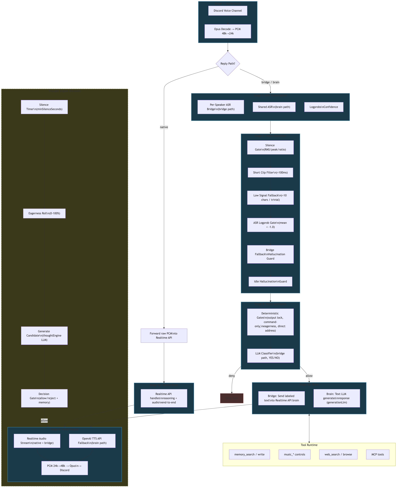

# Voice Pipeline — Provider Abstraction and Stage Reference

> **Scope:** Voice pipeline architecture — what stages audio passes through, which providers are active, and what settings configure each stage.
> Operator-facing activity paths and setting map: [`clanker-activity.md`](clanker-activity.md)
> Barge-in and noise rejection: [`voice-interruption-policy.md`](voice-interruption-policy.md)
> Assistant reply/output lifecycle: [`voice-output-state-machine.md`](voice-output-state-machine.md)

This document describes the voice chat pipeline as a linear sequence of stages, from audio input to voice output. Each stage is independently configurable, and the active set of stages depends on which **reply path** is selected.

---

## 1. Overview

The system keeps voice chat split into independently swappable layers:

1. **Voice/TTS provider** — realtime audio model (OpenAI, xAI, Gemini, ElevenLabs)
2. **Brain provider** — reasoning/generation model (native realtime, OpenAI, Anthropic, xAI, Gemini)
3. **Transcriber provider** — ASR transcription (OpenAI)

Provider resolution (`src/voice/voiceSessionHelpers.ts`):

```
voiceProvider    = resolveVoiceProvider(settings)         // default: "openai"
brainProvider    = resolveBrainProvider(settings)          // default: "openai"
transcriberProvider = resolveTranscriberProvider(settings)  // default: "openai"
runtimeMode      = resolveVoiceRuntimeMode(settings)       // maps provider → runtime mode
```

Runtime modes (`src/voice/voiceModes.ts`): `openai_realtime`, `voice_agent`, `gemini_realtime`, `elevenlabs_realtime`, `stt_pipeline`

---

## 2. The Pipeline



### Stage Visibility Matrix

| Stage | Native | Bridge | Brain |
|---|---|---|---|
| 1. Audio Input | yes | yes | yes |
| 2a. ASR (per-speaker) | — | yes | — |
| 2b. ASR (shared) | — | — | yes |
| 3. Noise Rejection | bypassed | yes | yes |
| 4a. Reply Admission (deterministic) | yes | yes | yes |
| 4b. Reply Admission (classifier) | — | yes (if not cmd-only) | — |
| 5a. Brain (realtime end-to-end) | yes | — | — |
| 5b. Brain (text→realtime) | — | yes | — |
| 5c. Brain (text LLM) | — | — | yes |
| 6a. Voice Output (realtime stream) | yes | yes | yes |
| 6b. Voice Output (TTS API) | — | — | — |
| Thought Engine (parallel) | yes | yes | yes |

---

## 3. Reply Paths

### Native

Direct audio passthrough to the realtime API. The provider handles ASR, reasoning, and audio generation end-to-end.

- **Latency**: lowest
- **ASR**: provider-internal (no local transcription)
- **Tool support**: limited to providers that support `updateTools`
- **Provider requirement**: OpenAI only (requires `perUserAsr` or native audio input)
- **Code path**: `forwardRealtimeTurnAudio()` in `voiceSessionManager.ts`

### Bridge

Per-speaker ASR transcribes each user independently, producing labeled text. The text is forwarded to the realtime brain for reasoning + audio generation.

- **Latency**: moderate (ASR round-trip added)
- **ASR**: per-speaker via `OpenAiRealtimeTranscriptionClient` — logprobs confidence gate available
- **Tool support**: full (realtime brain tool-calling loop)
- **Provider requirement**: any provider with `textInput` capability
- **Code path**: `forwardRealtimeTextTurnToBrain()` in `voiceSessionManager.ts`

### Brain

Shared ASR transcribes mixed audio. A text LLM (`generationLlm`) generates the response. The realtime provider speaks the generated text via utterance requests.

- **Latency**: high (ASR + text LLM + realtime utterance)
- **ASR**: shared via STT pipeline
- **Tool support**: full text LLM reasoning
- **Provider requirement**: works with any provider combination
- **Code path**: `runRealtimeBrainReply()` → `generateVoiceTurn()` in `voiceSessionManager.ts`

---

## 4. Stage Reference

### Stage 1: Audio Input & ASR

Discord Opus audio is decoded to PCM 48kHz, downsampled to 24kHz, and routed based on the reply path.

**Per-speaker ASR (bridge path)**

Each active speaker gets a dedicated `OpenAiRealtimeTranscriptionClient` in `openAiAsrSessions: Map<userId, state>`.

| Setting | Key Path | Default |
|---|---|---|
| Transcription method | `voice.openaiRealtime.transcriptionMethod` | `"realtime_bridge"` |
| ASR model | `voice.openaiRealtime.inputTranscriptionModel` | `"gpt-4o-transcribe"` |
| Per-user bridge | `voice.openaiRealtime.usePerUserAsrBridge` | `true` |
| Language mode | `voice.asrLanguageMode` | `"auto"` |
| Language hint | `voice.asrLanguageHint` | `"en"` |

Code: `ensureOpenAiAsrSessionConnected()`, `appendAudioToOpenAiAsr()`, `commitOpenAiAsrUtterance()` in `voiceSessionManager.ts`
Client: `src/voice/openaiRealtimeTranscriptionClient.ts`

**Shared ASR (brain path)**

Uses the STT pipeline transcription model for mixed-channel transcription.

| Setting | Key Path | Default |
|---|---|---|
| Transcription model | `voice.sttPipeline.transcriptionModel` | `"gpt-4o-mini-transcribe"` |

**Logprobs**

OpenAI realtime transcription returns per-token logprobs on `completed` events. These flow through the ASR bridge into `AsrCommitResult.transcriptLogprobs` and are evaluated at the noise rejection stage.

---

### Stage 2: Noise Rejection Gates

Sequential gates that drop low-quality captures before they consume brain resources. Each gate fires independently — a turn is dropped at the first gate that rejects it.

Applied in `runRealtimeTurn()` in `voiceSessionManager.ts`:

| Order | Gate | Drop Reason | Threshold / Constants | Applies To |
|---|---|---|---|---|
| 1 | Silence gate | `voice_turn_dropped_silence_gate` | `VOICE_SILENCE_GATE_MIN_CLIP_MS=280`, `RMS_MAX=0.003`, `PEAK_MAX=0.012`, `ACTIVE_RATIO_MAX=0.01` | all captures |
| 2 | Short clip filter | `realtime_turn_transcription_skipped_short_clip` | `VOICE_TURN_MIN_ASR_CLIP_MS=100` | `speaking_end` captures |
| 3 | Low signal fallback | `voice_turn_dropped_low_signal_fallback` | `FALLBACK_NOISE_GATE_MAX_CLIP_MS=1800`, `RMS_MAX=0.0065`, `PEAK_MAX=0.02`, `ACTIVE_RATIO_MAX=0.03` | fallback model turns |
| 4 | ASR logprob confidence | `voice_turn_dropped_asr_low_confidence` | `VOICE_ASR_LOGPROB_CONFIDENCE_THRESHOLD=-1.0` (mean logprob, log-base-e; -1.0 ≈ 37% per-token) | bridge path only (`hasTranscriptOverride`) |
| 5 | Bridge fallback hallucination | `voice_turn_dropped_asr_bridge_fallback_hallucination` | same as low signal fallback | bridge active but returned empty |
| 6 | Idle hallucination guard | `voice_turn_dropped_idle_hallucination` | same as low signal fallback | `idle_timeout` / `near_silence_early_abort` captures |

Code: `evaluatePcmSilenceGate()`, `shouldDropFallbackLowSignalTurn()` in `voiceSessionManager.ts`
Confidence: `computeAsrTranscriptConfidence()` in `voiceDecisionRuntime.ts`

---

### Stage 3: Reply Admission

Two layers: deterministic gates (fast, no LLM call) and an optional LLM classifier (bridge path only).

#### Deterministic Gates

Evaluated in order by `evaluateVoiceReplyDecision()` in `voiceReplyDecision.ts`:

| Order | Gate | Reason | Result |
|---|---|---|---|
| 1 | Missing transcript | `missing_transcript` | deny |
| 2 | Pending command followup | `pending_command_followup` | allow |
| 3 | Output lock (assistant output phase, non-music) | `bot_turn_open` (coarse) / `outputLockReason` (authoritative) | deny (retry after 1400ms) |
| 4 | Command-only + direct address | `command_only_direct_address` | allow |
| 5 | Command-only + not addressed | `command_only_not_addressed` | deny |
| 6 | Music playing + not awake | `music_playing_not_awake` | deny |
| 7 | Direct address fast path | `direct_address_fast_path` | allow |
| 8 | Eagerness disabled + no direct address | `eagerness_disabled_without_direct_address` | deny |
| 9 | STT pipeline (generation decides) | `generation_decides` | allow |
| 10 | No brain session | `no_brain_session` | deny |
| 11 | Music playing + not awake (bridge) | `music_playing_not_awake` | deny |
| 12 | Generation-only admission mode | `generation_decides` | allow |

#### LLM Classifier (bridge path)

When `realtimeAdmissionMode == "hard_classifier"` and the turn survived deterministic gates, `runVoiceReplyClassifier()` makes a YES/NO call.

| Setting | Key Path | Default |
|---|---|---|
| Provider | `voice.replyDecisionLlm.provider` | `"anthropic"` |
| Model | `voice.replyDecisionLlm.model` | `"claude-haiku-4-5"` |
| Reasoning effort | `voice.replyDecisionLlm.reasoningEffort` | `"minimal"` |
| Admission mode | `voice.replyDecisionLlm.realtimeAdmissionMode` | `"hard_classifier"` |
| Music wake latch | `voice.replyDecisionLlm.musicWakeLatchSeconds` | `15` |

Classifier config: `temperature: 0`, `maxOutputTokens: 4`, history window: `CLASSIFIER_HISTORY_MAX_TURNS=6` / `CLASSIFIER_HISTORY_MAX_CHARS=900`

Decision reasons: `classifier_allow` (YES), `classifier_deny` (NO), `unparseable_classifier_output` (deny), `classifier_runtime_error` (deny), `llm_unavailable` (deny)

Admission policy prompt: `buildVoiceAdmissionPolicyLines()` in `src/prompts/voiceAdmissionPolicy.ts` — generates contextual policy lines based on mode (`"classifier"` or `"generation"`), direct address, eagerness, participant count, music state.

---

### Stage 4: Brain

#### Native (Stage 5a)

Raw PCM is forwarded to the realtime API. The provider handles reasoning and audio generation end-to-end.

Code: `forwardRealtimeTurnAudio()` in `voiceSessionManager.ts`

#### Bridge (Stage 5b — text→realtime)

Labeled transcript `(speakerName): text` is sent to the realtime provider via `realtimeClient.requestTextUtterance()`. Context-aware instructions and tools are refreshed before each request.

Code: `forwardRealtimeTextTurnToBrain()`, `refreshRealtimeInstructions()`, `prepareRealtimeTurnContext()` in `voiceSessionManager.ts`

Context includes: participant/membership context, durable memory facts, recent conversation history (text + voice), web-search cache, adaptive directives (guidance + behavior).

#### Brain (Stage 5c — text LLM)

Text LLM generates a text response, then TTS converts to speech.

| Setting | Key Path | Default |
|---|---|---|
| Use text model | `voice.generationLlm.useTextModel` | `true` |
| Provider | `voice.generationLlm.provider` | `"anthropic"` |
| Model | `voice.generationLlm.model` | `"claude-sonnet-4-6"` |

Code: `runRealtimeBrainReply()` → `generateVoiceTurn()` in `voiceSessionManager.ts`

#### Tool Calling

Realtime brain (native + bridge) supports tool calling through the provider event loop:
- Function-call deltas accumulated → `executeLocalVoiceToolCall()` or `executeMcpVoiceToolCall()` → result returned via `sendFunctionCallOutput()` → follow-up response via `scheduleOpenAiRealtimeToolFollowupResponse()`

Code: `bindRealtimeHandlers()` in `voiceSessionManager.ts`, dispatch in `src/voice/voiceToolCalls.ts`

**Local tools** (`resolveVoiceRealtimeToolDescriptors()` in `voiceToolCalls.ts`):

- `conversation_search`, `memory_search`, `memory_write`
- `adaptive_directive_add`, `adaptive_directive_remove`
- `music_search`, `music_play_now`, `music_queue_next`, `music_queue_add`, `music_stop`, `music_pause`, `music_resume`, `music_skip`, `music_now_playing`
- `web_search`, `browser_browse` (when enabled)

**MCP tools**: merged from configured MCP servers, dispatched via `executeMcpVoiceToolCall()`

---

### Stage 5: Voice Output

#### Realtime Audio Stream (native + bridge + brain)

The realtime provider streams audio deltas. PCM 24kHz is upsampled to 48kHz, encoded to Opus, and sent to Discord.

#### TTS API (stt_pipeline mode)

Text response is sent to TTS API for synthesis in non-realtime `stt_pipeline` mode. Output is played via `playVoiceReplyInOrder()`.

| Setting | Key Path | Default |
|---|---|---|
| TTS model | `voice.sttPipeline.ttsModel` | `"gpt-4o-mini-tts"` |
| TTS voice | `voice.sttPipeline.ttsVoice` | `"alloy"` |
| TTS speed | `voice.sttPipeline.ttsSpeed` | `1` |

#### Music Output

When music playback starts, `haltSessionOutputForMusicPlayback()` clears pending bot output and stops speech. Music audio (yt-dlp → ffmpeg) shares the same AudioPlayer — calling `audioPlayer.play()` replaces the current resource.

#### Output Lock & Barge-in

Bot turn tracking via `botTurnOpen` / `activeResponseId`. When a human speaks during bot output, `interruptBotSpeechForBargeIn()` cancels the active response, clears queued audio, and stores a retry candidate for brief interruptions. See `docs/voice-interruption-policy.md`.

---

## 5. Thought Engine

The thought engine generates ambient thoughts during silence — a parallel pipeline that feeds into voice output.

### Flow

1. **Silence timer**: waits `minSilenceSeconds` after last voice activity
2. **Eagerness roll**: random `[0,100)` vs `thoughtEngine.eagerness` — skip if roll fails
3. **Generate candidate**: thought engine LLM produces a candidate (max `VOICE_THOUGHT_MAX_CHARS=220` chars)
4. **Decision gate**: separate LLM call evaluates relevance — allow/reject + optional memory enrichment (`VOICE_THOUGHT_MEMORY_SEARCH_LIMIT=8` facts retrieved)
5. **Delivery**: realtime utterance in realtime modes; TTS in `stt_pipeline` mode

### Topicality Bias

As silence grows, the topicality anchor drifts: anchored (recent conversation) → blended → ambient (general/memory-driven).

### Settings

| Setting | Key Path | Default |
|---|---|---|
| Enabled | `voice.thoughtEngine.enabled` | `true` |
| Provider | `voice.thoughtEngine.provider` | `"anthropic"` |
| Model | `voice.thoughtEngine.model` | `"claude-sonnet-4-6"` |
| Temperature | `voice.thoughtEngine.temperature` | `1.2` |
| Eagerness | `voice.thoughtEngine.eagerness` | `50` |
| Min silence | `voice.thoughtEngine.minSilenceSeconds` | `15` |
| Min interval | `voice.thoughtEngine.minSecondsBetweenThoughts` | `30` |

### Constants

| Constant | Value |
|---|---|
| `VOICE_THOUGHT_LOOP_MIN_SILENCE_SECONDS` | `8` |
| `VOICE_THOUGHT_LOOP_MAX_SILENCE_SECONDS` | `300` |
| `VOICE_THOUGHT_LOOP_MIN_INTERVAL_SECONDS` | `8` |
| `VOICE_THOUGHT_LOOP_MAX_INTERVAL_SECONDS` | `600` |
| `VOICE_THOUGHT_LOOP_BUSY_RETRY_MS` | `1400` |
| `VOICE_THOUGHT_MAX_CHARS` | `220` |
| `VOICE_THOUGHT_DECISION_MAX_OUTPUT_TOKENS` | `220` |

---

## 6. Provider Capabilities

From `REALTIME_PROVIDER_CAPABILITIES` in `src/voice/voiceModes.ts`:

| Capability | OpenAI (`openai_realtime`) | xAI (`voice_agent`) | Gemini (`gemini_realtime`) | ElevenLabs (`elevenlabs_realtime`) |
|---|---|---|---|---|
| `textInput` | yes | yes | yes | yes |
| `updateInstructions` | yes | yes | yes | — |
| `updateTools` | yes | yes | — | — |
| `cancelResponse` | yes | yes | — | — |
| `perUserAsr` | yes | — | — | — |
| `sharedAsr` | yes | yes | yes | yes |

Guards use `providerSupports(mode, capability)` instead of hardcoded provider checks.

---

## 7. Settings Reference

### Reply Path & Eagerness

| Setting | Key Path | Type | Default |
|---|---|---|---|
| Reply path | `voice.replyPath` | `"native" \| "bridge" \| "brain"` | `"bridge"` |
| Reply eagerness | `voice.replyEagerness` | `0-100` | `50` |
| Command-only mode | `voice.commandOnlyMode` | `boolean` | `false` |

### Providers

| Setting | Key Path | Default |
|---|---|---|
| Voice provider | `voice.voiceProvider` | `"openai"` |
| Brain provider | `voice.brainProvider` | `"openai"` |
| Transcriber provider | `voice.transcriberProvider` | `"openai"` |

### Generation LLM (brain path)

| Setting | Key Path | Default |
|---|---|---|
| Use text model | `voice.generationLlm.useTextModel` | `true` |
| Provider | `voice.generationLlm.provider` | `"anthropic"` |
| Model | `voice.generationLlm.model` | `"claude-sonnet-4-6"` |

### Reply Decision LLM (bridge classifier)

| Setting | Key Path | Default |
|---|---|---|
| Provider | `voice.replyDecisionLlm.provider` | `"anthropic"` |
| Model | `voice.replyDecisionLlm.model` | `"claude-haiku-4-5"` |
| Reasoning effort | `voice.replyDecisionLlm.reasoningEffort` | `"minimal"` |
| Admission mode | `voice.replyDecisionLlm.realtimeAdmissionMode` | `"hard_classifier"` |
| Music wake latch | `voice.replyDecisionLlm.musicWakeLatchSeconds` | `15` |

### Thought Engine

| Setting | Key Path | Default |
|---|---|---|
| Enabled | `voice.thoughtEngine.enabled` | `true` |
| Provider | `voice.thoughtEngine.provider` | `"anthropic"` |
| Model | `voice.thoughtEngine.model` | `"claude-sonnet-4-6"` |
| Temperature | `voice.thoughtEngine.temperature` | `1.2` |
| Eagerness | `voice.thoughtEngine.eagerness` | `50` |
| Min silence | `voice.thoughtEngine.minSilenceSeconds` | `15` |
| Min between thoughts | `voice.thoughtEngine.minSecondsBetweenThoughts` | `30` |

### ASR & STT

| Setting | Key Path | Default |
|---|---|---|
| ASR model (bridge) | `voice.openaiRealtime.inputTranscriptionModel` | `"gpt-4o-transcribe"` |
| Per-user bridge | `voice.openaiRealtime.usePerUserAsrBridge` | `true` |
| Transcription method | `voice.openaiRealtime.transcriptionMethod` | `"realtime_bridge"` |
| Language mode | `voice.asrLanguageMode` | `"auto"` |
| Language hint | `voice.asrLanguageHint` | `"en"` |
| STT model (brain) | `voice.sttPipeline.transcriptionModel` | `"gpt-4o-mini-transcribe"` |
| TTS model | `voice.sttPipeline.ttsModel` | `"gpt-4o-mini-tts"` |
| TTS voice | `voice.sttPipeline.ttsVoice` | `"alloy"` |
| TTS speed | `voice.sttPipeline.ttsSpeed` | `1` |

### Session

| Setting | Key Path | Default |
|---|---|---|
| Max session minutes | `voice.maxSessionMinutes` | `30` |
| Inactivity leave | `voice.inactivityLeaveSeconds` | `300` |

---

## 8. Screen Share Integration

Screen share is layered onto the same brain/runtime path:
- Frame ingestion: `src/voice/voiceStreamWatch.ts`
- Commentary uses `requestTextUtterance` flow when available
- Works across realtime providers through shared session orchestration
- Commentary responses tracked separately via `pendingCommentaryResponseId` to prevent stacking (staleness valve at 30s)

---

## 9. Extensibility

- **Add voice providers**: add entry to `REALTIME_PROVIDER_CAPABILITIES` in `src/voice/voiceModes.ts`, map runtime in `resolveVoiceRuntimeMode()`
- **Add brain providers**: extend provider resolution in `voiceSessionHelpers.ts` and reply strategy handling
- **Add transcriber providers**: extend `TRANSCRIBER_PROVIDERS` and per-turn transcription plumbing
- **Add tools**: extend `resolveVoiceRealtimeToolDescriptors()` in `src/voice/voiceToolCalls.ts`
