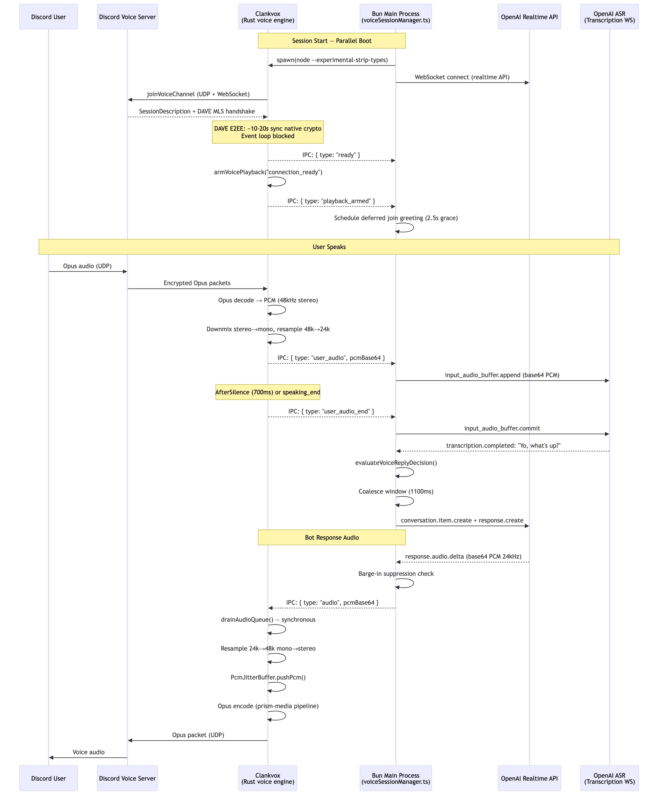
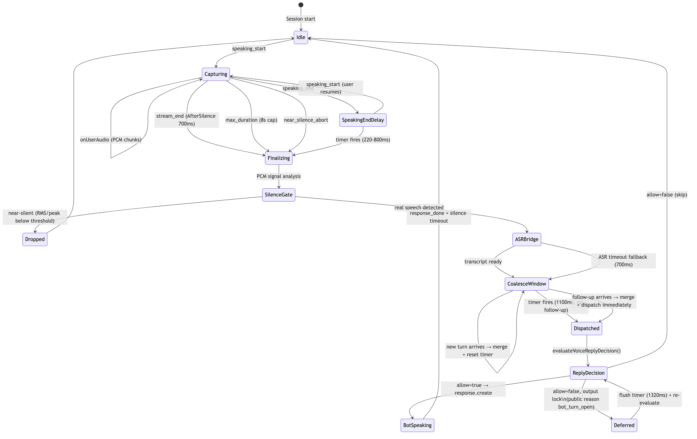
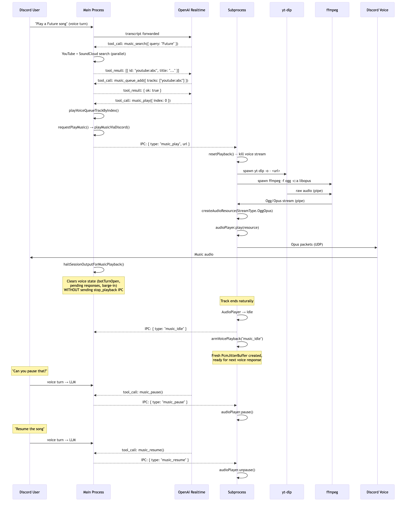

# Voice Subprocess Architecture (Node Reference)

This document covers the Node.js voice chat and music playback systems in `src/voice/voiceSubprocess.ts` — how audio flows, how the bot decides when to speak, and how music integrates without disrupting voice conversation.

Treat this as the Node behavior reference when validating parity work.


<!-- source: docs/diagrams/voice-subprocess-architecture.mmd -->

## Why a Subprocess?

The main process runs on **Bun**, but `@discordjs/voice` depends on native C++ addons (`sodium-native`, `@discordjs/opus`, `prism-media`) that don't work reliably under Bun's Node compatibility layer. The voice subprocess runs on **Node.js** to isolate the entire audio stack — VoiceConnection (UDP), AudioPlayer (20ms frame timer), Opus encode/decode, and voice receiver — in a runtime where native addons work correctly.

The subprocess is spawned with `node --experimental-strip-types` (Node 22+ strips TypeScript annotations at load time, no transpile step needed). It boots in parallel with the realtime LLM API connection so neither blocks the other.

## IPC Protocol

The main process and subprocess communicate via Node.js child-process IPC (`process.send` / `process.on("message")`). Messages flow in both directions:

**Main → Subprocess:**
`join`, `voice_server`, `voice_state`, `audio`, `stop_playback`, `subscribe_user`, `unsubscribe_user`, `music_play`, `music_stop`, `music_pause`, `music_resume`, `destroy`

**Subprocess → Main:**
`ready`, `playback_armed`, `adapter_send`, `connection_state`, `player_state`, `speaking_start`, `speaking_end`, `user_audio`, `user_audio_end`, `music_idle`, `music_error`, `error`

Audio IPC uses a 5ms batching optimization — `sendAudio()` accumulates raw PCM buffers and flushes them as a single base64-encoded IPC message (`audio` with `pcmBase64` + `sampleRate`), reducing overhead during burst arrivals from the realtime model.

### Gateway Adapter Proxy

The subprocess cannot access the Discord WebSocket gateway (owned by the main Bun process). A proxy adapter pattern bridges this:

1. Discord sends voice server/state info through the gateway → main process forwards as `voice_server`/`voice_state` IPC
2. `@discordjs/voice` needs to send OP4 voice state updates → subprocess sends `adapter_send` IPC → main process forwards to the real gateway shard

## The DAVE Race Condition

DAVE (Discord Audio/Video Encryption) is Discord's E2EE protocol for voice channels. After the VoiceConnection reaches `Ready`, a DAVE MLS handshake performs **synchronous native Rust crypto operations** (`@snazzah/davey` NAPI addon) that block the Node.js event loop for 10-20 seconds.

Because DAVE uses the MLS (Messaging Layer Security) protocol, it requires computationally heavy cryptographic operations that scale with the number of people in the voice channel. Currently, the NAPI bindings that bridge this Rust implementation to Node.js execute these operations synchronously. During this window, `setTimeout` callbacks are starved — they cannot fire until the crypto completes. This caused a critical latency bug: audio chunks arriving via IPC would pile up in the queue for 17+ seconds because `setTimeout(drainAudioQueue, 1)` couldn't execute.

### The Rust Subprocess Solution

Because the fundamental issue is Node.js's single-threaded event loop getting blocked by synchronous NAPI calls, rewriting the voice subprocess entirely in Rust (e.g., using the `songbird` library) elegantly bypasses this. Rust has true multi-threading, allowing the heavy DAVE/MLS cryptographic handshake to be offloaded to a background OS thread (via Tokio). This means the main thread handling UDP sockets, Opus framing, and IPC communication never skips a beat, allowing audio to flow instantly without any latency or timer starvation.

### Node.js Mitigations

1. **Synchronous audio drain:** `handleAudio()` calls `drainAudioQueue()` synchronously on the same event loop tick as the IPC message arrival, bypassing timer starvation.

2. **Pre-armed playback stream:** `armVoicePlayback("connection_ready")` creates the PcmJitterBuffer + Opus encoder pipeline + calls `audioPlayer.play()` immediately when the connection reaches Ready. By the time audio arrives, the player is already primed — no cold-start latency.

3. **Join greeting absorption:** A 3-second deferred greeting fires after `playbackArmed`, naturally absorbing the DAVE latency. The user hears the bot announce itself, and by the time they respond, everything is warmed up.

4. **Higher decryption tolerance:** `decryptionFailureTolerance: 200` (default is 36) prevents premature connection teardown during the handshake.

---

## Voice Chat

### Audio Output Pipeline (LLM → Discord)

```
Realtime provider client (OpenAI/xAI/Gemini/ElevenLabs)
  → audio delta events (base64 PCM, provider sample rate)
  → voiceSessionManager: barge-in suppression check
  → IPC: { type: "audio", pcmBase64, sampleRate } (5ms batched)
  → subprocess: drainAudioQueue() — synchronous
  → convertXaiOutputToDiscordPcm: resample input rate→48k, mono→stereo
  → PcmJitterBuffer: slice into 3840-byte frames (20ms @ 48kHz stereo s16le)
  → createAudioResource(StreamType.Raw): Opus encoder pipeline
  → AudioPlayer: 20ms frame timer pulls Opus packets
  → VoiceConnection: UDP to Discord voice server
  → User hears audio
```

The `PcmJitterBuffer` is a pull-based `Readable` stream that stays open indefinitely. The AudioPlayer pulls one 20ms frame per cycle. The `maxMissedFrames: 250` setting tolerates up to 5 seconds of silence before considering the stream dead. `silencePaddingFrames: 250` prevents cutoff artifacts.

### Audio Input Pipeline (Discord → ASR)

```
Discord voice server
  → Encrypted Opus packets (UDP)
  → subprocess: receiver.subscribe(userId, AfterSilence: 700ms)
  → prism-media Opus decoder → PCM (48kHz stereo s16le)
  → convertDiscordPcmToXaiInput: downmix stereo→mono, resample 48k→configured input rate (commonly 24k)
  → IPC: { type: "user_audio", userId, pcmBase64 }
  → voiceSessionManager: capture accumulation + signal analysis
  → ASR bridge: OpenAI Realtime Transcription WebSocket
```

The subprocess auto-subscribes on `speaking_start` immediately, without waiting for a `subscribe_user` IPC round-trip — this prevents missing the beginning of the user's speech.

### Per-User ASR vs Shared ASR

Two ASR modes are available (configured via `voice.openaiRealtime.usePerUserAsrBridge`, default `true`):

**Per-user ASR** (default): Each speaking user gets their own dedicated `OpenAiRealtimeTranscriptionClient` WebSocket. Audio is streamed exclusively to their session. Supports concurrent speakers without handoff delays. Pre-warmed at join time to avoid the 1-4s connection cost on first utterance.

**Shared/Mono ASR**: A single WebSocket is shared. Only one user streams at a time; others queue for handoff after the current speaker's utterance commits. Lower resource usage but higher latency with concurrent speakers.

Both use the ASR bridge pattern: after capture finalization, the bridge commits audio to the ASR session and races the transcript result against a 700ms timeout. Whichever resolves first wins — the turn is dispatched with the transcript if available, or with raw PCM as fallback.

### Turn Detection


<!-- source: docs/diagrams/voice-turn-lifecycle.mmd -->

Turn boundaries are detected through multiple layers:

1. **Discord VAD** (`speaking.start`/`speaking.end`): WebRTC voice activity detection at the protocol level.

2. **AfterSilence stream end** (700ms): The Opus subscription automatically ends after 700ms of silence, firing `user_audio_end`.

3. **Speaking-end finalize timer** (220-800ms): When Discord fires `speaking_end`, a configurable delay timer starts before the capture is finalized. If the user resumes speaking before the timer fires, it's cancelled — keeping the capture open across brief pauses. The delay scales with capture age:
   - Micro captures (<260ms): 420ms delay
   - Short captures (<900ms): 220ms delay  
   - Normal captures (>=900ms): 800ms delay
   - Under load: scaled down by 0.7x or 0.5x

4. **Silence gate**: Post-capture PCM analysis filters out near-silent captures (Discord VAD false positives) before ASR. Evaluates RMS, peak amplitude, and active sample ratio against thresholds. Prevents hallucinated transcripts from ambient noise.

5. **Realtime turn coalesce window** (1100ms): Holds a finalized turn briefly before dispatching. If another segment from the same speaker arrives within the window, the turns are merged and dispatched as one. Prevents mid-sentence splits like "Play a Future song" + "like the rapper" from producing two separate responses.

### Addressing: How the Bot Decides When to Talk

The `evaluateVoiceReplyDecision` function runs on every finalized user turn to decide whether the bot should respond. It uses a multi-stage pipeline:

**Stage 1 — Deterministic wake word detection:** Tokenizes the bot name and transcript, checking for exact token-sequence matches, merged wake tokens, and primary wake token presence. Fast path — no LLM call needed.

**Stage 2 — LLM direct-address classifier** (optional): If the wake word check is ambiguous and a name cue is detected, an LLM classifier can score confidence that the user is addressing the bot. The default model target is `claude-haiku-4-5` with threshold `0.62`, but this stage is controlled by `voice.replyDecisionLlm.enabled` (default `false`).

**Stage 3 — Conversation state check:** Two states exist:
- **`engaged`**: The current speaker recently directly addressed the bot (within 35s) and the bot replied. Follow-up speech from the same speaker auto-allows.
- **`wake_word_biased`**: Default state. The bot requires more explicit addressing signals.

**Stage 4 — LLM reply decision:** A YES/NO classifier (temperature 0, usually max 2 output tokens) evaluates the full context — transcript, participant count, engagement state, reply eagerness, join window status, and recent turn history. The system prompt encodes rules about eagerness levels, wake-word variants, and multi-participant etiquette.

**Join window bias:** During the first 25 seconds after joining, the reply decider is biased toward responding to short greetings, even without explicit wake-word addressing.

### Thought Loop (Proactive Speech)

The thought engine allows the bot to speak unprompted after extended silence. It runs on a timer:

1. **Silence check:** Fires after `minSilenceSeconds` of channel silence (default settings: 15s; clamped to 8-300s).
2. **Probability gate:** `eagerness / 100` chance per check. At eagerness 50, there's a 50% chance per timer fire.
3. **Thought generation:** An LLM call drafts a short spoken line using recent conversation context, participant names, and durable memory facts. A **topicality bias** system decays the topic tether over time:
   - **Anchored:** Strongly tied to recent topic
   - **Blended:** Mix of topic and novelty
   - **Ambient:** Standalone observations with weak/no topic tether  
   Phase timing is dynamic and derived from `minSilenceSeconds` + `minSecondsBetweenThoughts` rather than fixed hardcoded windows.
4. **Decision gate:** A second LLM call judges whether the thought is worth speaking. Can rewrite it using memory facts.
5. **Delivery:** Via `requestRealtimeTextUtterance()` (which calls the realtime client's `requestTextUtterance()`) to inject the line into the live conversation and trigger synthesis.

### Barge-In

When a user speaks while the bot is talking, the barge-in system handles interruption:

1. **Detection:** During live audio capture, each chunk is evaluated for assertiveness (not near-silent). After `BARGE_IN_MIN_SPEECH_MS` (700ms) of assertive capture, barge-in fires.

2. **Interruption:** `interruptBotSpeechForBargeIn` cancels the active OpenAI response, truncates the conversation item to the estimated played duration (so the LLM's context reflects what the user actually heard), resets bot audio playback, and clears `botTurnOpen`.

3. **Output suppression:** For up to 12 seconds, incoming LLM audio deltas are counted but silently dropped — preventing the cancelled response from leaking through.

4. **Retry mechanism:** The interrupted utterance text is saved in `pendingBargeInRetry`. After the user finishes speaking:
   - If the user spoke for <2200ms (brief interruption), the bot retries its original response.
   - If the user spoke for >=2200ms (full override), the retry is discarded and the user's new speech is processed normally.

### Bot Turn Open / Deferred Turns

When the bot is actively speaking (`botTurnOpen = true`), new user turns are **deferred** instead of dispatched:

1. The turn is queued in `pendingDeferredTurns` (max 8 entries).
2. A flush timer starts (1320ms, debounced on each new queued turn).
3. When the timer fires and the bot has stopped speaking, up to 5 deferred turns are coalesced (transcripts space-joined, PCM buffers concatenated) and re-evaluated through `evaluateVoiceReplyDecision`.

---

## YouTube Music Playback


<!-- source: docs/diagrams/voice-music-playback.mmd -->

### Search → Queue → Play

1. **Voice command:** User says "play a Future song" → captured, transcribed, forwarded to OpenAI Realtime.
2. **Tool call — `music_search`:** The LLM invokes the search tool. YouTube and SoundCloud are searched in parallel. Results are fuzzy-sorted by relevance to the query.
3. **Tool call — `music_queue_add`:** The LLM adds selected tracks to the voice session's music queue by track ID (e.g., `youtube:6OxmafNPn3o`).
4. **Tool call — `music_play`:** The LLM starts playback by queue index.

### Subprocess Pipeline

When `music_play` arrives at the subprocess:

1. The URL is staged as **pending music** (it does not start immediately).
2. The subprocess waits for announcement TTS timing so "now playing ..." can finish naturally:
   - wait up to 5s for announcement audio to appear,
   - once audio appears, wait for a 500ms IPC audio gap plus empty drain queue,
   - finish the bot stream and wait for `end` (with 5s safety timeout),
   - absolute safety timeout: 15s from `music_play`.
3. After that, `commitPendingMusic()` runs `resetPlayback()`.
4. **yt-dlp** is spawned to extract best audio to stdout.
5. **ffmpeg** is spawned to transcode into Ogg/Opus container format (48kHz stereo, 128kbps).
6. `yt-dlp.stdout.pipe(ffmpeg.stdin)` connects the pipeline.
7. `createAudioResource(ffmpeg.stdout, { inputType: StreamType.OggOpus })` wraps the stream.
8. `audioPlayer.play(resource)` starts playback through the same AudioPlayer used for voice.

Both paths (YouTube via yt-dlp and direct URLs) use `-f ogg -c:a libopus` to produce proper Ogg/Opus container output that the `OggOpusDemuxer` can parse. (A previous bug used `-f opus` which produced raw Opus packets without container framing — the demuxer couldn't find valid Ogg pages and the player cycled `idle → buffering → idle` endlessly.)

### Pause, Resume, Stop

- **Pause:** Does not use `audioPlayer.pause()`. It cancels pending music start, snapshots the currently playing resource (if any), clears stale music idle listeners, and re-arms voice playback via `armVoicePlayback("music_pause")`.
- **Resume:** Replays the saved resource if still readable; otherwise restarts from `activeMusicUrl` by spawning a fresh yt-dlp/ffmpeg pipeline.
- **Stop:** `resetPlayback()` kills yt-dlp/ffmpeg, destroys the stream, then `armVoicePlayback("music_stop")` re-creates a fresh voice PcmJitterBuffer so the bot can speak again immediately.

### Voice State Management During Music

When music starts, `haltSessionOutputForMusicPlayback` clears voice conversation state (pending responses, barge-in suppression, bot turn open, deferred turns) **without** sending `stop_playback` IPC. This is critical — music start is coordinated inside the subprocess (including pending/commit timing), and a blind `stop_playback` from main can cut either announcement playback or active music.

### Resuming Voice After Music

When a track ends naturally, the subprocess fires `music_idle` and calls `armVoicePlayback("music_idle")`, which creates a fresh PcmJitterBuffer and calls `audioPlayer.play()`. The voice pipeline is immediately ready to receive the next LLM audio response — no setup latency. On the main process side, `music.active` goes false, which unlocks the reply output lock and allows new user turns to trigger bot responses.

---

## Rust Parity Checklist (Against Node Reference)

Status snapshot: 2026-03-02.  
Goal: make Rust behavior-compatible with this Node reference before voice cutover.

### P0 — Must Match Before Cutover

| Area | Node reference behavior | Rust status now | Parity target |
|---|---|---|---|
| IPC event contract | Main logic depends on `ready`, `playback_armed`, `adapter_send`, `connection_state`, `player_state`, `speaking_start`, `speaking_end`, `user_audio`, `user_audio_end`, `music_idle`, `music_error`, `error` | `user_audio_end` is not emitted in active flow | Emit all events consumed by `voiceSessionManager` with equivalent timing semantics |
| User capture lifecycle | Auto-subscribe on `speaking_start`, finalize on `AfterSilence` + `user_audio_end`; avoid stale unsubscribe races | `subscribe_user`/`unsubscribe_user` are effectively config/no-op in Rust | Recreate end-of-utterance signal semantics expected by main-process capture logic |
| Music start UX | `music_play` is deferred so announcement audio can finish first | Rust starts music immediately on `music_play` | Implement pending-music deferral (5s wait for first audio, 500ms gap, stream drain, 15s safety timeout) |
| Music pause/resume | Pause preserves resumable playback resource; resume replays or URL-restarts | `music_pause` behaves like stop; resume path is not equivalent | Match Node pause/resume behavior and recovery path |
| Voice re-arm after music | `armVoicePlayback(...)` keeps TTS immediately ready after `music_idle` / stop / pause paths | Rust currently arms on connection ready only | Preserve equivalent "ready to speak immediately after music" behavior |
| Stop-playback semantics | `stop_playback` clears active playback and restores speaking path without leaking stale audio | Partial | Match Node reset guarantees for barge-in + tool transitions |

### P1 — Strong Behavioral Parity

| Area | Node reference behavior | Rust status now | Parity target |
|---|---|---|---|
| Player state observability | Rich state transitions (`idle`, `buffering`, `playing`, etc.) are surfaced to main process | Rust emits a narrower `player_state` set | Emit equivalent states (or a mapped superset) so operational behavior and logs stay consistent |
| Input/output sample-rate expectations | Main process sends output with per-event `sampleRate`; input capture honors configured realtime sample rate | Implemented, but needs regression validation across providers | Validate parity for OpenAI/xAI/Gemini/ElevenLabs sample-rate combinations |
| Barge-in safety | Interrupted bot speech should not leak stale audio; retries depend on clean playback reset | Unverified parity | Preserve interruption, suppression, and retry behavior perceived by users |

### P2 — Validation/Signoff Checklist

- [ ] Golden parity run for join greeting, first response latency, and normal Q/A turn flow.
- [ ] Barge-in scenario: short interruption retries; long interruption cancels retry.
- [ ] Multi-speaker scenario: no lost first syllables; no stuck capture state.
- [ ] Music scenario: announcement finishes before track start; pause/resume/stop all preserve voice readiness.
- [ ] Disconnect/reconnect scenario: connection teardown and cleanup events match main-process expectations.
- [ ] Operational logs still provide equivalent debugging signals (`voice_runtime`, `voice_error`, subprocess lifecycle).
