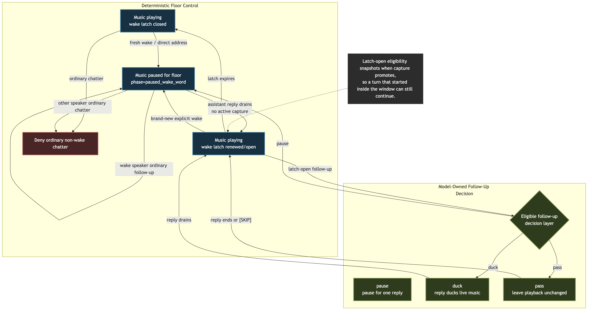

# Voice Music

> **Scope:** Canonical music interaction rules for voice sessions — playback phases, output lock interaction, wake-word pause/resume behavior, wake latch semantics, and duck/unduck behavior while the bot speaks.
> Voice output state machine: [`voice-output-and-barge-in.md`](voice-output-and-barge-in.md)
> Voice reply admission/orchestration: [`voice-client-and-reply-orchestration.md`](voice-client-and-reply-orchestration.md)
> Provider/runtime pipeline: [`voice-provider-abstraction.md`](voice-provider-abstraction.md)
> Cross-cutting settings contract: [`../settings.md`](../settings.md)

---

## 1. Purpose

Persistence, preset inheritance, dashboard envelope shape, and save/version semantics live in [`../settings.md`](../settings.md). This document only covers music-local voice behavior and the settings that shape that behavior.

Music behavior crosses several voice subsystems:

- playback lifecycle
- reply output locking
- admission gating while music is active
- wake-word interruption
- bot-speech ducking

Slash music commands that imply VC playback are also voice-entry points. `/music play`, `/music add`, and `/music next` treat the command itself as an explicit invitation to join the requester's current voice channel when no voice session exists yet. If join policy, permissions, or runtime prerequisites block that bootstrap, playback does not start.

This document is the canonical source of truth for the music-specific rules. Other voice docs should summarize only the part that matters to their own state machine and link back here.

<!-- source: docs/diagrams/music-conversation-state.mmd -->

Read the diagram as the shortest canonical mental model:

- `paused_wake_word` is still the explicit floor-taking state
- once music resumes and the wake latch is open, ordinary conversation belongs to the main reply brain again
- the dedicated music brain only exists to short-circuit compact music-side control/disambiguation turns

## 2. Canonical Concepts

Two separate mechanisms matter:

- `MusicPlaybackPhase`: whether music is conceptually present, audible, paused, or idle
- music wake latch: whether the bot should keep listening for short follow-ups without requiring another wake word

They are related but not the same:

- music can be `playing` while the wake latch is open or closed
- music can be `paused_wake_word` while the bot is taking the floor
- the wake latch affects admission behavior, not the playback transport itself

Music is an overlay on top of shared attention, not a third attention mode. Clanker can be `ACTIVE` or `AMBIENT` while music is present.

## 3. Playback Phases

Important phase meanings:

- `loading`: a play request has already been accepted and playback startup is in progress; command-only behavior and the music output lock are active even before first PCM arrives
- `playing`: music is audible; output lock and command-only music behavior are active
- `paused_wake_word`: music was auto-paused because someone explicitly addressed the bot
- `paused`: music was paused intentionally, not by wake-word handoff
- `idle`: no active music session

Important implications:

- output lock for music is tied to active playback intent, including the `loading` phase before audio becomes audible
- ducking is relevant only while music is `playing`
- `paused_wake_word` is a handoff state, not just a generic pause

## 4. Wake-Word Handoff

Fresh wake while music is actively playing:

- explicit bot-name / wake-word address pauses music immediately
- phase becomes `paused_wake_word`
- this creates clean conversational floor-taking instead of talking over full-volume music

Wake-word-paused music resume:

- music does **not** resume at `response.done`
- it resumes only after the assistant reply has actually drained from `clankvox`
- the short `botTurnOpen` guard must also clear before resume happens
- if the user barges in with a new live capture while music is `paused_wake_word`, auto-resume waits until that interrupting capture clears instead of restarting music into the user's next turn

This means audible UX is anchored to real playback completion, not model completion.

## 5. Wake Latch

The wake latch is a short follow-up window during music playback.

Public control:

- `voice.admission.musicWakeLatchSeconds`

Canonical behavior:

- a fresh direct address during active music arms the latch
- while music is still `paused_wake_word`, ordinary follow-ups stay owned by the wake-word speaker who opened that pause
- for ordinary replies spoken over still-playing music, the passive follow-up window refreshes after assistant speech actually settles, not while buffered reply audio is still draining
- when wake-word-paused music resumes after assistant playback drains, the latch renews from that real resume moment
- once a follow-up capture is promoted while the latch is open, that turn keeps its eligibility even if finalization lands just after the latch expires
- while the latch is open, normal conversational follow-ups can pass reply admission without repeating the wake word
- when the latch expires, non-command non-wake chatter goes back to being denied during active music

The latch is intentionally simple once music is back to `playing`:

- open or closed
- not conversational ownership for ordinary follow-ups
- command/disambiguation ownership still applies separately where the command system requires it

## 6. Music Brain

Music control is model-owned once a turn is allowed past the deterministic safety gates.

Deterministic layer responsibilities:

- verify that the turn is even eligible while music is active
- enforce wake-word ownership while music is still `paused_wake_word`
- enforce the simple open/closed wake latch while music is back to `playing`
- keep acoustic safety and barge-in safety separate from conversational decisions

When `agentStack.runtimeConfig.voice.musicBrain.mode` is `dedicated_model`, only compact music-control/disambiguation turns go to a small music brain first. That model sees:

- the heard transcript
- a tiny slice of recent spoken context: the last assistant reply and the previous turn from the same speaker when available
- current playback phase and queue state
- whether the turn was a fresh direct address
- whether the wake latch is open
- whether the paused wake-word conversation is still owned by this speaker
- only the music tool surface

The dedicated music brain then returns one of two outcomes:

- `consumed`: handle the turn with music tools and stop there; no normal spoken reply is required
- `pass`: this was not really a music-side command; let the main reply path decide whether to answer

The dedicated music brain does not choose `pause` or `duck` handoffs anymore. Those are main-brain floor-control decisions.

The dedicated model binding lives under `agentStack.runtimeConfig.voice.musicBrain`. It stays separate from the reply admission/classifier model and still applies when reply admission is set to `generation_decides`. Presets still expose a small fallback model when this mode is turned on, but the default runtime mode is `disabled`, so the main reply brain owns music handoff unless the user explicitly enables the dedicated music brain.

When `agentStack.runtimeConfig.voice.musicBrain.mode` is `disabled`, the deterministic safety gates still decide whether the turn is eligible during active music, but the dedicated music brain is bypassed. The main reply brain then owns the temporary music handoff decision itself:

- `music_reply_handoff(mode=pause)` for a one-reply floor-taking pause that auto-resumes
- `music_reply_handoff(mode=duck)` for a one-reply duck/unduck handoff
- no handoff tool call when it wants to speak normally over current playback state
- `[SKIP]` when the wake word got attention but the bot decides not to respond

Persistent playback tools stay separate:

- `music_pause` means leave playback paused beyond the current reply
- `music_resume` means restore paused playback now
- `music_stop` means stop playback

## 7. Pause Versus Duck

This is the intended nuanced behavior:

- first fresh wake during active music: pause
- after music resumes and the latch is open: ordinary follow-up replies can stay conversational without another wake word, and the main reply brain decides whether that reply should pause, duck, do nothing, or stay silent
- a brand-new explicit wake word during that same latch-open window: pause again
- if the bot speaks while music is still live and no handoff was claimed, it should usually favor a quick reaction or short answer unless the moment clearly wants more
- if the brain chooses `music_reply_handoff`, that only means this reply can temporarily take the floor and playback auto-restores afterward; the bot still decides whether the answer stays brief or goes longer

So “latch-open follow-up” and “fresh wake” are intentionally different:

- latch-open follow-up means “conversation can continue naturally”
- fresh wake means “the user explicitly wants the bot to take the floor again”

## 8. Ducking

Ducking is gain-only:

- duck/unduck lowers and restores music volume
- it does not pause the track
- it is used only when the main reply brain explicitly chooses `music_reply_handoff(mode=duck)` and assistant speech happens while music remains in the `playing` phase

This is the steady-state path for post-resume follow-ups that do not reopen a fresh wake-word pause.

## 9. Output Lock Interaction

Music interacts with reply output in two ways:

- active music playback contributes an orthogonal output lock (`music_playback_active`)
- wake-word-paused music temporarily clears the floor so the assistant can answer cleanly

Important distinction:

- `music_playback_active` is not part of the assistant output phase machine
- it is composed with assistant output state at reply-lock evaluation time

For the full output state machine, see [`voice-output-and-barge-in.md`](voice-output-and-barge-in.md).

## 10. Admission Interaction

During active music:

- no wake latch: non-wake chatter is denied
- while music is `paused_wake_word`: only the wake-word speaker's ordinary follow-ups can continue without another wake word
- wake latch open: follow-ups can continue without repeating the wake word
- a recent same-speaker follow-up immediately after a successful barge-in also stays eligible even if no wake latch is open; interrupted speech should not be reclassified as background chatter
- fresh wake-word/direct-address turns go straight to the main reply brain
- exact compact control words like `pause`, `stop`, `skip`, and `resume` use an immediate fast path when the dedicated music brain is enabled
- fuzzy control/disambiguation turns use the dedicated music brain only to decide whether they should be consumed as music-side commands
- with the dedicated music brain disabled, even those control/disambiguation turns go straight to the main reply brain
- once music-mode handling returns `pass`, or when the dedicated music brain is disabled, the turn continues through the normal reply admission/reply-generation path
- pending music disambiguation followups resolve against the active option set before ordinary reply planning, even if playback has not started yet and music is still effectively idle
- pending music disambiguation first uses cheap exact/ordinal/title matching, then may use a bounded model resolver over the active option list for fuzzy or ASR-noisy references; it never invents a new option id or starts a fresh search from that followup alone
- `music_play` treats `selection_id` as advisory when a query is also present; if the selection id is stale or malformed, the tool logs the bad id and falls back to query search instead of failing the whole play request
- `music_queue_next` and `music_queue_add` can resolve ordinary queue requests directly from query text, or reuse an exact `selection_id`/track id when one is already known
- for "play X, then queue Y" turns, the intended tool order is `music_play` first and `music_queue_next` second in the same tool turn; this avoids stranding the queue intent behind async playback startup
- spoken confirmations should not claim a track is queued until `music_queue_next` or `music_queue_add` has actually succeeded
- pending music disambiguation or command followups still use the canonical `voiceCommandState` ownership rules managed by `VoiceSessionManager`
- raw PCM music turns use the same transcription-plan and mini-model fallback policy as ordinary voice turns

The wake latch does not force a reply. It only stops the music prefilter from hard-swallowing a turn before the active music-decision layer can decide what kind of handoff, if any, should happen.

## 11. Logging And Debugging

When debugging music conversation behavior, start with:

- `voice_music_stop_check`
- `voice_music_paused_for_wake_word`
- `voice_music_resumed`
- `voice_music_output_halted`
- `voice_turn_addressing`
- `openai_realtime_response_done`

Interpretation rules:

- `decisionReason=swallowed`: music prefilter consumed the turn before normal reply admission
- `decisionReason=interrupted_reply_followup`: a recent same-speaker follow-up after successful barge-in stayed eligible despite music still playing
- `decisionReason=fast_path_pause|stop|skip|resume`: an exact compact control word was consumed immediately without invoking the music brain
- `decisionReason=music_brain_consumed`: the music brain handled the turn itself, usually with music tools
- `decisionReason=music_brain_pass`: the music brain decided this was not really a music-side command and let the ordinary reply path continue
- `decisionReason=main_brain_decides`: the turn was forwarded straight to the main reply brain; inspect `gateDecisionReason` to see whether it came from direct address, wake-latch followup, interrupted-reply followup, or disabled music-brain routing
- interrupted assistant speech should clear any queued realtime assistant utterances from the abandoned reply before new playback begins
- `paused_wake_word` followed by resume after playback drain and capture clear is the expected clean handoff path

## 12. Code Anchors

- `src/voice/voiceMusicPlayback.ts`
- `src/voice/musicWakeLatch.ts`
- `src/voice/replyManager.ts`
- `src/voice/voiceReplyDecision.ts`
- `src/voice/voiceSessionTypes.ts`
- `src/voice/sessionLifecycle.ts`

Product language: music should feel like background atmosphere that politely makes room when directly invoked, then slips back under the conversation without forcing the user to keep re-summoning the bot.
