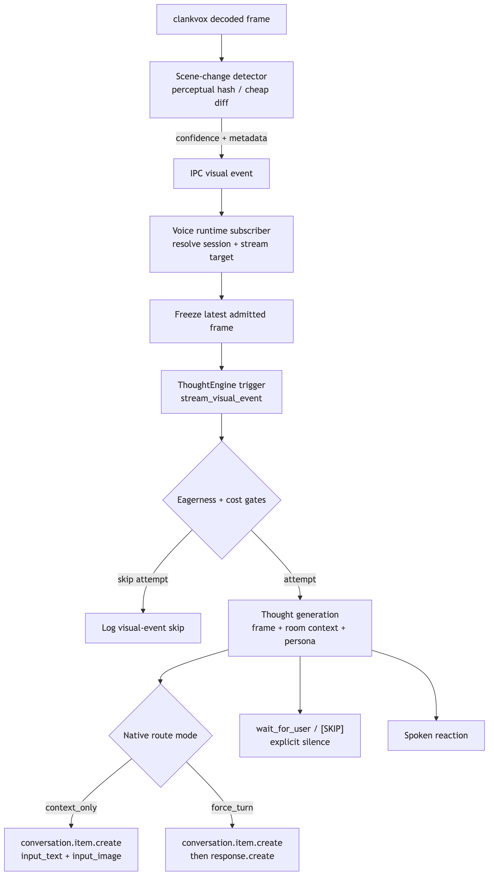

# Proactive Stream Commentary

Design contract for letting the voice agent notice visual moments in an active screen watch and decide whether to react without waiting for a user question.

Canonical screen-watch pipeline: [`screen-share-system.md`](screen-share-system.md)

Provider architecture: [`voice-provider-abstraction.md`](voice-provider-abstraction.md)



<!-- source: docs/diagrams/proactive-stream-commentary.mmd -->

## Product Shape

The agent is a realtime social participant. If something visually funny, tense, impressive, or useful happens on a shared screen, it can blurt out like a friend in the room. It should not wait for a silence window before reacting, because the best stream reactions often happen while everyone is already talking.

The runtime supplies event context and a sampled frame. The model decides whether the moment earns an interjection. Silence is a model choice through `[SKIP]` or `wait_for_user`, not a deterministic infrastructure gate.

## Target Architecture

Frame decode stays in the current screen-watch media plane:

- Native Discord Go Live and webcam frames are decoded in `clankvox` or the existing Bun fallback.
- Every admitted frame continues to refresh `streamWatch.latestFrameDataBase64`.
- The existing note loop still produces private rolling observations.
- `look_at_screen` remains the on-demand tool for user-driven or model-driven glances.

Proactive commentary adds a visual-event path:

- `clankvox` runs a cheap scene-change detector near the decoder, using perceptual hash or comparable low-cost frame diff.
- `clankvox` emits an IPC event with detector confidence, frame metadata, stream identity, and timing.
- Voice runtime subscribes to the IPC event and resolves the active voice session plus current screen-watch target.
- Runtime calls the voice thought engine with trigger source `stream_visual_event` and a frozen frame snapshot.
- Thought generation sees the visual event, recent voice context, active audio state, persona, screen-watch notes, and detector metadata.
- The model returns speech, `[SKIP]`, or on native realtime calls `wait_for_user` to explicitly do nothing.

## Native Realtime Routing

OpenAI realtime vision is still sampled image input, not continuous video. Proactive commentary should use one of two modes per setting:

| Mode | Runtime action | Product effect |
| --- | --- | --- |
| `context_only` | Send `conversation.item.create` with `input_text` plus `input_image`; do not force `response.create` | The model gains fresh visual context and can use it on the next natural turn |
| `force_turn` | Send the same image item, then `response.create` | The model immediately decides whether to speak or choose silence |

`context_only` is the conservative default for ambient awareness. `force_turn` is the streamer-reactive mode for gaming, watch parties, demos, or personas expected to riff in real time.

## Thought Engine Contract

`src/voice/thoughtEngine.ts` should accept a trigger source beyond the silence timer:

- `timer` remains the ambient silence/cadence trigger.
- `stream_visual_event` is a visual event trigger and does not evaluate `minSilenceSeconds`.
- `stream_visual_event` still respects infrastructure safety gates such as session active, output channel locked, thought loop busy, pending realtime turn backlog, and cost/rate caps.
- `stream_visual_event` uses eagerness as the primary probability gate.
- The thought candidate and decision prompts should state that most visual events deserve silence, but memorable moments can justify interrupting active room audio.

The thought engine should receive a structured payload instead of encoding all event details into a string trigger:

| Field | Purpose |
| --- | --- |
| `source` | `stream_visual_event` |
| `frame` | Frozen `{ mimeType, dataBase64 }` snapshot from the latest admitted frame |
| `detectorConfidence` | Scene-change confidence from `clankvox` |
| `changeKind` | Optional detector label such as `scene_cut`, `large_motion`, or `text_change` |
| `streamerUserId` | Active screen-watch target |
| `streamerName` | Display name for prompt context |
| `routeMode` | `context_only` or `force_turn` |

## Eagerness Model

Visual-event commentary uses eagerness only as the social-volume knob. It does not require silence.

Attempt probability should derive from:

- `initiative.voice.eagerness`
- detector confidence
- visual-event cooldown or per-minute budget as a cost gate
- persona eagerness bias

Persona bias is additive and bounded. A hype-gamer-bro persona gets a positive baseline boost for high-energy stream events. A quieter analyst persona gets little or no boost. The final probability should still clamp to `0..100`.

Example formula:

```text
effectiveEagerness = clamp(initiative.voice.eagerness + personaBias + detectorBonus, 0, 100)
attempt = random() < effectiveEagerness / 100
```

This gate decides whether to spend model work on a visual-event thought attempt. The model still decides whether to speak.

## No Silence Requirement

Do not add a hard audio-quiet gate for `stream_visual_event`.

The model should see active audio context and decide whether an interjection fits. That supports the social-participant principle: sometimes the right reaction is to yell over the room because the moment warrants it.

Allowed runtime gates:

- cost/rate limits
- active session and screen-watch state
- output transport already locked by bot speech
- cancellation and shutdown safety
- permission and capability checks

Not allowed as deterministic gates:

- `minSilenceSeconds`
- active human capture by itself
- room currently talking by itself

## `wait_for_user` Semantics

Native realtime sessions need a no-op tool for explicit silence because `[SKIP]` is a text convention from the brain path. `wait_for_user` is that tool.

Contract:

- Tool name: `wait_for_user`
- Arguments: none, or optional short `reason` for logging
- Behavior: return `{ ok: true, waiting: true }`
- Continuation policy: `fire_and_forget`
- Product meaning: the model chose not to speak now and is waiting for the room or the next event

The tool should be available to provider-native realtime sessions so proactive visual turns can end cleanly without forcing filler speech.

## Logging And Tuning

Flight recorder coverage should make tuning possible without guessing:

- `stream_visual_event_detected` logs detector confidence, change kind, frame age, and stream target.
- `stream_visual_event_eagerness_skipped` logs effective eagerness, persona bias, detector bonus, and random roll.
- `stream_visual_event_thought_started` logs route mode and frame metadata.
- `stream_visual_event_wait_for_user` logs explicit model silence.
- `stream_visual_event_spoken` logs final text, provider/model, and latency.

The useful product ratios are attempts per minute, model-silence rate, spoken-reaction rate, and average visual-event latency.

## Implementation Sequence

1. Add `clankvox` scene-change IPC events with confidence and stream identity.
2. Add voice runtime subscription that resolves active stream watch and freezes the current frame.
3. Extend `ThoughtEngine` trigger inputs to carry `stream_visual_event` metadata and skip the silence gate for that trigger.
4. Route native realtime context through `conversation.item.create` for `context_only` or `response.create` for `force_turn`.
5. Add `wait_for_user` to provider-native realtime tools.
6. Add logs and runtime snapshot fields for visual-event attempts, skips, and spoken reactions.

## Product Language

Proactive stream commentary makes Clanky feel like it is actually watching with the room. It can notice the clutch play, the weird popup, or the funny cut and decide whether to jump in, while still using eagerness and persona to control how loud of a friend it should be.
