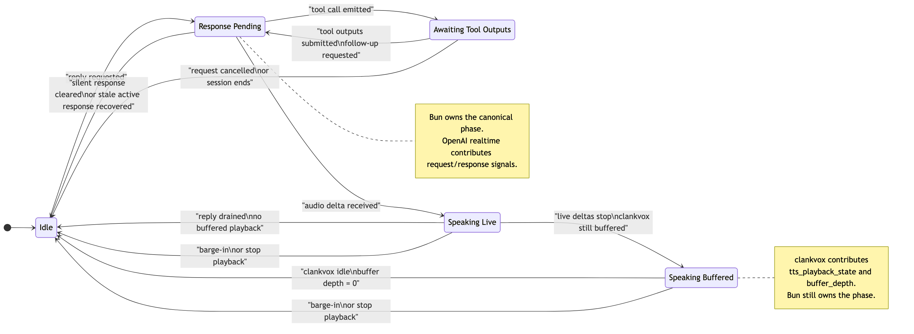

# Voice Output and Barge-In

> **Scope:** Assistant reply/output lifecycle and barge-in interruption handling — output phase state machine, acoustic gating, interrupt execution, and post-interruption recovery.
> Voice pipeline stages: [`voice-provider-abstraction.md`](voice-provider-abstraction.md)
> Capture and ASR: [`voice-capture-and-asr-pipeline.md`](voice-capture-and-asr-pipeline.md)
> Reply orchestration: [`voice-client-and-reply-orchestration.md`](voice-client-and-reply-orchestration.md)
> Music behavior: [`music.md`](music.md)
> Explicit cancel commands ("stop", "cancel"): [`../operations/cancellation.md`](../operations/cancellation.md)
> Cross-cutting settings contract: [`../reference/settings.md`](../reference/settings.md)

---

# Part 1: Output State Machine

Persistence, preset inheritance, dashboard envelope shape, and save/version semantics live in [`../reference/settings.md`](../reference/settings.md). This document keeps the output-state, buffering, interruption, and barge-in rules local to the voice runtime.

This document defines the canonical assistant output state machine for voice sessions.
The goal is to prevent stale "bot is still speaking" locks when OpenAI realtime,
the Bun session manager, and `clankvox` disagree about whether playback has actually
finished.



<!-- source: docs/diagrams/voice-assistant-output-state.mmd -->

## 1. Source of Truth

The Bun `VoiceSession` owns the authoritative assistant output phase in
`assistantOutput`.

External systems do not own reply/output state:

- OpenAI realtime provides signals such as active response status, tool calls, and audio deltas.
- `clankvox` provides playback lifecycle signals such as `tts_playback_state` and `buffer_depth`.
- The session manager derives one canonical phase from those signals and uses that phase for output locking.

Code:

- `src/voice/assistantOutputState.ts`
- `src/voice/voiceSessionManager.ts`
- `src/voice/clankvoxClient.ts`
- `src/voice/clankvox/src/main.rs`

## 2. Phases

| Phase | Meaning | Canonical lock reason |
|---|---|---|
| `idle` | no reply is pending and no playback is active | `idle` |
| `response_pending` | a response is pending or OpenAI still reports an active response | `pending_response` or `openai_active_response` |
| `awaiting_tool_outputs` | tool calls are running and the reply cannot continue yet | `awaiting_tool_outputs` |
| `speaking_live` | realtime audio deltas are actively arriving | `bot_audio_live` |
| `speaking_buffered` | live deltas stopped, but `clankvox` still has buffered speech | `bot_audio_buffered` |

`music_playback_active` is **not** a phase in this state machine. Music playback is an orthogonal lock managed by `MusicPlaybackPhase`; it is composed with the assistant output phase at the `buildReplyOutputLockState` layer (`locked = musicActive || phase !== idle`).

Only one helper should translate these phases into reply output lock decisions:

- `buildReplyOutputLockState(...)` in `src/voice/assistantOutputState.ts`

## 3. Authoritative vs Heuristic Signals

| Signal | Role | Notes |
|---|---|---|
| `assistantOutput.phase` | authoritative | canonical output phase used for locking |
| `pendingResponse` | signal | contributes to `response_pending` |
| `realtimeClient.isResponseInProgress()` | signal | contributes to `response_pending`; can be stale and may need recovery |
| `clankvox tts_playback_state` | signal | authoritative subprocess playback hint while telemetry is fresh |
| `clankvox buffer_depth` | signal | authoritative buffered speech hint while telemetry is fresh |
| `botTurnOpen` | heuristic/guard | short echo and barge-in guard only |
| `lastAudioDeltaAt` | heuristic | recency/latency hint only |
| `playbackArmed` | bootstrap hint | subprocess readiness/join-greeting bootstrap |

Ground truth for output locks is `assistantOutput.phase` and `bot_audio_buffered`. The heuristic signals above are secondary guards.

Wake-word music handoff summary:

- `paused_wake_word` auto-resume waits for real playback drain and output-clear conditions, not just `response.done`
- while `paused_wake_word` is active, ordinary follow-ups stay scoped to the wake-word speaker who opened that pause
- after resume, wake-latch follow-ups return to the music decision layer rather than staying in a hardcoded pause path

Canonical music semantics and the pause/duck/latch diagram live in [`music.md`](music.md).

Freshness rule:

- positive `clankvox` buffered-playback telemetry is not durable truth forever
- locally queued TTS above `clankvox` still counts as buffered assistant output until it is played or explicitly interrupted
- if buffer-depth / playback-state updates stop arriving, stale positive TTS telemetry is treated as expired and the assistant output phase can return to `idle`
- this prevents missed final drain events from pinning `outputLockReason=bot_audio_buffered`

Telemetry note:

- `clankvox` still sends `buffer_depth` IPC samples on a periodic cadence while output buffers are non-empty so the Bun side can keep assistant output state fresh
- the raw `clankvox_buffer_depth` Rust log is `DEBUG` for periodic samples (`periodic_nonempty`, `periodic_drained`) and stays `INFO` for anomalous cases such as `audio_send_state_missing`

## 4. Transition Rules

| Event | From | To |
|---|---|---|
| reply requested | `idle` | `response_pending` |
| tool call emitted | `response_pending` | `awaiting_tool_outputs` |
| tool outputs submitted / follow-up requested | `awaiting_tool_outputs` | `response_pending` |
| request cancelled or session ends | `awaiting_tool_outputs` | `idle` |
| first audio delta arrives | `response_pending` | `speaking_live` |
| audio deltas stop but buffered speech remains | `speaking_live` | `speaking_buffered` |
| `clankvox` reports drained / idle | `speaking_buffered` | `idle` |
| silent response cleared | `response_pending` | `idle` |
| stale realtime active response recovered | `response_pending` | `idle` |
| barge-in or forced stop | `speaking_live` / `speaking_buffered` | `idle` |

## 5. Incident Debugging

When a turn is transcribed correctly but the bot does not answer:

1. Check `voice_turn_addressing`.
2. Treat top-level `reason="bot_turn_open"` as a coarse public label only.
3. Use `outputLockReason` as the real blocker.
4. If you need the exact user wording in realtime bridge mode, correlate `voice_turn_addressing` with `openai_realtime_asr_final_segment`; the addressing log keeps transcript length, not duplicate transcript text.
5. Correlate with `openai_realtime_response_done`, `bot_audio_started`, and `openai_realtime_active_response_cleared_stale`.
6. If a deferred turn is queued, verify whether there is a real active capture or only a silence-only capture that should not block replay.

Interpretation:

- `outputLockReason=bot_audio_buffered`: `clankvox` still has queued speech or the last positive playback telemetry has not gone stale yet.
- `outputLockReason=pending_response`: Bun still has a pending reply.
- `outputLockReason=openai_active_response`: OpenAI realtime still reports an active response.
- `outputLockReason=awaiting_tool_outputs`: tool execution is the blocker.
- `outputLockReason=music_playback_active`: music is the only active lock. If buffered or live assistant speech is also active, the assistant-side reason wins and `musicActive=true` remains as orthogonal context.

Deferred replay rule:

- queued user turns should wait for assertive live speech, not merely for the existence of a capture object
- silence-gated or near-silent captures should not keep deferred turn flushing blocked once they are the only remaining captures

## 6. Regression Tests

These cases should remain covered:

- stale `botTurnOpen` should not lock output after playback ends
- stale OpenAI active response should be cleared once playback is idle
- explicit `clankvox` TTS lifecycle should move the phase between buffered and idle
- stale positive `clankvox` telemetry should not keep output locked indefinitely
- `response.done` before subprocess drain should still keep output locked until drain completes
- queued user turns should ignore silence-only active captures but still wait on unresolved live captures

Current coverage:

- `src/voice/assistantOutputState.test.ts`
- `src/voice/voiceSessionManager.lifecycle.test.ts`

---

# Part 2: Barge-In System

## 7. Design Philosophy

Barge-in sits at the intersection of two concerns:

1. **Floor-taking detection** — Is someone actually trying to take the floor, or is the room just reacting? In ASR-bridge sessions this is decided from short transcript bursts, not raw overlap PCM alone.

2. **Post-interruption recovery** — What does the bot do after being interrupted? This is a *conversational* decision. The agent should reason about it, not a state machine.

The system keeps infrastructure decisions deterministic, but gives the agent ownership of what happens next once a real interrupt exists.

This layer is voice transport hygiene under the shared attention model. It protects the floor; it does not define a separate voice-only social state.

### Floor-Taking Symmetry

Barge-in is not one-directional. Just as humans can interrupt the bot, the bot can speak while humans are talking. Active user captures do not block the bot from sending generated speech to TTS — the agent decides *whether* to speak (via `[SKIP]` or generation), and once that decision is made, infrastructure does not prevent it. In a group voice channel with ambient chatter, a perpetually active capture would otherwise muzzle the bot indefinitely. The bot should behave like a person: if it has something to say, it says it, even if someone else is mid-sentence. Proactive thoughts and music resume/refresh still defer to active captures, since those are lower-priority outputs that benefit from polite timing.

## 8. Why We Handle Barge-In Ourselves

OpenAI's Realtime API has built-in interruption handling, but it only works when audio flows directly through OpenAI's channels (WebRTC or WebSocket with direct audio). Our bot routes audio through Discord:

- **Input:** User audio → Discord voice gateway → decoded locally → streamed to ASR as text → forwarded to the brain via `conversation.item.create`.
- **Output:** Brain generates audio → Rust subprocess (clankvox) → encoded to Opus → Discord voice.

OpenAI cannot see Discord playback position or control Discord output. So we implement barge-in manually.

## 9. Default Interruption Policy

**Default: `"speaker"`** — the person the bot is responding to gets the privileged fast interrupt path. Other speakers do not get plain acoustic talk-over, but in ASR-bridge sessions they can still seize the floor through transcript-overlap arbitration when the overlap looks like a real takeover. A direct wake-word / bot-name turn can still cut in.

| Mode | Effect |
|------|--------|
| `"speaker"` | Ordinary raw talk-over is bound to the assistant reply target. If the reply targets one participant, that person gets the fast interrupt path. If the reply targets `ALL` or the target cannot be resolved, ordinary raw talk-over stays closed. In ASR-bridge sessions, other speakers can still interrupt through transcript-overlap arbitration when they clearly take the floor. A wake-word / bot-name turn from anyone can still interrupt. |
| `"anyone"` | Anyone in the channel can interrupt the bot. Wake-word / bot-name turns also interrupt. |
| `"none"` | Nobody can interrupt the bot, including wake-word / bot-name turns. |

Setting: `voice.conversationPolicy.defaultInterruptionMode`

Rationale: A real person in a conversation is most naturally interrupted by the person they are already talking to. Group conversation still needs that preference, but it also needs a way for someone else to seize the floor when they clearly cut in for a reason. `"speaker"` models that as a privileged target-speaker fast path plus a stricter arbitration path for everyone else.

### Per-Utterance Override

Callers of `requestRealtimePromptUtterance()` can pass an explicit `interruptionPolicy` for specific utterances. Example: a session-ending goodbye that must complete, or a music error announcement.

```ts
{
  assertive: boolean;    // true = policy is active
  scope: "none" | "speaker" | "anyone";
  allowedUserId?: string;  // only relevant when scope = "speaker"
}
```

If no interruption policy resolves for an utterance, barge-in is disabled.

Before playback starts, raw live capture does not steal the floor by itself.
Promotion and `speech_started` can prove that an utterance is underway, but the
runtime does not supersede or hold pre-audio assistant speech until one of two
things happens:

- a real interruption is committed against live assistant output
- a newer finalized user turn is admitted and replaces the older reply

Untargeted join greetings, optional system speech, and other replies with no
resolved speaker therefore stay protected from humming, coughing, laughing,
backchannel, and other channel noise before audio actually begins.

There is one explicit exception: full-brain replies can request a bounded
output lease. The hidden `[[LEASE:ASSERTIVE]]` and `[[LEASE:ATOMIC]]`
prefixes protect a reply in two phases:

1. **Pre-audio:** the lease blocks pre-audio supersede and transcript-level
   output-lock interruption for a short runtime-bounded window until first
   assistant audio begins (assertive: 1.2 s, atomic: 2.4 s).
2. **Post-audio speech immunity:** once audio starts, acoustic barge-in is
   blocked for a bounded grace window so the reply's point can land
   (assertive: 2 s, atomic: 4 s from first audio). After the immunity window,
   normal barge-in rules resume.

This is separate from interruption policy:

- interruption policy answers who may cut in once the immunity window expires
- output lease answers whether newer turns may push a pending reply back before first audio, and how long the reply is shielded from barge-in after audio starts
- the model requests the lease; the runtime caps its duration and releases it
- no lease means the older reply can still be abandoned for a newer admitted turn

The pre-audio supersession gate is also speech-aware: if the ASR bridge was
active for a queued capture but server VAD never confirmed speech, that capture
is not counted as interrupting input. This prevents non-speech audio (humming,
coughing, laughing) from superseding a pending reply even without a lease.

### Wake-Word Override During Output Lock

Wake-word interruption is a transcript-level override, separate from the fast acoustic barge-in gate:

- if a finalized turn comes from the user currently allowed by the active interruption policy, it may also cut through `bot_turn_open` without repeating the bot name
- if a finalized turn is directly addressed to the bot by wake word / bot alias, it may cut through `bot_turn_open`
- in `"speaker"` mode this lets non-speakers say the bot's name to interrupt
- in `"none"` mode the override stays disabled

In ASR-bridge sessions, server-confirmed `speech_started` from the authorized
speaker can arm the sustain checks for a real interrupt, but before assistant
audio has begun it does not place a `generation_only` reply on hold.
Same-speaker backchannel and other pre-audio noise should not make the bot
hesitate.
Only a committed interrupt after audible assistant output, or a newer admitted
turn, can replace the pending reply.

This is intentionally narrower than full `"anyone"` talk-over. In `"speaker"` mode, the current reply target gets the ordinary fast path, while a non-speaker still needs either an explicit wake-word turn or transcript-overlap arbitration that looks like a real floor takeover.

### Agent-Influenced Policy

Full-brain spoken replies declare who they target inline with the hidden
`[[TO:...]]` audience directive before speech playback begins. OpenAI
provider-native realtime replies resolve the same target through a parallel,
text-only out-of-band response on the same session shortly after the final
assistant audio transcript lands. In `"speaker"` mode, that assistant-side
target becomes the ordinary talk-over target:

- target = one participant → that person can interrupt through ordinary talk-over
- target = `ALL` → ordinary talk-over stays closed
- target missing or unresolved → ordinary talk-over stays closed

When full-brain reply streaming is enabled, the stream parser resolves that
leading `[[TO:...]]` directive and optional `[[LEASE:...]]` directive before
the first spoken chunk is dispatched, so the very first realtime utterance
already carries the correct interruption policy and any requested pre-audio
lease.

OpenAI provider-native replies still start with the provisional reply-owner
policy so speech is not delayed; once the side-channel target resolves, the
active interruption policy is patched to the real assistant target. Wake-word /
bot-name interruption remains a separate transcript-level override in
`"speaker"` mode, so anyone can still cut in by explicitly addressing the bot.
Finer model-driven interruptibility preferences beyond reply targeting are
still future work.

### ASR-Bridge Transcript Bursts

When a realtime `bridge` or `brain` session is using the OpenAI ASR bridge, live overlap audio no longer hard-cuts playback by itself. The runtime first asks whether the room is actually taking the floor.

Flow while assistant speech is active:

1. If Realtime ASR emits `speech_started` for the speaker who is already allowed to interrupt under the current reply policy, the runtime arms a sustain window instead of cutting immediately.
2. If the same authorized speaker has already promoted an obviously voiced local capture but provider `speech_started` has not arrived yet, the runtime can arm that same sustain window from the local capture itself instead of waiting for final transcript commit.
3. While that same utterance is still active, the runtime keeps re-checking the same assertive acoustic gate used by raw barge-in. An early overlap chunk does not permanently lose the interrupt just because it was still below the byte or signal threshold. However, `echo_guard_active` is a terminal denial — if the echo guard blocks a sustain recheck, the pending interrupt is released rather than rescheduled. This prevents the sustain loop from simply waiting out the echo guard window and then cutting the bot's own audio.
4. If that same utterance keeps the floor long enough to become interrupt-eligible while assistant output is still interruptible, the runtime commits the hard cut, stores interruption context, and flushes the staged turn into the normal turn pipeline.
5. If both provider `speech_started` and the local sustain fallback miss, later same-speaker transcript updates and the final bridge commit can still rescue the interrupt once that same capture becomes eligible while assistant output is still interruptible.
6. If that same utterance stops before the sustain window closes and never becomes eligible, the pending interrupt is released and any staged bridge turn flushes normally with no interrupt recorded.
7. A wake-word or direct-address transcript that is still allowed to seize the floor can cut immediately once the transcript makes that intent explicit.
8. For everyone else, a non-empty partial or final ASR transcript opens an overlap burst.
9. Later transcript updates replace the latest text for that utterance while the burst stays open.
10. The burst closes on either:
   - a short quiet gap (`VOICE_INTERRUPT_BURST_QUIET_GAP_MS = 360ms`)
   - the max burst window (`VOICE_INTERRUPT_BURST_MAX_MS = 1500ms`)
11. Resolution order:
   - obvious takeover text like `wait`, `hold on`, `stop`, or explicit cancel intent interrupts immediately
   - obvious low-signal text like laughter, backchannel, and tiny acknowledgements is ignored immediately
   - ambiguous short overlap is sent once to the dedicated interrupt classifier, which must answer `INTERRUPT` or `IGNORE`
12. While the decision is pending, finalized ASR turns for that utterance are staged instead of being forwarded to the normal turn queue.
13. If the burst resolves to `INTERRUPT`, the runtime executes the normal output-lock interrupt, stores interruption context if the reply was actually cut, and flushes the staged turn into the normal pipeline.
14. If the assistant output already moved on to a newer reply before the classifier result returns, the staged turn is forwarded normally and no retroactive cut is applied to the newer output.
15. If the burst resolves to `IGNORE`, the staged turn is dropped and no interrupt is recorded. Filler, laughter, and room noise do not become user turns.

The interrupt classifier binding comes from `agentStack.overrides.voiceInterruptClassifier` and is exposed in the dashboard as the voice-mode "Interrupt classifier" provider/model controls. If no dedicated override exists, it falls back to the preset interrupt classifier, then the admission classifier, then the orchestrator.

## 10. Acoustic Gating
All acoustic gates are deterministic. The agent has no input here. In ASR-bridge sessions, these gates still control capture promotion, echo guards, and whether audio is worth transcribing. The current reply target can arm a same-speaker interrupt as soon as Realtime ASR confirms `speech_started`, and the runtime now has a matching local-capture fallback when provider `speech_started` is missing but the same promoted capture is clearly still taking the floor. The hard cut still requires the same assertive raw barge-in gate, but that gate is re-checked through the sustain window instead of being locked to the very first overlap chunk. Transcript bursts remain the floor-transfer path for everyone else trying to seize the floor mid-reply, and wake-word/direct-address transcripts can still seize the floor immediately when policy allows. Raw acoustic barge-in remains the direct interrupt path for sessions that are not using transcript-overlap interrupts.

### Gate Sequence

```
User audio arrives during output lock
    │
    ▼
┌────────────────────────────────────────────────────────────┐
│ 1. Pre-audio guard                                          │
│    Bot hasn't produced any audio yet for this response.     │
│    User can't interrupt something they haven't heard.       │
│    Gate: pendingResponse.audioReceivedAt > 0                │
│    Buffered subprocess drain still counts as audible output │
│    even after the provider response has already settled.    │
└────────────────────────────────────────────────────────────┘
    │
    ▼
┌────────────────────────────────────────────────────────────┐
│ 2. Echo guard                                               │
│    Bot just started speaking (< 1.5s ago).                  │
│    Audio is likely the bot's own voice through user's mic.  │
│    Constant: BARGE_IN_BOT_AUDIO_ECHO_GUARD_MS (1500ms)     │
└────────────────────────────────────────────────────────────┘
    │
    ▼
┌────────────────────────────────────────────────────────────┐
│ 3. Output-present guard                                     │
│    No live audio streaming, no open bot turn, and no        │
│    buffered TTS playback.                                   │
│    There is nothing audible left to interrupt.              │
│    Buffered subprocess playback still counts as live        │
│    interruptible assistant output.                          │
└────────────────────────────────────────────────────────────┘
    │
    ▼
┌────────────────────────────────────────────────────────────┐
│ 4. Minimum speech duration                                  │
│    User must have sent ≥ 700ms of audio.                    │
│    Prevents micro-blips from triggering interruption.       │
│    Constant: BARGE_IN_MIN_SPEECH_MS (700ms)                 │
└────────────────────────────────────────────────────────────┘
    │
    ▼
┌────────────────────────────────────────────────────────────┐
│ 5. Signal assertiveness                                     │
│    Basic: activeSampleRatio > 0.01, peak > 0.012           │
│    During bot speech (stricter): peak ≥ 0.05,              │
│    activeSampleRatio ≥ 0.06                                │
│    Prevents breathing/noise from triggering interrupt.      │
└────────────────────────────────────────────────────────────┘
    │
    ▼
┌────────────────────────────────────────────────────────────┐
│ 6. Interruption policy check                                │
│    Is this user allowed to interrupt right now?             │
│    Resolves per-utterance override → session policy →       │
│    dashboard default.                                       │
└────────────────────────────────────────────────────────────┘
    │
    ▼  ALLOWED → execute interrupt
```

### Why Each Gate Exists

| Gate | Catches | Why Others Don't Cover It |
|------|---------|--------------------------|
| Pre-audio | User speaking during tool call / before TTS starts | Policy check would pass, but nothing to interrupt yet |
| Echo guard | Bot's own audio leaking through user mic | Signal assertiveness alone can't distinguish echo from speech in first 1.5s |
| Output-present | Pre-audio / stale-lock states with no remaining speech | Output lock alone is not enough — the user needs audible assistant output to interrupt |
| Min speech | Micro Discord speaking events, mouth opens | Assertiveness thresholds alone can't catch sub-700ms blips |
| Signal assertiveness | Breathing, background noise, quiet TV | Duration alone isn't enough — 700ms of breathing shouldn't interrupt |
| Local-only promotion confirmation | Strong local audio that looks interrupt-worthy before Realtime VAD has confirmed speech | Local fallback keeps capture responsive, but live assistant playback should wait for speech confirmation before cutting out |
| Policy check | Users who aren't part of the current exchange | Acoustic gates are user-agnostic — policy adds social context |

Local-only promotion rule:

- `strong_local_audio` can promote a capture before Realtime VAD confirms speech so the turn can keep collecting audio immediately
- that local-only promotion still warms ASR state, but it does not hold, cancel, or supersede pre-audio assistant speech by itself
- while assistant audio is already playing, the runtime still blocks direct raw cut for that local-only capture, but the currently authorized interrupter can now arm the sustain recheck loop from the promoted capture itself even before provider `speech_started` lands
- once the utterance is VAD-confirmed, or once the local sustain fallback proves the same promoted capture is still taking the floor long enough to satisfy the raw gate, the runtime commits the hard cut; other speakers still go through the overlap-burst path

## 11. Interrupt Execution

When a realtime interrupt is committed, either from the direct acoustic path, from an authorized `speech_started` sustain commit, from a direct-address transcript override, or from a transcript-overlap burst that resolved to `INTERRUPT`:

1. **Attempt provider-native cut** — Use the realtime provider's own interruption path when it supports one. On immediate-ack runtimes this is a direct cancel call, and OpenAI-style runtimes may also truncate the assistant output item so history matches spoken audio.
2. **Clear queued utterances** — Pending realtime assistant chunks are dropped so old speech cannot resume after the cut.
3. **Abort in-flight voice work** — Active voice-generation and voice-tool reply scopes are aborted so stale streamed chunks cannot enqueue new playback after the cut.
4. **Stop subprocess playback** — `resetBotAudioPlayback()` stops clankvox TTS and clears buffered playback telemetry.
5. **Close bot turn** — `botTurnOpen = false`, clear reset timer.
6. **Unduck music** — Release any music volume ducking immediately.
7. **Interrupt acceptance guard** — The runtime resolves whether the cut counts as accepted:
   - **Immediate-ack providers** (`interruptAcceptanceMode = "immediate_provider_ack"`): `interruptAccepted` becomes true only when the provider acknowledges the cut immediately. OpenAI-style `conversation.item.truncate` still counts even when `response.cancel` does not.
   - **Async-confirmation providers** (`interruptAcceptanceMode = "local_cut_async_confirmation"`): once local playback is authoritatively cut and output state is cleared, `interruptAccepted` becomes true immediately. The later provider-side `response_done` / interruption event is confirmation and observability, not the only source of truth.
   - **No accepted cut**: do not create interruption recovery state.
8. **Interruption context storage** — If `interruptAccepted` is true and the runtime still has interrupted utterance text, store interruption context on the session for the next turn's prompt.
9. **Suppression guard** — Keep the long post-barge-in suppression window only when `response.cancel` succeeded. Truncate-only or local-only accepted cuts still fall back to the short echo guard.
10. **Interrupted item quarantine** — When `conversation.item.truncate` names a live output item, stash that `item_id` on the session. Any later audio deltas or final assistant transcripts for that exact item are dropped until the short quarantine TTL expires, so already-cancelled speech cannot leak back into local playback or transcript history.

### Event Loop Race

`response_done` (WebSocket) and user audio (IPC) are separate async sources. A user audio chunk can arrive before `response_done` clears `pendingResponse`. The pre-audio and output-present guards catch the "nothing audible left" cases; the post-cancel guard handles the rest.

Late provider chunks for the just-truncated output item are handled separately from barge-in suppression. The runtime drops those stale chunks by exact `item_id`, so the next legitimate reply can start immediately without replaying the cancelled tail.

Transcript-overlap burst decisions are also bound to the assistant output instance they opened against. If the classifier resolves after the room has already moved on to a newer reply, the staged user turn is forwarded normally instead of cutting the newer output.

## 12. Post-Interruption Recovery (LLM-Driven)

**This is where agent autonomy applies.** After a successful interrupt, the interrupted context is handed to the generation model for the next turn. The model decides what to do:

1. The interruption context is stored on the session:
   - What the bot was saying when interrupted (partial utterance text)
   - Who interrupted
   - When the interruption happened

2. When the interrupting user's turn is processed through the normal pipeline, the generation prompt includes this context:
   - *"You were interrupted while saying: '...' by [user]. They then said: '...'"*

3. The generation model decides what to do:
   - **Resume** — If the interruption was brief/accidental ("uh huh"), continue where it left off.
   - **Adapt** — If the user changed direction ("actually, play rock instead"), respond to the new request.
   - **Drop** — If the original response is no longer relevant, start fresh.

If the exact capture that already committed a real interrupt later finalizes with an empty or unclear ASR result, the runtime does not synthesize a fake user turn and does not replay canned assistant speech. It hands an interruption-context event back to the normal voice brain instead, so the model decides whether to continue, rephrase, acknowledge the backchannel, or stay silent. Empty post-barge-in audio is treated as unclear overlap, not as deterministic reason to force a replay.

Low-signal overlap that resolves to `IGNORE`, denied captures, and unrelated empty ASR commits never reach this recovery path, because the runtime never commits a real interrupt for that exact bridge utterance in the first place.

### Suppression Window

After a successful **acoustic barge-in**, barge-in is suppressed for **4 seconds**. This prevents:
- The bot's interrupted audio echoing back and re-triggering
- Rapid oscillation between interrupt → retry → interrupt

4 seconds is enough for the interrupted audio to drain and the echo to clear, without locking the user out of a second legitimate interruption.

Wake-word / bot-name output-lock interrupts do **not** use this suppression window. Those happen after the turn transcript is already finalized, so the bot can cut over and answer immediately.

## 13. Constants Reference

| Constant | Value | Purpose |
|----------|-------|---------|
| `BARGE_IN_MIN_SPEECH_MS` | 700ms | Minimum user audio to trigger interrupt |
| `BARGE_IN_BOT_AUDIO_ECHO_GUARD_MS` | 1500ms | Grace period after bot TTS starts |
| `BARGE_IN_STT_MIN_CAPTURE_AGE_MS` | 500ms | Min capture age for non-realtime modes |
| `BARGE_IN_SUPPRESSION_MAX_MS` | 4000ms | Post-interrupt suppression window |
| `VOICE_INTERRUPT_BURST_QUIET_GAP_MS` | 360ms | Quiet-gap close for overlap bursts |
| `VOICE_INTERRUPT_BURST_MAX_MS` | 1500ms | Max coalescing window for overlap bursts |
| `VOICE_INTERRUPT_DECISION_TTL_MS` | 30000ms | TTL for recent overlap decisions and staged turn bookkeeping |
| `VOICE_INTERRUPT_SPEECH_START_SUSTAIN_MS` | 700ms | Same-speaker `speech_started` overlap window before the hard cut commits |
| `VOICE_INTERRUPT_SPEECH_START_RECHECK_MS` | 200ms | Retry cadence while a pending same-speaker overlap is still active but has not yet met the raw cut gate |
| `VOICE_GENERATION_SOUNDBOARD_CANDIDATE_TIMEOUT_MS` | 1200ms | Max time to wait on soundboard candidate prompt context before falling back to none |
| `VOICE_GENERATION_CONTINUITY_TIMEOUT_MS` | 2400ms | Max time to wait on continuity/history prompt context before falling back to empty continuity |
| `VOICE_GENERATION_BEHAVIORAL_TIMEOUT_MS` | 1800ms | Max time to wait on behavioral memory prompt context before falling back to no behavioral facts |
| `VOICE_GENERATION_ONLY_WATCHDOG_MS` | 9000ms | Max time an admitted voice turn may stay in `generation_only` before the runtime aborts it and lets newer turns drain |
| `VOICE_TURN_PROMOTION_STRONG_LOCAL_ACTIVE_RATIO_MIN` | 0.14 | Stricter fallback active-ratio threshold before server VAD confirms speech |
| `VOICE_TURN_PROMOTION_STRONG_LOCAL_PEAK_MIN` | 0.06 | Stricter fallback peak threshold before server VAD confirms speech |
| `VOICE_TURN_PROMOTION_STRONG_LOCAL_RMS_MIN` | 0.008 | Stricter fallback RMS threshold before server VAD confirms speech |
| `BARGE_IN_BOT_SPEAKING_PEAK_MIN` | 0.05 | Stricter peak threshold during bot speech |
| `BARGE_IN_BOT_SPEAKING_ACTIVE_RATIO_MIN` | 0.06 | Stricter active ratio during bot speech |
| `VOICE_SILENCE_GATE_RMS_MAX` | 0.003 | Basic silence RMS threshold |
| `VOICE_SILENCE_GATE_PEAK_MAX` | 0.012 | Basic silence peak threshold |
| `VOICE_SILENCE_GATE_ACTIVE_RATIO_MAX` | 0.01 | Basic silence active ratio threshold |

## 14. Implementation Files

| File | Role |
|------|------|
| `src/voice/bargeInController.ts` | Acoustic gate sequence, signal metrics, interrupt command builder |
| `src/voice/voiceSessionManager.ts` | Policy resolution, interrupt execution, suppression management |
| `src/voice/voiceInterruptClassifier.ts` | Transcript-burst heuristics and `INTERRUPT` / `IGNORE` classifier call |
| `src/voice/replyManager.ts` | Output lock state, buffer depth checks |
| `src/voice/captureManager.ts` | Audio capture, promotion, and live barge-in gating fallback on `userAudio` |
| `src/voice/voiceSessionManager.constants.ts` | All timing constants |
| `src/settings/settingsSchema.ts` | `voice.conversationPolicy.defaultInterruptionMode` |

## 15. Noise Rejection Pipeline

Before a transcribed turn reaches the brain, it passes through a layered rejection pipeline in `runRealtimeTurn()` within `src/voice/turnProcessor.ts`. These gates are upstream of barge-in — they determine whether audio becomes a turn at all.

```
PCM audio arrives
    │
    ▼
┌─────────────────────────────────────────────────────────┐
│ 1. Silence Gate (PCM analysis, before ASR)               │
│    Drops near-silent PCM (mic blips, empty speaking      │
│    events). RMS ≤ 0.003, peak ≤ 0.012, active ratio     │
│    ≤ 0.01.                                               │
└─────────────────────────────────────────────────────────┘
    │
    ▼  ASR runs
    │
┌─────────────────────────────────────────────────────────┐
│ 2. Short Clip Skip (local ASR only)                      │
│    Drops micro clips < VOICE_TURN_MIN_ASR_CLIP_MS that  │
│    hallucinate transcript junk.                          │
└─────────────────────────────────────────────────────────┘
    │
┌─────────────────────────────────────────────────────────┐
│ 3. ASR Logprobs Confidence Gate (ASR bridge only)        │
│    Drops hallucinated text with mean logprob below       │
│    threshold (-1.0 ≈ 37% per-token confidence).         │
└─────────────────────────────────────────────────────────┘
    │
┌─────────────────────────────────────────────────────────┐
│ 4. ASR Control-Token Guard                               │
│    Drops malformed provider transcripts containing       │
│    OpenAI reserved control tokens before they can        │
│    reach bridge turns or realtime turn context.          │
│    Assistant directives use [[...]] markup and are       │
│    unaffected by this guard.                             │
└─────────────────────────────────────────────────────────┘
    │
┌─────────────────────────────────────────────────────────┐
│ 5. Bridge Fallback Hallucination Guard                   │
│    Drops hallucinated text from local ASR that ran       │
│    because the bridge returned empty (race condition).   │
└─────────────────────────────────────────────────────────┘
    │
    ▼
    Turn reaches the brain
```
