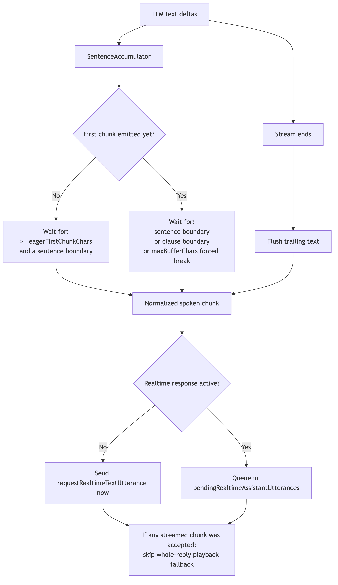

# Voice Streaming Reply

> **Scope:** Full Brain reply streaming when speech is delivered through realtime TTS.
> Voice pipeline stages: [`voice-provider-abstraction.md`](voice-provider-abstraction.md)
> Reply orchestration: [`voice-reply-orchestration-state-machine.md`](voice-reply-orchestration-state-machine.md)
> Assistant output lifecycle: [`voice-output-state-machine.md`](voice-output-state-machine.md)

This document is the canonical description of the live streaming-reply path.
It covers when the feature is active, how chunking works, what the two tuning
settings mean, and why the system starts speaking on the first coherent chunk
instead of on the first raw token.

<!-- source: docs/diagrams/voice-streaming-reply.mmd -->

## 1. When Streaming Reply Is Active

Streaming spoken reply chunks is active only when all of the following are true:

- `voice.conversationPolicy.streaming.enabled === true`
- `voice.replyPath === "brain"`
- `voice.ttsMode === "realtime"`

If the settings are stored but the runtime is on Native, Bridge, or Brain + TTS
API, the configuration remains present but the streaming path is inactive.

Source of truth:

- `src/bot/voiceReplies.ts`
- `src/voice/voiceReplyPipeline.ts`
- `src/voice/sentenceAccumulator.ts`

## 2. Design Rule

The system optimizes for **earliest coherent speech**, not earliest raw token.

That distinction matters:

- starting on the first raw delta would create tiny, unstable utterances
- waiting for the full reply would throw away the main latency benefit of streaming
- the live implementation starts speaking as soon as the first clean chunk is available

In practice, most of the latency win comes from front-loading the first spoken
chunk before full generation finishes. After speech has already started,
playback often becomes the bottleneck, but chunking still matters for cadence,
queue pressure, and long punctuation-free replies.

## 3. Live Runtime Flow

1. `generateStreaming()` emits text deltas as the LLM generates them.
2. `SentenceAccumulator` buffers those deltas.
3. The first chunk is held until both conditions are true:
   - the buffered text length reaches `eagerFirstChunkChars`
   - the buffer contains a clean sentence ending (`.`, `!`, `?`, or newline)
4. Once emitted, that first chunk is normalized and passed through
   `onSpokenSentence(...)`.
5. `runVoiceReplyPipeline()` turns each accepted chunk into a
   `requestRealtimeTextUtterance(...)` call.
6. If no realtime response is currently active, the chunk is sent immediately.
7. If a chunk is already playing, later chunks are queued in
   `pendingRealtimeAssistantUtterances` and drained after the active response completes.
8. At stream end, `SentenceAccumulator.flush()` emits any trailing text that
   never ended with punctuation.
9. If at least one streamed chunk was accepted, the pipeline skips the old
   whole-reply playback path so the bot does not speak the full reply twice.

## 4. Chunking Rules

### First Chunk

The first chunk is intentionally stricter than the rest of the stream.

It does **not** cut at arbitrary whitespace just because the minimum character
threshold has been reached. The first chunk still waits for a clean sentence
boundary so the bot does not produce opener fragments such as:

- `yo what's good in the`
- `hold up let me che`
- `we back in the` followed by `vc!`

This is why `eagerFirstChunkChars` is a gate, not a hard split point.

### Later Chunks

After the first chunk has been emitted, the accumulator can break on:

- sentence boundaries (`.`, `!`, `?`, newline)
- clause boundaries (`;` or `:`) if no sentence boundary is available
- forced breaks at `maxBufferChars` if the model keeps streaming without a clean boundary

### Final Flush

If the stream ends with trailing text that never formed a boundary, `flush()`
emits that text as the last chunk. This prevents the tail of the reply from
being silently dropped.

## 5. Settings

Current live defaults:

| Setting | Default | Meaning | Lower values do | Higher values do |
|---|---:|---|---|---|
| `eagerFirstChunkChars` | `30` | Minimum buffered text before the first chunk is eligible to go out | start speaking sooner | delay startup in exchange for a more deliberate opener |
| `maxBufferChars` | `300` | Maximum buffered text before a chunk is forced out | split more aggressively, create more utterance requests | wait longer for cleaner boundaries, reduce chunk count |

Important clarifications:

- `eagerFirstChunkChars` does **not** cap reply length
- `maxBufferChars` does **not** cap reply length
- both settings only affect chunk timing and chunk boundaries during streaming

## 6. Why Chunking Still Matters After Speech Starts

It is correct that the biggest benefit exists before the full message has been
returned by the LLM. Once the bot is already speaking, additional chunking has
less latency upside.

Chunking still matters after speech starts for three reasons:

- it controls how many separate realtime utterance requests are created
- it prevents long punctuation-free replies from stalling until the very end
- it keeps the queued speech cadence coherent instead of pushing arbitrary token fragments into playback

So the runtime rule is:

- start as soon as the first coherent chunk exists
- keep later chunks large enough to sound natural
- force progress if the model never gives a clean boundary

## 7. Operational Expectations

When streaming reply is working correctly:

- the first spoken audio begins before full generation completes
- later streamed chunks may queue behind active speech
- the full reply is not replayed again after streamed speech has already started
- short punctuation-free endings still speak because the stream flushes its tail

Regression coverage for this behavior lives in:

- `src/voice/sentenceAccumulator.test.ts`
- `src/bot/voiceReplies.test.ts`
- `src/voice/voiceSessionManager.lifecycle.test.ts`
